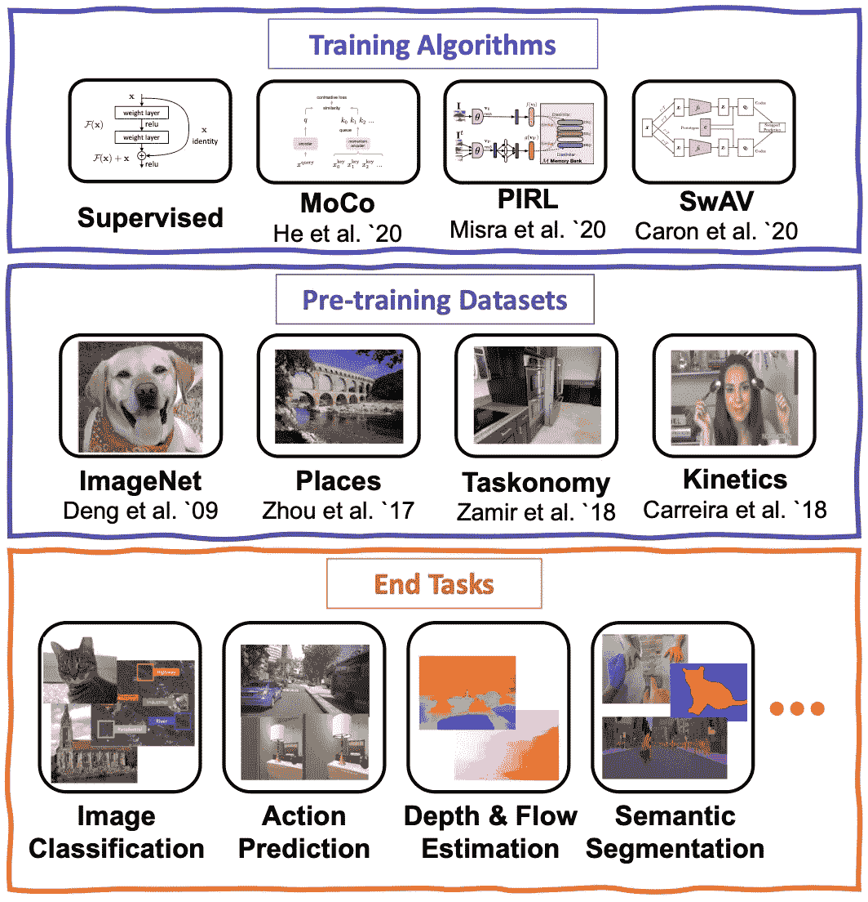
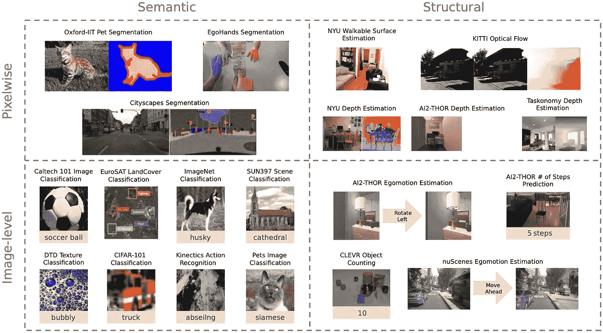
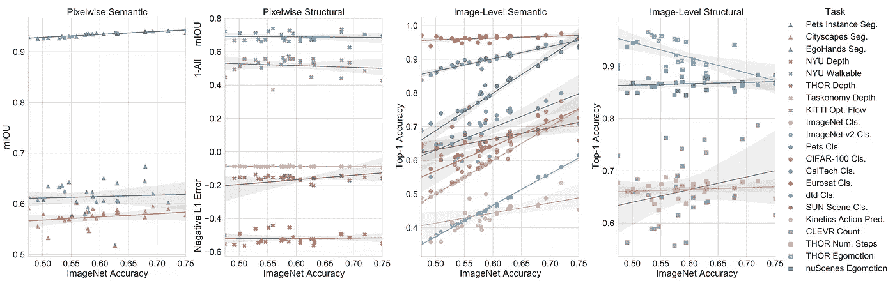
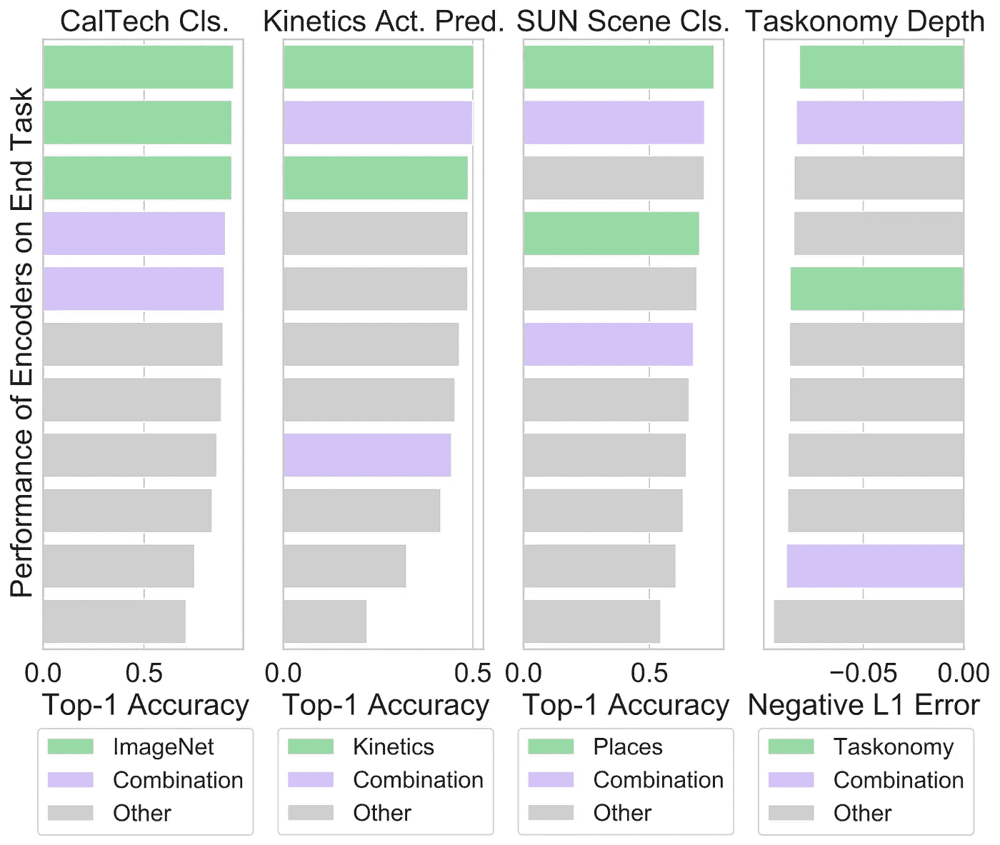
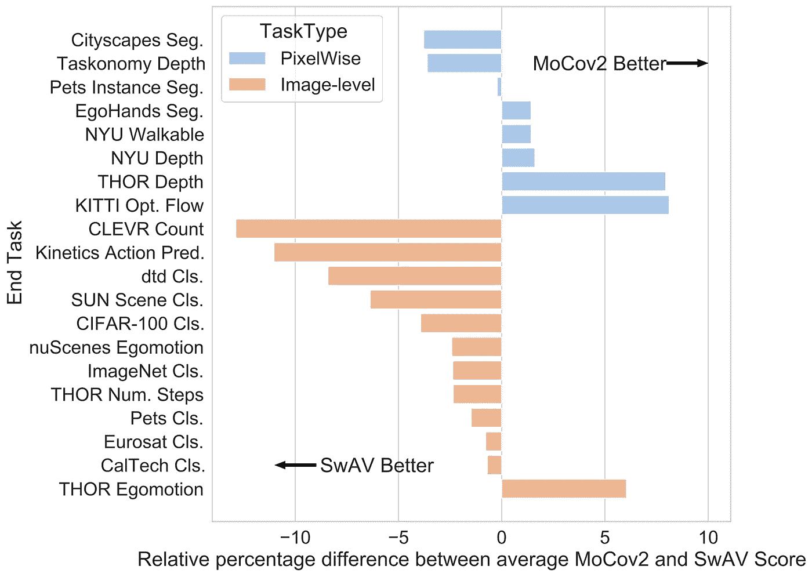
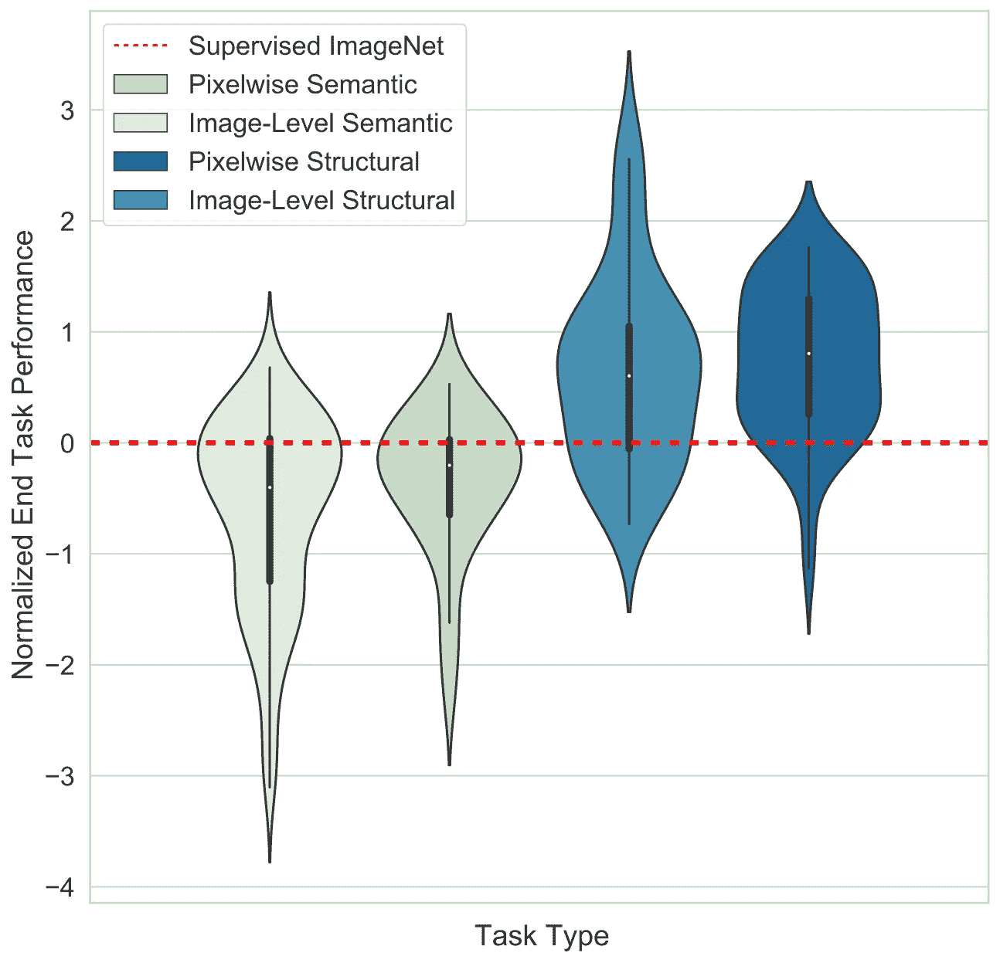
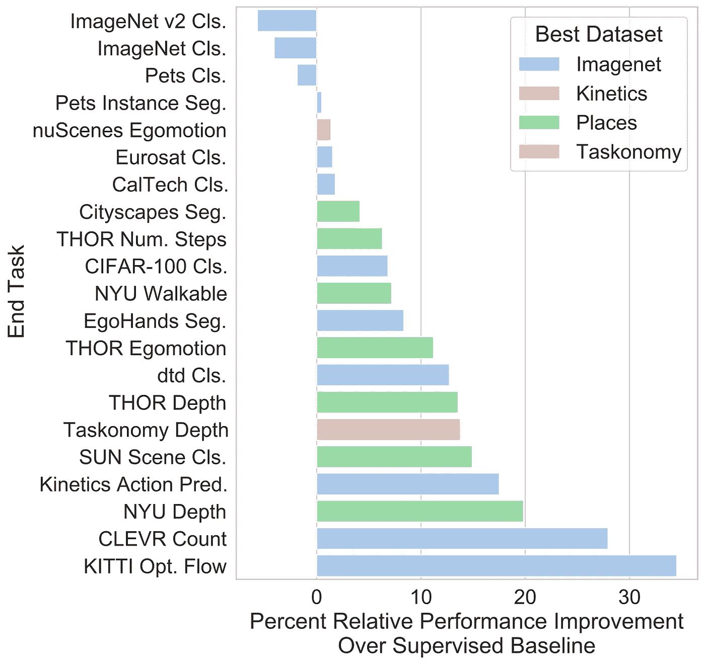

# 对比对比学习方法

> 原文：<https://towardsdatascience.com/contrasting-contrastive-learning-approaches-c3eab8a4728c?source=collection_archive---------17----------------------->

## [思想和理论](https://towardsdatascience.com/tagged/thoughts-and-theory)

## 深入探讨哪些计算机视觉任务是很好的基准，数据集如何影响模型性能，以及哪种编码器是最好的通用主干。

*链接:*[*Github*](https://github.com/allenai/ViRB)*[*论文*](https://arxiv.org/abs/2103.14005)*

*近年来，我们看到了计算机视觉领域新的自我监督学习方法的爆炸式增长——研究人员已经成功训练了神经网络，这些网络在公共基准上表现非常好，如使用大部分未标记数据的 [ImageNet](https://imagenet.stanford.edu/) 分类。*

**

*图文由[温森韩](http://www.winsonhan.com/)*

*事实证明，理解是什么使一幅图像与其他图像不同，就足以产生该图像的抽象表示，这种表示可用于现实世界的任务，如语义分类。这种方法的早期成功引发了大量描述这一主题的变体的出版物，这些变体彼此之间都有微小的改进。*

*我们现在有诸如 [PIRL](https://arxiv.org/abs/1912.01991) 、 [CPC](https://arxiv.org/abs/1807.03748) 、 [SimCLR](https://arxiv.org/abs/2002.05709) 、 [MoCo](https://arxiv.org/abs/1911.05722) 和 [SwAV](https://arxiv.org/abs/2006.09882) 等方法，这些方法都使用一种称为对比学习的特定类型的自我监督学习来产生显著的结果，在对比学习中，编码器被训练来识别同一图像的稍微视觉增强版本，因为它们彼此相似，而与其他图像不同。*

*虽然这种爆炸性的研究速度对于推进一个新的想法很有帮助，但它也产生了许多难以比较或整合的独立线索。在这篇博客中，我想谈谈自我监督的计算机视觉研究的现状和我最近发表的一篇论文的问题，以及旨在解决其中一些问题的[论文](https://arxiv.org/abs/2103.14005)和 [Gabriel Ilharco](http://gabrielilharco.com/) 、 [Ludwig Schmidt](https://people.csail.mit.edu/ludwigs/) 、 [Kiana Eshani](https://ehsanik.github.io/) 和 [Roozbeh Mottaghi](https://roozbehm.info/) 。*

*在我们深入探讨之前，让我们快速回顾几个关键术语，以及我将如何在本文中使用它们:*

***预训练算法:**虽然术语“预训练算法”在深度学习中的定义相当松散，但在这篇文章中，我将使用它来描述最近流行的作品(如 MoCo 和 SwAV)提出的整个预训练管道。*

***预训练数据:**这是用于计算机视觉编码器自我监督预训练的数据集。大部分作品为此使用 ImageNet。*

***编码器:**在计算机视觉中，我们通常将我们的网络分为两个组件:通用特征提取器，它将图像的原始像素数据编码为有用的抽象表示；以及终端任务网络，它使用该抽象表示来完成一些现实世界的任务。前者就是我在这篇博文中所说的编码器。*

***终端任务网络:**如上所述，终端任务网络是我们的模型的一部分，它被定制来执行特定的现实世界任务，如图像分类，因此它必须针对每个任务分别进行调整。*

***结束任务:**结束任务是我们的模型可以执行的一些有用的任务。通常，这些都是实际的事情，比如从图像中估计房间的深度或者对狗的品种进行分类。最终任务是一种将我们的抽象模型与现实世界的工作联系起来的方式，人们可以从中受益。*

***终端任务数据:**这是与特定终端任务相关联的训练数据集，用于训练终端任务网络对编码器产生的抽象图像表示做一些有用的事情。*

*所以总而言之，像 SwAV 这样的**预训练算法**使用一个**预训练数据集**来训练一个**编码器**，这是一个从图像中提取抽象表示的通用工具。**结束任务网络**然后在**结束任务数据**上被训练，以使用这些抽象表示来执行一些有用的现实世界**结束任务**。*

**

*图表来自[对比自我监督对比模型](https://arxiv.org/abs/2103.14005)*

*既然我们都已经掌握了术语，让我们深入探讨一下自我监督视觉领域的快速创新带来的几个关键问题。*

# ***1。苹果、橘子和香蕉***

*虽然各种建议的训练算法都试图创建良好的通用图像编码器，但它们共享非常少的兼容数据点，这意味着将该算法应用于完全相同的模型架构，使用完全相同的端点使用完全相同的预训练数据。*

*像这样的完全匹配的数据点集合通常会减少到只有一个:使用在 ImageNet 数据上训练的 ResNet50 的 ImageNet 分类性能。虽然这是一个很好的基准，但如果它是我们唯一关心的**基准，它可能会变得极其危险。除此之外，不同的论文提供了最终任务、预训练数据集和模型架构的非重叠子集的结果，因此比较不同论文之间的数字常常会导致比较苹果和橙子。***

# *2.我们到底在追求什么？*

*由于 ImageNet 分类是大多数计算机视觉社区可以同步并达成一致的唯一基准，因此似乎真正追求的目标不是生产一个好的通用图像编码器，而是生产一个在 ImageNet 分类上表现良好的编码器，以及类似的最终任务。在某种程度上，任何开发新算法的研究人员都被迫追求这一基准，因为高分将给予算法更多的关注，但这无意中导致社区优化“ImageNet 性能”的代理目标，而不是“良好的视觉编码器”的真正目标。结合大多数论文使用 ImageNet 作为训练数据的事实，我们有一个强大的反馈回路的配方，该反馈回路产生擅长学习数据集(如 ImageNet)的底层分布统计的编码器，而不是擅长理解图像中的内容。*

# ***我们的工作***

*希望这足以让你相信，在自我监督的计算机视觉领域存在着重大的不一致。现在让我们谈谈解决这些问题的方法。具体来说，我将谈论我最近的论文[对比对比自我监督表示学习模型](https://arxiv.org/abs/2103.14005)的方法和发现。*

*为了获得一个标准化的参考框架来比较各种自监督算法和预训练数据集，我们必须固定许多实验变量。我们所有的测试都是使用相同的编码器架构(ResNet50)完成的。在训练终端任务网络时，我们还冻结了编码器的权重。*

*尽管冻结了这些变量，我们仍然使用数千小时的 GPU 时间运行了 700 多个实验。我们在 4 个不同的预训练数据集( [ImageNet](http://www.image-net.org/) 、 [Places](http://places2.csail.mit.edu/download.html) 、 [Taskonomy](http://taskonomy.stanford.edu/) 和 [Kinetics400](https://deepmind.com/research/open-source/kinetics) )和 4 个组合上测试了由 4 个不同的预训练算法( [SwAV](https://arxiv.org/abs/2006.09882) 、 [MoCo v1](https://arxiv.org/abs/1911.05722) 、 [MoCo v2](https://arxiv.org/abs/2003.04297) 和 [PIRL](https://arxiv.org/abs/1912.01991) )产生的总共 30 个编码器。我们在 20 个最终任务训练集上为每个编码器训练了最终任务网络，并报告了这些编码器在最终任务测试集上产生的结果(参见下面的最终任务图)。*

*更多详情请参考[文件](https://www.semanticscholar.org/paper/Contrasting-Contrastive-Self-Supervised-Learning-Kotar-Ilharco/56f9922b8132000e3ab04e92c20a9218349354b7)。*

*现在让我们深入研究结果…*

# *ImageNet 是一个好的基准吗？*

*如上所述，在 ImageNet 分类结束任务中评估在 ImageNet 数据集上训练的模型似乎是相当循环的。为了衡量这一指标的好坏，我们对 ImageNet 上编码器的性能和其他终端任务进行了相关性分析。这意味着，对于任何给定的编码器，我们计算了 ImageNet 上的性能与其他终端任务的性能之间的关系。我们发现 ImageNet 根本不是一个很好的指标。虽然它在预测类似任务(如加州理工学院和 CIFAR-100 分类)的性能方面相当不错，但在预测不同任务(如深度预测)的性能方面确实很差。*

*我们根据任务类型(语义或结构)和输出形式(图像级或像素级)将任务大致分为四类。下面是我们所有最终任务及其相应分类的图示:*

**

*来自[对比自我监督对比模型的图形](https://arxiv.org/abs/2103.14005)*

*下图描绘了 ImageNet 分类准确性与其他终端任务性能的关系。它说明了 ImageNet 性能对于其他图像级语义任务是一个很好的指标，但是对于所有其他终端任务类别是一个很弱的信号。此外，我们甚至看到一些负相关的结果，表明将编码器调优为非常擅长 ImageNet 分类会导致它忽略一些对其他任务类型至关重要的信息。*

**

*图片来自[对比自我监督对比模型](https://arxiv.org/abs/2103.14005)*

*总而言之，这表明仅报告模型的 ImageNet 分类性能是非常有限的。*

# ***所有预训练数据集都是平等的吗？***

*我们想探索的另一个领域是预训练数据对最终模型的质量有多大影响。由于这个领域的绝大多数工作都是在 ImageNet 上预先训练他们的编码器，所以在这个轴上没有太多的探索。我们在 4 个数据集上训练了 MoCo v2 和 SwAV 编码器:ImageNet、Places、Taskonomy 和 Kinetics400。我们对所有数据集进行子采样，以匹配 ImageNet 的大小，并对 4 个数据集的组合进行了训练。*

*首先，我们发现在 ImageNet 上训练的编码器倾向于最好地解决语义终端任务，而在 Places 上训练的编码器倾向于最好地解决结构终端任务。这很有意义，因为 ImageNet 包含许多不同的图像，而 Places 包含房间和建筑物的图像。此外，Places 和 ImageNet 都对数据进行了策划、标记和组织，而 Kinetics 是从 youtube 视频中捕获的一系列帧，Taskonomy 是一系列 Matterport 3d 扫描。这表明，尽管我们没有明确使用标签，但使用一个整洁有序的数据集仍然可能有一些优势。这就对在来自互联网的随机完全无监督数据上训练视觉模型的可行性提出了质疑——这是自我监督计算机视觉的伟大承诺之一。虽然最近的一些工作显示了在从互联网上收集的大型数据集上进行训练的成功，但尚不清楚这些数据有多干净和有组织。*

*其次，我们测试了在类似于我们的终端任务数据的大型数据集上使用自我监督方法预训练我们的编码器是否会产生更好的编码器。对于我们的每个预训练数据集(ImageNet、Kinetics、Places 和 Taskonomy)，我们找到了使用相似数据集或相同数据集的子集(分别为加州理工学院分类、Kinetics 动作预测、太阳场景分类和 Taskonomy 深度预测)的相应最终任务。我们绘制了我们在以下 4 个数据集上训练的所有编码器的最终任务性能:*

**

*来自[对比自我监督对比模型的图形](https://arxiv.org/abs/2103.14005)*

*这个结果对于监督学习来说有些明显，但是在我们的工作中，我们也验证了它对于对比学习也是成立的。有趣的是，我们发现组合数据集平均产生的编码器在所有任务中都相当好，但在任何任务中都不是最好的。事实上，我们还发现，在 ImageNet 和 Places 上训练的编码器平均性能优于组合编码器，因此混合数据集给我们带来的好处似乎少于缺点。*

# *数据集平衡重要吗？*

*除了上面提到的预训练数据集，我们还使用 ImageNet 的非平衡版本测试了预训练的效果，我们通过对每个类别中的图像数量进行对数采样来产生该非平衡版本(例如，我们从几个类别中获得许多样本，从许多类别中获得少量样本)。我们发现，如果我们在 ImageNet 的严重不平衡的子集上预训练我们的编码器，我们的最终任务性能不会比在相同大小的 ImageNet 的完全平衡的子集上预训练差。我们测试了每个数据集的 3 个不同样本，没有非常大的差异，这表明所有子采样都一样好，并且如果我们从子样本中的特定类获得许多样本，没有神奇的类会为我们提供巨大的性能提升。为了稍微破坏这一发现的兴奋，重要的是要提到我们只使用了 200 个时期训练的小数据集(250，000 个样本)，因此需要进一步的工作来验证更大数据集和更长训练运行的这一趋势。*

# *不同的预训练算法是否表现出不同的实力？*

*我们详细描述的两种训练算法是 MoCo v2 和 SwAV。虽然不是我们工作的主要焦点，但我们的分析提出了两种算法的一些有趣的对比特性。*

*MoCo v2 往往更擅长于结构性任务，而 SwAV 在图像级任务上表现出色。关于为什么会发生这种情况，我的高层次假设是，由于 SwAV 在最后一层使用聚类方法，它往往会丢失一些空间图像信息。这个理论的一些支持来自我们对编码器进行的分层 [CKA](https://arxiv.org/abs/1905.00414) 分析的结果。我们发现，平均而言，用 MoCo v2 训练的编码器在早期和晚期层表示之间具有更强的一致性，这表明在最终编码中保留了更多的空间信息。下图展示了 MoCo 和 SwAV 编码器在像素级和图像级任务中的性能差异:*

**

*图片来自[对比自我监督对比模型](https://arxiv.org/abs/2103.14005)*

*如果我们试图为需要空间信息的任务构建自定义编码器，这可能是一个有用的数据点，因为我们现在有证据表明 MoCo v2 是这项工作的更好的预训练算法。在这里，我们看到了将 ImageNet 分类性能作为我们的基准的另一个缺点。由于 SwAV 在这一特定的最终任务上优于 MoCo v2，许多人可能会认为它总体上更好，而我们的研究表明现实并不是如此清晰。*

# ***自我监督编码器对所有下游任务都有用吗？***

*简单来说，答案是肯定的。对于我们测试的每个任务，自我监督模型都表现得非常好，事实上，除了 3 个任务，它们都优于监督的 ImageNet 基线。受监督编码器表现较好的 3 个最终任务是 ImageNet 分类、ImageNet v2 分类和 Pets 分类(与 ImageNet 非常相似)。由于我们没有为手头的任务微调编码器，这个结果一点也不奇怪，因为在 ImageNet 上训练的监督编码器在编码器训练期间有效地微调了任务。对于其他一切，自我监督的方法表现更好，这给了我们一个强烈的迹象，他们产生更好的通用编码器。*

*此外，我们发现一些终端任务从使用自我监督模型中获得了比其他任务更大的提升，即结构性任务。下图显示，虽然一些自监督编码器在每个任务类别中都优于监督基准，但几乎所有的**自监督编码器在结构化任务方面都优于监督基准，甚至那些预训练数据集和预训练算法与最终任务不匹配的编码器也是如此:***

**

*图片来自[对比自我监督对比模型](https://arxiv.org/abs/2103.14005)*

# *那么我应该使用什么编码器呢？*

*在考虑了所有上述结果之后，很明显当前的标准计算机视觉编码器(在 ImageNet 上用监督学习训练的 ResNet50)通常不是最好的通用编码器。我们发现，一些经过自我监督学习训练的编码器在解决最终任务方面几乎总是更好，并且一个特定的编码器(在 ImageNet 上经过 SwAV 训练)在超过 75%的最终任务方面更好。*

*下图显示了自监督模型相对于监督 ImageNet 的相对改进水平。它还表明，ImageNet 和 Places 往往是实现上述最佳结果的两个数据集。*

**

*图片来自[对比自我监督对比模型](https://arxiv.org/abs/2103.14005)*

# ***更多未回答的问题***

*虽然我们在工作中进行了 700 多次实验，但我们只描绘了自我监督计算机视觉整体前景的一小部分。为了获得我们所做的详细结果，我们需要修正许多变量，这给我们留下了许多未解决的问题，例如:*

1.  *模型架构如何影响不同自监督算法的性能？*
2.  *微调整个编码器会显著影响性能吗？*
3.  *如果我们为更多的时代训练编码器，我们观察到的趋势会消失还是变得更明显？*

*这些都是未来工作的良好起点，将进一步帮助我们理解自我监督计算机视觉的优点和缺点。*

# ***结论***

*虽然这篇博文指出了自我监督视觉领域当前工作的许多缺陷，但庆祝它的许多成就也很重要。我们的论文发现证据表明，对比学习方法在产生良好的通用编码器方面优于监督学习，进一步验证了这不仅仅是一个巧妙的技巧，而是一个真正的重要进步。然而，我们也已经表明，在单一维度(ImageNet 分类)中衡量进展可能会导致我们忽略更大画面的某些部分(比如 MoCo v2 在我们测试的近一半最终任务中优于 SwAV 的事实)。*

*总之，我想从这项工作中提供 4 个关键的收获，可能对计算机视觉研究人员和工程师未来的计算机视觉项目有所帮助:*

1.  *自监督图像编码器是伟大的通用特征提取器，你应该考虑在你的下一个项目中使用它。我会推荐一个 ResNet50，在 ImageNet 上用 SwAV 训练 800 个历元(或者 Places，如果你的项目是结构化的)*
2.  *如果您的领域中有大量的数据，考虑用它来训练一个自我监督的编码器，因为这可能会给您带来更大的性能提升。*
3.  *如果你正在开发一个新的自我监督模型，确保在各种各样的任务上对它进行评估。考虑使用我们在项目中发布的 [ViRB](https://github.com/allenai/ViRB) 代码库。*
4.  *如果您正在开发一个新的数据集(或训练 webly 监督模式)，您的数据类的平衡可能不那么重要，但拥有一些不同的样本是重要的。*