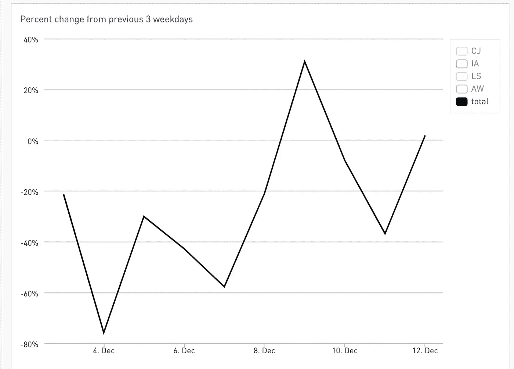
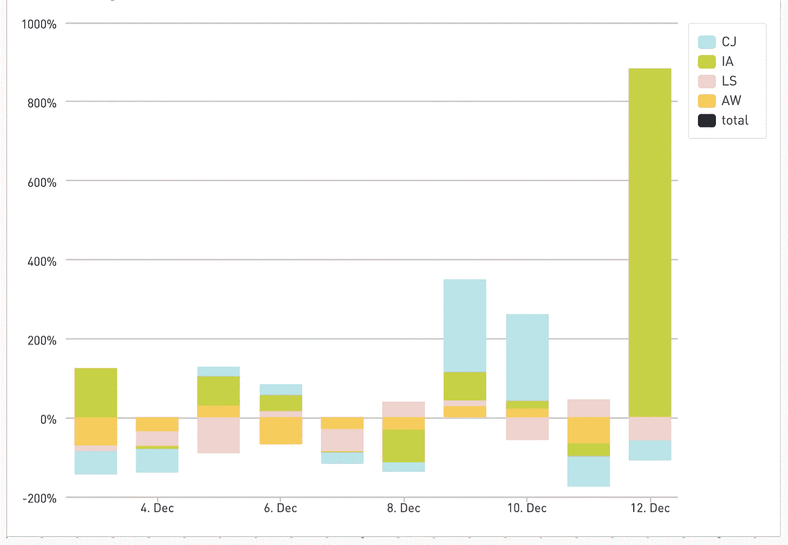
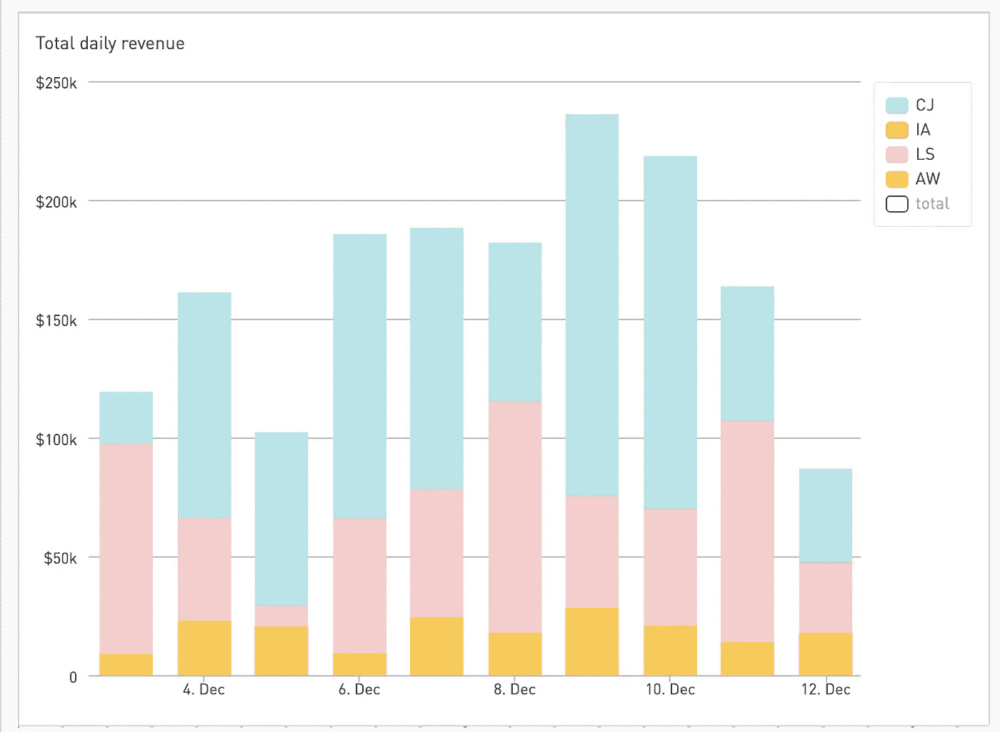
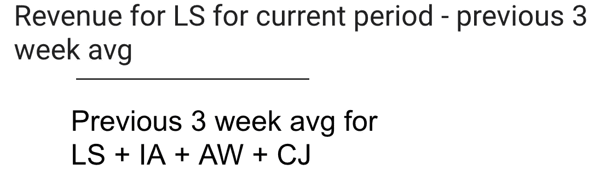
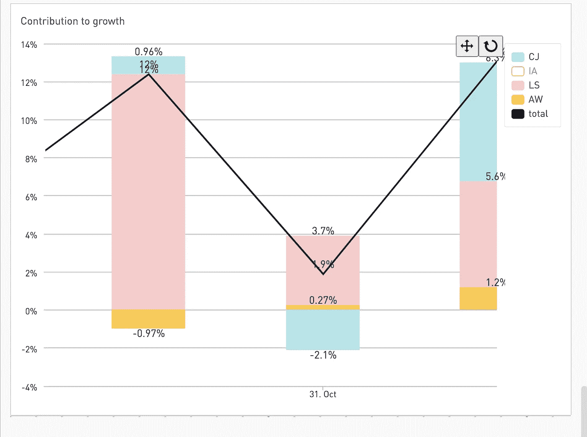
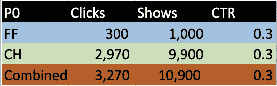
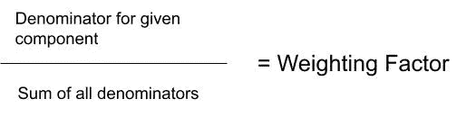
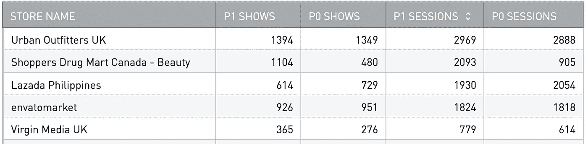
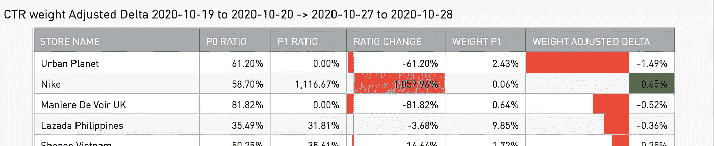

# 对增长的贡献—分解百分比变化的 SQL 框架

> 原文：<https://towardsdatascience.com/contribution-to-growth-a-sql-framework-for-breaking-down-percent-change-d0573e0f7d7?source=collection_archive---------14----------------------->

## 现在你终于可以回答:“每个资产/组件/模因对整体百分比变化的贡献是多少？”

这是一个非常基本的概念，我想知道其他人是否已经知道了，那天的数学课我一直在睡觉。但后来我想起，如果我只是想通了这一点，可能还有其他人和我处于同一浪潮中。如果他们和我在同一个波段上，那就意味着他们可能顺便来看看我，别挡我的路，傻瓜🤙🏾 🌊

话虽如此，这是一个非常简单的框架，但我觉得最简单的框架是最强大的，因为即使对那些没有强大数据背景的人来说，它们也是直观的。

我经常面临一个非常常见的分析难题——假设给定的指标有很大的百分比变化。也许你的股票投资组合上涨了 200%。为了这个例子，让我们说业务收入，因为如果有一件事每个人都关心，那就是面包。

通常情况下，第一个问题是“每只资产/组件/meme 股票对整体的百分比变化贡献多少？”



一个可能让你挠头的增长图表的例子。除非另有说明，所有图表均由作者绘制

如果你有多种收入来源，那么通常的第一步是查看不同收入来源的收入，然后查看每个收入来源与前一时期的百分比变化。

我在这里提供了一些我自己公司的例子，亲爱的(这些数字是随机的，不能以任何方式反映现实)。我们有几个附属合作伙伴(也编辑和随机化)提供了我们的大部分收入。这里的每个缩写代表一个附属合作伙伴



按合作伙伴列出的与前 3 个工作日平均值相比的百分比变化

我们可以开始看到哪些合作伙伴增加了或减少了——百分比方面

这很好，但假设你有一些小土豆，它们波动很大，但对整体变化没有任何实际影响。**以 IA 为例，在上图中👆🏾与前几周相比，12 月 12 日的百分比有大幅增长，但如果我们看一下每日总收入👇🏾内部调查甚至没有记录为一个信号。**



每日收入的总值给了我们一个权重应该是多少的概念


来自[的 meme know your meme](https://knowyourmeme.com/memes/that-wasnt-very-cash-money-of-you)

我们可以使用一些心理体操来说，哦，让我们只考虑大型网络的运动，以确定它如何影响总数，但这不是我们的分析能力。

# 我们如何更好地沟通？

我从这里借用的概念被称为**对增长的贡献**，这是一个最常用来衡量不同行业或 GDP 组成部分对前一时期整体增长或收缩的影响的指标。
有了下面的这个可视化，也许我们可以看到它对我们的难题的应用。


来自 [OECD](https://www.oecd.org/economy/contributions-to-gdp-growth-third-quarter-2017-oecd.htm) 的图片

每个条形图表示“对增长的贡献”，或组件带动总体增长的百分点数。因此，在 2016 年第 2 季度，我们可以看到私人消费比上一时期的总体国内生产总值增长了约 0.45 个百分点，而库存变化降低了 0.15 个百分点的增长。

所有增长贡献的总和等于总量。
GDP 增长=私人消费+政府消费+投资+ NX +库存变化
≈我在这里盯着它。. 45+. 06+. 05+-. 02+-. 15)∞. 39(顶部的黑线

## 如何计算对增长的贡献


仅此而已！

如果我们这样做只是为了 LS，它会看起来像



现在让我们看看这在实践中是什么样子



我们可以在 10 月 31 日看到，尽管 LS 较 3 周平均值变化了+24%(未显示)，但对总收入百分比变化的总体影响仅为+3.7% CTG，而 CJ 对-2.1% CTG 有很大的下行吸引力。如果我们看看 10 月 31 日的 CTG 总和(3.7%+3% %-2.1%)=+1.9%
幽灵般的对吗？

# SQL 时间

现在让我们看看如何将它组合成一个查询！(如果你想看整件事，就跳到最后)

这样做的主要技巧是窗口功能，如果您需要复习[请在此处勾选](https://cloud.google.com/bigquery/docs/reference/standard-sql/analytic-function-concepts)

第一步是计算要与给定的当前值进行比较的先前值。就我们的情况而言，这是最近 3 周的平均值。我们这样做是因为它是一个稳定的指标，允许我们查看与一周中的最近几天相比，今天是好是坏。这很方便，尤其是当有两个星期的季节性时——例如，周一可能是你一周中最好的一天，而周末稍微慢一点。
这有点棘手，但大多数情况都会比这个简单——所以让我们从最难的开始吧！

```
AVG(Commission) OVER (PARTITION BY providerId, weekday ORDER BY date ASC ROWS BETWEEN 3 PRECEDING AND 1 PRECEDING) AS rolling_3_week_avg
```

这个函数是说我们想要得到平均佣金。PARTITION 子句告诉我们，我们需要每个提供商的平均值，按工作日对其进行分区可以让我们比较一周中同一天的收入。ROWS BETWEEN 子句定义了我们希望平均为前 3 行直到前 1 行的行——但是只针对那些具有相同 providerid 和 weekday 的分区。我试着在下表中列出它👇🏾


窗口函数允许我们获取最近 3 个工作日的佣金，给我们一个标准化的数字进行比较

撇开这个不谈，我们实际上能够写出我们的 CTG 计算——这是最简单的部分:


记得这个人吗？

```
(commission — rolling_3_week_avg) / SUM(rolling_3_week_avg) OVER(partition by date) as CTG
```

你做到了！这是一个金 star⭐️

# 额外信用:比率变化 CTG

⚠️警告:高级分析区域⚠️

几乎可以肯定的是，可能有一种比我更简单的方法，有人已经在我之前找到了，但不管怎样，我还是来了。

从算术的角度来看，这部分不太直观。有些情况下，您会有与上述相同的问题，但您不是在跟踪数字指标(如收入)的增长，而是在调查一个*比率*(如点击率或转换率)的变化，您希望按组件细分(如浏览器平台的点击率，或电子邮件副本的转换率)？

某些成分会增加变化，而其他成分会减少变化。除此之外，我们还有每个分量的相对权重，所以我们也需要考虑到这一点。这有点令人生畏，但我保证最终所有的逻辑都会变得有意义。

## 我们在这里使用的例子是跨两种浏览器(Chrome 和 Firefox)的点击率(CTR)

在第一阶段(我们称之为 P0 ),两个浏览器的点击率相当于 30%。我们将用表格而不是图表来做这件事，因为这样更容易理解。[完整的床单文件可以在这里找到。](https://docs.google.com/spreadsheets/d/1fNIPVvC6WfAaPziYzRAe8ndbyZQScYSoR9vQnpnc8dY/edit?usp=sharing)



到目前为止一切顺利　‘

当跟踪比率变化时，需要理解的一个关键指标是加权系数。你可能熟悉加权，比如说，根据家庭作业和期末考试来计算你的期末成绩。权重因子越大，对最终结果的影响越大



**现在让我们来看一个不同时期的变化——P1**


FF 向上，CH 向下，整体向下

在我们的例子中，Chrome 有一个大得多的用户群，所以它有一个更高的权重因子，这个权重因子是用它的节目数/所有节目数的和来计算的

对于铬合金= 9000/(1100+900) = 0.89

我们对 Firefox 做了同样的事情来获得每个平台的权重。

所有加权因子的总和应该等于 1，见上文

在 P1，我们看到总体比率从 30%的 CTR 下降到 20%。然而，当按浏览器分类时，我们看到 Firefox 上升，Chrome 下降。火狐的崛起在多大程度上抵消了整体下跌？答案比你想象的要难，因为分母随着分子一起变化，导致相对权重也随之变化。🤔

为了理解 P1 权重背景下的 P0 比率，我们需要调整 delta。
原始增量只是相对于 P0-P1
的总百分比变化，对于 FF 来说是 0.55–0.3 = 0.25，这意味着 FF 的 CTR 增加了 25%的绝对百分比。
但是我们然后通过乘以新的 P1 权重来调整它，所以
0.25 * .11 = 0.03
这是权重调整后的δ(WAD？).这个重量调整的增量是一个等价的概念，我们的 CTG，你可以看到，所有 WAD 的总和给我们-10%，CTR 的综合下降。现在让 GFTO 超越自我，进入有趣的部分。

# SQL 时间

通常，当我发现自己在做这种分析时，我会查看两个特定的日期范围，然后寻找它们之间差异的贡献者。这里的场景是在商店级别上跟踪点击率的急剧下降。
所以我们的 SQL 方法会记住这个方法。第一步是将两个日期范围转换成一行。

```
WITH step1 as (
  select
    name store_name
    -- case statements allow us to group each date range into a given label - p0 and p1
    , case
      when day between "2020-10-27"
      and "2020-10-28"
        then 'p1'
      when day between "2020-10-19"
      and "2020-10-20"
        then 'p0'
      else null
    end as week
    , sum(clicks) as shows
    , sum(shows) as sessions
  from
    base
  group by
    store_name
    , week
  having
    -- limiting to sessions > 0 will help remove divide by 0 errors down the road
    sessions > 0
)
    , period_split as (
    select
      store_name
      -- kind of a pain, but this is the best way I know to pivot
      , sum(if(week = "p1", shows, 0)) as p1_shows
      , sum(if(week = "p0", shows, 0)) as p0_shows
      , sum(if(week = "p1", sessions, null)) as p1_sessions
      , sum(if(week = "p0", sessions, null)) as p0_sessions
    from
      step1
    group by
      1
  )
```



这将为我们提供一个很好的数据透视表来开始我们的原始值。下一步相当简单，唯一棘手的部分来自构建窗口函数来寻找权重。

```
sum(p1_shows) over (partition by store_name) / sum(p1_shows) over() as weight_p1
```

窗口函数将首先返回为给定商店`over partition by store_name`划分的节目，然后用`over ()`子句将其除以所有商店的所有节目的总和。布埃诺？

```
select
  *
-- this is the critical step where we adjust the raw ratio change and multiply it by the P1 weighting to get the adjusted delta
  , ratio_change * weight_p1 as weight_adjusted_delta
from
  (
    select
      store_name
-- get ratios from raw values
      , p0_shows / p0_sessions as p0_ratio
      , p1_shows / p1_sessions as p1_ratio
-- get the raw ratio change
      , p1_shows / p1_sessions-p0_shows / p0_sessions as ratio_change
-- use a window function to find the weighting factor of each individual store
      , sum(p1_shows) over(partition by store_name) / sum(p1_shows) over() as weight_p1
    from
      period_split
    where
-- for the sake of presentation, let's ignore the super small potatoes
      p0_shows > 10
  )
```

这给了我们漂亮的完整图表



只要打破我们所有的图表。做就是了

在这里，我们可以清楚地看到耐克导致点击率大幅上升，而 Urban Planet 由于完全崩溃导致点击率大幅下降。这里有一些古怪的数字，所以绝对有理由深入调查这两家商店。这里的一个好方法是从主要指标计算中删除这两家商店，看看行为是否正常，这样您就可以明确地将责任归咎于这两个坏蛋🥚
再见，数据牛仔……🤠

# 附录

Pt 1 的完整代码

```
#standardSQL
with
  TRANS_TRANS as (
    select
      A.affiliate_Provider_Id as providerId
      , cast(trx_time as date) as date
      , cast(sum(A.affiliate_Sale_Value) / 100 as numeric) as gmv
      , round(cast(sum(A.affiliate_Commission) / 100 as numeric), 0) as Commission
    from
      `honey-production.dbt.fct_affiliate_transactions` as A
      left join `honey-production.analytics.stores_master` as B on
      A.store_id = B.storeid
  where
    1 = 1
    and cast(trx_time as date) >= '2020-01-01'
  group by
    1
    , 2
  )
  , base as (
    (
      select
        date
        , weekday
        , providerid
        , Commission
        , avg(Commission) over(partition by providerId, weekday order by date asc rows between 3 preceding and 1 preceding) as rolling_3_week_avg
      from
        (
          select
            date
            , extract(DAYOFWEEK from date) as weekday
            #  date_trunc(A.Date, month) as month,
            , providerId
            , sum(Commission)*(rand()/2) as commission
            , sum(gmv) as gmv
          from
            TRANS_TRANS where providerId in ("CJ","IA","LS", "AW")
          and
            date >= '2020-01-01'
          group by
            1
            , 2
            , 3
        )
    )
  )
  , final as (
    select
      date
      , weekday
      , providerid, Commission as provider_commission
      ,(Commission-rolling_3_week_avg) / rolling_3_week_avg as pct_change
      , sum(commission) over(partition by date) as total_commission
      , sum(rolling_3_week_avg) over(partition by date) as total_commission_3_week_avg
      , (commission - rolling_3_week_avg) / sum(rolling_3_week_avg) over(partition by date) as CTG
    from
      base
    where
      rolling_3_week_avg > 0
    order by
      commission desc
  )
select
  *
from
  final   
where
date between "2020-12-03" and "2020-12-12"
union all-- this union is necessary in Periscope to make the "total" line show up. It's pretty annoying
(
  select
    date
    , weekday
    , "total" as providerid, null as provider_commission
    , null as pct_change
    , null as total_commission
    , null as total_commission_3_week_avg
    , sum(ctg) as  ctg
  from
    final  where
date between "2020-12-03" and "2020-12-12"
  group by
    date
    , weekday
    , providerId, provider_commission
    , pct_change
    , total_commission
    , total_commission_3_week_avg
)
```

Pt 2 的完整代码

```
#standardSQL
with
  click as (
    select
      date(timestamp, 'America/Los_Angeles') as date
      , user_id
      , store.session_id
      , store.name
    from
      `honey-production.sdata_events_partitioned.ext_apply_codes_click`
    where
      date(timestamp, 'America/Los_Angeles') between "2020-10-19"
      and "2020-10-28"
      and cta.type = 'c0_g0'
      and cta.img is not null
      and cta.img_text is not null
      and cta.btn_text is not null
  )
  , show as (
    select
      date(timestamp, 'America/Los_Angeles') as date
      , user_id
      , version
      , store.session_id
      , store.name
    from
      `honey-production.sdata_events_partitioned.ext_apply_codes_show`
    where
      date(timestamp, 'America/Los_Angeles') between "2020-10-19"
      and "2020-10-28"
      and cta.type = 'c0_g0'
      and cta.img is not null
      and cta.img_text is not null
      and cta.btn_text is not null
  )
  , base as (
    select
      date day
      , name
      , count(distinct click.session_id) as clicks
      , count(distinct show.session_id) as shows
    from
      show
      left join click using (date, name)
      group by
        day
        , name
  )
  , step1 as (
    select
      name store_name
      -- case statements allow us to group each date range into a given label - p0 and p1
      , case
        when day between "2020-10-27"
        and "2020-10-28"
          then 'p1'
        when day between "2020-10-19"
        and "2020-10-20"
          then 'p0'
        else null
      end as week
      , sum(clicks) as clicks
      , sum(shows) as shows
    from
      base
    group by
      store_name
      , week
    having
      -- limiting to sessions > 0 will help remove divide by 0 errors down the road
      shows > 0
  )
  , period_split as (
    select
      store_name
      -- kind of a pain, but this is the best way I know to pivot
      , sum(if(week = "p1", clicks, 0)) as p1_clicks
      , sum(if(week = "p0", clicks, 0)) as p0_clicks
      , sum(if(week = "p1", shows, null)) as p1_shows
      , sum(if(week = "p0", shows, null)) as p0_shows
    from
      step1
    group by
      1
  )
select
  *
  -- this is the critical step where we adjust the raw ratio change and multiply it by the P1 weighting to get the adjusted delta
  , ratio_change * weight_p1 as weight_adjusted_delta
from
  (
    select
      store_name
      -- get ratios from raw values
      , p0_clicks / p0_shows as p0_ratio
      , p1_clicks / p1_shows as p1_ratio
      -- get the raw ratio change
      , p1_clicks / p1_shows-p0_clicks / p0_shows as ratio_change
      -- use a window function to find the weighting factor of each individual store
      , sum(p1_shows) over(partition by store_name) / sum(p1_shows) over() as weight_p1
    from
      period_split
    where
      -- for the sake of presentation, let's ignore the super small potatoes
      p0_clicks > 10
  )
order by-- this way we can see the big hitters
  abs(ratio_change * weight_p1) desc
```

[Google Sheets with the whole thang](https://drive.google.com/file/d/1ND2Xu_a-5RoagSCFJH3_g28R8nosUcaT/view?usp=sharing)