# 用手势控制 DJI·泰洛无人机

> 原文：<https://towardsdatascience.com/control-dji-tello-drone-with-hand-gestures-b76bd1d4644f?source=collection_archive---------2----------------------->

## 使用 MediaPipe 手关键点检测器和简单的神经网络来识别手势和控制无人机


在 [Unsplash](https://unsplash.com?utm_source=medium&utm_medium=referral) 上[剂量媒体](https://unsplash.com/@dose?utm_source=medium&utm_medium=referral)拍照

使用手势控制无人机是一个非常常见的主题。但是大多数解决方案都集中在旧的 OpenCV 上。因此，这是快速的解决方案(如果你想直接在无人机上运行它)，但很难添加自定义手势，甚至是动作。在这篇文章中，我想介绍一种基于手部关键点检测模型的解决方案，它由 [**MediaPipe**](https://mediapipe.dev) 和简单的**多层感知器**(神经网络)组成。

# 介绍

该项目依托**两个主要部分**——DJI 泰洛无人机和 MediaPipe 快手关键点检测。

**DJI·泰洛**是任何一种编程实验的完美无人机。它有一个丰富的 Python API(也有 Swift 和 JS APIs 可用)，这有助于几乎完全控制无人机，创建无人机群，并利用其相机进行计算机视觉。

**MediaPipe** 是一个令人惊叹的 ML 平台，拥有许多强大的解决方案，如面部网格、手关键点检测和 Objectron。此外，他们的模型可以在具有设备上加速的移动平台上使用。

这是你需要的**启动包**:

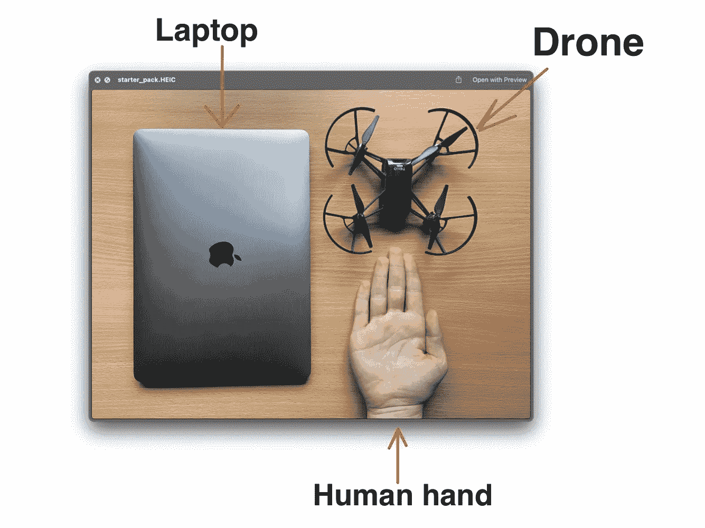

图片作者| DJI·泰洛，笔记本电脑和人手(狗爪子正在开发中)

# 进场说明

该应用分为两个主要部分:**手势识别**和**无人机控制器**。这些都是独立的实例，很容易修改。例如，添加新的手势或改变无人机的移动速度。

让我们仔细看看每个部分！

## 手势识别

当然，这个项目的主要部分是致力于手势检测器。这个项目中识别方法的想法受到了这个 [GitHub repo](https://github.com/Kazuhito00/hand-gesture-recognition-using-mediapipe) 的启发。这里是它如何工作的一个快速概述。

MediaPipe 为他们的手关键点检测器提供了 python 实现。正在返回 **20 手界标**的三维坐标。像这样:

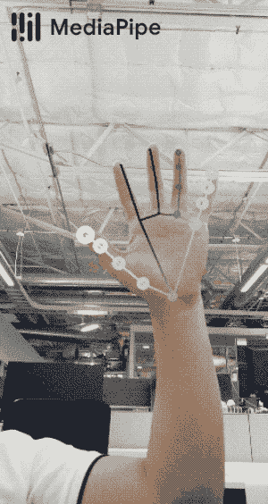

来自开放媒体管道库的 GIF([链接](https://github.com/google/mediapipe/blob/master/docs/images/mobile/hand_tracking_3d_android_gpu.gif))

在这个项目中，将只使用 **2D** 坐标。在这里，您可以看到所有 20 个要点。

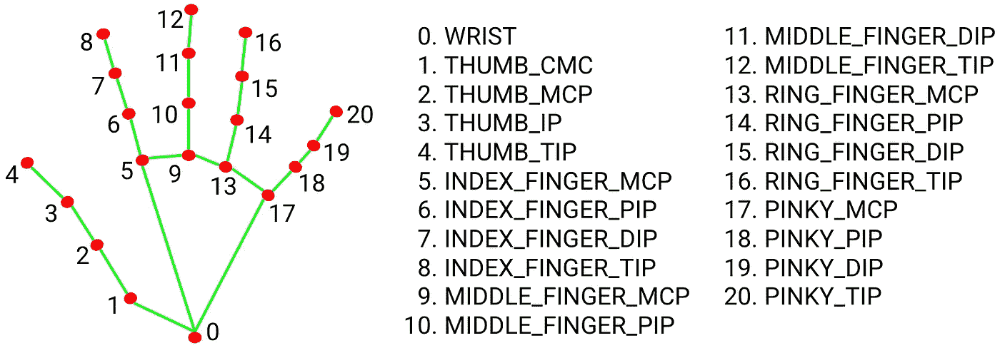

图片来自开放媒体管道库([链接](https://github.com/google/mediapipe/blob/master/docs/images/mobile/hand_landmarks.png)

然后，将这些坐标展平并归一化。手势的 **ID** 被添加到每个点列表中。

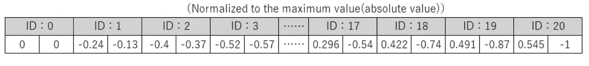

作者图片|此类积分列表示例

当我们为每个手势收集了大约**20–100 个例子**时，我们就可以开始训练我们的神经网络了。

MLP 只是一个简单的 **5 层** NN，有 **4 个全连接**层和 **1 个 Softmax** 层用于分类。

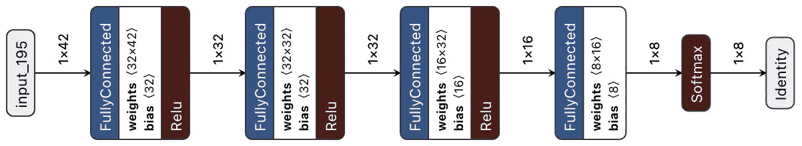

图片作者|神经网络结构

因为这样简单的结构，我们可以用少量的例子得到极好的精度。我们不需要在不同的光照下为每个手势重新训练模型，因为 MediaPipe 接管了所有的检测工作。

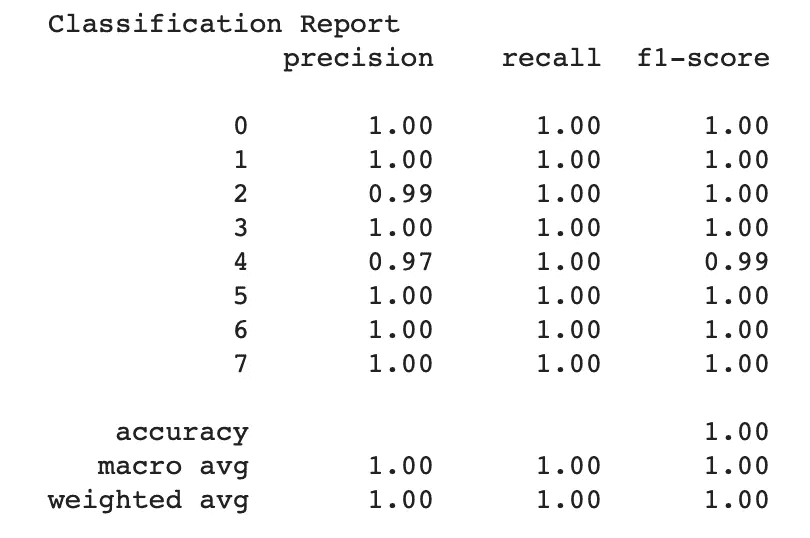

作者图片

在我的实验中，我可以对 8 种不同的手势中的每一种获得超过 97%的准确率。

因为网络的结构非常简单，您可以很容易地使用**网格搜索**来找到最适合神经网络的超参数。

这是我在这个项目中使用的 Tensorboard 的一个例子:

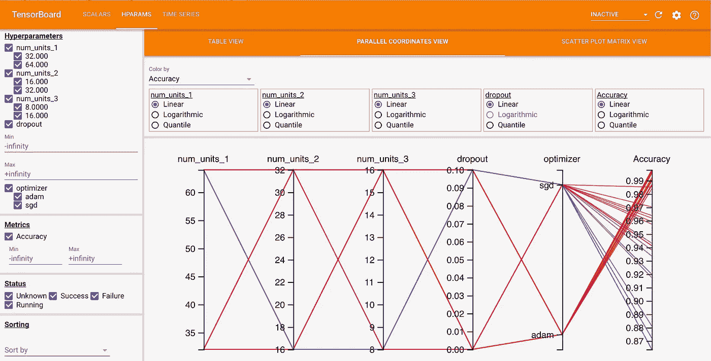

作者图片|网格搜索可视化示例

## 无人机控制器

好了，我们有了无人机的图像和基于检测到的关键点返回手势 ID 的模型。但是如何控制我们的无人机呢？

泰洛最棒的地方在于他有现成的 Python API 来帮助我们完成这项工作。我们只需要将每个手势 ID 设置为一个命令。

尽管如此，为了消除错误识别的情况，我们将创建一个手势缓冲区。当这个缓冲区主要包含一个特定的手势 ID 时，我们可以发送一个命令来移动无人机。

*以下是项目代码的功能实现示例:*

这里可以看到，我们只是根据每个 ID 设置不同方向的期望速度。这使得无人机能够朝着一个方向飞行而不会颠簸。

# 演示

这是最甜蜜的部分🔥

但是首先，运行项目需要一些准备工作:

## 设置

首先，克隆存储库

```
# Using HTTPS
git clone [https://github.com/kinivi/tello-gesture-control.git](https://github.com/kinivi/tello-gesture-control.git)
# Using SSH
git clone [git@github.com](mailto:git@github.com):kinivi/tello-gesture-control.git
```

**1。媒体管道设置**

然后，安装以下依赖项:

```
ConfigArgParse == 1.2.3
djitellopy == 1.5
numpy == 1.19.3
opencv_python == 4.5.1.48
tensorflow == 2.4.1
mediapipe == 0.8.2
```

图像处理需要 OpenCV，djitellop 是 DJI 官方 Python API 的一个非常有用的包装器

**2。泰洛设置**

打开无人机并将电脑连接到其 WiFi

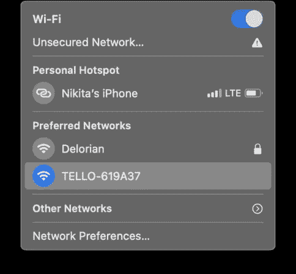

作者图片

接下来，运行以下代码来验证连通性

成功连接后，您将看到以下内容

```
1\. Connection test:
Send command: command
Response: b'ok'2\. Video stream test:
Send command: streamon
Response: b'ok'
```

## 运行应用程序

有两种控制方式:**键盘**和**手势**。在飞行过程中，你可以在不同的控制类型之间转换。下面是对这两种类型的完整描述。

运行以下命令启动 tello 控件:

```
python3 main.py
```

该脚本将启动 python 窗口，显示如下:

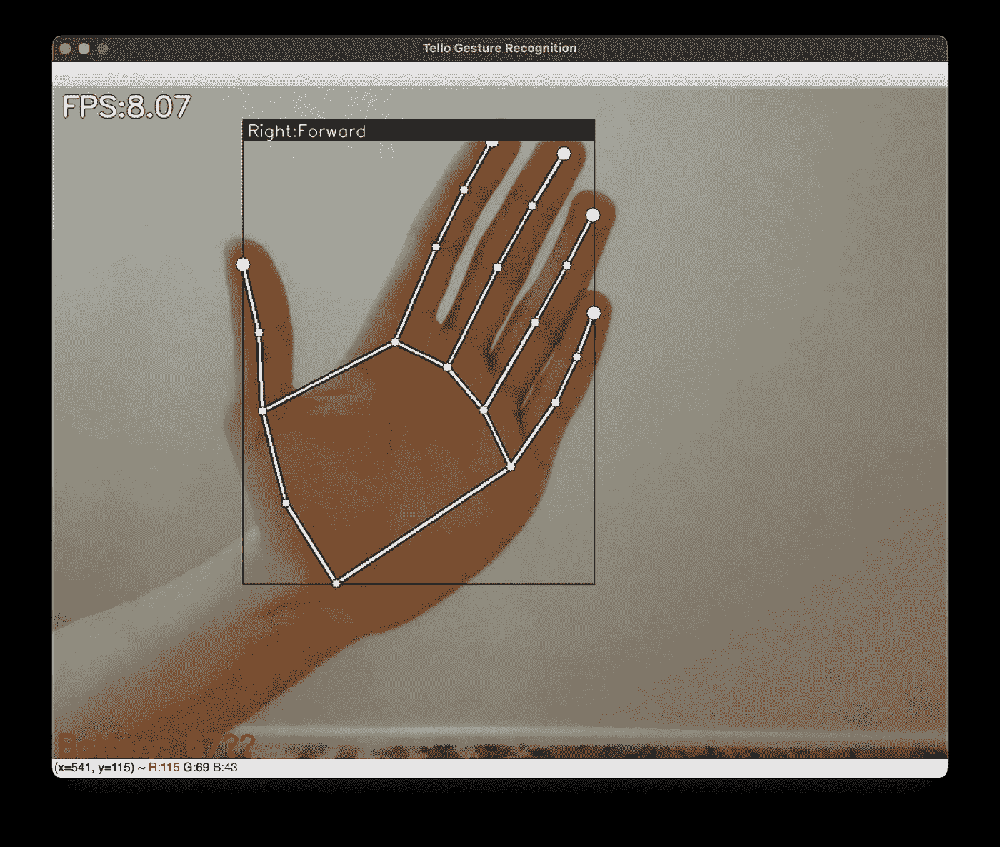

作者图片

## 键盘控制

为了将你的无人机定位到一个完美的地方或者在紧急情况下，你可以使用键盘控制。默认情况下，起飞后，*键盘的控制方式*是**在**上

检查以下按键和动作描述列表:

*   `k` - >切换键盘控制
*   `g` - >切换手势控制
*   `Space` - >起飞无人机(如果降落)或降落无人机(如果飞行中)
*   `w` - >向前移动
*   `s` - >向后移动
*   `a` - >向左移动
*   `d` - >向右移动
*   `e` - >顺时针旋转
*   `q` - >逆时针旋转
*   `r` - >上移
*   `f` - >向下移动
*   `Esc` - >结束程序，降落无人机

## 手势控制

按下`g`激活*手势控制模式*。以下是我的回购中可用手势的完整列表:

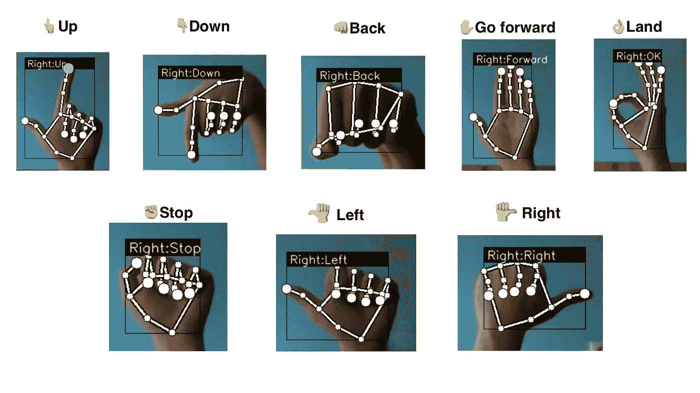

图片作者|手势列表

## 飞行🚀

现在你已经准备好飞翔了。按下`Space`起飞，享受🛸

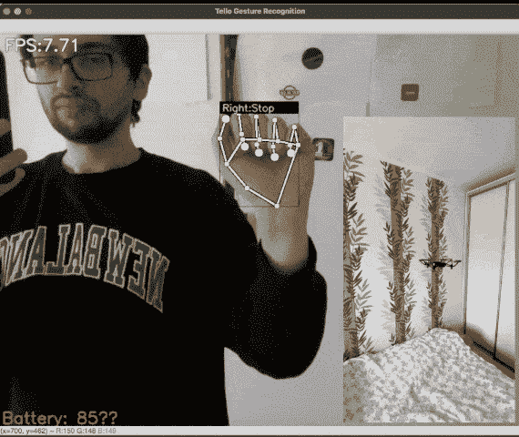

作者 GIF |演示

## 项目回购

<https://github.com/kinivi/tello-gesture-control.git>  

## 参考

*   [MediaPipe 手关键点检测器](https://google.github.io/mediapipe/solutions/hands)
*   [DJI 泰洛 API 包装库](https://github.com/damiafuentes/DJITelloPy)
*   [使用手关键点的手势识别(Kazuhito00)](https://github.com/Kazuhito00/hand-gesture-recognition-using-mediapipe)

**附言**。这个项目也可以很容易地添加你自己的手势。只需查看[自述](https://github.com/kinivi/tello-gesture-control#Adding-new-gestures)的这一部分。

**P.S.S.** 在不久的将来，我将使用一个 [**整体模型**](https://google.github.io/mediapipe/solutions/holistic) 来检测大距离的手势，并使用 TensorFlow JS 来利用智能手机上的 **WebGPU 加速**(用智能手机上的摄像头控制无人机)。所以，如果你对它感兴趣，请在 [GitHub](https://github.com/kinivi) 上关注我。