# 控制梯度下降

> 原文：<https://towardsdatascience.com/controlling-gradient-descent-fb5e494ab1ea?source=collection_archive---------19----------------------->

## …就像驾驶一辆旧车


拉夫(拉维)凯登在 [Unsplash](https://unsplash.com/s/photos/old-blue-carutm_source=unsplash&amp;utm_medium=referral&amp;utm_content=creditCopyText) 上的照片

与 [Adam 优化算法](https://arxiv.org/pdf/1412.6980.pdf%20%22%20entire%20document)相比，将要讨论的算法将允许您以大约 10 ⁰的因子常规地达到更低的成本函数值。

继续看下去，看看为什么像“开旧车”！

# 介绍

在科学和技术领域，有许多计算都需要最小化成本函数(CF)。人们使用 CFs 是因为它们易于构建，并且因为它们的最小值对应于他们寻求了解的内容。它们已经被用于机器学习(ML)、物理学和许多其他领域。事实证明，梯度下降(GD)算法对于寻找 CF 的最小值特别方便。回想一下，GD 通过以下方式对函数 *f(θ)* 进行运算:将其自变量从 *θ_old* 更新为 *θ_new*

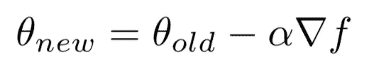

其中 *α* 为学习率，梯度为 *∇f = ∂ f / ∂ θ* 。重复这种更新，直到满足停止条件。如图所示，只需要计算梯度，并将 *α* 设置为一个适当的小数值。

然而，找到 *α* 的“最佳”值证明是一个问题。通常，人们会使用不同的 *α* 值进行几次试验优化，看看哪一个看起来会导致最佳行为，然后只选择那个值。然而，即使仅仅是在整个优化运行中使用单个值 *α* 的想法也是有缺陷的。我认为这相当于试图以单一速度在两个城市之间行驶。例如，在芝加哥和圣路易斯之间开车的最佳速度是每小时 10 英里、40 英里还是 70 英里？当然，对于旅行的不同部分，不同的速度是优选的。这与寻找整个优化运行的最佳 *α* 的情况类似。

本文的计划是这样的:首先，引入诊断 *ρ* ，它将洞察 *α* 是否过大或过小。接下来，将通过一个例子来演示，只是为了建立直觉。之后，给出了一些伪代码来展示如何计算 *ρ* 而实际上没有额外的成本。最后将展示如何在大家最喜欢的测试题上使用 *ρ* :对数字进行分类！使用它的算法(NeogradM)优于 Adam，CF 值低了许多数量级。

# ρ诊断

我们用下图来解释一下 *ρ*

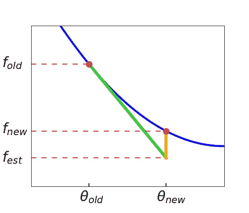

作者图片

***蓝色*** 曲线为 CF，两个参数值( *θ_old* 和 *θ_new* )标有 ***红色*** 圆点。这些值对应的 CF 值为 *f_old* 和 *f_new* 。此外，定义 *f_est* 为基于 GD 算法的估计 CF 值，如下所示

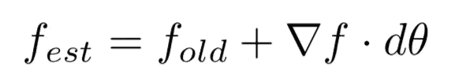

其中 *dθ = (θ_new -θ_old)* 。注意，这真的只是一个线性方程，就像大家熟悉的“ *y = mx + b* ”，除了这里的 *y = f_est，m = ∇f，x = dθ，b = f_old* 。由于 *dθ* 从 *0* 到 *(θ_new -θ_old)* 变化，导致 *f_est* 的值范围在图中显示为一条 ***绿色*** 线。

然而，我们真正感兴趣的是那个图中的 ***橙色*** 线。它代表估计值 *f_est* 和正确值 *f_new* 之间的差距或“偏差”。在图中，这个偏差表示α是太大还是太小。但是，要让它真正有用，应该是无量纲的。在这里，这是通过将其除以来自 *f_est* 的垂直落差来实现的。这导致了 *ρ* 诊断测量:

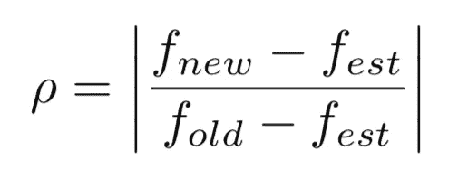

这里使用绝对值，因为我们只关心大小。
注意，该度量相对于平移和缩放 *f* 是不变的(同时保持 *dθ* 不变)，这正是所需要的。因此， *ρ* 作为 *α* 大小适当性的一种“通用度量”。

# 如何看待 *ρ*

你可能在想，我应该用什么值来表示 *ρ* ？当然，非常小的值将导致低效的更新，而非常大的值将导致相对不稳定和不受控制的更新。

但是，在直接回答 *ρ* 的一个“最佳值”之前，先考虑一下这个类比。想象一下，有人开着一辆**旧车**，试图尽可能快地行驶。他甚至不会看速度计；他只注意汽车何时开始高速晃动。这位司机的理由是，“如果车晃动得很小，我可以开得更快，但如果晃动得很大，我就应该减速”。GD 也是这种情况，只不过现在 *ρ* 是抖音 *α* 是油门。在这两种情况下,“震动”都是我们希望控制的变量的代理，无论是油门踏板还是学习速率 *α* 。

> 这位司机的理由是，“如果车晃动得很小，我可以开得更快，但如果晃动得很大，我就应该减速”。GD 也是这种情况，只不过现在 *ρ* 是抖音 *α* 是油门。

总结一下，控制算法变成:如果 *ρ* 太大，减小 *α* ，如果 *ρ* 太小，增大 *α* 。当然，理想的是将 *ρ* 保持在一个固定值。在下一节的示例中，将展示如何做到这一点。这被称为“常数 *ρ* ansatz”，达到这个值的一个 *α* 被称为*理想*学习率。

# 一个例子

证明 *ρ* 有用的一个很好的例子是一维四次 CF。我们需要计算 *ρ* 的变量是:

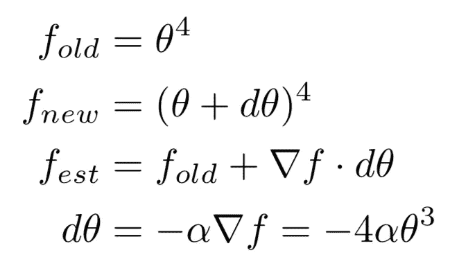

一个简单的计算揭示了

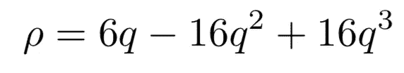

其中 *q = αθ* 。需要注意的最重要的特征是 *ρ* 现在取决于 *θ* 。这意味着单个 *α* 将根据在 *θ=0* 处接近最小值而产生不同的效果。更有趣的是，这个等式可以很容易地倒过来有利于 *α。*假设小 *q，*

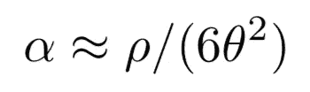

虽然相当简单，但这其实相当了不起。我们现在有一个公式，在给定 *ρ* 的期望值的情况下，通过该公式来设置 *α* 。随着 GD 算法的每次迭代，随着 *θ* 的变化，该公式保证保持 *ρ* 的目标值。这被称为“理想 GD”算法，如下图所示；它显示了 Adam 和理想 GD 的 *log f* 和 *logρ* 与*迭代*。

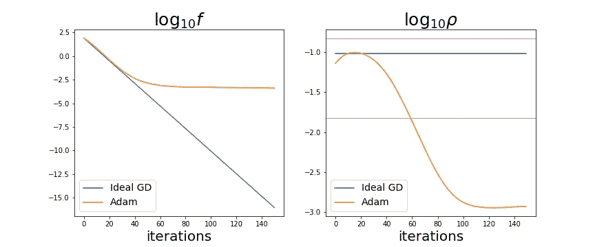

作者图片

在图中，目标值是 *ρ = 0.1。S* o，在理想 GD 的每次迭代中，根据上述公式将 *α* 设置为 *0.1/(6θ)，*。(两种算法的初始 *θ* 都是 *-3* 。)该图显示，仅经过 *150* 次迭代后，用理想 GD 达到的值比来自 Adam 的值小超过 *10* 倍。显然，运行时间越长，这个因素就变得越大。此外，它还显示，对于 Adam，它开始趋于平稳的阶段与它的 *ρ* 下降的阶段一致。在图中，这发生在第 *50* 次迭代附近。这个特征在亚当身上反复出现。由于 *ρ* 没有用 Adam 控制，所以是自由进化；在这种情况下，它变得非常小，导致低效的更新。本质上，亚当有内置的正则化，因为它的 *ρ* 自然变得非常小。这类似于提前停止，也是它趋于“停滞”的原因。此外，运行 Adam 也是一个挑战，因为必须进行大量的试运行来为 *α* 选择一个合适的值。关于理想的 GD 算法，主要问题是它使 CF 变得如此之小，以至于人们不得不担心机器精度误差，因为数字*变得那么小*。

> 本质上，Adam 有内置的正则化，因为它的 *ρ* 自然变得非常小。这类似于提前停止，也是它趋于“停滞”的原因。

# 高效计算 *ρ*

在上一节中，我们给出了一个简单成本函数的示例，并确定了 *ρ* 和 *α* 之间的精确关系。利用这一点，可以将 *α* 设置为 *ρ* 目标值的函数。在实际应用中，CF 变得极其复杂，并且这种关系的计算变得不可能。相反，测量值 *ρ* 将用于设置 *α* 。现在看来， *ρ* 的公式使得每次迭代需要两次 CF 计算。然而，每次迭代只需一次计算就可以轻松测量 *ρ* 。首先，让我们从 GD 的一些基本伪代码开始:

```
INIT: θ, num
FOR: i = 1 to num+1
   f  = f(θ)
   g  = ∇f(θ)
   dθ = -αg
   θ  = θ + dθ
RETURN: θ
```

鉴于到目前为止的讨论，它应该是不言自明的。现在，这个版本最重要的是 FOR 循环中以下操作的顺序:(1)求值 *f* , (2)求值 *g* , (3)更新 *θ* 。
这个" *f* - *g* -update "序列现在被修改，因此在循环之前有一个初始的" evaluate *f* ",在循环内部的顺序是" *g* -update- *f* "。这种重写允许访问更新前后的值，并且不需要额外的计算。经过这些更改，伪代码显示为

```
INIT: θ_old, num
f_old = f(θ_old)
FOR: i = 1 to num
   g  = ∇f(θ_old)
   dθ = -αg
   θ_new  = θ_old + dθ
   f_new  = f(θ_new)
   f_est = f_old + g.dθ
   ρ = get_rho( f_old, f_new, f_est )
   f_old = f_new
   θ_old = θ_new
RETURN: θ_new
```

其中 *get_rho* 是我们等式 *ρ* 的一个实现。最后，如果这种重写对你没有吸引力，还有其他的方法。例如，您可以在诸如“IF i > 1”的条件中评估 *ρ* ，以确保 *f_old* 和 *f_new* 都可用。

# 近似 *α*

这样一来，下一步就是理解如何使用原来的 *ρ* 公式来设置 *α* 。事实证明，它可以以近似的方式使用，同样没有显著的开销。记住 *ρ* 的定义，通过定义数量 *A* 和 *B*

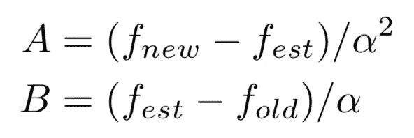

这样做是为了抽出对 *α* 的前导顺序依赖，并使其显式化。因此， *A* 和 *B* 都是常量，以 *α* 为前导顺序。但是注意一般情况下 *A* 保留 *α* 依赖，而 *B* 没有 *α* 依赖。使用这些等式和 *ρ* 的定义，很容易得出 *α* 的表达式

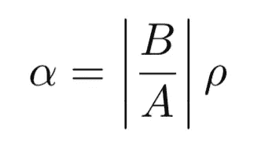

注意，在更新之后，这个等式完全成立。但是 *ρ* 的值很可能会过大或过小。因此，作为第一近似值(参见 Neograd_v0，单位为秒)。6.3 [此处](https://arxiv.org/pdf/2010.07873.pdf))我们将通过替代 *ρ* 的目标值来获得新的 *α* 。只要这两个 *ρ* 值(目标值和当前值)相差不大，这种方法就能很好地工作。此外，它是近似值的原因是因为一般来说， *A* 有一些 *α* 依赖性。最后，请注意我们正在做的技巧是将 *α* 视为*相关*变量，将 *ρ* 视为*独立*变量，而实际情况正好相反。

让我们考虑一个例子来说明这一点。假设第 7 次迭代后 *α=0.1* ， *B=5* ， *A=10* ， *ρ=0.2* 。注意到这些值完全满足上述 *α* 的等式，因为它们必须满足(即 *0.1=(5/10)0.2* )。现在，我们希望 *ρ* 值更接近于 *0.1* 的目标值，因此我们将 *0.1* 与相同的 *A* 和 *B* 一起代入等式，并将 *α* 的新值计算为 *0.05* 。这个新值将用于第 *8* 次迭代。当然， *0.05* 的这个值可能并不理想，因为我们忽略了 *A* 中的 *α* 依赖性，但是只要 CF 变化不太快，它就能很好地工作。顺便提一下，您可能会注意到，由于这种技术涉及到在随后的迭代中*α*的*近似*值，所以“晚了一天，少了一美元”的说法浮现在脑海中。尽管如此，它仍然工作得很好。

> 由于这项技术涉及到*后续*迭代中 *α* 的*近似*值，所以“晚了一天，少了一美元”的说法浮现在脑海中。尽管如此，它仍然工作得很好。

下一级近似是，不要试图通过代入 *ρ* 目标值来获得新的 *α* ，而是使用与原始值相差不大的 *ρ* 值。这在我的论文里叫做 Neograd_v1。最后，我们可以把这个算法和现有的结合起来。我发现最有效的方法是将这些想法和动力结合起来；它叫 NeogradM。

这里有一个 NeogradM 应用于数字识别问题的例子(数据来自 [Scikit-Learn](https://scikit-learn.org/stable/modules/generated/sklearn.datasets.load_digits.html) )。CF 是在神经网络的输出和训练标签之间构造的交叉熵惩罚。从图中可以看出

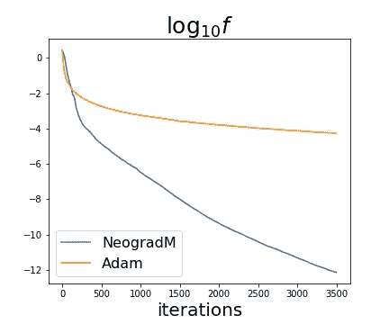

作者图片

使用 NeogradM 得出的 CF 值比使用 Adam 得出的值大约小 10⁸倍。另外，如图 13 中的[我的论文](https://arxiv.org/pdf/2010.07873.pdf)【1】所示， *ρ* 的值主要停留在目标附近；对于 Adam 来说， *ρ* 的值要低大约 *100* 倍。同样，Adam 的情况是 *ρ* 变得很小，CF 曲线有一个平台。

# 最终意见

本文的目的是向您介绍 Neograd 系列算法的[全文](https://arxiv.org/pdf/2010.07873.pdf)中的主要概念。也许最重要的一点是 *ρ* 诊断指标易于实施，是学习率的有效代表。如果你继续在你自己的梯度下降程序中实现它，那就是成功了一半。然后，您可能会发现您当前的程序可能会运行得更快。在这一点上，也许你会愿意采取下一步，实施 NeogradM 示例代码在[我的 Github](https://github.com/mfzimmer/Neograd) 上。

除了这里已经回顾的，全文包括许多其他有用的结果，例如其他度量，GD 的另一个推导，等等。

希望你喜欢这篇文章！

**参考文献**

[1] M.F. Zimmer， [Neograd:具有接近理想学习率的梯度下降(2020)](https://arxiv.org/pdf/2010.07873.pdf) ，arXiv 预印本，arXiv:2010:07873。(已提交出版)