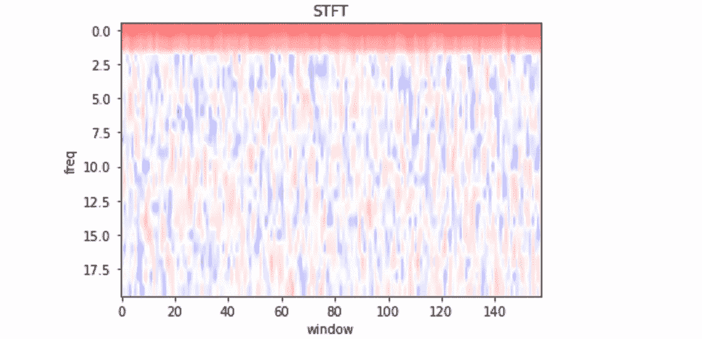
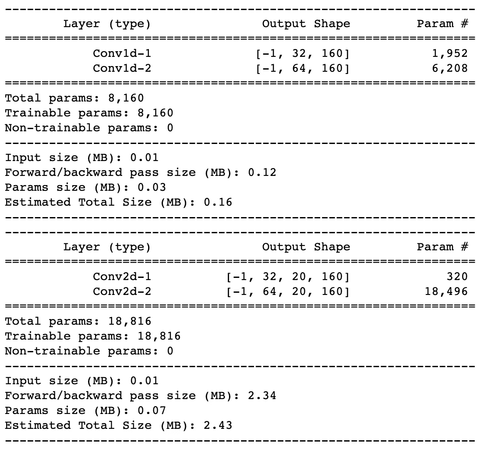
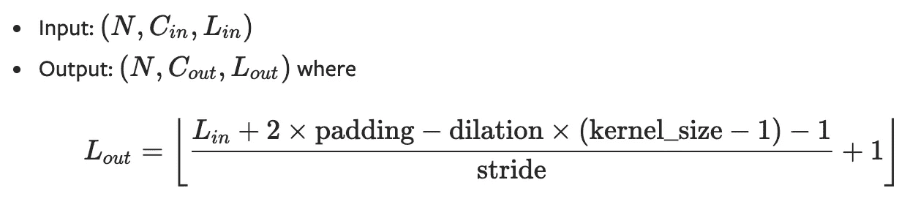
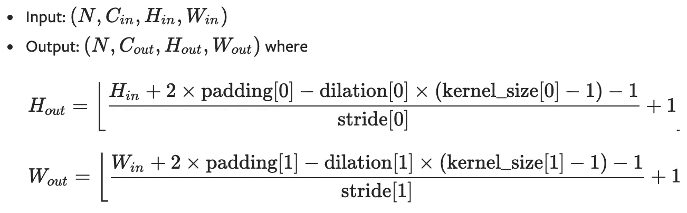
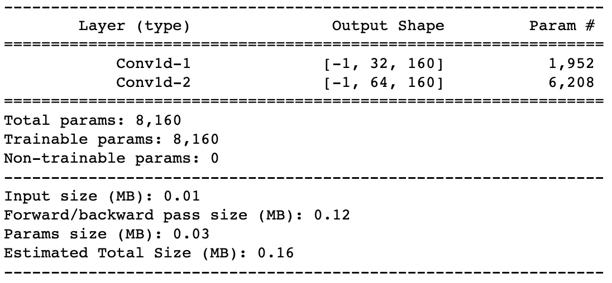
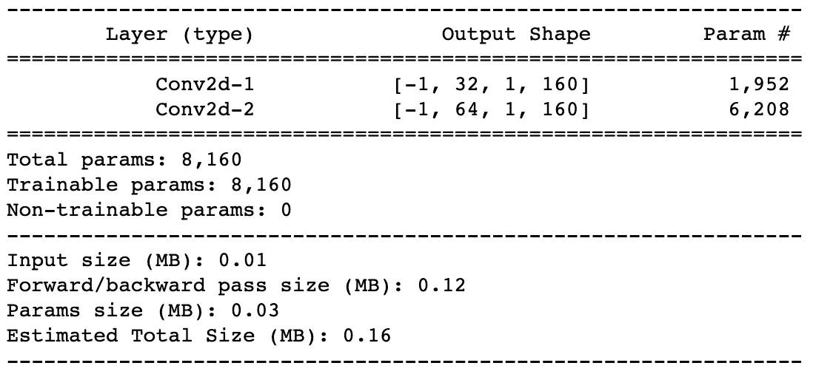

# Conv1D 和 Conv2D:你知道 Conv1D 是 Conv2D 的子类吗？

> 原文：<https://towardsdatascience.com/conv1d-and-conv2d-did-you-realize-that-conv1d-is-a-subclass-of-conv2d-8819675bec78?source=collection_archive---------13----------------------->

## 比较和评估 Conv1d 和 Conv2D

照片由[像素](https://www.pexels.com/photo/grayscale-photo-of-computer-laptop-near-white-notebook-and-ceramic-mug-on-table-169573/)上的[负空间](https://www.pexels.com/@negativespace)拍摄

很可能，阅读本文的大多数人已经实现了一些基于 CNN 的神经网络，并想知道在进行时间序列分析时是使用 Conv1D 还是 Conv2D。在这篇文章中，我将解释和比较这两种卷积类型，并回答以下问题:*为什么我说 Conv1D 是 Conv2D 的子类？*

如果你不能轻易地回答这个问题，我想这篇文章会让你感兴趣的。一如既往，欢迎任何问题/评论。

几个月前，我被要求为一个基于时间序列的挑战创建一个神经网络。数据大概是这样的:

*   数据数量:500
*   长度:3200
*   频率:40
*   频道:1

基于时间序列的长度，我决定实现[短时傅立叶变换](https://en.wikipedia.org/wiki/Short-time_Fourier_transform#:~:text=The%20Short%2Dtime%20Fourier%20transform,as%20it%20changes%20over%20time.)进行分析。一个数据看起来类似于图 1 所示的曲线图。此外，输出具有如下所示的形状。

*   输入形状:(500，1，3200)
*   输出 STFT 形状:(500，20，160)

一个数据的 STFT

在与几个人交谈后，我意识到在日常生活中与图像打交道的人建议使用 Conv2D，在 Conv2D 中，数据被视为图像。另一方面，处理时间序列的人表示 Conv1D 是最佳解决方案，类似于多通道时间序列任务，其中每个通道对应一个频率。在 [PyTorch](https://pytorch.org/) 的符号中，神经网络的输入是:

*   CNN: ( *N* =256， *Cin* =20，*林* =160)
*   2D CNN: ( *N* =256， *Cin* =1，*欣* =20，*胜* =160)

因此，我们可以实现两种可能的 2 层神经网络来解决这个任务:

正如所观察到的，1D CNN 的参数数量是 8160，而 2D CNN 是 18816，这两种方法都是时间序列分析的有效方法。

然而，在写报告的时候，我想到了以下问题:**有没有可能创建一个类似于 1D CNN 的 2D CNN？如果有，执行情况如何？**

虽然这一开始听起来很奇怪，但这是可能的，而且为了理解这种说法，有必要了解卷积层是如何工作的。

使用参数*内核大小*、*填充、步幅和膨胀*来定义卷积层:

*   *内核大小*:指滤镜蒙版的形状。
*   *填充*:添加到图像中的像素数量。
*   *步距*:输入矩阵上移动的像素数。
*   *膨胀*:内核中值之间的间距。

每个卷积层的输出取决于这些参数，并使用以下 PyTorch 公式进行计算。

## Conv1D

塑造 1D·conv。[参考](https://pytorch.org/docs/stable/generated/torch.nn.Conv1d.html)

## Conv2D

塑造 2D·conv。[参考](https://pytorch.org/docs/stable/generated/torch.nn.Conv2d.html)

因此，即使首先要获得两种类型卷积的相同结果似乎很困难，但问题的答案最终还是要为参数设置正确的值。

让我们用上面提到的例子来研究这个问题。如果我定义一个具有 32 和 64 个过滤器的两层 1D CNN，参数和形状如下所示。

*   输入:( *N* =256，*= 20，*林* =160)*
*   *Conv1d-1: kernel_size=3，padding=1，stride=1，dilation=0*
*   *Conv1d-2: kernel_size=3，padding=1，stride=1，dilation=0*

**

*因此，我们的目标是找到 2D CNN 的参数，其输出结果类似于 1D CNN:*

*   *输出层 1: ( *N* =256，*= 32，*林* =160)**
*   **输出第二层:( *N* =256，*= 62，*林* =160)***

**在 2D 有线电视新闻网，翻译为获得:**

*   **输入 2D: ( *N* =256， *Cin* =1，*欣* =20，*赢* =160)**
*   **输出层 1: ( *N* =256， *Cin* =32，*欣* =1，*赢* =160)**
*   **输出层 2: ( *N* =256， *Cin* =62，*欣* =1，*赢* =160)**

**总之，本文提出的问题的答案非常简单:**

> **设置正确的参数，我们可以创建一个具有与 Conv1D 相同功能的 Conv2D。**

**特别是，要设置的主要参数是内核大小。对于这种特殊情况，Hin 的内核必须设置为 20，类似于 1D CNN 的频率或频道总数。此外，需要将该维度的填充固定为 0，因此我们得到维度 1 作为该层的输出。**

**实现如下:**

## **Conv2D**

****

**总之，我们能肯定 1D CNN 是 2D CNN 的一个子类吗？正如我在这篇文章中试图解释的那样，我们总是可以创建一个 2D CNN，其功能与 1D CNN 相同，并设置正确的内核大小、填充和步幅。作为一个说明性的例子，我们有这个最后的 2D CNN，它的参数数量类似于上面实现的 1D CNN。**

**然而，这一结论并不意味着我们应该总是使用 2D CNN 而不是 1D CNN，因为后者在处理例如多通道时间序列时更容易实现。我只是试图表达 Conv1D 和 Conv2D 最终是相同的。**

*****如果你喜欢这个帖子，请考虑*** [***订阅***](https://javiferfer.medium.com/membership) ***。你将获得我所有的内容+所有其他来自牛逼创作者的文章！*****