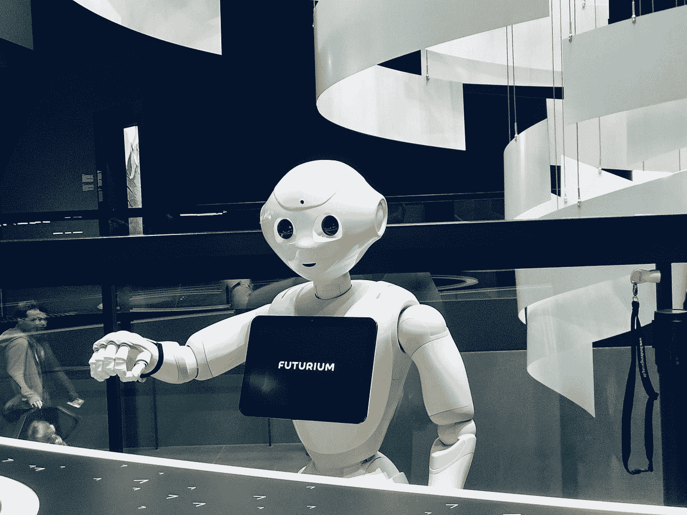

# 对话式人工智能聊天机器人，带有使用 Pytorch 的预训练变压器

> 原文：<https://towardsdatascience.com/conversational-ai-chatbot-with-pretrained-transformers-using-pytorch-55b5e8882fd3?source=collection_archive---------11----------------------->

## 了解如何使用 Huggingface Transformers 构建一个具有 DialoGPT 功能的对话聊天机器人



在 [Unsplash](https://unsplash.com?utm_source=medium&utm_medium=referral) 上由 [Fitore F](https://unsplash.com/@daseine?utm_source=medium&utm_medium=referral) 拍摄的照片

# 介绍

[**会话系统，或者说**](https://en.wikipedia.org/wiki/Dialogue_system) 对话系统，已经在现代[**【NLP】**](https://en.wikipedia.org/wiki/Natural_language_processing)社区中获得了巨大的兴趣。看到机器人可以如此接近地模仿我们的思想、逻辑和情感，就像它们的语言所显示的那样，这真是令人兴奋。今天，我们知道在我们的智能手机中，数字助理就在我们的手掌中，如[苹果 Siri](https://www.apple.com/siri/) 、[谷歌助理](https://assistant.google.com/)和[微软 Cortana](https://www.microsoft.com/en-us/cortana) 。它们都能够倾听用户的语言并做出反应，尽管并不完美。

在这篇文章中，我们将教你如何利用 DialoGPT 这样的预训练转换器来实现你自己的对话聊天机器人。我们将使用 [Huggingface](https://huggingface.co/) 提供的[变形金刚库](https://github.com/huggingface/transformers)来构建这个系统。

所以事不宜迟，让我们开始吧！

# 教程概述

*   步骤 1:安装库
*   步骤 2:导入库
*   步骤 3:构建对话管道
*   步骤 4:添加开始对话
*   步骤 5:添加连续对话

# 步骤 1:安装库

我们正在使用的库是[拥抱脸变形金刚](https://github.com/huggingface/transformers)。要安装它，您只需:

```
pip install transformers
```

确保有一个工作版本的 [Pytorch](https://pytorch.org/) 或者 [Tensorflow](https://www.tensorflow.org/) ，这样变形金刚就可以使用其中一个作为后端。

# 步骤 2:导入库

安装了 Transformers 之后，现在是时候用 Python 脚本导入它了。我们没有使用整个 Transformers 库，而是引入了一个`[pipeline](https://huggingface.co/transformers/main_classes/pipelines.html)`模块，它基本上提供了一个非常简单的 API 来完成各种 NLP 任务，而不需要理解复杂的代码。我们还导入了`[Conversation](https://huggingface.co/transformers/main_classes/pipelines.html#transformers.Conversation)`对象，稍后我们将把它用于对话管道。

要导入它们，您可以:

```
from transformers import pipeline, Conversation
```

# 步骤 3:构建对话管道

导入相关组件后，现在我们可以通过以下方式开始构建对话系统的管道:

```
conversational_pipeline = pipeline(“conversational”)
```

这行代码将使用 [**DialoGPT**](https://arxiv.org/abs/1911.00536) 作为模型，一个在对话数据集上训练的 [GPT2](https://cdn.openai.com/better-language-models/language_models_are_unsupervised_multitask_learners.pdf) 模型来设置对话管道。

# 步骤 4:添加开始对话

现在，我们可以开始和机器人说话了！首先，让我们开始与机器人的两次对话，并询问它电影推荐以及它最喜欢的书是什么:

> 对话 1:我们今晚去看电影吧——有什么推荐吗？
> 
> 对话 2:你最喜欢的书是什么？

```
conv1_start = “Let’s watch a movie tonight — any recommendations?”
conv2_start = “What’s your favorite book?”
```

然后，我们使用定义的变量构建两个对话:

```
conv1 = Conversation(conv1_start)
conv2 = Conversation(conv2_start)
```

之后，我们将两个对话都放入列表中，然后将其提供给对话管道:

```
conversational_pipeline([conv1, conv2])
```

最后，我们可以看到机器人返回的每个对话的结果:

> 【对话 id:a9ba e572-cc11–48 c8-b36f-d 88 BCD 49 b 8 c 0
> 用户> >今晚一起看电影吧——有什么推荐吗？
> bot > > The Big Lebowski，
> 对话 id:e6ee2d 97–5ee 7–404 b-b2e 5–4dd 527 F9 e9 DD
> 用户> >你最喜欢的书是什么？
> bot>T20【饥饿游戏】

# 步骤 5:添加连续对话

我们可以通过向之前的对话添加新的用户输入来继续与机器人的对话，然后再次处理对话管道。

想象一下，我们想通过在对话 1 中询问电影是关于什么的以及在对话 2 中询问书的类型来跟进机器人。

> 对话 1:是关于什么的？
> 
> 对话 2:酷，这本书是什么类型的？

```
conv1_next = “What is it about?”
conv2_next = “Cool, what is the genre of the book?”
```

要在之前的对话中添加新的用户输入，我们可以先做:

```
conv1.add_user_input(conv1_next)
conv2.add_user_input(conv2_next)
```

之后，我们可以简单地重用之前的代码，用新的对话集更新对话管道:

```
conversational_pipeline([conv1, conv2])
```

最后，您应该看到机器人能够返回与主题相关的新响应:

> 【对话 id:a9ba e572-cc11–48 c8-b36f-d 88 BCD 49 b 8 c 0
> 用户> >今晚一起看电影吧——有什么推荐吗？
> bot > >大李博斯基
> 用户> >它讲的是什么？这是一部喜剧，讲的是一个人在电影院找到了一份工作，并得到了一堆工作。、
> 对话 id:e6ee2d 97–5ee 7–404 b-b2e 5–4dd 527 f 9 e 9 DD
> 用户> >你最喜欢的书是什么？
> bot > >饥饿游戏
> 用户> >爽，书的流派是什么？
> bot > >我不确定，但我觉得是幻想。]

# 结论

这就是本文的全部内容！希望你学到了有用的东西。在这篇文章中，我们讨论了如何使用 Huggingface 提供的预训练模型实现自己的对话机器人。如果你正在寻找它，为了你的方便，我在下面附上了一个 Jupyter 版本的全部代码:

希望你喜欢这篇文章！如果你喜欢我的作品，请订阅电子邮件列表，这样你就可以在我创作新内容时收到更新！如果感兴趣，也可以随意浏览我的其他帖子:

[](/text-generation-with-pretrained-gpt2-using-pytorch-563c7c90700) [## 使用 Pytorch 通过预训练的 GPT2 生成文本

### 使用 Huggingface 框架快速轻松地生成任何语言的文本

towardsdatascience.com](/text-generation-with-pretrained-gpt2-using-pytorch-563c7c90700) [](/question-answering-with-pretrained-transformers-using-pytorch-c3e7a44b4012) [## 使用 Pytorch 回答关于预调变压器的问题

### 学会在几分钟内建立一个任何语言的问答系统！

towardsdatascience.com](/question-answering-with-pretrained-transformers-using-pytorch-c3e7a44b4012) [](/machine-translation-with-transformers-using-pytorch-f121fe0ad97b) [## 使用 Pytorch 的变压器机器翻译

### 只需简单的几个步骤就可以将任何语言翻译成另一种语言！

towardsdatascience.com](/machine-translation-with-transformers-using-pytorch-f121fe0ad97b) [](/abstractive-summarization-using-pytorch-f5063e67510) [## 使用 Pytorch 的抽象摘要

### 总结任何文本使用变压器在几个简单的步骤！

towardsdatascience.com](/abstractive-summarization-using-pytorch-f5063e67510) [](/semantic-similarity-using-transformers-8f3cb5bf66d6) [## 使用转换器的语义相似度

### 使用 Pytorch 和 SentenceTransformers 计算两个文本之间的语义文本相似度

towardsdatascience.com](/semantic-similarity-using-transformers-8f3cb5bf66d6) 

# 参考

[1] [苹果 Siri 官网](https://www.apple.com/siri/)，苹果

[2] [谷歌助手官网](https://assistant.google.com/)，谷歌

[3] [微软 Cortana 官网](https://www.microsoft.com/en-us/cortana)，微软

[4] [变形金刚 Github](https://github.com/huggingface/transformers) ，拥抱脸

[5] [变形金刚官方文档](https://huggingface.co/transformers/)，拥抱脸

[6] [Pytorch 官网](https://pytorch.org/)，脸书艾研究

[7] [Tensorflow 官网](https://www.tensorflow.org/)，谷歌大脑

[8]张，，等.[“对话概念:大规模生成性会话应答生成的预训练”](https://arxiv.org/abs/1911.00536) *arXiv 预印本 arXiv:1911.00536* (2019)。

[9]拉德福德、亚历克等[“语言模型是无人监督的多任务学习者。”](https://cdn.openai.com/better-language-models/language_models_are_unsupervised_multitask_learners.pdf) *OpenAI 博客* 1.8 (2019): 9。