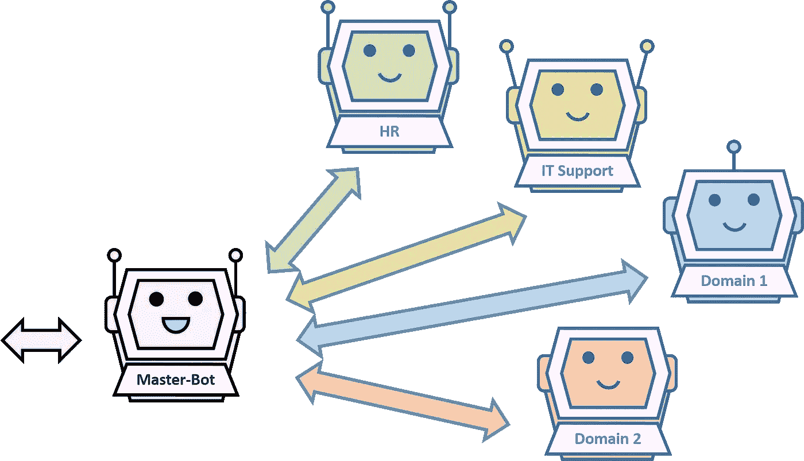
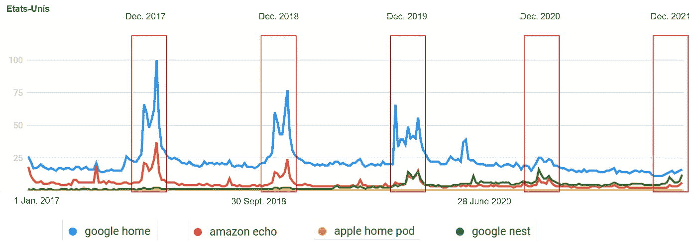

# 对话式人工智能:2022 年的趋势和预测

> 原文：<https://towardsdatascience.com/conversational-ai-trends-and-predictions-for-2022-8be05e15e713?source=collection_archive---------9----------------------->

## 在这篇文章中，我提出了 2022 年市场发展的 6 个趋势和预测。

## 由于当前疫情形势带来的新的个人和职业生活方式，数字化转型正在快速加速。对话助手是这种转变的一部分，它实现了支持和自助服务请求的自动化。

马修·施瓦茨在 [Unsplash](https://unsplash.com?utm_source=medium&utm_medium=referral) 上的照片

在健康状况的推动下，对业务流程自动化的需求持续增长，不幸的是，这种情况可能还要持续几个月甚至几年。2020 年是充满疑问的一年，2021 年是前前后后的过渡年。由于远程工作而导致的团队分散，给公司带来了数字化转型，以及随时随地访问其功能的问题。

支持功能被过度订阅，授权团队为自己做事的需求非常重要。根据您是客户还是解决方案提供商，这种方法被称为自助服务或左移，它包括让客户、供应商和员工能够全天候自己获得答案、解决问题或执行某些操作。

在自动化手段的类别中，我们发现由人工智能驱动的对话助手。这些允许自动处理几个用例，例如:回答重复出现或偶然出现的问题，执行或多或少的简单操作，帮助解决一般的计算机问题，在某些操作中帮助人类，等等。

# 预测 1:需求将继续增长

尽管全球形势严峻，公司(尤其是业务部门)仍需要找到节约资源和提供服务的方法，这推动了对业务流程自动化(BPA)的需求不断增长。一些支持解决方案从语言处理的角度来看是成熟的，但从使其工作所需的工具的角度来看也是成熟的。

这种成熟度增加了这些项目的成功率。如果这些优势不断得到其他自动化解决方案的补充，例如智能文档处理(IDP ),这些解决方案可以自动处理用户发送的文档(发票、订单、身份证、简历等),那么这些优势将更加有趣。)，并且能够与用户就所收集的数据进行交互；以及机器人流程自动化(RPA)脚本，无需开发新的连接器即可访问系统。

2022 年，欧洲(不包括英国)的市场增长预计将是 2021 年的 1.5 至 2 倍。

# 预测 2:扩大规模

一些公司已经试验了对话辅助解决方案，特别是在消费者和专业服务部门(BFSI、电信运营商、某些公共管理部门)，在这些部门部署了几个涵盖不同领域的对话实例。在零售/营销领域，通常有一个单独的实例负责回答网站上买家的问题。机器人通常通过基于文本的界面访问，很少通过语音访问。管理许多日常关系的组织当然最容易接受这些技术。

到 2022 年，随着更多具体案例的出现，使用量将会增加，因此，那些已经启动项目并对这些解决方案的优势和劣势有了良好认识的公司的部署将会成倍增加。优先领域:IT 支持(一般请求、问题解决、订购设备等)。)、HR(一般问题、招聘、新进人员等。)、销售(客户服务)、某些特定业务领域(对我的存款账户的操作、投诉等。).

尚未尝试这些技术的公司将不得不考虑解决方案的实施。市场上的大量解决方案不会让他们容易选择，尤其是因为第一个销售人员提出解决方案通常会有溢价，这可能会导致负面和令人失望的体验。

# 预测三:机器人大师的出现

随着实例的扩散和所涵盖的不同业务领域的增加，对不同机器人的可访问性将成为问题，并将需要在单个界面中对不同的入口点进行分组。这种通用助手，也称为 Master-Bot，将帮助用户解决需要访问不同业务领域的多个问题或任务。

主-Bot 关系和业务领域(作者的图表)

主机器人是各种服务的单一入口点。它是用户和业务领域之间交流的控制塔。该设备允许用户避免在不同的地方寻找所需的专家来回答他的问题。主机器人根据请求联系这些域。

市场上的几种解决方案已经实现了这种机制，并将在 2022 年首次使用。

# 预测 4:增加语音测试

普通大众对亚马逊 Echo 或谷歌 Home 这样的语音助手设备很熟悉。然而，这些设备不适合在专业环境中使用。尽管如此，语音在专业领域的用途是多种多样且相关的:作为标准客户电话支持(Callbot)的补充，或者在车间、实验室或车辆等场合作为免提助手(Voicebot)。

部署语音助手所需的技术比传统的“Chabot”更复杂，这使得这些解决方案更难掌握，项目也更难成功。

2022 年，公司将继续测试语音，以了解如何使用这一通道和相关技术(电话、语音识别、语音合成、语音对话管理……)。

# 预测五:互联助手的幻灭

对过去 4 年中在 Google 中(通过 Google Trend)对几个连接的发言者的名字所做的请求的分析显示，在美国的请求总体上减少了。

【2017 年以来美国联网说话人查询趋势(来源:谷歌趋势)

这些扬声器存在几个问题，这些问题减缓了它们的使用，例如对个人数据的使用缺乏信任，不透明或过于笼统的服务(除非你是音乐爱好者或想在亚马逊上订购产品)，以及家庭中的家庭自动化设备水平低下。它们被视为圣诞礼物，而不是家中的重要设备。

这种情况预计将在 2022 年持续。

# 预测六:新人的没落

自动语言处理的进步和统计模型的可用性使得每个人都可以创建助手。然而，助手不仅仅是一个语言处理单元，还是:对话建模工具，引导工具，允许企业自己监督操作，用户和信息系统的连接器，对话历史，高级角色管理，行为分析单元，等等。市面上的解决方案大多背后都有几年的经验和开发，对新人造成了很高的准入门槛。他们需要有其他解决方案还没有的突破性创新，这将变得越来越难找到。

此外，项目的成功不仅基于技术，还基于对项目周期的掌握，这导致市场的高度专业化，需要在整个项目期间及之后提供支持。尤其是因为公司越来越关注这些解决方案的投资回报。公司在开始创建特定的解决方案之前必须三思。特别是因为一些免费的开源解决方案允许以较低的许可成本实现聊天机器人(但具有较高的项目阶段和维护成本)。

唯一的 FAQ 类型的解决方案将不会成功地在这个生态系统中生存，除非提供极低的价格和/或拥有庞大的基础，这将导致长期盈利能力的问题。

因此，到 2022 年，应该很少有新的进入者，最基本的解决方案将会消失。人工智能技术的当前状态不应该允许重大技术突破迅速出现(至少对于工业用途而言)。今年，我们肯定会看到新的整合，尤其是在解决方案提供商层面，以增加他们的服务组合。

在封闭域上使用微调过的多维语言模型还不允许有保证的结果，例如在支持上下文中可以预期的结果。基于知识图的向导可以很好地工作，但是问题在于填充和维护知识图，这限制了它们的部署和使用。

# 增刊

如果你想了解更多关于这些话题的内容，以下是我的一些文章:

</state-of-the-art-of-speech-synthesis-at-the-end-of-may-2021-6ace4fd512f2>  </14-criteria-for-well-choosing-a-chatbots-solution-2e788aace3b8>  </an-overview-of-the-global-market-for-chatbot-solutions-in-2020-820aa9366efc> 