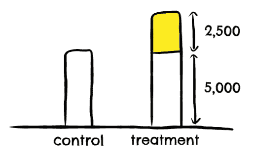
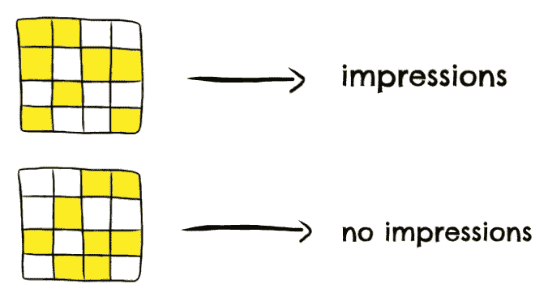

# 转换升力试验已经停止；过渡到地理实验

> 原文：<https://towardsdatascience.com/conversion-lift-tests-are-dead-transitioning-to-geo-experiments-5496a5450204?source=collection_archive---------26----------------------->

## [行业笔记](https://towardsdatascience.com/tagged/notes-from-industry)

> 本文是与 [**Leo Ubbiali**](https://twitter.com/LeoUbb) 共同撰写的，他是 Babylon Health 的营销分析师，专门研究计量经济学和因果推理在营销中的应用。

# iOS 14.5 的影响

已经有很多文章讨论了 iOS 14.5 和 IDFA 弃用对效果营销的影响。这些文章讲述了苹果的变化如何将归因建模的负担转移到广告平台上，降低了广告定位的有效性，并导致 iOS 和 Android 设备之间的 CPM 定价发生变化。

然而，iOS 14.5 的一个很少受到关注的结果是，这些变化对转换升力测试产生了影响。Lift 测试曾经为脸书广告客户提供了增量测量的黄金标准，但现在它们已经被完全否决，没有替代方案。

让我们看看什么是转换升力试验，为什么他们被脸书否决，以及如何地质实验提供了一个前进的方向。

# 什么是转换提升测试？

转换提升试验(或简称为*提升试验*)在市场上相当于随机对照试验。

他们试图了解一个广告活动的影响，方法是将广告随机展示给一组用户，让另一组用户拿着它，并在预定的一段时间内寻找两组用户之间的行为差异。

电梯测试寻找行为的什么不同？这完全取决于进行电梯测试的广告商。一个典型的电子商务品牌可能希望了解他们的脸书广告是否推动了本来不会发生的销售，因此他们希望在提升测试中跟踪购买情况作为 KPI。

## 对照组和治疗组

如果看过该电子商务品牌广告的用户群(T8 治疗组)继续从该品牌购买的比率高于那些没看过该品牌广告的用户群(T10 对照组)，那么这将表明该活动产生了增量销售。

作者图片

如果上述情况不成立，即治疗组不会比对照组更有可能购买该品牌的产品，那么可以说该活动没有增加销售额。在这种情况下，任何归因于该活动的销售(通过点击后或观看后归因)都可能是无论如何都会发生的销售。

## 多少增量？

仅仅因为一个活动产生了递增的结果并不意味着它是一个值得进行的活动。为了评估这一点，我们需要了解活动的每增量转换成本。

从上面的例子可以看出，电子商务品牌在他们的活动上花费了 10 万美元。他们测量了他们活动的治疗组的 7500 次销售(包括活动期间和活动后的一段固定时间)，以及他们活动的对照组的 5000 次销售。

简单地说，这些销售数字之间的差异(2，500)是由活动推动的增量销售的估计数字。如果我们将活动成本除以增量销售的数量，我们将得到每增量购买成本的估计值(CPiP)；$40.

作者图片

如果这个 CPiP 对品牌来说是可以忍受的(意味着它低于他们的 LTV，并且他们乐于以这个价格获得客户)，那么这个活动就可以被认为是成功的。请注意，如果治疗组和对照组之间的销售差异较小，CPiP 将按比例增加，因此活动成功的可能性降低。

## 改装升力试验的死亡

能够进行转换提升测试的一个相当重要的部分是能够测量两组人的转换量；你的治疗组(看过你的广告)和你的对照组(没看过你的广告)。

IDFA 折旧，ATT，和 SKAD 网络本身并没有提供任何理由，为什么你仍然不能报告(或至少估计)你的治疗组的转换量。他们对广告互动和转换之间的时间延迟提出了一些限制，并要求您至少有一个小的观察期，在此期间转换回发可以慢慢进入。也就是说，没有根本原因阻止您测量治疗组转换量。

对于测量对照组转换体积，情况更复杂；也就是一群没看过某个品牌广告的用户的购买次数。由于各种原因——尤其是 SKAD Network 回发需要一个活动 ID 来确定转化的归属——不可能从 lift 测试的对照组中测量转化量。

有一个提升测试的处理组的转换体积，但没有它的控制组，是没有多大用处的。正如我们之前看到的，这些数字之间的差异才是真正令人感兴趣的，因此，仅仅拥有治疗组转化量甚至不如常规的互动后归因方法有用(因为它忽略了转化和广告互动之间的时间)。

## 脸书的回应

尽管脸书在今年早些时候宣布，在 iOS 14.5 推出后，广告商将无法创建新的提升测试，但他们几乎没有宣传这一事实。除了广告管理器中的*实验*页面中的一个小注释，脸书只对他们的电梯测试文档进行了微小的编辑，以警告广告商即将到来的变化。

脸书建议，广告客户用常规的 A/B 测试(无法衡量增量)或品牌提升测试(旨在衡量一项活动对品牌指标的影响，而不是转化率)来取代衡量策略中的提升测试。这相当于脸书放弃了转换提升测试，并迫使广告商寻找其他方法来衡量他们的广告活动的增量。

# 提示地质实验

随着转化率提升测试的取消，广告客户又回到了绘图板上，寻找一种新的方法来衡量他们广告活动的有效性。

虽然没有因果推断方法可以被认为是普遍的“下一个最佳选择”，但地理实验特别适合在线广告；它们具有很强的统计严密性，并且易于理解、设计和实现。

## 什么是地理实验？

地理实验是一种准实验方法，其中将非重叠的地理区域( *geos* )随机分配给对照组或治疗组。由于地理定位，广告只在治疗组的地理区域提供，而对照组地理区域的用户不会看到广告。

作为一个简单的例子，我们可以在美国进行一个州级地理实验，将每个州随机分配给对照组或治疗组。然后，我们会在组成治疗组的州投放广告，而在组成对照组的州暂停广告。

## 你如何实施地理实验？

假设你可以将广告定位到相关的位置级别(街区、城市、州等)，那么建立地理实验就相当容易。)并在地理水平上测量转化率。所有主要的广告网络/跟踪平台都允许这些功能。

## 步骤 1:地理标识

第一步是决定运行测试的粒度级别..如果您感兴趣的市场是整个美国，那么将州作为您的地理位置可能是有意义的。如果你的市场是一个州，你可以使用 DMAs 或邮政编码将你感兴趣的区域划分成更小的区域。

为了确保测量的统计稳健性，建议不要选择太小的地理区域(*即 z* ip 代码)，因为人们可能会跨越地理边界，转换量可能太低。

## 步骤 2:地理随机化和分配

一旦我们定义了我们的市场和它的划分，我们需要将每个地区随机分配给治疗组或对照组。

在理想情况下，所有地理位置在过去具有相似的表现，随机化是基本的，因为它确保了除了广告服务之外的两个组之间的可能差异最小化。这起到了防止偏见的护栏的作用。

想法是在运动开始前(*预试验期)*治疗组和对照组尽可能相似，它们在*试验期只有一个因素不同；*接触广告。

作者图片

然而，geo 中的差异可能存在，并损害测试的设计和准确性。出于这个原因，通常需要进行初步分析，以便我们可以找到哪些是最好的 geo，以纳入治疗组和对照组。

# 如何衡量一个地理实验

一旦我们建立了实验，我们可以使用计量经济学方法，如*差异差异*或*综合控制*来量化广告增量；如果不投放广告，有多少转化不会发生。

作者图片

这些方法背后的直觉很简单:

1.  我们估计了试验期间治疗组的反事实:如果干预没有发生会发生什么(黄色虚线)
2.  我们计算实际治疗效果(黄色实线)和反事实之间的差异

尽管这种方法得出的结果不会像转化率提升测试那样准确，但地理实验是一种面向未来的衡量广告效果的方法，因为它们不需要用户跟踪，并且可以应用于不同的渠道。这甚至包括线下渠道。

网上有大量的教程来分析准实验结果，技术演练不在本文的讨论范围之内。有了基本的编码技能，营销人员可以利用非常抽象的软件包，如 [CausalImpact](https://google.github.io/CausalImpact/CausalImpact.html) (由谷歌开发)或其增强版本 [MarketMatching](https://cran.r-project.org/web/packages/MarketMatching/vignettes/MarketMatching-Vignette.html) 。

最近脸书发布了 GeoLift，这是一个新的开源包，通过地理实验来测量升力。

# 展望未来

虽然地理实验需要更多的技术工作来设计、设置和运行，但它们为希望复制转换提升测试的营销人员提供了一条清晰的前进道路。虽然没有广告平台提供开箱即用的地理实验，但脸书过去曾在私人测试版中玩弄过这个想法，他们有可能在未来公开这种工具。

然而，在此之前，有必要熟悉一下作为测量增量工具的地质实验，尤其是在脸书等平台上不再提供的转换提升测试。

*最初发表于*[*【https://mackgrenfell.com】*](https://mackgrenfell.com/blog/conversion-lift-tests-are-dead-transitioning-to-geo-experiments)*。*

> 本文是与 Babylon Health 的营销分析师 Leo Ubbiali 合作撰写的，他专门研究计量经济学和因果推理在营销中的应用。