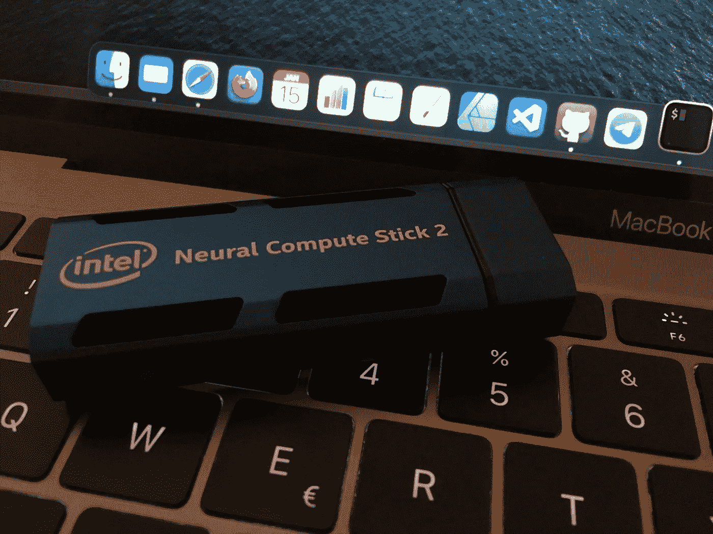

# 将 Tensorflow2 模型转换为 OpenVINO

> 原文：<https://towardsdatascience.com/convert-a-tensorflow2-model-to-openvino-c498f526c60b?source=collection_archive---------19----------------------->



装有无数芯片神经计算棒 2。图片作者。

## 在任何地方运行您的模型的简要指南

如今，机器学习的应用层出不穷。那里有已经训练好的模型和只需要拟合的数据。

当一个人处理机器学习应用程序时，通常很难决定哪个硬件训练模型并卸载推理。

英特尔推出了 openVINO，帮助将模型(主要与计算机视觉相关)部署到任何英特尔设备，无论它们是 CPU、GPU、FPGAs 还是带有无数芯片的神经计算棒。

<https://software.intel.com/content/www/us/en/develop/tools/openvino-toolkit.html>  

这项技术的一个常见用途是使用 openVINO 进行**快速**推理(即从网络摄像头预测视频中的实时对象)。一些模型需要一个强大的硬件来训练，但是一个更小更便宜的硬件来执行推理就足够了。例如，你可以使用一个**复杂的**预训练模型，然后在 [**轻型**硬件上运行它，就像一个 RaspberryPi](/a-live-ai-web-server-with-intel-ncs-and-a-raspberrypi-9831dce859e6) 。

OpenVINO 是一个强大的工具，但它需要一些段落才能正常工作。我们将经历转换模型的过程，将它加载到推理引擎插件中并执行推理。

# 定制模型

英特尔框架有一个[集合](https://github.com/openvinotoolkit/open_model_zoo)可以使用的预训练和优化模型。但是如果你想训练一个定制模型呢？

我们将考虑使用 **Tensorflow** 进行模型训练，即使 openVINO 支持许多其他框架。步骤大多相似。

我会用 Google Colab 来描述这一切，它应该很容易被复制。

## 在 Colab 上下载 OpenVINO

首先，我们需要下载 openVINO repository，安装 Tensorflow 的先决条件。

```
!git clone https://github.com/openvinotoolkit/openvino!cd openvino/model-optimizer/install_prerequisites/ && ./install_prerequisites.sh tf2
```

## 你习惯使用 keras 吗

在这一步你可以做任何你想做的事情。创建一个定制 **keras** 模型，带有定制**层**。**编译**它。**在*任何*数据集上训练**它等等。

当你对你的训练感到满意时，你可以准备将模型加载到*推理机*插件中。那么该模型可以用于任何类型设备上的推理。

## 从 h5 中保存模型

第一步是将模型保存到一个 *.h5* 文件中。使用 keras API 很容易做到这一点。

```
model = tf.keras.models.load_model(“/content/model.h5”)tf.saved_model.save(model,’model’)
```

## 转换模型

模型需要被转换成推理机可以加载到设备中进行推理的表示。这个步骤可以使用所谓的*模型优化器*来完成，如下所示。

模型优化器需要输入一些参数，比如 *input_shape。*

```
python3 openvino/model-optimizer/mo_tf.py --saved_model_dir model/ --input_shape=\[1,28,28\]
```

此时，您应该有两个文件 *model.xml* 和 *model.bin* ，它们包含对您的定制模型执行推理所需的所有信息。

## 例子

以下笔记本中提供了此转换步骤的示例:

<https://colab.research.google.com/drive/1wiFilpyXv947kLOqFJh_oqEp2224y8IL?usp=sharing>  

# 执行模型

当转换后的模型准备好了，下一步就是使用它进行推理。这可以在任何支持的设备上完成。没有必要使用与您执行培训时相同的设备。

## 安装 openVINO 进行推理

为了运行推理，有必要安装 openVINO 框架。这可以通过 pip 轻松完成。

```
!pip install --upgrade pip
!pip install openvino
```

## 将模型加载到插件中

我们需要将模型加载到设备上进行推理。

*推理引擎核心*对象具有读取*的能力。xml* 和*。将*绑定到**网络**对象中。

这个网络可以加载到任何**设备**中，无论是 CPU、GPU 还是 MYRIAD。这是这个 API 的强大之处之一，它可以毫不费力地在任何设备上透明运行。

```
from openvino.inference_engine import IECore, IENetworkie = IECore()net =  ie.read_network(model=model_xml, weights=model_bin)exec_net =  ie.load_network(network=net, device_name="MYRIAD")
```

## 获取关于拓扑的信息

我们可以检查网络拓扑。这个 API 只支持单个输入，无论如何，如果你在一个视频上运行这个，你需要一次对一个帧进行推理，所以这不是一个大问题。

此外，我们可以检查输入或输出形状，这对于由其他人训练的模型特别有用。我们需要确保数据处于正确的状态。

```
assert len(net.input_info.keys()) == 1, "Sample supports only single input topologies"assert len(net.outputs) == 1, "Sample supports only single output topologies"input_blob = next(iter(net.input_info.keys())) out_blob = next(iter(net.outputs))net.batch_size = len([0])net.input_info[input_blob].input_data.shape
```

# 推理

最后，是进行推理的时候了。给定一个对象 *X_test[0]* 我们准备在网络上使用 infer 方法来推断它。

```
res = exec_net.infer(inputs={input_blob: X_test[0]})res[out_blob].reshape(1,10)
```

# 结论

我们训练了一个定制模型。

使用 openVINO *模型优化器*，我们**将**转换成将模型加载到推理引擎模块所需的新表示。

当训练好的模型准备好使用推理机来**推断**输入数据时，它几乎是微不足道的。另外，这可以在任何设备上进行。