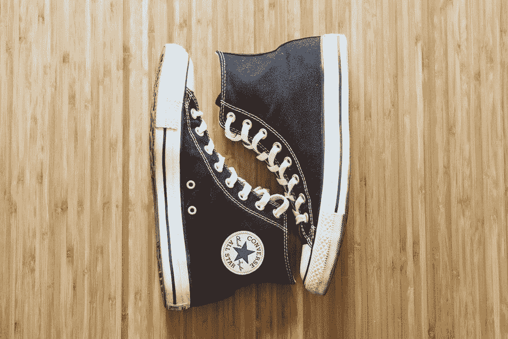
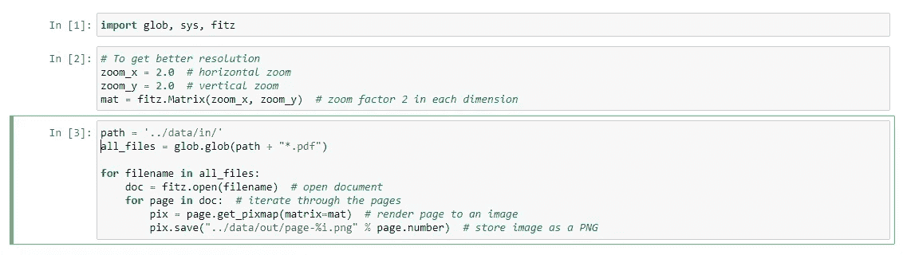

# 使用 PyMuPDF 将 PDF 转换为 Python 中的图像

> 原文：<https://towardsdatascience.com/convert-pdf-to-image-in-python-using-pymupdf-9cc8f602525b?source=collection_archive---------9----------------------->

## NLP 工具

## 一个从 pdf 生成 png 的简单实用的工具。



米切尔·伦辛克在 [Unsplash](https://unsplash.com/s/photos/converse?utm_source=unsplash&utm_medium=referral&utm_content=creditCopyText) 上拍摄的照片

最近，我[在玩亚马逊 Textract 的时候遇到了一个小问题。Textract 的同步操作要求输入文档为图像格式。我有一堆(数百个)pdf 文件要处理；我该如何毫不费力地将它们转换成 png 呢？](/how-to-use-amazon-textract-to-read-invoices-and-receipts-143b661b0c49)

PyMuPDF 来救援了！

让我们启动一个终端，键入以下内容:

```
pip install PyMuPDF
```

然后，让我们启动一个 Jupyter 笔记本，键入以下代码:

不要忘记更改第 8 行的源路径(pdf)和第 15 行的目标路径(pngs)。



[作者截图](https://medium.com/@ednalyn.dedios/membership)

就是这样！

谢谢你过来看我的帖子。希望 PyMuPDF 能像帮助我一样帮助你！在我随后的文章中，我会尝试将这些代码移植到 AWS 上…也许吧。

敬请期待！

*如果你想了解更多关于我从懒鬼到数据科学家的旅程，请查看下面的文章:*

</from-slacker-to-data-scientist-b4f34aa10ea1>  

*如果你正在考虑改变方向，进入数据科学领域，现在就开始考虑重塑品牌:*

</the-slackers-guide-to-rebranding-yourself-as-a-data-scientist-b34424d45540>  

你可以通过 [Twitter](https://twitter.com/ecdedios) 或 [LinkedIn](https://www.linkedin.com/in/ednalyn-de-dios/) 联系我。

# 参考

[https://pymupdf.readthedocs.io/en/latest/faq.html](https://pymupdf.readthedocs.io/en/latest/faq.html)