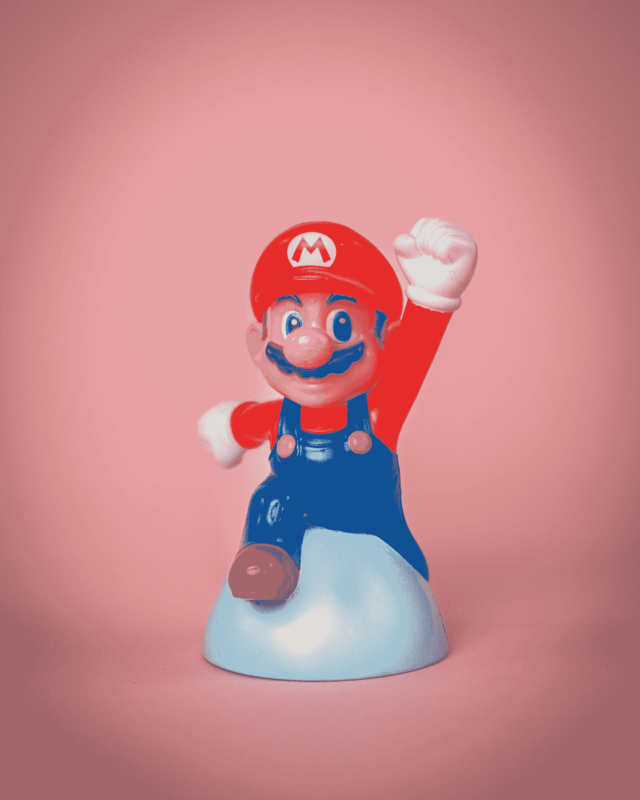
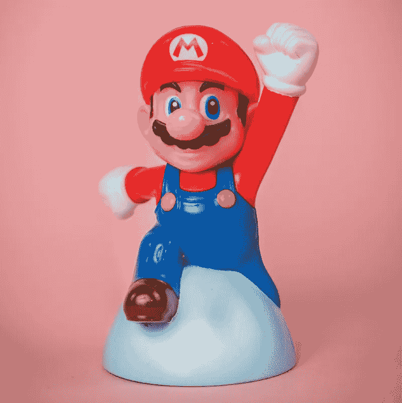
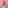
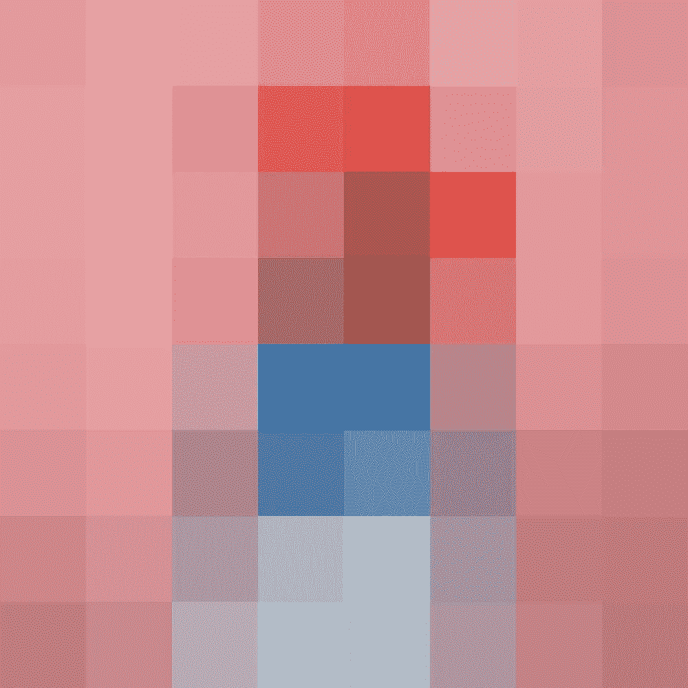
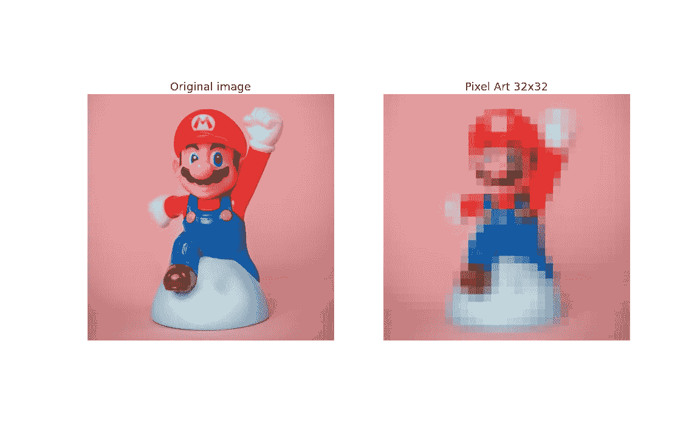
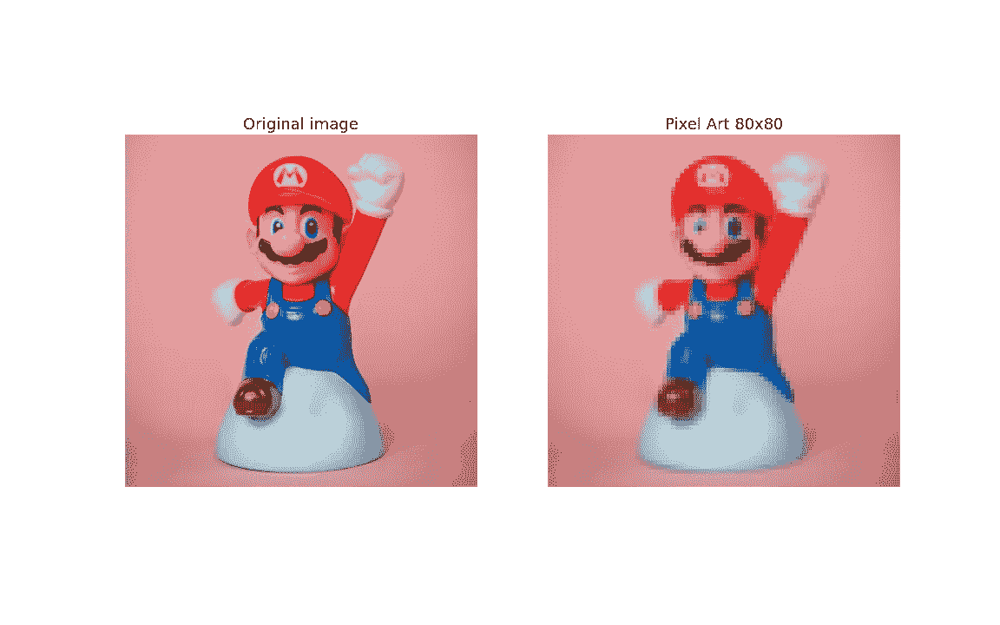
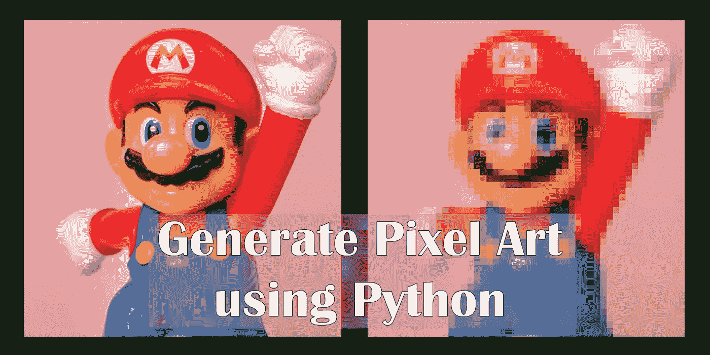

# 使用 Python 将照片转换为像素艺术

> 原文：<https://towardsdatascience.com/convert-photo-into-pixel-art-using-python-d0b9bd235797?source=collection_archive---------4----------------------->

## 如何使用 python 从照片中生成像素艺术的分步教程

## 介绍

随着 NFTs 和加密艺术越来越受欢迎，对能够执行图像处理和生成程序艺术的程序员的需求也在增加。
像素艺术最近也重新流行起来，特别是在数字艺术鉴赏家中间。
在本文中，我将解释如何用 python 执行图像处理，将任何照片转换成像素艺术。



照片由[米卡·鲍梅斯特](https://unsplash.com/@mbaumi?utm_source=medium&utm_medium=referral)在 [Unsplash](https://unsplash.com?utm_source=medium&utm_medium=referral) 上拍摄

出于演示的目的，我将使用上述图像的裁剪版本(800px X 800px)。

# 开始编码吧！

## 所需的库

我们将使用 [***枕***](https://pillow.readthedocs.io/en/stable/index.html)*库进行图像操作，使用[***Matplotlib***](https://matplotlib.org/)库进行图像显示和保存。*

```
*#Import Libraries
from PIL import Image
import matplotlib.pyplot as plt*
```

## *读取图像*

*通过提供图像的*路径作为*枕*库的*图像*模块的*打开*函数的*参数，可以读取图像。因为我们的图像和笔记本在同一个文件夹中，所以只需要图像的名称就足够了。***

*一旦图像被读取，就可以使用 matplotlib 的 *imshow* 函数显示。*

```
*#Read image
img=Image.open('mario.jpg')#show image
plt.imshow(img)
plt.show()*
```

**

*输入图像(裁剪后的图像 800 像素 X 800px 像素)*

## *转换成小图像*

*创建像素化图像的第一步是使用 ***双线性插值*** 重采样技术将输入图像图像转换成小图像。*

*您可以访问下面的页面，了解更多关于不同的图像重采样技术。*

*<https://www.cambridgeincolour.com/tutorials/image-interpolation.htm>  

这可以通过提供大小和重采样技术作为参数，使用 resize 方法来实现。
我们可以将 800px X 800px 图像转换为 8px X 8px 图像，如下所示:

```
small_img=img.resize((8,8),Image.BILINEAR)
```



小图像(8px X 8px)

## 调整到所需的输出尺寸

然后，再次使用 resize 函数，将小图像调整到所需的输出大小。
我们将使用 ***最近邻*** 重采样技术，本质上是放大每个像素。
默认的重采样技术是双三次插值，这将锐化图像。下面的代码将把小图像(8px X 8px)转换成尺寸为 1000 px X 1000px 的图像。

```
#resize
o_size=(1000,1000) #output size
res=small_img.resize(o_size,Image.NEAREST)#save image
res.save('mario_8x8.png')#display image
plt.imshow(res)
plt.show()
```



mario_8x8.png，生成的输出图片(图片由作者提供)

请注意，我们已经使用保存功能将图像保存到本地，文件名为 *mario_8x8.png.*

上面的图像只包含原始图像的 0.01%的数据。因此，如果你不能从这个图像中识别出原始图像也就不足为奇了。
好的像素艺术必须包含足够的来自原始图像的数据，这样才能被识别。然而，在这个过程中，细微的特征将会丢失。
如果原始图形有许多需要保留的细微特征，我们应该使用大得多的尺寸进行初始调整。
合适的*小图像*尺寸可以通过试错法获得。

## 创建一个函数来生成像素艺术

下一步是通过创建一个从任何图像生成像素艺术的函数来简化上面讨论的处理。
该功能必须包含以下功能:
i .读取照片
ii。以*小图像* *尺寸*和*输出图像尺寸*为参数
iii 转换为像素艺术。保存生成的图像
iv。并排显示原始图像和像素图片以进行比较

photo2pixelart 功能(作者要点)

该功能可用于为*马里奥图像*尝试不同的小图像尺寸，以找到合适的尺寸，从而获得视觉上最愉悦的像素艺术。

## 函数调用

我们将图像转换为 32px X 32px 大小，以像素化图像。
*img.size* 可以用来获取原始图像的大小。
通过提供 *img.size* 作为输出尺寸，我们可以生成与原始图像尺寸相同的像素艺术。

```
photo2pixelart(image='mario.jpg',i_size=(32,32),
                    o_size=img.size)
```



photo2pixelart 函数的输出(图片由作者提供)

我们可以看到，新的像素艺术显示更多的细节相比，最初的。与 8px 版本相比，该图包含的数据量是前者的 16 倍。然而，它只包含来自原始图像的 0.16%的数据。

我们将图像的长度和宽度缩小 10%，即下一张图像为 80px X 80px。这个数字将包含原始图像的 1%的数据。

```
#Function Call
photo2pixelart(image='mario.jpg',i_size=(80,80),
                    o_size=img.size)
```



photo2pixelart 函数的输出(图片由作者提供)

此图像比前一个图像更平滑，图像的特征更容易识别。

## 资源:

本教程的代码以及所有使用和生成的图像都可以在我的 [GitHub Repo](https://github.com/hashABCD/Publications/tree/main/Medium/PixelArt) 中找到。

## 成为会员

我希望你喜欢这篇文章，我强烈推荐 [**注册*中级会员***](https://abhijithchandradas.medium.com/membership) 来阅读更多我写的文章或数以千计的其他作者写的各种主题的故事。
[你的会员费直接支持我和你看的其他作家。你还可以在 Medium](https://abhijithchandradas.medium.com/membership) 上看到所有的故事。* 

## *你可能会对作者的其他文章感兴趣*

*</generate-pencil-sketch-from-photo-in-python-7c56802d8acb>  

封面图片(作者图片)*