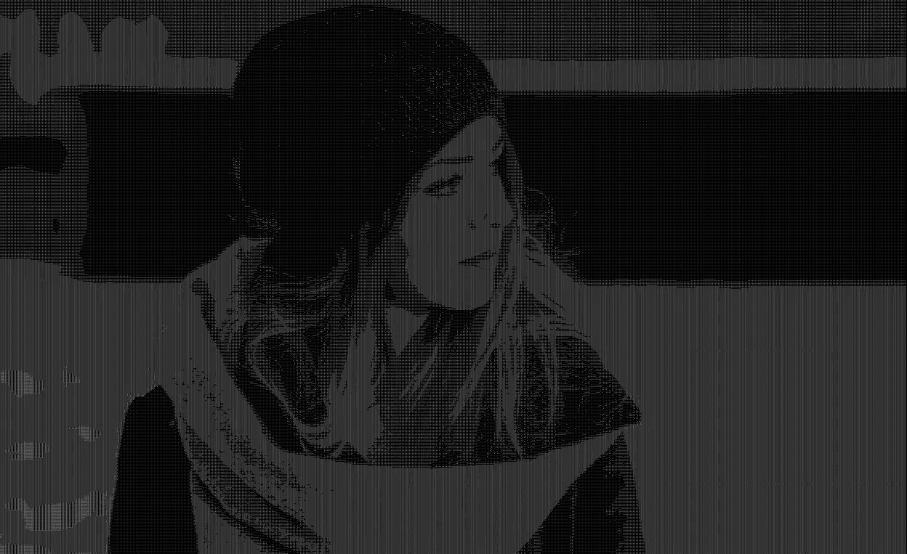
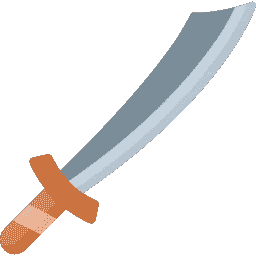
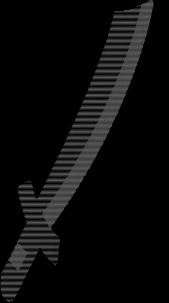
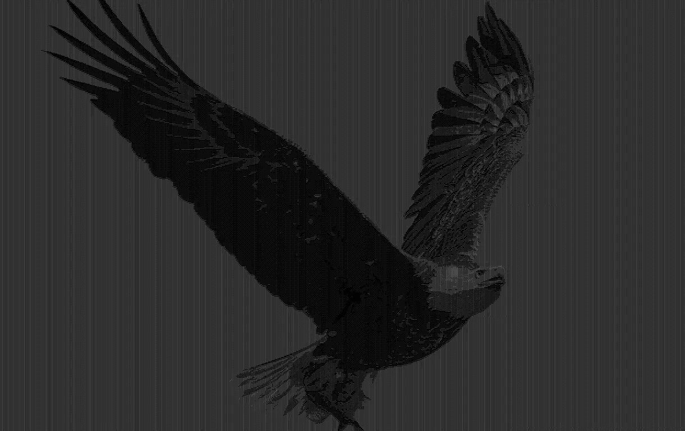
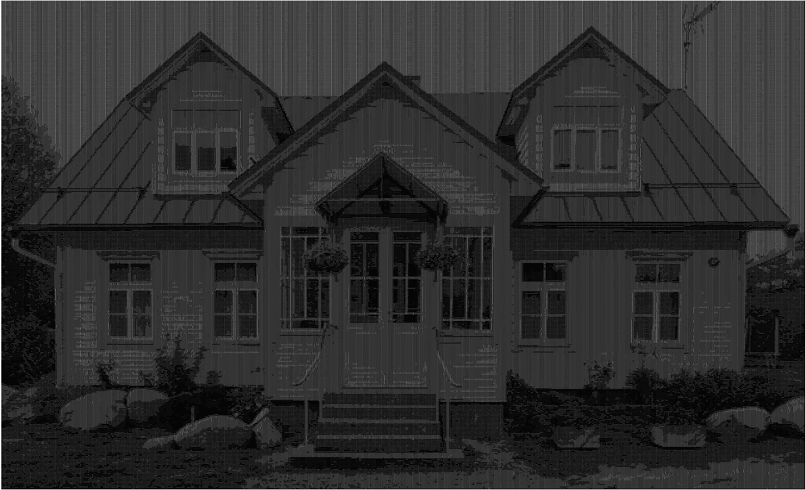

# 将图片转换为 ASCII 图片

> 原文：<https://towardsdatascience.com/convert-pictures-to-ascii-art-ece89582d65b?source=collection_archive---------14----------------------->

## 关于图像如何工作以及如何将像素表示为 ASCII 字符的简要指南—包括代码示例



由 [freestocks](https://unsplash.com/@freestocks?utm_source=medium&utm_medium=referral) 在 [Unsplash](https://unsplash.com?utm_source=medium&utm_medium=referral) 发布的原始图片的 ASCII 版本

我相信你们很多人都听说过 [ASCII art](https://en.wikipedia.org/wiki/ASCII_art) ，这是一种图形设计技术，使用可打印的 ASCII 字符集来组成图片。这种艺术最简单的形式是表情符号，如`:-)`或`:-3`。但是，您能用可打印的 ASCII 字符表示更复杂的图像吗？

## 图像到底是什么

首先，澄清图像在计算机系统中是如何表现的是很重要的。图片通常以`.png`或`.jpg`等格式存储在磁盘上。所有这些文件类型都有相似的结构:它们大致由一个[头](https://en.wikipedia.org/wiki/File_format#:~:text=few%20bytes%20long.-,File%20header%5Bedit%5D,-The%20metadata%20contained)和一个数据段组成。前者存储关于图像的有用信息，例如其[格式签名](https://en.wikipedia.org/wiki/File_format#:~:text=container)%20file%20formats.-,Magic%20number,-%5Bedit%5D)，而后者存储实际的像素数据。

你看到的实际图像是由像素组成的，像素是我们都熟悉的光栅图像的最小可寻址元素。它们通常被表示为一组[通道](https://en.wikipedia.org/wiki/Channel_(digital_image))，也称为颜色。最常见的颜色值有经典的 RGB(红绿蓝)和 RGBA(红绿蓝 Alpha)。两者的区别在于，后者有一个额外的通道，称为“alpha”，用于指定图像的不透明度。RGBA 是我们将要使用的，因为它也可以用来表现一个空白的背景。

## 如何将像素转换成 ASCII 码

现在我们已经看到了图像是如何表示的，是时候讨论如何将像素转换成实际的 ASCII 字符了。为了理解这一点，我们必须首先看看像素颜色强度。该值是指所有像素通道的总和，除以通道可以具有的最大值的总和(在本例中为 255)。

> 从现在开始，我将使用 Python 作为代码示例，因为它简单易读，但是您可以随意使用您喜欢的任何技术。我还将使用`PIL`图像库来保持代码尽可能的简单和抽象。

第一行导入了清晰所需的静态类型。如果你不知道它们是什么，看看我关于类型提示的文章。

在这段代码中，我定义了一个新的`Pixel`类型，一个由四个整数组成的`Tuple`，每个整数代表一个 RGBA 像素中的一个通道。然后我定义了一个函数来提取给定像素的亮度。它首先将所有通道值相加，然后将结果除以像素通道可以达到的最大值，从而有效地获得强度百分比。

一旦我们计算了像素的亮度，就该把它映射到一个 ASCII 字符了。为此，我们必须定义一个用来表示像素的字符集。

字符集从最轻的空格到最重的 T3 排序。这意味着像素越密集，其对应的 ASCII 字符占用的空间就越大。

该函数将给定的像素亮度映射到集合中的一个字符。因为索引必须是整数，所以`intensity * len(CHARACTERS)`的结果被四舍五入。

现在，让我们用一个简单的脚本将这些代码片段粘在一起:

## 查看 ASCII 图片

一旦我们获得了图像的 ASCII 字符串表示，我们必须找到一种图形化查看它的方法。最简单的方法是将它打印到控制台。由于图像通常是按像素行组织的，所以在打印时，我们也必须相应地使用换行符。

在这里，我编写了一个简单的函数，将 ASCII 图片打印到控制台，并说明了如何从 main 函数中调用它:

让我们看看这个脚本的运行情况！我们将转换一个像这样的简单图像:



剑(由 [Flaticon](https://www.flaticon.com/) 的 [Freepik](https://www.freepik.com/) 制作的图标)

假设我们已经调用了图像文件`image.png`和脚本`converter.py`，该命令将如下所示:

```
python converter.py image.png
# Or if you are on a Unix-like system and the script is executable
./converter.py image.png
```

这将向控制台生成以下输出:



Freepik 在[https://www.flaticon.com/](https://www.flaticon.com/))发布的原始图片的 ASCII 版本

正如你所看到的，由于线条之间的间隔，图片有点失真。这是许多终端模拟器的局限性，但是有一个简单的解决方案。

## 使用 HTML 的视觉改进

我们已经看到了如何将图像转换成 ASCII 表示，但是如果能将结果保存到一个实际的文件中会更好。但是为什么是 HTML 呢？

*   所有的网络浏览器都支持它。
*   您可以根据图像的比例轻松放大和缩小。
*   它仍然可以只由 ASCII 字符组成。

让我们编写一个函数来将结果图像保存到 HTML 文件中:

现在我们已经完成了我们的图像转换器，让我们花点时间看看一些很酷的图片和它们的 ASCII 版本:


马修·施瓦茨在 [Unsplash](https://unsplash.com?utm_source=medium&utm_medium=referral) 上的照片



由[马修·施瓦茨](https://unsplash.com/@cadop?utm_source=medium&utm_medium=referral)在 [Unsplash](https://unsplash.com?utm_source=medium&utm_medium=referral) 拍摄的原始图像的 ASCII 版本


Jacques Bopp 在 [Unsplash](https://unsplash.com?utm_source=medium&utm_medium=referral) 上拍摄的照片



由 [Jacques Bopp](https://unsplash.com/@jacquesbopp?utm_source=medium&utm_medium=referral) 在 [Unsplash](https://unsplash.com?utm_source=medium&utm_medium=referral) 上制作的原始图像的 ASCII 版本


[freestocks](https://unsplash.com/@freestocks?utm_source=medium&utm_medium=referral) 在 [Unsplash](https://unsplash.com?utm_source=medium&utm_medium=referral) 上拍摄的照片


[freestocks](https://unsplash.com/@freestocks?utm_source=medium&utm_medium=referral) 在 [Unsplash](https://unsplash.com?utm_source=medium&utm_medium=referral) 上发布的原始图片的 ASCII 版本

这是我这篇文章所基于的项目的 GitHub 库的链接。我还会在下面的要点中直接包含源代码，以防您时间不够:

图像转换的完整脚本

如果有人感兴趣，我还建立了一个简单的免费网站，可以将你的图片转换成 ASCII 码。虽然我否认这不是一个严肃的项目，可能包含错误和漏洞，所以不要想依靠它做任何事情。

## 结论

在这篇文章中，你简要地学习了图像文件是如何构造的，最重要的是，如何将单个像素转换成相应的 ASCII 字符。

例如，这种 ASCII 艺术可以用作网页中的设计元素。ASCII 图像转换也可能是一些用于社交媒体的酷照片过滤器和视频效果的基础。此外，即使您不能利用这项技术，它仍然是一个很好的编码练习。

我希望您喜欢这篇文章，并在此过程中学到一些新东西，

**感谢阅读！**