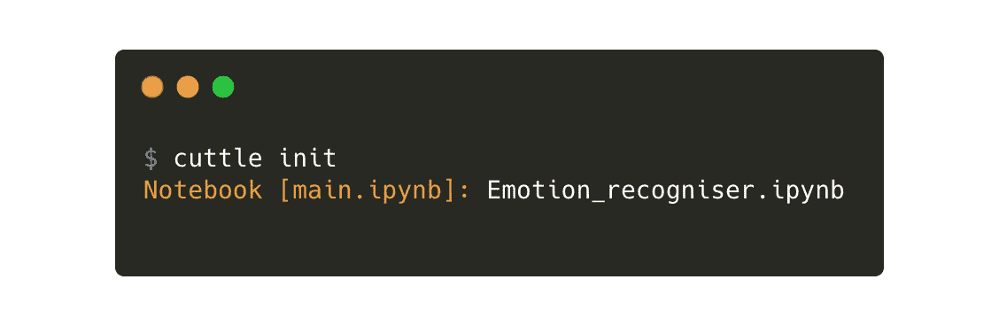
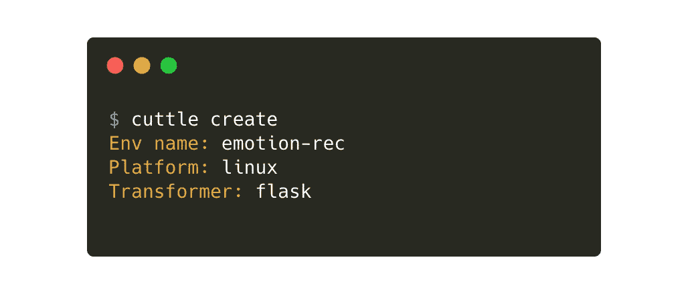
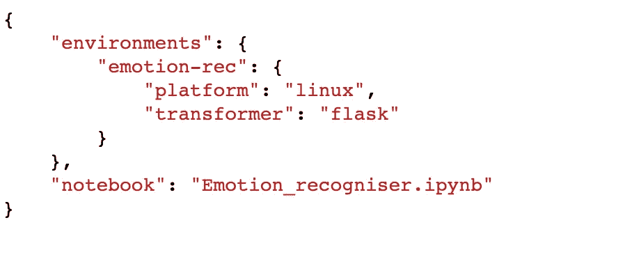
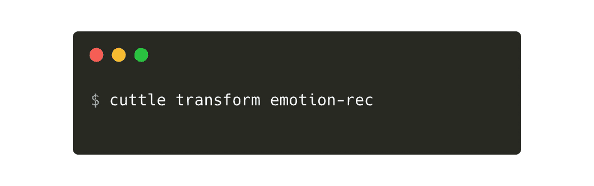
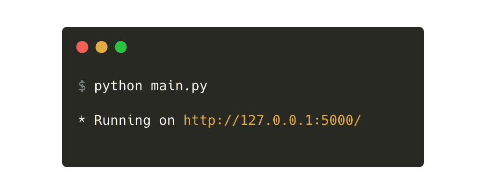
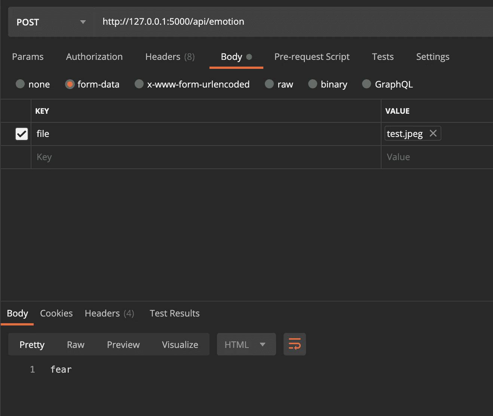

# 将您的情绪识别笔记本转换为 API，无需额外代码

> 原文：<https://towardsdatascience.com/convert-your-emotion-recognition-notebook-into-an-api-without-extra-code-bc13421d2ed5?source=collection_archive---------22----------------------->

## 在 Jupyter 笔记本中训练情感识别，并使用 Cuttle 将其转换为 Flask API 项目，无需额外代码


来源: [Unsplash](http://unsplash.com)

对于经常使用 Jupyter 笔记本进行开发和测试的人来说，您可能已经习惯了一直复制和粘贴代码。

> 删除测试代码片段，使用不同的 IDE 来编译和测试您的代码，以及开发 API 只是 ML 开发人员所习惯的一些耗时的任务。

如果我们能够自动化构建一个 API 项目所需的样板代码的苦差事，那不是很好吗？这里我们将在 Jupyter 笔记本中训练一个情绪识别模型，并将其转换为 Flask API 项目，完全不需要额外的代码！

# 属国

```
pip install 
tensorflow==2.5.0 Keras==2.4.3 numpy==1.19.5 opencv-python==4.4.0.44
```

我们还需要安装[卡特尔](http://www.cuttle.it)来将我们的 ML 笔记本转换成 Flask API 项目。

```
pip install cuttle
```

# 资料组

你可以在情感识别上使用任何数据集，也可以创建自己的数据集。在本文中，我们使用 Kaggle 上的情感识别数据集。你应该在这里找到它[。该数据集包含 7 类图像:愤怒、厌恶、恐惧、快乐、中性、悲伤和惊讶。如果您想添加另一个类，只需创建一个新目录并添加属于该类的图像。](https://www.kaggle.com/jonathanoheix/face-expression-recognition-dataset)

在与您下载的数据集相同的目录中创建笔记本，其中包含“train”和“validation”文件夹。

# 进口

# 数据集扩充

ImageDataGenerator 允许您在每个训练图像上使用图像增强、变换来拟合模型，还可以传递任何预处理函数(如果可用)。

我们重新缩放图像是因为颜色的范围是从[0–255]，重新缩放图像会转换范围为[0–1]的每个像素值。这里，我们将模型的目标大小定义为 48x48，将 batch_size 定义为 64。

# 模特培训

我们在这里定义一个 CNN，但是你可以选择使用任何预先训练好的模型，比如 VGG16 或者 ResNet，或者也可以使用迁移学习。

完成训练后，您的模型会保存在给定的路径中。

# 情感识别

我们现在加载模型，给它一个图像并测试它。在这一步，让我们引入 cuttle，并将结果函数转换成任何前端应用程序都可以访问的 API。

让我们使用一个测试图像“test.jpeg”。


来源: [Unsplash](http://unsplash.com)

我们从模型预测中得到的输出是**‘恐惧’**。继续用更多的图像进行测试，直到你对模型的准确性和结果满意为止。让我们看看如何将它转换成一个 API 项目。

# 初始化卡特尔

如下用“cuttle init”初始化 cuttle，并输入正在使用的笔记本的名称。



来源—作者

# 创建卡特尔环境

在这一步中，您命名环境，指定您正在使用的平台，以及您想要使用的转换器。我们想在这个场景中使用**烧瓶**变压器。您可以选择一个方便的环境名称。我用了“**情感记录**”作为例子。



来源—作者

此时，您的**应该是这样的:**



来源—作者

完成配置创建后，就该编辑 Jupyter 笔记本以包含 cuttle 配置了。我们只需要编辑代码的最后一部分来定义 API 路由并设置输出配置。

**向单元格添加配置:**

我们使用 Cuttle config 来执行两个主要操作，如这里的[和](https://github.com/CuttleLabs/Emotion-Recognition-API/blob/main/Emotion_recogniser.ipynb)所示。

*   禁用训练步骤并从保存的模型文件中加载，这样就不用每次运行脚本时都重新训练。
*   指定每次调用 API 时要执行的单元以及必需的参数

要禁用单元格，请在单元格的开头添加此配置。

```
#cuttle-environment-disable emotion-rec
```

现在添加 config 将您的脚本转换成 API，如下所示:

我们正在设置两个配置:**切割环境设置配置**和**切割环境分配**配置。它们分别是单元格范围和行范围。单元范围的配置设置了在转换**单元**期间所需的配置。行范围的配置允许我们配置**变量**。

在第一行中，我们设置了单元范围的配置，指定了我们选择的环境名称、方法和路由。我们还配置了变量“file ”,允许我们从请求方法和将作为我们响应的“output”变量中获取-config。

# 改变

我们的最后一步是使用我们一直使用的环境名进行 cuttle-transform。让我们来看看如何:



来源—作者

在这个步骤之后，您应该会看到一个**输出目录**，它由另一个包含环境名称的子目录组成。转到这个目录，找到您转换成 API 的代码。以下列身份运行该文件:



来源—作者

现在我们的代码默认运行在本地主机端口 5000 上。通过使用 Postman 发送图像来测试这一点，以获得您的响应。



test.jpeg 通过 POST 请求发送到我们的 flask API。来源—作者

您的 API 项目现在可以部署了！Cuttle 还允许您将笔记本转换为脚本或管道。

# 资源

卡特尔网站: [cuttle.it](https://www.cuttle.it/?utm_source=medium_article)
Github: [情感识别 API 源](https://github.com/CuttleLabs/Emotion-Recognition-API)卡特尔源:[卡特尔 CLI 源](https://github.com/CuttleLabs/cuttle-cli)

你也可以在推特上找到我们@[https://twitter.com/cuttlehq](https://twitter.com/cuttlehq)