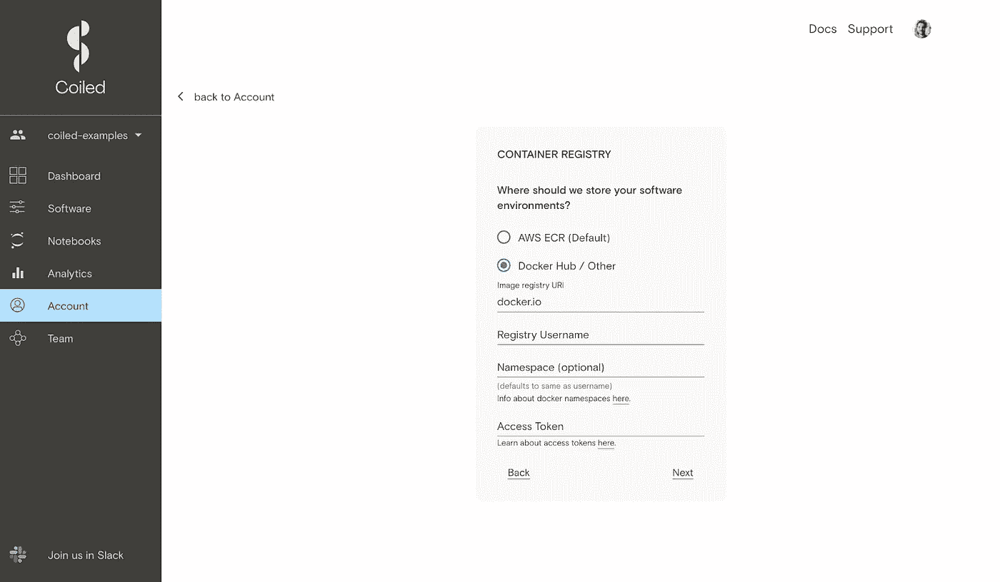

# 将 conda/pip 环境转换为 Docker 图像

> 原文：<https://towardsdatascience.com/converting-conda-pip-environments-into-docker-images-d02aa22e872c?source=collection_archive---------17----------------------->

## 使用 Coiled 作为 Docker 图像管道


图片来自 [Unsplash](http://unsplash.com/)

# TL；博士；医生

构建 Docker 映像是大多数数据科学家工作流程中必不可少但极具挑战性的一部分。简化这个过程的一个方法是将 Coiled 连接到您自己的 Docker 注册表(如 DockerHub ),创建一个管道，将您的 conda 或 pip 环境转换成可以在其他地方使用的 Docker 映像。这篇文章向你展示了如何使用`coiled.create_software_environment()`命令并通过在你的 Coiled cloud 仪表板的“帐户”设置中设置容器注册后端来实现。

你也可以观看下面的视频，获得一步一步的指导:

*免责声明:我在 Coiled 工作，是一名数据科学传道者实习生。* [*Coiled*](http://coiled.io/) *由*[*Dask*](https://dask.org/)*的最初作者 Matthew Rocklin 创立，是一个面向分布式计算的开源 Python 库。*

# 为什么您可能需要 Docker 图像

许多数据科学家需要将 conda 和/或 pip 环境转换为 Docker 映像，以便跨团队协作或将本地工作环境迁移到云上运行。大多数人使用越来越复杂的工作流手动实现这一点(例如，看看[这篇中等的文章](/making-docker-and-conda-play-well-together-eda0ff995e3c))。)虽然这在技术上可行，但并不是每个人都能使用。作为一名数据科学家新手，我知道我一开始发现这种体验很复杂，很难掌握。

# 如何盘绕可以让你更容易

作为为数据科学家设计的基于云的服务， [Coiled](http://coiled.io/) 需要能够将 conda 和 pip 环境转换成 Docker 映像才能正确运行。`[**coiled.create_software_environment()**](https://docs.coiled.io/user_guide/software_environment_creation.html)` [命令](https://docs.coiled.io/user_guide/software_environment_creation.html)将一个`**environment.yml**` (conda)或 **requirements.txt** (pip)文件转换成 Docker 映像，然后分发给所有 Dask workers，以确保整个盘绕集群的一致性。

下面是两个代码片段:一个用于 conda，一个用于 pip:

```
# using conda .yml files
import coiled

coiled.create_software_environment( 
    name='my-env', 
    conda='<path/to/environment.yml>' 
) # using pip .txt files
import coiledcoiled.create_software_environment( 
    name='my-env', 
    pip='<path/to/requirements.txt>' 
)
```

本着社区和开源开发的精神，Coiled 工程师并没有把这个功能藏起来，而是把它变成了一个通用工具。这意味着您可以将 Coiled 连接到您自己的 Docker 注册中心(如 DockerHub)来创建 conda/pip-to-Docker 构建服务。然后，您可以在任何喜欢的地方使用使用 Coiled 创建的 Docker 图像。

# 如何将 Coiled 连接到 Docker 容器注册表

默认情况下，Coiled 将您创建的软件环境存储在您正在运行的云服务的容器注册表中:AWS、GCP 或 Azure。 ***您可以在 Coiled Cloud dashboard 的“Account”选项卡中更改此设置，将您的软件环境作为 Docker 映像保存到您的 Docker Hub。***



任何支持 Docker 注册表 API V2 的注册表都应该可以工作。在[我们文档的“后端”页面](https://docs.coiled.io/user_guide/backends.html)阅读更多细节。

*请注意:使用 Docker Hub 以外的注册中心是一个正在积极开发中的实验性功能。如果您想在*[*support @ Coiled . io*](mailto:support@coiled.io)*或通过*[*Coiled Community Slack channel*](https://join.slack.com/t/coiled-users/shared_invite/zt-hx1fnr7k-In~Q8ui3XkQfvQon0yN5WQ)*讨论您的用例，请联系我们。*

我在这里偷偷给你一个额外的提示:创建软件环境实际上并不需要你启动一个集群。这意味着你可以使用你的 conda/pip-to-Docker 管道，而不会烧掉你的任何。

# 什么都不发明的价值

这就是我喜欢 Python 生态系统的原因。产品不可或缺的功能可以开放给更广泛的公众使用。它遵循了 Matt Rocklin 经常宣称的关于开源库 Dask 的反直觉的最低创造力原则:**“什么都不发明。”**

这个咒语看起来似乎违反直觉，但实际上包含了一个简单的教训:不要试图重新发明轮子，而是创造与人们已经在使用的工具相集成的产品，从而为已经存在的丰富的生态系统增加额外的一块砖。

我希望这篇文章对你有帮助！[在 Twitter 上关注我](https://twitter.com/richardpelgrim)获取每日数据科学内容。

或者来我的博客打招呼:

<https://crunchcrunchhuman.com/2021/12/22/kaggle-xgboost-distributed-cloud/>  

*原载于 2021 年 8 月 23 日*[*https://coiled . io*](https://coiled.io/blog/conda-pip-docker-convert/)*。*