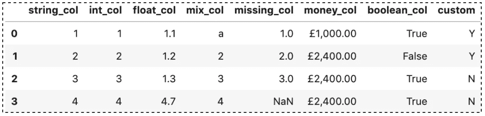
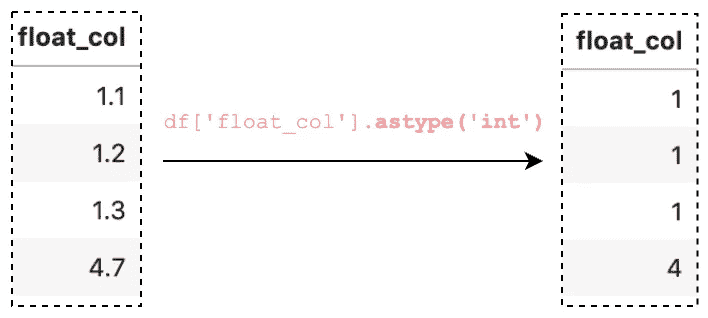
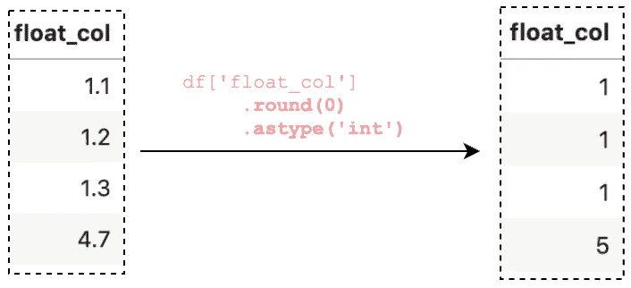
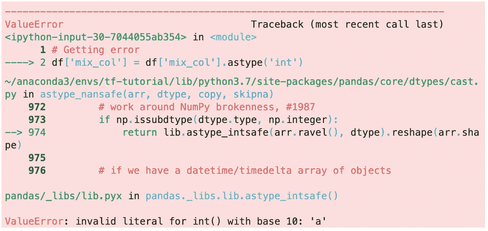
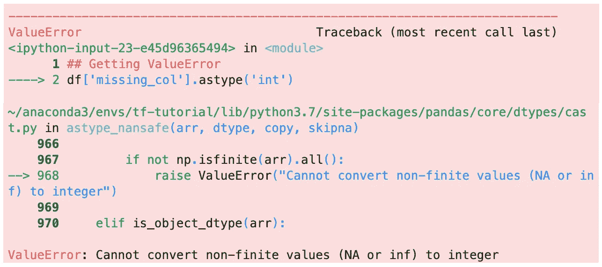

# 在 Pandas 中将数据转换为数字类型的 10 个技巧

> 原文：<https://towardsdatascience.com/converting-data-to-a-numeric-type-in-pandas-db9415caab0b?source=collection_archive---------2----------------------->

## 熊猫帮助你开始数据分析的提示和技巧


照片由[罗斯·芬登](https://unsplash.com/@rossf?utm_source=unsplash&utm_medium=referral&utm_content=creditCopyText)在 [Unsplash](https://unsplash.com/s/photos/change?utm_source=unsplash&utm_medium=referral&utm_content=creditCopyText) 上拍摄

在进行数据分析时，确保正确的数据类型非常重要。否则，您可能会得到意外的结果或错误。在熊猫的例子中，它将在许多情况下正确地推断数据类型，并且您可以继续您的分析，而无需对该主题进行任何进一步的思考。

尽管 pandas 工作得很好，但在数据分析过程中的某个时候，您可能需要显式地将数据从一种类型转换为另一种类型。本文将讨论如何将数据转换为数值类型。更具体地说，您将学习如何使用 Pandas 内置方法`astype()`和`to_numeric()`来处理以下常见问题:

1.  将 string/int 转换为 int/float
2.  将 float 转换为 int
3.  转换混合数据类型的列
4.  处理缺失值
5.  将货币列转换为浮动
6.  将布尔值转换为 0/1
7.  一次转换多个数据列
8.  读取 CSV 文件时定义数据类型
9.  创建自定义函数来转换数据类型
10.  `astype()`对`to_numeric()`

为了进行演示，我们创建了一个数据集，并用一个函数加载它:

```
import pandas as pd
import numpy as npdef load_df(): 
  return pd.DataFrame({
    'string_col': ['1','2','3','4'],
    'int_col': [1,2,3,4],
    'float_col': [1.1,1.2,1.3,4.7],
    'mix_col': ['a', 2, 3, 4],
    'missing_col': [1.0, 2, 3, np.nan],
    'money_col': ['£1,000.00','£2,400.00','£2,400.00','£2,400.00'],
    'boolean_col': [True, False, True, True],
    'custom': ['Y', 'Y', 'N', 'N']
  })df = load_df()
```



作者图片

请查看 [Github repo](https://github.com/BindiChen/machine-learning/blob/master/data-analysis/036-pandas-change-data-to-numeric-type/change-data-to-a-numeric-type.ipynb) 获取源代码。

# 检查数据类型

在我们深入研究更改数据类型之前，让我们快速了解一下如何检查数据类型。如果我们想在一个数据帧中看到所有的数据类型，我们可以使用`dtypes`属性:

```
>>> **df.dtypes**string_col      object
int_col          int64
float_col      float64
mix_col         object
missing_col    float64
money_col       object
boolean_col       bool
custom          object
dtype: object
```

这个属性在 Series 中也是可用的，我们可以用它来检查特定列上的数据类型。例如，检查 **int_col** 的数据类型:

```
>>> df.**int_col.dtypes**dtype('int64')
```

如果我们想研究数据，那么`info()`方法可能更有用，因为它提供了 RangeIndex、总列数、非空计数、dtypes 和内存使用情况。这是大量有价值的信息，可以帮助我们更全面地了解数据。

```
>>> **df.info()**RangeIndex: 4 entries, 0 to 3
Data columns (total 8 columns):
 #   Column       Non-Null Count  Dtype  
---  ------       --------------  -----  
 0   string_col   4 non-null      object 
 1   int_col      4 non-null      int64  
 2   float_col    4 non-null      float64
 3   mix_col      4 non-null      object 
 4   missing_col  3 non-null      float64
 5   money_col    4 non-null      object 
 6   boolean_col  4 non-null      bool   
 7   custom       4 non-null      object 
dtypes: bool(1), float64(2), int64(1), object(4)
memory usage: 356.0+ bytes
```

# 1.将字符串转换为整型/浮点型

将 Pandas 列转换为不同类型的最简单方法是使用 Series 的方法`astype()`。例如，要将字符串转换成整数，我们可以这样调用它:

```
# string to int
>>> df['string_col'] = df['string_col']**.astype('int')**
>>> df.dtypes**string_col       int64**
int_col        float64
float_col      float64
mix_col         object
missing_col    float64
money_col       object
boolean_col       bool
custom          object
dtype: object
```

我们可以看到它默认使用的是 **64 位整数**。在某些情况下，当处理大型数据集时，使用较短的整数会更节省内存。为此，你可以简单地调用`astype('int8')`、`astype('int16')`或`astype('int32')`

同样，如果我们想将数据类型转换为 float，我们可以调用`astype('float')`。默认情况下，它使用的是 **64 位浮点数**。我们可以使用`'float128'`来获得更高的精度，或者使用`'float16'`来获得更高的内存效率。

```
# string to float
>>> df['string_col'] = df['string_col']**.astype('float')**
>>> df.dtypes**string_col     float64**
int_col          int64
float_col      float64
mix_col         object
missing_col    float64
money_col       object
boolean_col       bool
custom          object
dtype: object# For more precision
>>> df['string_col'] = df['string_col']**.astype('float128')**# For more memory efficiency
>>> df['string_col'] = df['string_col']**.astype('float16')** >>> df['string_col'] = df['string_col']**.astype('float32')**
```

# 2.将 float 转换为 int

如果我们想将一个浮点列转换成整数，我们可以尝试使用上面使用的`astype()`。

```
df['float_col'] = df['float_col']**.astype('int')**
```



作者图片

然而，有一个小问题。通过显示 DataFrame，我们可以看到该列被转换为整数，但所有值都被向下舍入。这可能没问题，但在大多数情况下，我会认为这是不对的。如果我们想转换成整数，并按照我们期望的方式四舍五入，我们可以先做`round()`。

```
df['float_col'] = df['float_col']**.round(0)**.astype('int')
```



作者图片

现在，数字`4.7`被四舍五入为`5`。

# 3.转换混合类型的列

让我们继续看一列混合的字符串和数字。当运行`astype('int')`时，我们得到一个**值错误**。

```
# Getting ValueError
df['mix_col'] = df['mix_col'].astype('int')
```



作者图片

该错误表明值`'a'`有问题，因为它不能转换为整数。为了解决这个问题，我们可以使用带参数`errors='coerce'`的 Pandas `to_numeric()`函数。

```
df['mix_col'] = pd.**to_numeric**(df['mix_col'], **errors='coerce'**)
```

但是当检查`dtypes`时，你会发现它被转换为`float64`。

```
>>> df['mix_col'].dtypesdtype('**float64**')
```

在某些情况下，你不希望输出浮点值，你希望它是整数，例如转换一个 ID 列。我们可以叫`astype('Int64')`。注意它有一个大写字母`I`并且不同于 Numpy `'int64'`。这样做的目的是将 Numpy 的`NaN`改为 Pandas 的`NA`，这样它就可以是一个整数。

```
>>> df['mix_col'] = 
       pd.to_numeric(df['mix_col'], errors='coerce').**astype('Int64')**>>> df['mix_col'].dtypesInt64Dtype()
```

或者，我们可以用另一个值替换 Numpy `nan`(例如用`0`替换`NaN`)并调用`astype('int')`

```
df['mix_col'] = pd.to_numeric(
    df['mix_col'], 
    errors='coerce'
).**fillna(0)**.**astype('int')**
```

# 4.处理缺失值

现在，我们应该完全具备处理缺失值的能力。在 Pandas 中，缺失值被赋予值`NaN`，这是“不是一个数字”的缩写。由于技术原因，这些`NaN`值总是属于`float64`。

```
df.**missing_col.dtypes**dtype('**float64**')
```

当将带有缺失值的列转换为整数时，我们还会得到一个 **ValueError** ，因为`NaN`不能转换为整数。



作者图片

为了避免这个错误，我们可以像上面那样调用`astype('Int64')`(注意它是大写的`I`，和上一节提到的一样)。这样做的是将 Numpy 的`NaN`改为 Pandas 的`NA`，这允许它是一个整数。

```
df['missing_col'] = df['missing_col'].**astype('Int64')**
```

或者，我们可以用另一个值替换 Numpy `NaN`(例如用`0`替换`NaN`)并调用`astype('int')`

```
df['mix_col'] = df['missing_col'].**fillna(0)**.**astype('int')**
```

如果您想了解有关处理缺失值的更多信息，可以查看:

[](/working-with-missing-values-in-pandas-5da45d16e74) [## 处理熊猫中缺失的值

### 关于 Pandas 中缺失值以及如何使用内置方法处理它们的教程

towardsdatascience.com](/working-with-missing-values-in-pandas-5da45d16e74) 

# 5.将货币列转换为数字

让我们转到钱这一栏。问题是，如果我们使用上面的方法，我们将得到所有的`NaN`或`NA`值，因为它们都是带有符号`£`和`,`的字符串，并且它们不能转换成数字。所以我们要做的第一件事就是删除所有无效的符号。

```
>>> df['money_replace'] = 
       df['money_col']**.str.replace('£', '').str.replace(',','')**
>>> df['money_replace'] = pd.to_numeric(df['money_replace'])
>>> df['money_replace']0    1000.0
1    2400.0
2    2400.0
3    2400.0
Name: money_replace, dtype: **float64**
```

我们链接 2 个`replace()`调用，一个用于`£`，另一个用于`,`，用空字符串替换它们。

如果你熟悉正则表达式，我们也可以用正则表达式替换那些符号。

```
>>> df['money_regex'] = 
       df['money_col'].str.replace(**'[\£\,]', '', regex=True**)
>>> df['money_regex'] = pd.to_numeric(df['money_replace'])
>>> df['money_regex']
```

`replace('[\£\,]', '', regex=True)`表示我们想用一个空字符串替换`£`和`,`。参数`regex=True`假设传入的模式是一个正则表达式(注意它默认为`True`)。

# 6.将布尔值转换为 0/1

我们有`True` / `False`，但是您可以想象一种情况，我们需要这些作为`0`和`1`，例如，如果您正在构建一个机器学习模型，这是您的输入特征之一，您需要它是数字，您将使用`0`和`1`来表示`False`和`True`。这个其实很简单，你可以直接叫`astype('int')`:

```
df['boolean_col'] = df['boolean_col']**.astype('int')**
```

# 7.一次转换多个列数据类型

到目前为止，我们一直在一次转换一列的数据类型。例如

```
# Converting column string_col and int_col one at a time
df['string_col'] = df['string_col'].astype('float16')
df['int_col'] = df['int_col'].astype('float16')
```

有一个 DataFrame 方法，也称为`astype()`，允许我们同时转换多个列数据类型。当您有一堆要更改的列时，这很节省时间。

```
df = df.astype({
    **'string_col': 'float16',
    'int_col': 'float16'**
})
```

# 8.定义读取 CSV 文件时每列的数据类型

如果您想在读取 CSV 文件时为每一列设置数据类型，可以在加载数据时使用参数`dtype``read_csv()`:

```
df = pd.read_csv(
    'dataset.csv', 
    **dtype={
        'string_col': 'float16',
        'int_col': 'float16'
    }**
)
```

`dtype`参数取一个字典，键代表列，值代表数据类型。此方法与上述方法的区别在于，此方法在读取过程中进行转换，可以节省时间并提高内存效率。

# 9.创建自定义函数将数据转换为数字

当数据转换有点复杂时，我们可以创建一个自定义函数，并将其应用于每个值，以转换为适当的数据类型。

例如，在 **money_col** 列中，有一个我们可以使用的简单函数:

```
>>> **def convert_money(value):
       value = value.replace('£','').replace(',', '')
       return float(value)**>>> df['money_col']**.apply(convert_money)**0    1000.0
1    2400.0
2    2400.0
3    2400.0
Name: money_col, dtype: **float64**
```

我们也可以使用λ函数:

```
df['money_col']
    .apply(**lambda v: v.replace('£','').replace(',','')**)
    .astype('float')
```

# 10.`astype()`与`to_numeric()`的区别

将数据类型从一种转换到另一种最简单的方法是使用`astype()`方法。熊猫数据框架和系列都支持这种方法。如果您已经有了数字数据类型(`int8`、`int16`、`int32`、`int64`、`float16`、`float32`、`float64`、`float128`和`boolean`)，您也可以使用`astype()`进行以下操作:

*   将其转换为另一种数字数据类型(int 到 float，float 到 int，等等。)
*   使用它向下转换到较小的字节大小，或者向上转换到较大的字节大小

然而，`astype()`对混合类型的列不起作用。例如，**混合列**有`a`，而**缺失列**有`NaN`。如果我们尝试使用`astype()`，我们将得到一个**值错误**。从熊猫 0.20.0 开始，这个错误可以通过设置参数`errors='ignore',`来抑制，但是你的原始数据将原封不动地返回。

Pandas `to_numeric()`函数可以更优雅地处理这些值。与其失败，我们可以设置参数`errors='coerce'`将无效值强制为`NaN`:

```
pd.to_numeric(df['mixed_col'], **errors='coerce'**)
```

# 结论

我们已经看到了如何使用`astype()`和`to_numeric()`将 Pandas 数据列转换为数字类型。`astype()`是最简单的方法，在转换方式上提供了更多的可能性，而`to_numeric()`具有更强大的错误处理功能。

我希望这篇文章能帮助你节省学习熊猫的时间。我建议您查看一下`astypes()`和`to_numeric()` API 的文档，并了解您可以做的其他事情。

感谢阅读。请查看[笔记本](https://github.com/BindiChen/machine-learning/blob/master/data-analysis/036-pandas-change-data-to-numeric-type/change-data-to-a-numeric-type.ipynb)获取源代码，如果你对机器学习的实用方面感兴趣，请继续关注。

## 你可能会对我的其他一些熊猫文章感兴趣:

*   [熊猫 json_normalize()你应该知道的扁平化 JSON](/all-pandas-json-normalize-you-should-know-for-flattening-json-13eae1dfb7dd)
*   [所有熊猫切()你应该知道把数值数据转换成分类数据](/all-pandas-cut-you-should-know-for-transforming-numerical-data-into-categorical-data-1370cf7f4c4f)
*   [使用熊猫方法链接提高代码可读性](https://medium.com/@bindiatwork/using-pandas-method-chaining-to-improve-code-readability-d8517c5626ac)
*   [如何对熊猫数据帧进行自定义排序](/how-to-do-a-custom-sort-on-pandas-dataframe-ac18e7ea5320)
*   [为了数据分析你应该知道的所有熊猫移位()](/all-the-pandas-shift-you-should-know-for-data-analysis-791c1692b5e)
*   [何时使用 Pandas transform()函数](/when-to-use-pandas-transform-function-df8861aa0dcf)
*   [你应该知道的熊猫串联()招数](/pandas-concat-tricks-you-should-know-to-speed-up-your-data-analysis-cd3d4fdfe6dd)
*   [所有熊猫合并()你应该知道](/all-the-pandas-merge-you-should-know-for-combining-datasets-526b9ecaf184)
*   [在 Pandas 数据帧中处理日期时间](/working-with-datetime-in-pandas-dataframe-663f7af6c587)
*   [熊猫阅读 _csv()你应该知道的招数](https://medium.com/@bindiatwork/all-the-pandas-read-csv-you-should-know-to-speed-up-your-data-analysis-1e16fe1039f3)
*   [用 Pandas read_csv()解析日期列应该知道的 4 个技巧](/4-tricks-you-should-know-to-parse-date-columns-with-pandas-read-csv-27355bb2ad0e)

更多教程可以在我的 [Github](https://github.com/BindiChen/machine-learning) 上找到