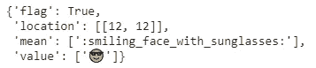
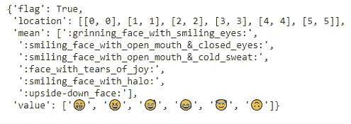
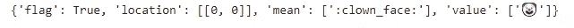

# 将表情符号转换为文本

> 原文：<https://towardsdatascience.com/converting-emojis-to-text-a28b69ed9f45?source=collection_archive---------19----------------------->

## 使用表情符号将表情符号转换为文本描述


伯纳德·赫曼特在 [Unsplash](https://unsplash.com?utm_source=medium&utm_medium=referral) 上的照片

你有没有收到过一个你不知道或者不明白是什么的表情符号？我知道这发生在我们所有人身上。有很多我们不理解的表情符号，在创建 NLP 模型时使用这些数据会导致差异。

如果我告诉你，你可以把这些表情符号改成文字，会怎么样？是的，你没听错，你可以这么做。这不仅易于理解，而且可以为 NLP 建模准备好数据。

Emot 是一个开源的 python 库，我们可以用它来将表情符号转换成文本描述。在本文中，我们将探讨如何使用 Emot。

让我们开始吧…

# 安装所需的库

我们将从使用 pip 安装 Emot 开始。下面给出的命令可以做到这一点。

```
pip install emot
```

# 导入所需的库

在这一步，我们将导入所需的库，即 Emot。

```
import emot as e
```

# 将表情符号转换为文本

这是最后一步，我们将把一些包含表情符号的文本传递到表情库，并将表情符号转换为文本。

```
text = "I am a coder😎"
con = e.emoji(text)
con
```



来源:作者

这里你可以看到它是多么容易地将表情符号转换成文本。让我们尝试更多的表情符号。

```
text = "😁😆😅😂😇🙃"
con = e.emoji(text)
con
```



来源:作者

你看表情符号有多棒，用表情符号创造文字。让我们尝试最后一个非常独特的表情符号。

```
text = "🤡"
con = e.emoji(text)
con
```



来源:作者

在将文本数据传递给 NLP 模型之前，可以用它来预处理文本数据。继续尝试使用不同的表情符号，并在回复部分让我知道您的评论。

本文是与[皮尤什·英加尔](https://medium.com/u/40808d551f5a?source=post_page-----a28b69ed9f45--------------------------------)合作完成的。

# 在你走之前

***感谢*** *的阅读！如果你想与我取得联系，请随时通过 hmix13@gmail.com 联系我或我的* [***LinkedIn 个人资料***](http://www.linkedin.com/in/himanshusharmads) *。可以查看我的*[***Github***](https://github.com/hmix13)**简介针对不同的数据科学项目和包教程。还有，随意探索* [***我的简介***](https://medium.com/@hmix13) *，阅读我写过的与数据科学相关的不同文章。**