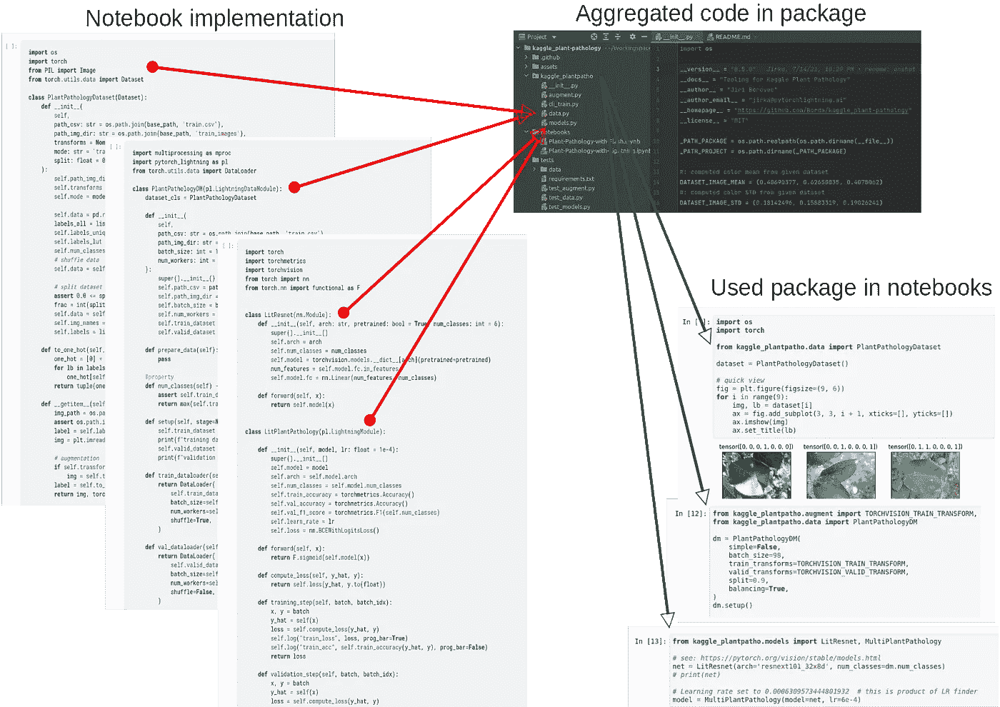
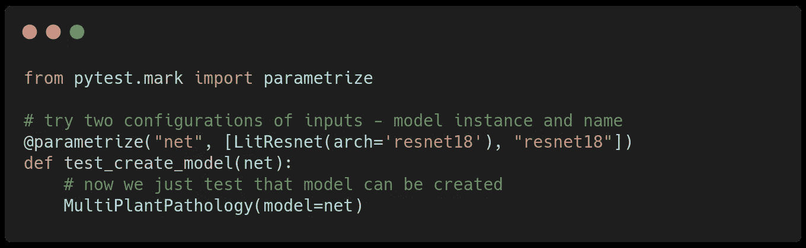
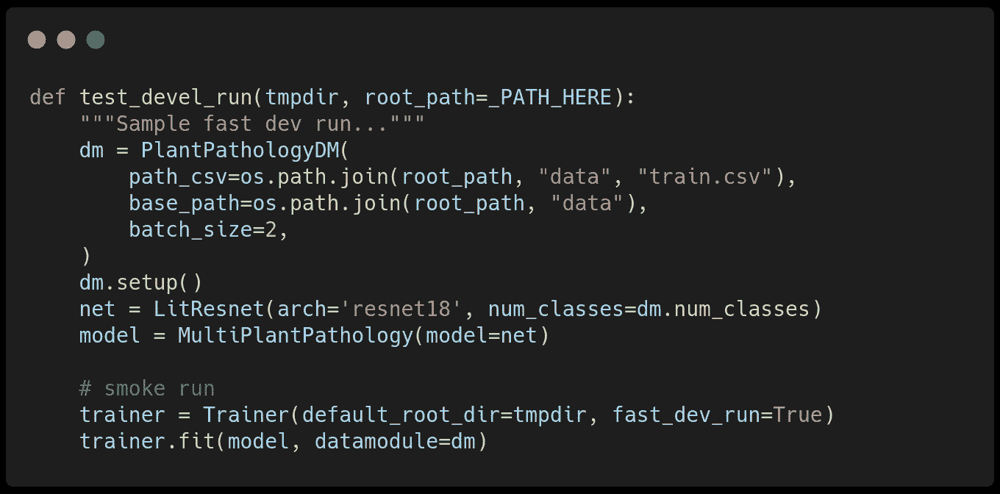
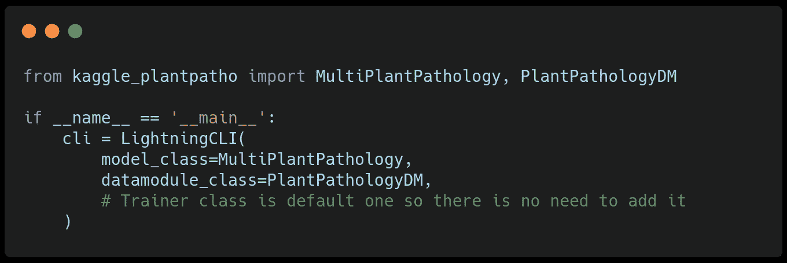
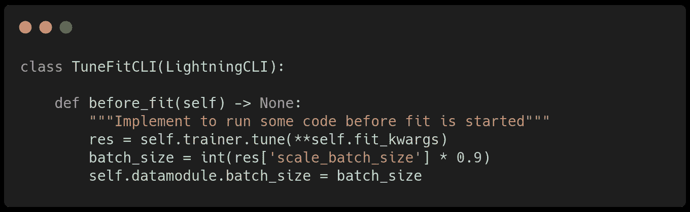

# 将科学 Kaggle 笔记本转换为友好的 Python 包

> 原文：<https://towardsdatascience.com/converting-kaggle-training-notebooks-to-sharable-code-1cc59fec2414?source=collection_archive---------29----------------------->


插图照片由[奥利娅·丹尼利维奇](https://www.pexels.com/@olia-danilevich?utm_content=attributionCopyText&utm_medium=referral&utm_source=pexels)从[派克斯](https://www.pexels.com/photo/two-men-looking-at-a-laptop-4974920/?utm_content=attributionCopyText&utm_medium=referral&utm_source=pexels)拍摄

## 这篇文章展示了如何轻松地将笔记本转换为标准 Python 包，并在培训脚本中包含一个简单的命令行界面(CLI ),以实现更快的超参数交互。

在[之前的文章](/intuitive-kaggle-task-exploration-and-model-baselining-e5f641943d08)中，我们分享了如何筛选给定的数据集，并展示了如何将类似文件的数据集包装到 PyTorch 类数据集，这是数据处理的核心。此外，我们基于一个 [TorchVision](https://pytorch.org/vision/stable/index.html) 模型在 [PyTorchLightning](https://pytorch-lightning.readthedocs.io/en/stable/) 中编写了一个基本的图像多标签分类模型，并在 GPU 上无缝地训练它，而无需在 Jupyter 笔记本中编写额外的代码。

[](/intuitive-kaggle-task-exploration-and-model-baselining-e5f641943d08) [## 直观的 Kaggle 任务探索和模型基线

### 用 PyTorch 闪电和网格点实例在 Kaggle 上排名的最佳实践(第 2/5 部分)

towardsdatascience.com](/intuitive-kaggle-task-exploration-and-model-baselining-e5f641943d08) 

笔记本电脑非常适合快速原型开发或数据探索，但对于大规模开发来说不太实用。笔记本电脑的单元式结构使得寻找不同的参数配置来优化模型具有挑战性。笔记本结果不一定是可重复的，因为您可能会交换一些编辑单元格或不按顺序运行它们。笔记本不支持版本控制，这使得与同事或更广泛的开源社区的协作变得困难。

# 将笔记本转换为可共享的 Python 包

使用 PyTorch Lightning，将一个笔记本转换成一个基本的 python 包是很简单的事情，并将其作为 GitHub 存储库共享。PyTorch Lightning 实施了最佳实践，并通过其功能(数据处理和模型架构)暗示了自然的代码组织。

python 包是一种组织函数、类等的结构。，到 python 模块中，可以在任何地方导入和使用它们。这种包装是紧凑的和单元的，适于与 Pip 或 Conda 一起分配。所以在我们的例子中，我们创建了两个 python 模块— `data`和`models`，并复制粘贴了之前实现的类。

[使用](https://packaging.python.org/tutorials/packaging-projects/) `[setup.py](https://packaging.python.org/tutorials/packaging-projects/)`我们可以安装我们的软件包，并将其导入我们环境中的任何地方。否则，我们需要将包的路径添加到我们的 Python 系统路径中。通过将数据和模型实现移动到我们自己的包中，我们可以通过导入在我们的笔记本中使用它，并将所有培训简化为以下几行:

来自共享的[库](https://github.com/Borda/kaggle_plant-pathology)的代码片段。

这使您能够在 GitHub 上共享您的[库/包，使人们能够轻松地在您的工作基础上进行构建。](https://github.com/Borda/kaggle_plant-pathology)



将 PL 实现移动到包中，然后通过导入使用它们的模式。

## 模板/初学者存储库

作为你下一个项目的灵感，我创建了这个[stater/template repository](https://github.com/Borda/kaggle_sandbox)，它用一个演示包`challenge_xyz`建立了一个基本的项目结构。它包括测试、代码格式化和 Github 问题/公关模板的基本工作流程。您可以从该模板创建以下存储库；参见[分步文档](https://docs.github.com/en/github/creating-cloning-and-archiving-repositories/creating-a-repository-on-github/creating-a-repository-from-a-template)。

[](https://github.com/Borda/kaggle_sandbox) [## GitHub-Borda/ka ggle _ sandbox:ka ggle 尝试的起点:]

### Kaggle 尝试的一个起点:】。在 GitHub 上创建一个帐户，为 Borda/kaggle_sandbox 开发做贡献。

github.com](https://github.com/Borda/kaggle_sandbox) [](https://medium.com/geekculture/thought-on-why-code-formatting-is-important-even-more-for-open-source-476829b54eaf) [## 思考为什么代码格式化对开源更重要

### 格式化程序不会打扰任何人；它们旨在帮助和促进任何合作的顺利进行…

medium.com](https://medium.com/geekculture/thought-on-why-code-formatting-is-important-even-more-for-open-source-476829b54eaf) 

# 包装实体的小技巧

现在我们开源了我们的代码，我们已经准备好让他们贡献或修复问题。这听起来不错，但是如何确保新的修改不会破坏其他东西呢？

标准的软件工程答案是通过测试(单元测试或集成测试)。在提交/发布每一个新的贡献之前，我们可以在存储库中运行所有的测试，并验证所有的工作都如预期的那样。就我个人而言，我在我的大部分项目中使用的都是 pytest 包，reed [紧随其后进入](https://realpython.com/pytest-python-testing/)。

使用标准框架又一次变得很方便，在我们的例子中是 Pytoch Lightning，它已经进行了数百次测试来保证正确的行为。我们只需要编写一小组测试用例来覆盖我们的解决方案，因为 lightning 已经完成了剩下的工作。例如，我们可能想要实例化所有的类。

如下所示，我们添加了参数化，它使用不同的网络调用相同的测试两次——第一次获取 network 作为实例，第二次获取 networks 作为字符串名称:

[](https://github.com/Borda/kaggle_plant-pathology/blob/a642861e8d4d896c15b10c5dfcf071d8436889b5/tests/test_models.py#L16-L19)

来自共享[库](https://github.com/Borda/kaggle_plant-pathology)的代码[片段](https://github.com/Borda/kaggle_plant-pathology/blob/a642861e8d4d896c15b10c5dfcf071d8436889b5/tests/test_models.py#L16-L19)。

为了测试训练能力，我们可以通过设置下面的`Trainer`的标志`fast_dev_run=True`，在一些样本图像上测试负载并运行您的模型。

[](https://github.com/Borda/kaggle_plant-pathology/blob/a642861e8d4d896c15b10c5dfcf071d8436889b5/tests/test_models.py#L22-L51)

来自共享[库](https://github.com/Borda/kaggle_plant-pathology)的代码[片段](https://github.com/Borda/kaggle_plant-pathology/blob/a642861e8d4d896c15b10c5dfcf071d8436889b5/tests/test_models.py#L22-L51)。

测试的最后一个技巧是包括几个样本图像和类似注释的文件来模拟实际的数据集。这允许您更真实地测试正确的用例。

# 将笔记本转换为 CLI 可配置的 Python 脚本

将笔记本转换成 python 脚本的一种方法是通过 JupyterLab——选择“下载为-> Python”。[简化笔记本](https://github.com/Borda/kaggle_plant-pathology/blob/a642861e8d4d896c15b10c5dfcf071d8436889b5/notebooks/Plant-Pathology-with-Lightning.ipynb)应更短，主要关注数据/模型/教练配置(如果我们跳过所有数据探索部分)。

不幸的是，它会生成一个带有硬编码参数的脚本。为了解决这个限制，我们需要编写自己的`argparser`，并将所有 CLI 参数映射到模型/数据模块/训练器。幸运的是，Lightning 最近推出了自己的极简`LightningCLI`界面，为你处理争论投标。

[](https://devblog.pytorchlightning.ai/auto-structuring-deep-learning-projects-with-the-lightning-cli-9f40f1ef8b36) [## 使用 Lightning CLI 自动构建深度学习项目

devblog.pytorchlightning.ai](https://devblog.pytorchlightning.ai/auto-structuring-deep-learning-projects-with-the-lightning-cli-9f40f1ef8b36) 

`LightningCLI`几乎不需要额外的代码就能为 Lightning 脚本提供简单的参数解析！它被设计成接受这些主要的组件/角色:`LightningModule`、`LightningDataModule` 和`Trainer`，解析命令行参数并实例化这些角色。最终，`LightningCLI` 执行了训练。最终的脚本如下所示:

[](https://github.com/Borda/kaggle_plant-pathology/blob/a642861e8d4d896c15b10c5dfcf071d8436889b5/kaggle_plantpatho/cli_train.py#L39-L45)

来自共享[库](https://github.com/Borda/kaggle_plant-pathology)的代码[片段](https://github.com/Borda/kaggle_plant-pathology/blob/a642861e8d4d896c15b10c5dfcf071d8436889b5/kaggle_plantpatho/cli_train.py#L39-L45)。

使用 CLI，您可以在任何终端中运行 python 脚本。

```
python kaggle_plantpatho/cli_train.py \
    --model.model 'resnet34' \
    --data.base_path /home/jirka/datasets/kaggle_plant-pathology \
    --trainer.max_epochs 5
```

*由于我们计划试验不同的模型架构，我们可能需要调整每个模型的批量大小，以使用最大的资源(对于较小的模型，例如* `*resnet18*` *，我们可以使用比* `*resnet101*` *大得多的批量)。这可以通过在方法* `*before_fit(...)*` *中实现的闪电训练器* `[*tune*](https://pytorch-lightning.readthedocs.io/en/1.4.0/common/trainer.html?highlight=tune#auto-scale-batch-size)` *来实现，因为它会找到适合 GPU 内存的最大* `*batch_size*` *并使用它进行训练。*

[](https://github.com/Borda/kaggle_plant-pathology/blob/a642861e8d4d896c15b10c5dfcf071d8436889b5/kaggle_plantpatho/cli_train.py#L29-L36)

来自共享[库](https://github.com/Borda/kaggle_plant-pathology)的代码[片段](https://github.com/Borda/kaggle_plant-pathology/blob/a642861e8d4d896c15b10c5dfcf071d8436889b5/kaggle_plantpatho/cli_train.py#L29-L36)。

在这篇文章中，我们展示了如何将科学笔记本转换成可以共享的标准 python 包。我们已经讨论了添加最小测试的动机，以便在不意外破坏它的情况下促进任何未来的包增强。最后，我们展示了从[普通 python 脚本](https://gist.github.com/Borda/5eb3dea49aff2cd60f8c88e1e3f01a3c)到公开所有命令行参数的通用脚本的简单转换。

在未来，我们将展示如何使用这个简单的脚本在 [Grid.ai](https://www.grid.ai/) 上并行运行跨多台机器的超参数搜索，并在线观察训练表现。

[](/hyperparameter-optimization-with-grid-ai-and-no-code-change-b89218d4ff49) [## 使用 Grid.ai 进行超参数优化，无需更改代码

### 用 PyTorch 闪电和网格点实例在 Kaggle 上排名的最佳实践(第 4/5 部分)

towardsdatascience.com](/hyperparameter-optimization-with-grid-ai-and-no-code-change-b89218d4ff49) 

**敬请关注，并跟随我了解更多！**

[](https://devblog.pytorchlightning.ai/best-practices-to-rank-on-kaggle-competition-with-pytorch-lightning-and-grid-ai-spot-instances-54aa5248aa8e) [## 使用 PyTorch Lightning 和 Grid.ai Spot 实例对 Kaggle 竞争进行排名的最佳实践

### 通过交互式会话、超参数解决图像分类挑战的完整数据科学周期…

devblog.pytorchlightning.ai](https://devblog.pytorchlightning.ai/best-practices-to-rank-on-kaggle-competition-with-pytorch-lightning-and-grid-ai-spot-instances-54aa5248aa8e) 

# 关于作者

[**Jirka boro vec**](https://medium.com/@jborovec)**已经在几家不同的 IT 公司从事机器学习和数据科学工作好几年了。特别是，他喜欢探索有趣的世界问题，并用最先进的技术解决它们。此外，他开发了几个开源 python 包，并积极参与其他知名项目。在 [*Grid.ai*](https://www.grid.ai/) 工作，担任研究工程师，是[*pytorchlightning . ai*](https://pytorchlightning.ai/)的主要撰稿人。**