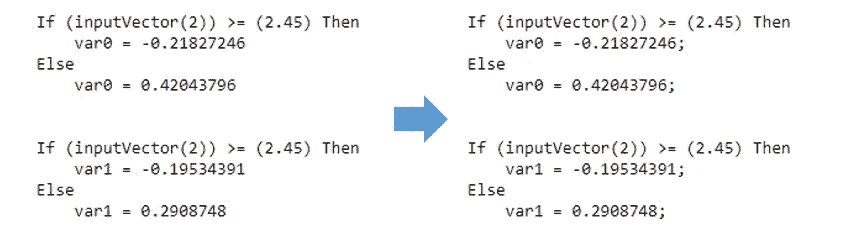

# 使用 m2cgen (Python)将机器学习模型转换为 SAS

> 原文：<https://towardsdatascience.com/converting-machine-learning-models-to-sas-using-m2cgen-python-190d846090dc?source=collection_archive---------32----------------------->

## 在 SAS 中部署经过训练的 ML 模型(如 XGBoost 和 LightGBM)的方法

m2cgen 是一个非常友好的包，可以将许多不同的训练模型转换成支持语言[的语言](https://github.com/BayesWitnesses/m2cgen#supported-languages)，比如 R 和 VBA。但是，m2cgen 还不支持 SAS。本文是为那些需要在 SAS 环境中部署经过训练的模型的人准备的。本文介绍的方法是首先将模型转换为 VBA 代码，然后将 VBA 代码转换为 SAS 脚本。

本教程中使用的脚本上传到[我的 Github repo](https://github.com/cydalytics/xgboost_to_sas/blob/main/README.md) ，随意克隆文件。


克里斯·劳顿在 [Unsplash](https://unsplash.com?utm_source=medium&utm_medium=referral) 上的照片

# 包裹

m2cgen

# 功能

`m2cgen`(Model 2 Code Generator)——是一个轻量级的库，它提供了一种将训练好的统计模型转换成本机代码(Python、C、Java、Go、JavaScript、Visual Basic、C#、PowerShell、R、PHP、Dart、Haskell、Ruby、F#)的简单方法。

# 示范

1.  将 XGBoost 模型转换为 VBA，然后转换为 SAS 脚本
2.  将 XGBoost 模型转换为 VBA，然后转换为 SAS 脚本(缺少值)

# 数据

[从 sklearn 加载的虹膜数据集](https://scikit-learn.org/stable/auto_examples/datasets/plot_iris_dataset.html)

任务 1:将 XGBoost 模型转换为 VBA 模型

```
# import packages
import pandas as pd
import numpy as np
import os 
import refrom sklearn import datasets
from xgboost import XGBClassifier
from sklearn.model_selection import train_test_split
from sklearn.metrics import accuracy_scoreimport m2cgen as m2c# import data
iris = datasets.load_iris()
X = iris.data
Y = iris.target
```

首先，我们导入这个任务所需的包和数据。

```
# split data into train and test sets
seed = 2020
test_size = 0.3
X_train, X_test, y_train, y_test = train_test_split(X, Y, test_size=test_size, random_state=seed)# fit model on training data
model = XGBClassifier()
model.fit(X_train, y_train)
```

然后，我们来训练一个简单的 XGBoost 模型。

```
code = m2c.export_to_visual_basic(model, function_name = 'pred')
```

接下来，将 XGBoost 模型转换为 VBA 模型。使用 m2cgen 的 export_to_visual_basic 函数，可以得到你训练好的 VBA 语言的 XGBoost 模型。转换成其他语言的脚本也和转换成 VBA 语言的脚本一样简单。


照片由 [cyda](https://cydalytics.blogspot.com/) 拍摄

接下来是本教程的核心，在将模型转换为 VBA 之后，需要一些步骤来将 VBA 代码转换为 SAS 脚本，例如删除 SAS 环境中不使用的许多不必要的行，如“模块 xxx”、“函数 yyy”和“Dim var Z As Double”，并插入“；”以遵循 SAS 中的语法规则。

```
# remove unnecessary things
code = re.sub('Dim var.* As Double', '', code)
code = re.sub('End If', '', code)# change the script to sas scripts
# change the beginning
code = re.sub('Module Model\nFunction pred\(ByRef inputVector\(\) As Double\) As Double\(\)\n', 
                'DATA pred_result;\nSET dataset_name;', code)# change the ending
code = re.sub('End Function\nEnd Module\n', 'RUN;', code)# insert ';'
all_match_list = re.findall('[0-9]+\n', code)
for idx in range(len(all_match_list)):
    original_str = all_match_list[idx]
    new_str = all_match_list[idx][:-1]+';\n'
    code = code.replace(original_str, new_str)
all_match_list = re.findall('\)\n', code)
for idx in range(len(all_match_list)):
    original_str = all_match_list[idx]
    new_str = all_match_list[idx][:-1]+';\n'
    code = code.replace(original_str, new_str)# replace the 'inputVector' with var name
dictionary = {'inputVector(0)':'sepal_length',
              'inputVector(1)':'sepal_width',
              'inputVector(2)':'petal_length',
              'inputVector(3)':'petal_width'} 
for key in dictionary.keys():
    code = code.replace(key, dictionary[key])# change the prediction labels
code = re.sub('Math.Exp', 'Exp', code)
code = re.sub('pred = .*\n', '', code)
temp_var_list = re.findall(r"var[0-9]+\(\d\)", code)
for var_idx in range(len(temp_var_list)):
    code = re.sub(re.sub('\\(', '\\(', re.sub('\\)', '\\)', temp_var_list[var_idx])), iris.target_names[var_idx]+'_prob', code)
```

逐步解释:

```
# remove unnecessary things
code = re.sub('Dim var.* As Double', '', code)
code = re.sub('End If', '', code)# change the beginning
code = re.sub('Module Model\nFunction pred\(ByRef inputVector\(\) As Double\) As Double\(\)\n', 
                'DATA pred_result;\nSET dataset_name;', code)# change the ending
code = re.sub('End Function\nEnd Module\n', 'RUN;', code)
```

前三部分非常简单。我们简单地使用正则表达式去掉不需要的行，然后将脚本的开头改为“DATA pred _ result\ n 设置数据集名称；"其中，pred_result 是指运行 SAS 脚本后的输出表名称，dataset_name 是指我们需要预测的输入表名称。最后一部分是将脚本的结尾改为“RUN”。

```
# insert ';'
all_match_list = re.findall('[0-9]+\n', code)
for idx in range(len(all_match_list)):
    original_str = all_match_list[idx]
    new_str = all_match_list[idx][:-1]+';\n'
    code = code.replace(original_str, new_str)
all_match_list = re.findall('\)\n', code)
for idx in range(len(all_match_list)):
    original_str = all_match_list[idx]
    new_str = all_match_list[idx][:-1]+';\n'
    code = code.replace(original_str, new_str)
```

遵循 SAS 中的语法规则，"；"需要指示每个语句的结束。



照片由 [cyda](https://cydalytics.blogspot.com/)

```
# replace the 'inputVector' with var name
dictionary = {'inputVector(0)':'sepal_length',
              'inputVector(1)':'sepal_width',
              'inputVector(2)':'petal_length',
              'inputVector(3)':'petal_width'} 
for key in dictionary.keys():
    code = code.replace(key, dictionary[key])
```

利用字典，我们可以将“输入向量”与输入数据集中的变量名进行映射，并一次性更改所有的“输入向量”。

```
# change the prediction labels
code = re.sub('Math.Exp', 'Exp', code)
code = re.sub('pred = .*\n', '', code)
temp_var_list = re.findall(r"var[0-9]+\(\d\)", code)
for var_idx in range(len(temp_var_list)):
    code = re.sub(re.sub('\\(', '\\(', re.sub('\\)', '\\)', temp_var_list[var_idx])), iris.target_names[var_idx]+'_prob', code)
```

转换步骤的最后一部分是更改预测标签。


由 [cyda](https://cydalytics.blogspot.com/) 拍摄

```
# save output
vb = open('vb1.sas', 'w')
vb.write(code)
vb.close()
```

最后，我们可以用后缀“.”保存输出。sas "

第一个任务到此结束，现在，您应该能够将您训练的模型转换成 SAS 脚本了。要仔细检查创建的 SAS 脚本是否有任何问题，您可以使用以下脚本来检查 python 预测和 SAS 预测的差异。请注意，预测的概率(python vs SAS)显示了一点差异，但差异应该不是非常显著。

```
# python pred
python_pred = pd.DataFrame(model.predict_proba(X_test))
python_pred.columns = ['setosa_prob','versicolor_prob','virginica_prob']
python_pred# sas pred
sas_pred = pd.read_csv('pred_result.csv')
sas_pred = sas_pred.iloc[:,-3:]
sas_pred(abs(python_pred - sas_pred) > 0.00001).sum()
```


照片由 [cyda](https://cydalytics.blogspot.com/) 拍摄

任务 2:将 XGBoost 模型转换为 VBA，然后转换为 SAS 脚本(缺少值)

如果您的数据在训练数据中没有缺失值，XGBoost 在生成树时默认将“缺失值”放在左边的节点上(如下树图所示)([引用](https://stackoverflow.com/questions/37617390/xgboost-handling-of-missing-values-for-split-candidate-search))。从 m2cgen 生成的脚本中，您可以发现，如果变量大于或等于给定的数字，测试的条件总是 be。因此，如果测试或预测数据集中有缺失值，脚本会将“缺失值”留给 else 部分。例如，在我们从任务 1 生成的 SAS 脚本中，第一个测试条件是“If(petal _ length)>=(2.45)Then var 0 =-0.21827246；否则 var0 = 0.42043796"，所以如果 petal_length 缺失，不大于等于 2.45，var0 会赋为 0.42043796。另一个例子如下所示。


照片由 [cyda](https://cydalytics.blogspot.com/)


照片由 [cyda](https://cydalytics.blogspot.com/)

如果您的训练数据包含缺失值，该怎么办？XGBoost 会根据训练结果将“缺失值”放到左侧或右侧节点。(因此，您可以看到 SAS 脚本中显示的条件有时是" = ")


由 [cyda](https://cydalytics.blogspot.com/) 拍摄


由 [cyda](https://cydalytics.blogspot.com/) 拍摄

您可以使用以下脚本创建带有缺失值的数据集，并重复任务 1 中的步骤，以查看和比较 SAS 和 python 的预测输出。

```
from random import sample
from sklearn import datasets# import data
iris = datasets.load_iris()
X = iris.data
Y = iris.target# assume that there are missing values in the first 2 columns of the data
sequence = [i for i in range(len(X))]
subset0 = sample(sequence, 30)
subset1 = sample(sequence, 50)
subset2 = sample(sequence, 40)
subset3 = sample(sequence, 60)
X[[(subset0)],0] = np.nan
X[[(subset1)],1] = np.nan
X[[(subset0)],2] = np.nan
X[[(subset1)],3] = np.nan
```

我做了测试，发现一些行具有相同的预测输出，而一些行显示出很大的差异(见下图)。


照片由 [cyda](https://cydalytics.blogspot.com/)

我比较了 SAS 脚本的中间步骤中生成的 var。让我们以下面显示的第二行为例。如果测试的条件是“If (petal_length) >= (2.45)那么 var 0 =-0.217358515；Else …”并且缺少了 petal_length，所以不满足条件，转到 Else 语句，那么测试的第二个条件是“If(petal _ width)> =(0.84999996)Then var 0 =-0.155172437；Else …”并且 petal_width 是 0.2，同样，它不满足条件并转到 Else 语句。接下来，我们进入第三个条件，“If (sepal_length) < (11.600001) Then var0 = 0.411428601; Else …” and we see that sepal_length is missing, it should not fulfill the condition but SAS somehow accept it as True and the var0 is 0.411428601.


Photo by [cyda](https://cydalytics.blogspot.com/)


cyda 拍摄的照片

因此，为了迎合这种情况，我添加了一些脚本来强制脚本首先检查值是否丢失。

```
# handle missing values
all_match_list = re.findall('If.*Then', code)
for idx in range(len(all_match_list)):
    original_str = all_match_list[idx]
    new_str = ' '.join(original_str.split()[:-1] + [**'and not missing'**, original_str.split()[1], ' Then'])
    code = code.replace(original_str, new_str)
```

因此，将 VBA 转换为服务协议的手动脚本将更改为以下脚本。你可以在[我的 GitHub repo](https://github.com/cydalytics/xgboost_to_sas/blob/main/Demo2%20-%20Convert%20XGBoost%20model%20to%20VBA%2C%20then%20to%20SAS%20scripts%20(with%20missing%20values).ipynb) 中找到完整版。

```
# remove unnecessary things
code = re.sub('Dim var.* As Double', '', code)
code = re.sub('End If', '', code)# change the beginning
code = re.sub('Module Model\nFunction pred\(ByRef inputVector\(\) As Double\) As Double\(\)\n', 
                'DATA pred_result;\nSET dataset_name;', code)# change the ending
code = re.sub('End Function\nEnd Module\n', 'RUN;', code)# insert ';'
all_match_list = re.findall('[0-9]+\n', code)
for idx in range(len(all_match_list)):
    original_str = all_match_list[idx]
    new_str = all_match_list[idx][:-1]+';\n'
    code = code.replace(original_str, new_str)
all_match_list = re.findall('\)\n', code)
for idx in range(len(all_match_list)):
    original_str = all_match_list[idx]
    new_str = all_match_list[idx][:-1]+';\n'
    code = code.replace(original_str, new_str)# handle missing values
all_match_list = re.findall('If.*Then', code)
for idx in range(len(all_match_list)):
    original_str = all_match_list[idx]
    new_str = ' '.join(original_str.split()[:-1] + ['and not missing', original_str.split()[1], ' Then'])
    code = code.replace(original_str, new_str)# replace the 'inputVector' with var name
dictionary = {'inputVector(0)':'sepal_length',
              'inputVector(1)':'sepal_width',
              'inputVector(2)':'petal_length',
              'inputVector(3)':'petal_width'} 
for key in dictionary.keys():
    code = code.replace(key, dictionary[key])# change the prediction labels
code = re.sub('Math.Exp', 'Exp', code)
code = re.sub('pred = .*\n', '', code)
temp_var_list = re.findall(r"var[0-9]+\(\d\)", code)
for var_idx in range(len(temp_var_list)):
    code = re.sub(re.sub('\\(', '\\(', re.sub('\\)', '\\)', temp_var_list[var_idx])), iris.target_names[var_idx]+'_prob', code)
```

在本教程中，我使用 m2cgen 包将 XGBoost 模型转换为 VBA 代码，然后转换为 SAS 脚本，但没有必要首先转换为 VBA 代码，如果您愿意，可以选择其他语言，如 C 或 JAVA。本教程只是演示了如何将脚本从一种语言转换成另一种语言。

想了解更多关于使用 m2cgen 的知识，请前往[官方 Github 资源库](https://github.com/BayesWitnesses/m2cgen)。