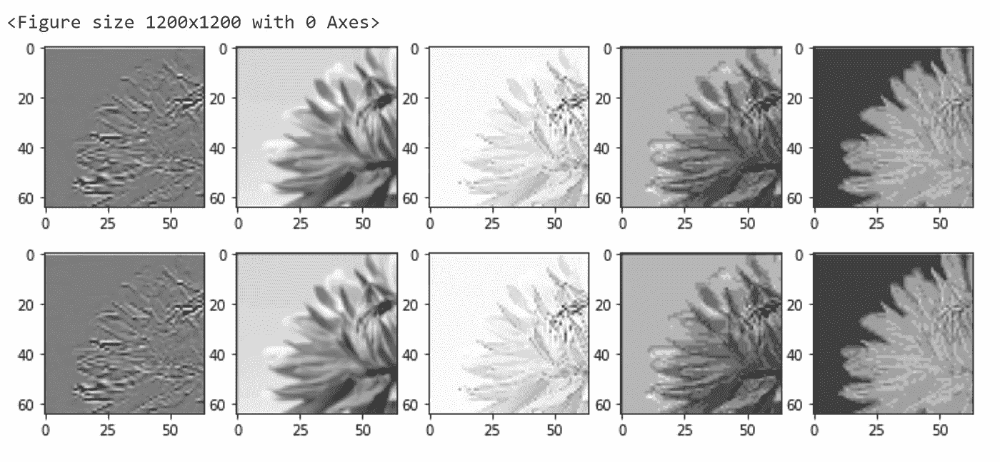

# 用 Python 和 Numpy 实现卷积层黑客攻击

> 原文：<https://towardsdatascience.com/convolutional-layer-hacking-with-python-and-numpy-e5f64812ca0c?source=collection_archive---------35----------------------->

## 用 python 从头开始创建一个卷积层，用自定义内核破解其权重，并验证其结果与 pytorch 生成的结果相匹配


[梅里达勒](https://unsplash.com/@meric?utm_source=unsplash&utm_medium=referral&utm_content=creditCopyText)在 [Unsplash](https://unsplash.com/photos/celEpt7dzHI) 上拍摄的照片

如果你开始在深度学习中使用卷积层，你可能会对所涉及的参数、计算和通道的混合感到困惑。**从条纹到填充，输入和输出通道，内核和可学习的参数**，有很多事情正在进行。在这篇文章中，我们将深入到这些 conv 层的最底层。我们将:

*   **用 python 从头编码一个卷积层**到**一点一点理解**当我们通过其中一个层传递数据时是怎么回事。
*   **黑掉 convnet 的参数**,生成自定义内核和随机内核的混合。
*   **使用 Pytorch 和 Python-numpy** 比较结果，验证我们获得了完全相同的输出。准备好了吗？让我们开始吧。

# 初始设置

跳到 https://colab.research.google.com/的 google colab 或者任何其他可以用 python 和 pytorch 编码的平台。

首先，我们**初始化我们需要的库**。这将允许我们用 pytorch 和 numpy 库进行编码，这样我们可以在以后比较它们的结果。

```
import torch
from torch import nn
from torchvision import transforms
from torchvision.transforms.functional import pad
import numpy as np
import time
import numpy.testing as npt
from PIL import Image 
from matplotlib import pyplot as plt
```

好了，现在我们做两件事:

*   **设置种子**以便结果一致且可重复(可选)
*   **上传图像**到系统。我们使用 PIL 库加载它，并将其与 R、G 和 B 三个通道一起可视化。在这个例子中，我使用了一朵花的 128x128 像素的图像。

```
img = Image.open("flower128.jpg")  
plt.figure()
plt.axis('off') 
plt.imshow(img)
fig, axs = plt.subplots(nrows=1, ncols=3, figsize=(12,4))
for i, ax in enumerate(axs.flatten()):
    plt.sca(ax)
    plt.axis('off')
    plt.imshow(np.array(img)[:, :, i], cmap='gray', vmin = 0, vmax = 255)
plt.show()
```


帕特里克·康纳·克洛夫在 [Unsplash](https://unsplash.com/photos/AggM5Lcvtxo) 上拍摄的照片

是时候设置我们卷积层的主要参数了:

*   首先，我们将图像的原始宽度和高度存储在 **w_in** 和 **h_in** 中，在本例中是 **128x128** 像素。
*   **c_in** 为 3，因为输入数据有 **3** 个通道。 **c_out** 将会是 **5** 因为我们想要在 conv 层的输出中产生 5 个通道。这可能是 4，7，11 或任何数字。在这个例子中，我选择 5。
*   **k** 是 **3** 因为我们将使用一个 **3x3 的内核**大小。
*   我决定在这个例子中我想产生一个宽度为**高度为**和**宽度为 **64 像素**的**输出**。为了做到这一点，我们将**步幅设置为 2** 并将**填充设置为 1** ，因此我们将以 2 为增量移动我们的内核，并且我们将创建 1 的外部填充以确保最终尺寸是初始尺寸的一半。**
*   为了验证(并且预先计划)我们的输出宽度和高度，我们可以使用这个简化的公式: **(n+2*pad-ks)//stride +1** ，我们将输出尺寸存储在 **w_out** 和 **h_out** 中。
    **w _ out**=(128+2 * 1–3)//2+1 =**64**
    h _ out=(128+2 * 1–3)//2+1 =**64**

```
w_in=img.size[0]
h_in=img.size[1]
c_in=3
c_out=5
k=3
stride=2
padding=1
# (n+2*pad-ks)//stride +1
w_out = (w_in+2*padding-k)//stride +1
h_out = (h_in+2*padding-k)//stride +1
```

# pytorch conv2d 层

现在，我们创建一个 pytorch conv2d 层，并根据正态分布初始化其参数:

*   将图像数据转换成张量。这将产生形状为 3，128，128 的张量。然后我们使用 unsqueeze_(0)在开头添加一个额外的维度，然后获得最终的形状: **1，3，128，128** 。第一维表示我们正在用一批**图片**做这个实验。
*   然后，我们声明函数 **init_weights** ，该函数将使用从正态分布采样的值初始化 conv 层的权重和偏置参数。
*   最后我们使用 pytorch **nn。Conv2d** 函数创建 Conv 层，我们调用 init_weights 函数**初始化它的权重**。这将创建 pytorch conv 层: **【Conv2d(3，5，kernel_size=(3，3)，stride=(2，2)，padding=(1，1))**

```
#### Pytorch Conv2d layer
data = transforms.ToTensor()(img).unsqueeze_(0)def init_weights(m):
  if isinstance(m, nn.Conv2d):
    torch.nn.init.normal_(m.weight, 0.0, 0.02)
    torch.nn.init.normal_(m.bias, 0.0, 0.02)convlayer=nn.Conv2d(c_in, c_out, k, stride=stride, padding=padding)
convlayer=convlayer.apply(init_weights)
print(convlayer)
```

# numpy conv2d 层设置

挑战仍在继续。现在让我们设置使用 python 和 numpy 库创建 conv2d 层所需的数据。

*   我们复制了一张图片，并使用**填充**函数**在其周围创建一个 1 像素的填充**(遵循我们在 pytorch 中使用的填充策略)。请注意，我使用了 torchvision 函数来进行填充，但是您可以用许多其他方式来完成此操作，而无需使用 torchvision。
*   然后我们**转置**通道维度，并使用 **expand_dims** 在开头添加一个额外的维度。此时，我们将拥有:
    **Numpy 输入数据** : 1x3x130x130
    **Pytorch 输入数据** : 1x3x128x128
    请注意，Numpy 数据包含填充，而 Pytorch 数据不包含填充，因为 pytorch convd2d 层会自行应用填充。
*   最后，我们**将 numpy 数据**除以 255.0，使其值介于 0 和 1 之间。
*   此时，pytorch 和 numpy 数据具有相似的结构和值。是行动的时候了！

```
img2= img.copy()
img2=pad(img2, (1,1))
data2 = np.array(img2).transpose((2, 0, 1))
data2 = np.expand_dims(data2, axis=0)
data2 = data2/255.0
```

# 破解重量

现在，我们将有一些乐趣黑客这些层的权重。
首先让我们打印 pytorch 层的权重和偏差的形状。
我们可以看到权重的结构是:5，3，3，3 ( **c_out，c_in，k，k** )。偏差要简单得多，我们只要有尽可能多的输出通道。
所以我们有 **135+5=140 个参数**，每个输出通道一个，每个输入通道一个，每个内核维度一个，加上偏置参数。然后我们使用 np.zeros 命令用 numpy 初始化类似的结构，最初用零填充它们。

```
print(convlayer.weight.shape)
print(convlayer.bias.shape)
# Print Output:
# torch.Size([5, 3, 3, 3]) 
# torch.Size([5])w=np.zeros((c_out, c_in, k, k))
b=np.zeros((c_out))
```

此时，在 pytorch 数据结构的情况下，我们的内核的**参数值被**初始化**为从正态分布采样的值，在 numpy 结构的情况下被初始化为零。**

我们知道，无论我们在内核中拥有什么，都将决定我们从图像中提取什么样的模式。因此，我们将执行以下操作:

*   我们将**黑掉连接图像前 3 个输出通道和输入通道的前 3 个内核**。
*   我们将**让与最后 2 个输出通道**连接的另外 2 个内核**具有来自正态分布的随机值**。

让我们首先在前 3 个内核中创建**参数的值。**

*   我们**创建一个名为 **ker** 的列表**。
*   然后我们**给它添加三个内核结构**。
*   第一个**是一个将**检测水平线**的内核。**
*   第二个是一个内核，它将模糊图像
*   第三个是内核，它将锐化图像的边缘

```
ker=[]
ker.append(np.array([[-1.1,-1.1,-1.1],[2.2,2.2,2.2],[-1.1,-1.1,-1.1]]))
ker.append(np.array([[1/9,1/9,1/9],[1/9,1/9,1/9],[1/9,1/9,1/9]]))
ker.append(np.array([[0.0,-1.0,0.0],[-1.0,6.0,-1.0],[0.0,-1.0,0.0]]))
```

现在是时候**侵入 pytorch 层权重**和**改变参数**的值，这些参数与连接到前 3 个输出通道的**内核**相对应，以便它们成为我们手动创建的内核。

最后的两个内核将保持它们之前具有的来自正态分布的相同随机值。

```
with torch.no_grad():
  for w0 in range(convlayer.weight.shape[0]):
      for w1 in range(convlayer.weight.shape[1]):
          if (w0<len(ker)):
             convlayer.weight[w0][w1]=torch.from_numpy(ker[w0])
```

现在我们对 numpy 卷积数据结构做同样的事情。我们对前 3 个输出通道和内核进行了同样的操作，对最后两个输出通道，我们从 pytorch conv2d 层复制了正态分布的采样数据(因此 pytorch 和 numpy conv 层具有完全相同的参数)。

```
for w0 in range(c_out):
   for w1 in range(c_in):
      if (w0<len(ker)):
             w[w0][w1]=ker[w0]
      else: 
        w[w0][w1]=np.around(convlayer.weight[w0][w1].detach().numpy(),decimals=4) 
   b[w0]=np.around(convlayer.bias[w0].detach().numpy(),decimals=4)
```

这样，两种数据结构具有相同的参数。

*   将前 3 个输出通道连接到数据输入通道的**前 3 个内核**具有我们创建的**手动内核值**，它将**检测水平线，产生模糊并锐化**边缘。
*   **最终 2 个内核**具有从正态分布中采样的**随机值，并且在 pytorch 和 numpy 结构中是相同的。**

如果我们打印 pytorch conv2d 层权重的值和 numpy 权重的值，我们会看到它们是相同的。例如，这些是 numpy 数据结构:

```
## Showing 2 decimals for visual clarity
print(np.around(w,decimals=2))###### FIRST KERNEL, detect horizontal lines #####
[[[[-1.1  -1.1  -1.1 ]
   [ 2.2   2.2   2.2 ]
   [-1.1  -1.1  -1.1 ]][[-1.1  -1.1  -1.1 ]
   [ 2.2   2.2   2.2 ]
   [-1.1  -1.1  -1.1 ]][[-1.1  -1.1  -1.1 ]
   [ 2.2   2.2   2.2 ]
   [-1.1  -1.1  -1.1 ]]]###### SECOND KERNEL, blurring #####
 [[[ 0.11  0.11  0.11]
   [ 0.11  0.11  0.11]
   [ 0.11  0.11  0.11]][[ 0.11  0.11  0.11]
   [ 0.11  0.11  0.11]
   [ 0.11  0.11  0.11]][[ 0.11  0.11  0.11]
   [ 0.11  0.11  0.11]
   [ 0.11  0.11  0.11]]]###### THIRD KERNEL, sharpen #####
 [[[ 0\.   -1\.    0\.  ]
   [-1\.    6\.   -1\.  ]
   [ 0\.   -1\.    0\.  ]][[ 0\.   -1\.    0\.  ]
   [-1\.    6\.   -1\.  ]
   [ 0\.   -1\.    0\.  ]][[ 0\.   -1\.    0\.  ]
   [-1\.    6\.   -1\.  ]
   [ 0\.   -1\.    0\.  ]]]###### FOURTH KERNEL, random values #####
 [[[-0\.   -0.01 -0\.  ]
   [ 0.04 -0.01 -0.03]
   [-0.01  0.01  0.02]][[-0.01  0\.    0\.  ]
   [-0.02 -0\.    0.02]
   [ 0.02 -0.02  0.01]][[ 0.02 -0.01 -0.02]
   [-0.02 -0\.   -0.02]
   [ 0.02  0.02 -0.04]]]###### FIFTH KERNEL, random values #####
 [[[-0.03 -0.02  0.01]
   [ 0.01  0.03  0.01]
   [ 0\.    0.01 -0.07]][[ 0.02 -0.03  0.01]
   [-0.03  0.03 -0.01]
   [ 0.01 -0.01  0.01]][[-0.01 -0\.   -0.02]
   [-0.01 -0\.   -0.05]
   [ 0.01  0.01 -0\.  ]]]]
```

因此，当我们获得两个 conv 层的输出并可视化产生的 5 个通道时，我们应该在前三个通道中看到水平线检测、模糊和锐化的影响，在后两个通道中，我们应该看到后两个内核中的随机值产生的不同结果。

黑客攻击完成后，我们现在可以开始创建 numpy 卷积层。

# python 中的 conv 图层

我们将创建一个函数来执行标准深度学习卷积层的整个过程，它用纯 python 来完成。事情是这样的:

*   首先，我们创建一个数据结构来保存我们的结果。它的结构会是: **1，c_out，w_out，h_out。**第一维是 1，因为我们用的是一批只有 1 张的图片。第二维是我们在输出中接收的通道数，最后二维是图像的输出宽度和高度。在我们的例子中，我们知道这些最终的维度是:1，5，64，64。
*   现在，有趣的事情来了。我们将用一种简单的方式来做这件事，以便尽可能清楚地看到正在发生的事情。女士们先生们，准备好你们的圈圈，系好安全带，开始狂野之旅。
*   该版本的代码旨在尽可能简单明了，以促进理解。我选择**从结尾开始，然后后退**。所以**我们将从输出尺寸**和**开始，然后向后**移向起点。这是我们可以用来解决这些计算的许多可能性之一。
*   **对于我们将要产生的输出结果的**输出尺寸**的每个**位置( **w_out** 和 **h_out**
*   **输出通道** ( **c_out** )的每个的
*   **以及连接到每个输出通道的**输入通道**的每个的**
*   ****对于我们的 **内核** ( **k x k** )的**维度中的每一个**，将在每个输入通道中移动数据****
*   ****没错，那一共是 **6 个循环**，确实没错。现在，在我们看到这些循环的底部发生了什么之前，还有一些事情要考虑。****
*   ******对于每个输出通道**，您将初始化一个变量，该变量将**累积数据**，这些数据将**从与该输出通道连接的所有相应输入通道**中收集(姑且称之为**总计**)。****
*   ****对于每个输入通道，**，**您将初始化另一个变量，该变量将**累积正在收集的值**，**，因为内核移动**通过每个通道中的数据(让我们称之为 **kt** )。****
*   ****所以**现在**，**一直到那套循环的底部**。****
*   ****取对应于你正在查看的当前输出通道和当前输入通道以及你正在考虑的内核中的当前位置的权重。(储存在**重量**中)****
*   ****通过结合与内核相关的位置、输出和使用的步幅，计算数据中的位置。(存储在**位置 1** 和**位置 2** 中)****
*   ****访问与我们正在寻址的当前输入通道和我们刚刚计算的那些位置的组合相对应的数据值( **0，ci，pos1，pos2** ，并将其存储在**值**中。****
*   ****最后，将**权重**乘以**值，并将其添加到变量 kt** 中，该变量为每个输入通道累积计算值。****
*   ****在变量 **kt** 中收集了来自每个输入通道的所有计算后，我们会将它们添加到与每个输出通道相关的计算中(这些计算存储在每个输出通道的变量 **total** 中)。****
*   ****然后**加上与我们考虑的输出通道相对应的偏置值**。****
*   ****最后，我们**将最终总计**值分配到输出结构中的正确位置: **res[0，co，o1，o2]** ，我们正在查看的当前输出通道的组合**以及我们正在考虑的输出结果**中的当前位置。****

********

****作者贾维尔·Ideami@ideami.com 制图****

```
**def python_conv(data):
 res=np.zeros((1, c_out, w_out, h_out))  
 for o1 in range(w_out):
      for o2 in range(h_out):
             for co in range(c_out):
                    total=0
                    for ci in range(c_in):
                          kt=0
                          for k1 in range(k):
                                for k2 in range(k):
                                     weight = w[co,ci,k1,k2]
                                     pos1=k1+o1*stride
                                     pos2=k2+o2*stride
                                     value = data[0, ci, pos1 ,pos2]
                                     kt+= weight * value
                          total+=kt
                    res[0,co,o1,o2]=total+b[co]
 return res**
```

****唷！我们成功了，恭喜:)****

****有一件特别简单的事情。我们还将**创建一个 sigmoid 函数**，它将允许我们**获得从 0 到 1** 范围内的输出数据。然后我们就可以将我们的结果与 Pytorch 产生的结果进行比较。****

```
**def sigm(data):
 z = 1/(1 + np.exp(-data))
 return z**
```

****所以**当有人问你深度学习 conv 层发生了什么**时，你可以这样说:****

****哦，那很简单，是的，让我告诉你。因此..对于每个输出维度、每个输出通道、每个输入通道以及每个内核维度，选择与所有这些值的当前组合相对应的权重，并将其乘以由内核和输出位置的组合确定的位置处的数据值(最后一个值由跨距值修改)。我们在所有输入通道中累计这些计算结果，并将相应的偏置参数值与该结果相加，以获得与特定输出通道和我们所观察的输出尺寸部分相对应的最终值。然后，我们继续相同的过程，继续通过其余的输出通道和输出维度。”****

****只有一个问题。如果你提供了这样的解释， **人们**可能会担心你最近没有睡好，他们**可能会建议**你开始服用褪黑激素，并开始一个深度的**瑜伽和冥想**计划。因此，**最好**你**只展示视觉**图形，**简单告诉他们**:****

*****“你瞧，* ***不过是用一组循环*** *包裹起来的一堆乘法和加法，这不是非常简单吗？”*****

****让我告诉你，那样会更好。****

****这太令人兴奋了。我们准备运行两个 conv 层并比较结果。我们开始吧！****

# ****测试 pytorch 和 python conv 图层****

****是时候运行两个 conv 层了。准备，稳住，开始！****

```
**start=time.time()
ptorch_out = convlayer(data)
ptorch_out = nn.Sigmoid()(ptorch_out)
end=time.time()
print("conv2d completed")
print("Pytorch: time taken: ",end-start)start=time.time()
numpy_out = python_conv(data2) 
numpy_out = sigm(numpy_out)
end=time.time()
print("Python: time taken: ",end-start)**
```

******Pytorch** : **耗时:**0.0009734630584716797
**Python**:**耗时:**0.5253609657287****

****当然 Pytorch 在速度上是最好的，但是我们的 python 版本是如此的甜美可爱！(因为这有助于我们一步一步地了解情况)。****

****那么现在，让我们来比较结果吧！****

****首先让我们检查输出尺寸。****

```
**print("Pytorch in shape: ",data.shape)
print("Python in shape: ",data2.shape)
print("Pytorch out shape: ",ptorch_out.shape)
print("Python out shape: ",numpy_out.shape)**
```

******形状 py torch:**火炬。大小([1，3，128，128])
**蟒蛇在形状:** (1，3，130，130)
**Pytorch 出来形状:**火炬。尺寸(【1，5，64，64】)
**蟒蛇出形:** (1，5，64，64)****

****维度看起来不错，现在让我们来看看两种方法的输出数据片段的子集。****

```
**pytorch_verify=ptorch_out[0][0][0].cpu().detach().numpy()
pytorch_verify=np.around(pytorch_verify,decimals=3)
numpy_verify=np.around(numpy_out[0][0][0],decimals=3)print("pytorch: ",pytorch_verify[:25])
print("python: ",numpy_verify[:25])
assert np.allclose(pytorch_verify, numpy_verify)**
```

****py torch 0.997 0.997 0.997 0.997 0.997 0.997 0.997 0.997 0.997 0.997 0.997 0.997 0.997 0.997 0.997 0.997 0.997 0 0.997 0 0.997 0.997 0 0.997 0 0.997 0 7 0.997 0 7 0.997 0 7 0.9997 0 7 0.9997 0 7 0****

****看起来不错！但是最好的测试是简单地在 pytorch 和 python 输出中可视化 5 个输出通道。让我们去争取吧。****

```
**%matplotlib inlinenc=5plt.figure(figsize=(15, 15), dpi=80)fig, axs = plt.subplots(nrows=1, ncols=nc, figsize=(12,4))
for i, ax in enumerate(axs.flatten()):
    plt.sca(ax)
    plt.axis('off')
    im=transforms.ToPILImage(mode='L')(ptorch_out[0][i])
    plt.imshow(im, cmap='gray')
#plt.tight_layout()
plt.show()fig, axs = plt.subplots(nrows=1, ncols=nc, figsize=(12,4))
for i, ax in enumerate(axs.flatten()):
    plt.sca(ax)
    plt.axis('off')
    im = Image.fromarray(numpy_out[0][i]*255)
    im = im.convert("L")
    plt.imshow(im, cmap='gray')
plt.show()**
```

********

****我们到了。**py torch 和 python conv 图层的结果相同。**在**前 3 个输出通道中，**在这两种情况下，我们都可以看到**对水平线的检测，模糊和锐化**内核处理。在**最后 2 个通道**中，我们看到 **2 个相同的随机变换**，它们来自我们在最后 2 个内核结构的参数中设置的随机正态分布值。****

# ****结论和下一步措施****

******从零开始构建事物**是**详细了解**事物的最佳方式之一。通过这个简单的练习，我们可以一步一步地了解深度学习标准卷积层中的计算流程。现在你已经为下一步做好了准备:****

*   ****你可以将类似的策略应用于深度学习生态系统中你感兴趣的其他部分。****
*   ****你也可能开始认为卷积层已经过时了。所以你可以**发明一些新的方法来从数据中提取模式**，就像我们在这里做的那样，使用普通的 python 和 numpy，然后使它适应像 **JAX / JIT** 这样的东西，使它飞行并将其集成到一个自动微分的过程中，等等。****

******这篇文章**的所有代码**都可以在这个 github** 库获得:****

****<https://github.com/javismiles/convolutional-layer-hacking>  

如果您喜欢这篇文章，**您可能也会对我发表的关于在 transformer** 架构中进行计算的方式的文章感兴趣:

</x-ray-transformer-dive-into-transformers-training-inference-computations-through-a-single-visual-4e8d50667378> ****