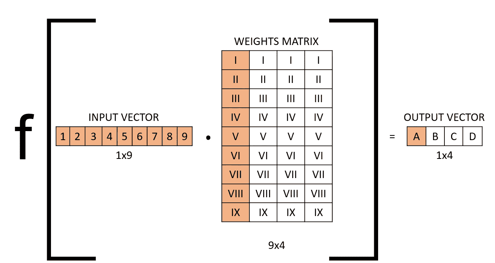

# 卷积层与全连接层

> 原文：<https://towardsdatascience.com/convolutional-layers-vs-fully-connected-layers-364f05ab460b?source=collection_archive---------0----------------------->

## 深度学习基础

## 当您使用卷积层与全连接层时，实际情况是怎样的？

作者图片

一开始，神经网络的设计是一件很难理解的事情。设计神经网络包括选择许多设计特征，如每层的输入和输出大小、何时何地应用批量标准化层、丢弃层、使用什么激活函数等。在本文中，我想讨论全连接层和卷积背后真正发生的事情，以及如何计算卷积层的输出大小。

# 介绍

随着计算能力的提高和模型架构的进步，深度学习是一个在过去几年中飞速发展的研究领域。当阅读深度学习时，你会经常听到两种网络，即全连接神经网络(FCNN)和卷积神经网络(CNN)。这两个是深度学习架构的基础，几乎所有其他深度学习神经网络都源于此。在本文中，我将首先解释全连接层如何工作，然后是卷积层，最后我将通过一个 CNN 的例子。

# 完全连接的层(FC 层)

神经网络是一组相关的非线性函数。每个单独的功能由一个神经元(或感知器)组成。在完全连接的层中，神经元通过权重矩阵对输入向量进行线性变换。然后通过非线性激活函数 *f* 对产品进行非线性变换。

作者图片

这里我们取权重矩阵 W 和输入向量 x 之间的点积，偏差项(W0)可以添加到非线性函数中。我将在本文的其余部分忽略它，因为它不影响输出大小或决策，只是另一个权重。

如果我们以输入大小为 9、输出大小为 4 的 FC 神经网络中的一个层为例，则操作可以如下所示:

作者图片

激活函数 f 在该层的输入和该层的权重矩阵之间包装点积。注意，权重矩阵中的列将具有不同的数字，并且将随着模型的训练而被优化。

输入是 1×9 向量，权重矩阵是 9×4 矩阵。通过取点积并利用激活函数应用非线性变换，我们得到输出向量(1×4)。

人们也可以通过以下方式来可视化该层:

作者图片

上图显示了为什么我们称这种类型的层为“完全连接”或有时称为“密集连接”。所有可能的层到层的连接都存在，这意味着输入向量的每个输入都会影响输出向量的每个输出。然而，并非所有权重都会影响所有输出。看上面每个节点之间的连线。橙色线代表该层的第一个神经元(或感知器)。这个神经元的权重只影响输出 A，对输出 B、C 或 d 没有影响。

# 卷积层(Conv 层)

作者图片

卷积实际上是一种滑动点积，其中内核沿着输入矩阵移动，我们将两者之间的点积视为矢量。下面是上面显示的卷积的矢量形式。您可以看到为什么橙色字段之间的点积会输出一个标量(1x44x 1 = 1x1)。

作者图片

同样，我们可以将这个卷积层想象为:

作者图片

卷积不是密集连接的，不是所有的输入节点都影响所有的输出节点。这使得卷积层在学习中具有更大的灵活性。此外，每层的权重数量要少得多，这对于图像数据等高维输入非常有帮助。这些优势赋予了 CNN 在数据中学习特征的众所周知的特性，例如图像数据中的形状和纹理。

# 与 CNN 合作

在 FC 层中，通过选择权重矩阵中的列数，可以非常简单地指定层的输出大小。对于 Conv 层就不一样了。卷积有许多可以改变的参数，以适应运算的输出大小。

我强烈推荐你查看[这个链接](https://github.com/vdumoulin/conv_arithmetic)到弗朗切斯科对卷积的解释。在这本书里，他解释了卷积的所有变体，比如有和没有填充的卷积、步长、转置卷积等等。这是迄今为止我所见过的最好的，最直观的解释，我仍然经常回头参考它。

## Conv 输出大小

要确定卷积的输出大小，可以应用以下公式:

作者图片

输出大小等于输入大小加上两倍的填充减去步幅上的内核大小加上 1。大多数时候我们处理的是方阵，所以这个数字对于行和列是一样的。如果分数不是整数，我们就向上取整。我建议试着理解这个等式。除以步幅是有意义的，因为当我们跳过操作时，我们是将输出大小除以该数字。两次填充来自于填充被添加到矩阵的两侧，因此被添加两次。

## 转置 Conv 尺寸

根据上面的等式，输出将总是等于或小于输出，除非我们添加大量填充。然而，添加太多填充来增加维度将导致学习中的巨大困难，因为每层的输入将非常稀疏。为了解决这个问题，转置卷积被用来增加输入的大小。示例应用例如在卷积 VAEs 或 GANs 中。

作者图片

上述等式可用于计算转置卷积层的输出大小。

有了这两个方程，你就可以设计一个卷积神经网络了。让我们看看 GAN 的设计，并使用上面的等式来理解它。

# GAN 示例

在这里，我将介绍一个使用卷积层和转置卷积层的生成式对抗网络的架构。你会明白为什么上面的等式如此重要，为什么没有它们你就不能设计 CNN。

我们先来看看鉴别器:

作者图片

鉴别器的输入大小是 3x64x64 图像，输出大小是二进制 1x1 标量。我们大幅降低了维度，因此标准卷积层是这种应用的理想选择。

注意，在每个卷积层之间(PyTorch 中表示为 Conv2d ),指定了激活函数(在本例中为 LeakyReLU ),并应用了批量归一化。

## 鉴别器中的 Conv 层

> nn。Conv2d(nc，ndf，k = 4，s = 2，p = 1，bias=False)

第一卷积层将“ndf”卷积应用于输入的 3 层中的每一层。图像数据通常有 3 层，分别用于红绿蓝(RGB 图像)。我们可以对每一层应用一些卷积来增加维度。

应用的第一个卷积的内核大小为 4，跨距为 2，填充为 1。将此代入等式得出:

作者图片

因此输出是一个 32x32 的图像，正如代码中提到的。您可以看到，我们已经将输入的大小减半。接下来的 3 层是相同的，这意味着每层的输出大小是 16x16，然后是 8x8，然后是 4x4。最终层使用的内核大小为 4，步幅为 1，填充为 0。代入公式，我们得到 1×1 的输出大小。

## 发生器中的转置 Conv 层

> nn。ConvTranspose2d( nz，ngf * 8，4，1，0，bias=False)

作者图片

让我们看看发生器中的第一层。发生器有一个 1x1x100 矢量(1xnz)的输入，想要的输出是 3x64x64。我们正在增加维度，所以我们想使用转置卷积。

第一个卷积使用的内核大小为 4，步长为 1，填充为 0。让我们把它代入转置卷积方程:

作者图片

如代码所示，转置卷积的输出大小为 4x4。接下来的 4 个卷积层是相同的，核大小为 4，步长为 2，填充为 1。这使每个输入的大小加倍。于是 4x4 转 8x8，然后 16x16，32x32，最后 64x64。

# 结论

在本文中，我解释了全连接层和卷积层是如何计算的。我还解释了如何计算卷积和转置卷积层的输出大小。不了解这些，就无法设计自己的 CNN。

## 支持我👏

希望这对你有所帮助，如果你喜欢，你可以 [**关注我！**](https://medium.com/@diegounzuetaruedas)

你也可以成为 [**中级会员**](https://diegounzuetaruedas.medium.com/membership) 使用我的推荐链接，获得我所有的文章和更多:[https://diegounzuetaruedas.medium.com/membership](https://diegounzuetaruedas.medium.com/membership)

# 你可能喜欢的其他文章

[可微发电机网络:简介](/differentiable-generator-networks-an-introduction-5a9650a24823)

[傅立叶变换:直观的可视化](/fourier-transforms-an-intuitive-visualisation-ba186c7380ee)