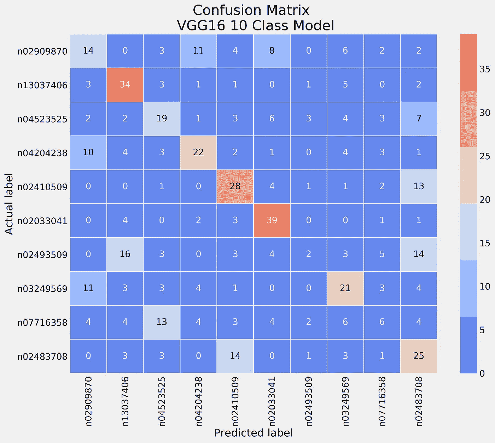

# 卷积神经网络冠军第 3 部分:VGGNet (TensorFlow 2.x)

> 原文：<https://towardsdatascience.com/convolutional-neural-network-champions-part-3-vggnet-tensorflow-2-x-ddad77492d96?source=collection_archive---------56----------------------->

## 这是关于最流行的卷积神经网络(CNN)架构的多部分系列的第 3 部分，包含可复制的 Python 笔记本

卷积神经网络是一种特殊类型的神经网络，用于对具有强空间相关性的数据进行建模，例如图像、多元时间序列、地球科学研究(地震分类和回归)以及许多其他应用。自 1998 年以来，卷积网络经历了重大变化，在这一系列文章中，我的目标是再现著名的模型架构冠军，如 LeNet、AlexNet、ResNet 等。我的目标是与更广泛的受众分享我的发现和研究，并提供可复制的 Python 笔记本。

里卡多·弗兰茨在 [Unsplash](https://unsplash.com/?utm_source=unsplash&utm_medium=referral&utm_content=creditCopyText) 上的照片

**第一部分:**tensor flow 中的 Lenet-5 和 MNIST 分类:

</convolutional-neural-network-champions-part-1-lenet-5-7a8d6eb98df6>  

**第二部分:**ImageNet 和 Tensorflow 上的 AlexNet 分类:

</convolutional-neural-network-champions-part-2-alexnet-tensorflow-2-x-de7e0076f3ff>  

> *本研究的 Python 笔记本位于我的 Github 页面:* [***链接***](https://github.com/anejad/Convolutional-Neural-Network-Champions/blob/master/VGGnet/VGG.ipynb)

在本系列的前几部分中，我们回顾了 LeNet-5 和 [**AlexNet**](/convolutional-neural-network-champions-part-2-alexnet-tensorflow-2-x-de7e0076f3ff) 型号。这些部分讨论了一些基本概念，如 conv 层、池层和激活函数。如果读者对这些概念不熟悉，我强烈建议在阅读本文之前先回顾一下。

在这篇文章中，我将讨论卷积神经网络架构的下一个主要发展，称为 **VGGnet** 。Simonyan 等人[2014]首先在 ILSVRC (ImageNet 大规模视觉识别挑战赛)上发表了来自牛津大学工程科学系视觉几何小组(VGG)的两个神经网络架构的结果，在这次比赛中获得了第一名和第二名。完井中输入的两个 VGGnets 具有 16 和 19 个隐藏层。VGGnet 结构与 AlexNet 结构相比没有多少优势:

*   网络深度:根据 VGG 小组的实验，深度越大，性能越好。
*   更小的滤波器尺寸:前身神经网络 ZfNet 提出，更小的滤波器尺寸可以提高 CNN 的性能。因此，VGG 用 3×3 的滤镜取代了 11×11 和 5×5 的滤镜。减小核的大小导致了参数的减少和计算复杂度的降低。

VGG 集团提出的六个模型有 11 到 19 个不同的层，最著名的 16 和 19 层模型(VGG16，VGG19)实现了卓越的性能。下图总结了这两种模型的体系结构。两个模型之间的唯一区别是在区块 3、4 和 5 中增加了三个 conv 层。他们有 1.38 亿和 1.43 亿个可训练参数，而 AlexNet 有 6200 万个可训练参数。在每个块中堆叠 conv 图层有助于模型从输入数据中提取多个高级特征。

使用 Tensorflow 的 VGG16、VGG19 模型架构

批量大小设置为 256，动量设置为 0.9。学习率最初设置为 0.01，然后当验证
设置精度停止提高时，学习率降低 10 倍。然后使用 SGD 优化器对该模型进行 74 个时期的训练。网络最初使用具有随机权重的较浅网络进行预训练。然后，使用浅预训练网络的权重来初始化每个深网络的权重(这稍后被 Glorot 初始化算法所取代)。

# Tensorflow 中的列车 VGG16

下面的示例演示了如何在 Tensorflow 中对 VGG16 模型进行定型。因为训练深度学习模型的计算量很大，所以我演示了如何使用本地资源和仅 10 个 ImageNet 类来训练模型。`VGG`函数在 Tensorflow 中建立模型。很容易看到该模型有三个主要组件`Conv2D`、`MaxPooling2D`和`Dense`层堆叠在一起以实现高性能。有关在 Tensorflow 中构建模型的更多细节，请参考本系列的前两节。

在 Tensorflow 2.x 中构建 VGG 模型的代码片段

在这个例子中，我只训练了 40 个时期的模型(与 VGGnet 开发人员提到的 74 个时期相反)。模型的学习曲线可以在下图中看到。对于前 20 个时期，模型似乎在学习特征，因此损失减少，准确性增加。在第 20 个时期之后，模型过度适应训练数据，并且在验证集上的性能在将来不能被提高。这种现象可以通过 Tensorflow 中的`EarlyStopping`回调函数来缓解(更多信息[在此](https://www.tensorflow.org/api_docs/python/tf/keras/callbacks/EarlyStopping))，该函数试图监控验证损失，如果损失函数没有进一步改善，则停止训练过程。

在 10 个 ImageNet 课程上培训的 VGG16 的学习率

# 评估结果

评估模型最简单的方法是在 Tensorflow 中使用`model.evaluate`提示符。从下图可以看出，该模型在测试集上的性能为 42%。

模型损失和准确性

模型精度并没有给我们关于每个类的模型性能的详细信息。评估分类性能的最常用方法之一是使用所谓的混淆矩阵。混淆矩阵是一个简单的计数矩阵，它展示了每个标签的实例是如何分类的。该矩阵的对角线代表正确分类的实例，而非对角线的实例表明错误分类。

下图演示了 VGG16 10 类的混淆矩阵示例。每个类包含 50 幅图像。可以看出，经过训练的模型在两个类别上具有良好的准确性，而在另外两个类别上具有非常低的准确性。模型精度是正确预测的样本占样本总数的比例。

10 类模型的混淆矩阵

VGG16 -10 级模型精度

从下面的图片可以看出，准确率最低的两个类属于两种不同类型的猴子。两个猴子类的误差最高。分类错误率高的其他类别是桶和篮子。值得注意的是，与原始的 VGGnet 在 1000 个类上训练相比，该模型只看到了 10 个类，因此我们训练的模型的准确性要低得多。

错误分类的图像示例(在 ImageNet 2014 之后修改)

# 超越 VGGnet

VGG 模型在研究界非常受欢迎，因为它的方法简单，而且预先训练的权重可以在网上免费获得，便于在新任务中对这个强大的模型进行微调。VGG 展示了简单和准确。然而，VGG 模式有几个缺点:

*   训练很慢。模型培训在配备了四个 NVIDIA Titan 黑色 GPU 的系统上进行，为期 2-3 周
*   VGG 模型拥有超过 1.36 亿个参数，是最大的 CNN 模型架构之一。因此，VGG-16 训练的 imageNet 权重大小的模型是 *528* MB。因此，它需要相当多的磁盘空间和带宽，使其效率低下。
*   VGGnet 模型的内存使用率在模型开发期间非常高。VGG16 需要至少 1gb 的内存，更多信息[ [链接](https://cs231n.github.io/convolutional-networks/)。

VGG 在 ImagNet 数据集上展示了良好的精度性能，但是，所有上述限制导致了不同模型结构的发明，如 ResNet，这将在本系列的下一部分中讨论。

> *感谢阅读！我叫* ***阿米尔·内贾德，博士。*** *我是一名数据科学家，也是*[***QuantJam***](https://medium.com/quantjam)*的编辑，我喜欢分享我的想法，并与其他数据科学家合作。可以在*[***Github***](https://github.com/anejad)*[***Twitter***](https://twitter.com/Dr_Nejad)***和*[***LinkedIn***](https://www.linkedin.com/in/amir-nejad-phd-8690a44b/)*上和我联系。****

**你可以在以下网址看到我的其他作品:**

**<http://amirnejad.medium.com/> ** 

# **参考**

*   **西蒙扬，凯伦和安德鲁·齐泽曼。“用于大规模图像识别的非常深的卷积网络。”arXiv 预印本 arXiv:1409.1556 (2014)。**
*   **Russakovsky，Olga 等人*“Imagenet 大规模视觉识别挑战。”国际计算机视觉杂志 115.3(2015):211–252。***
*   ***卷积神经网络硬件加速器的内存需求。2018 IEEE 工作负载表征国际研讨会(IISWC)。IEEE，2018。***

****所有图片均由作者制作，除非另有说明。****