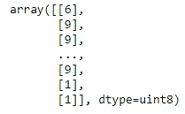
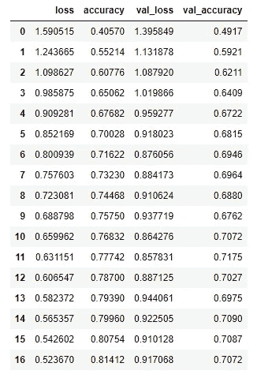

# 卷积神经网络:对层的良好理解和图像分类示例

> 原文：<https://towardsdatascience.com/convolutional-neural-network-good-understanding-of-the-layers-and-an-image-classification-example-a280bc02c13e?source=collection_archive---------12----------------------->


艾莉娜·格鲁布尼亚克在 [Unsplash](https://unsplash.com?utm_source=medium&utm_medium=referral) 上的照片

## 包含了大量的信息

卷积神经网络(CNN)是一种多层神经网络，已知能够检测模式和复杂特征。它在人脸检测、自动驾驶汽车和许多非常复杂的任务中非常有用。在本文中，我将向您介绍卷积神经网络是如何工作的。

本文将涵盖:

1.  卷积层如何在正向过程中工作。
2.  池层如何工作。
3.  用于图像分类项目的卷积神经网络的完整模型结构。
4.  模型总结分析。
5.  训练模型并显示结果。

# CNN 是如何运作的？

CNN 可以用于很多不同的领域，但是在这篇文章中，我们将讨论图像分类的例子。图像数据可以表示为数字像素值。然后这些数值被传入 CNN 进行处理。普通的神经网络也能够检测图像，但 CNN 在准确性和速度方面更有效。

## 卷积层

卷积层是 CNN 中非常重要的层，因为这是它成为卷积神经网络的原因。在这一层中，使用过滤器或内核来检测重要的特征。目的是使数据集更小，并且只将重要的要素发送到下一个图层。这样节省了密集层的大量计算，也保证了较高的精度。让我们来看一张图。


作者图片

上图是深度 3 的输入数据，一个深度和偏置项相同的核。

## 这个内核如何过滤输入数据？

接下来的几张图片将一步步展示这一点。


作者图片

计算是这样进行的:


作者图片

让我们把剩下的三个输出填满。下面是如何移动过滤器或内核来计算 y12。


作者图片

我没有展示计算部分。这是相同的项目-明智的乘法，然后求和，如前所示。下图显示了 y21 的内核位置和偏差:


作者图片

最后，y22 计算的内核和偏差:


作者图片

在上图中，只使用了一个内核。但是在真实模型中，可以使用几个内核。在这种情况下，相同大小的输出会更多。我在这里使用的填充类型称为“有效”。这意味着我实际上没有使用任何填充。还有另外两种主要类型，称为“全”和“相同”。我不打算在本文中讨论这些。但是在练习部分，我会用‘有效’。在 high label 思想中，填充“相同”意味着在输入数据的所有边上添加一个零层，然后在其上使用内核。

## 汇集层

汇集层减少了数据的维数，并且还检测特征，而不管特征在图像中的位置如何。下面是一个 MaxPooling2D 如何工作的例子。


作者图片

上图展示了 MaxPooling 的工作原理。紫色方框的最大值是 15，所以只需要 15。绿框最多 19 个，所以只剩 19 个了。另外两个盒子也是如此。还有其他类型的池，如平均池或最小池。这个名字表明了它们是如何工作的。在平均池中，我们取每个盒子的平均值，在最小池中，我们取每个盒子的最小值。

这些是理解本文练习的重要思想。

# 卷积神经网络练习

在这个练习中，我将使用 TensorFlow 库自带的免费“cifar”数据集。该数据集包括对象图像的像素值，标签包括数字。每个对象由一个数字表示。我们将首先训练网络，并使用测试数据集检查准确性。数据集已经由训练集和测试集分隔。我正在加载数据:

```
import tensorflow as tf
(X_train, y_train), (X_test, y_test) = tf.keras.datasets.cifar10.load_data()
```

数据集包含以下类:

```
'airplane', 'automobile', 'bird', 'cat', 'deer',   'dog', 'frog', 'horse', 'ship', 'truck'
```

每一类都用一个数字来表示。

如果打印 y_train 数据，它看起来像这样:



从训练集中检查一个图像:

```
import matplotlib.pyplot as plt
image=X_train[3]
plt.imshow(image)
plt.show()
```

输出:


作者图片

缩放输入数据总是好的。因为我们有像素值，我会把它们除以 255。

```
X_train = X_train/255
X_test = X_test/255
```

让我们检查一下训练输入的形状:

```
X_train.shape
```

输出:

```
(50000, 32, 32, 3)
```

**从这个形状我们知道什么？**

我们有 50000 个训练数据。输入大小为 32x32，深度为 3。这意味着图像是彩色图像。我们有 RGB 值。

## CNN 结构

对于这个项目，我将使用 3x3 的内核大小，我将在第一个卷积层使用 32 个输出窗口。下面是它的样子:


作者图片

在之前的演示中，为了简单起见，我只解释了一个内核。但是您可以根据需要使用任意数量的内核。在这个练习中，我将使用 32 个内核。

**为了澄清，上图显示的是 3x3 和深度 3 的输入数据。我们的数据也有三个深度，正如您从 X-train 形状中看到的。但是尺寸是 32x32 而不是这张图所示的 3x3。**

> 图中所有的内核都是 2x2。但是我会用 3x3 内核。你可以试试其他尺寸的。事实上，核不一定是正方形的。它们可以是 4x2 或任何其他矩形形状。

但是内核肯定不能比输入形状大。在此示例中，输入形状为 32x32。所以，内核不能比这个大。

此外，当我们使用一个内核时，我们有一个输出窗口。因为我在这里使用了 32 个内核，所以我将有 32 个输出窗口。

卷积层之后，会有一个 MaxPooling 层。我用了一个 2x2 的过滤器。此外，步幅为 2 意味着将有 2 个步骤。可以尝试不同的步幅。

我将有另外两个卷积和最大池层。然后会有一个'扁平化'层。它确实如其名。它会将三维数据展平为一维列。因为之后我们会把这个一维数据传到致密层。我假设你知道常规神经网络。密集层采用一维数据。对于这个项目，将有三个密集层。最终，输出层。

输出层将使用“softmax”激活。所有其他层将使用“relu”激活功能。

模型如下:

```
model = tf.keras.Sequential([
    tf.keras.layers.Conv2D(32, (3, 3), padding="valid",
                          activation="relu", input_shape=(32, 32, 3)),
    tf.keras.layers.MaxPooling2D((2, 2), strides=2),

    tf.keras.layers.Conv2D(48, (3, 3), padding="valid", activation="relu"),
    tf.keras.layers.MaxPooling2D((2, 2), strides=2),

    tf.keras.layers.Conv2D(48, (3, 3), padding="valid", activation="relu"),
    tf.keras.layers.MaxPooling2D((2, 2), strides=2),

    tf.keras.layers.Flatten(),
    tf.keras.layers.Dense(100, activation="relu"),
    tf.keras.layers.Dense(100, activation="relu"),
    tf.keras.layers.Dense(100, activation="relu"),
    tf.keras.layers.Dense(10, activation="softmax")]
)
```

以下是该模型的总结:

```
model.summary()
```

输出:

```
Model: "sequential_25"
_________________________________________________________________
Layer (type)                 Output Shape              Param #   
=================================================================
conv2d_81 (Conv2D)           (None, 30, 30, 32)        896       
_________________________________________________________________
max_pooling2d_79 (MaxPooling (None, 15, 15, 32)        0         
_________________________________________________________________
conv2d_82 (Conv2D)           (None, 13, 13, 48)        13872     
_________________________________________________________________
max_pooling2d_80 (MaxPooling (None, 6, 6, 48)          0         
_________________________________________________________________
conv2d_83 (Conv2D)           (None, 4, 4, 48)          20784     
_________________________________________________________________
max_pooling2d_81 (MaxPooling (None, 2, 2, 48)          0         
_________________________________________________________________
flatten_27 (Flatten)         (None, 192)               0         
_________________________________________________________________
dense_98 (Dense)             (None, 100)               19300     
_________________________________________________________________
dense_99 (Dense)             (None, 100)               10100     
_________________________________________________________________
dense_100 (Dense)            (None, 100)               10100     
_________________________________________________________________
dense_101 (Dense)            (None, 10)                1010      
=================================================================
Total params: 76,062
Trainable params: 76,062
Non-trainable params: 0
_________________________________________________________________
```

让我们试着理解这个总结。为了便于理解，我将讨论一个卷积层和一个 MaxPooling 层。第一个卷积层输出后的形状是(无，30，30，32)。

让我们来理解一下 30，30 和 32。这里最后一个元素是 32。这很容易理解。因为我们使用了 32 个内核，所以预期有 32 个输出窗口。

**这是什么 30，30？**因为我们使用了“有效”的填充，所以输出形状应该是:

输入大小—内核大小+ 1

这里输入大小为 32，内核大小为 3，因此，

32–3+1 = 30

> 此公式仅用于“有效”的填充。如果你使用“相同”或“完整”的填充，公式是不同的。

下一个元素是 MaxPooling 层。第一个 MaxPooling 层的输出形状是(无，15，15，32)。如前所述，32 来自 32 个内核。因为我们在 MaxPooling 层中使用了 2x2 过滤器，所以数据在两边都变成了一半。所以，卷积层的 30，30 变成了 15，15。

在我开始训练模特之前。我想用一个提前停止的条件。

## 什么是提前停止？

假设，我将我的模型训练设置为 100 个时期，但是我的模型不需要 100 个时期。可能它在 50 个纪元后收敛。在这种情况下，如果我让它运行 100 个纪元，就会导致过度拟合。我们可以用我们选择的耐心值来设置提前停止条件。我将在这里使用耐心值 5。这意味着，如果模型损失在 5 个时期内没有足够的变化，则模型将停止训练，即使它仅运行 30 个时期或 50 个时期。

```
from tensorflow.keras.callbacks import EarlyStopping
callbacks=[EarlyStopping(patience=5)]
```

## 训练模型

首先，我们需要编译，然后开始训练:

```
model.compile(optimizer="adam", 
             loss=tf.keras.losses.SparseCategoricalCrossentropy(),
             metrics=['accuracy'])
history = model.fit(X_train, y_train, epochs = 50, 
                    validation_data=(X_test, y_test), callbacks=callbacks)
```

我设定了 50 个纪元的模型。但是它在 17 个周期后停止，因为提前停止条件节省了大量时间。

以下是结果摘要:

```
met_df1 = pd.DataFrame(history.history)
met_df1
```

输出:



作者图片

这是每个历元的训练准确度和验证准确度的曲线图:

```
met_df1[["accuracy", "val_accuracy"]].plot()
plt.xlabel("Epochs")
plt.ylabel("Accuracy")
plt.title("Accuracies per Epoch")
plt.show()
```


作者图片

从上面的图中可以看出，训练精度一直在上升，但验证精度在几个时期后几乎稳定下来。

## 模型改进

在这篇文章解释的思想范围内，你可以尝试很多事情。如果你想尝试一下，这里有一些想法给你:

1.  改变内核形状。您可以尝试 2x2、4x4、2x4、3x2 或您选择的任何其他形状。
2.  请随意尝试使用“相同”或“完整”作为填充值，而不是“有效”。
3.  更改内核数量，并使用不同的数字，如 48、64、56 或任何其他数字，而不是 32、48 和 48。
4.  添加或移除卷积层。
5.  尝试用平均池代替最大池。
6.  添加或删除密集层，并改变神经元的数量。
7.  尝试其他激活功能，如 tanh、elu 或 leakyRelu。

我敢肯定，如果你足够努力，你可能会得到比我在这里显示的结果更好的验证准确性。

# 结论

我试图让卷积神经网络的想法，它如何在幕后工作。尽管如果你不得不从头开始实现它，会涉及到更多的数学问题。尤其是参数更新。但幸运的是我们有张量流。这为我们更新了参数，我们不需要对所有的元素做偏导数。请随意尝试我上面建议的一些不同的模型架构，如果你觉得有趣，请分享你的发现！

欢迎随时关注我的推特(Twitter)和我的新 T2 YouTube 频道(T3)。

## 更多阅读

[](/an-ultimate-guide-to-time-series-analysis-in-pandas-d511b8e80e81) [## 熊猫时间序列分析终极指南

### 在 Pandas 中执行时间序列分析所需的所有 Pandas 功能。您也可以将此用作备忘单。

towardsdatascience.com](/an-ultimate-guide-to-time-series-analysis-in-pandas-d511b8e80e81) [](/a-complete-anomaly-detection-algorithm-from-scratch-in-python-step-by-step-guide-4c115e65d54e) [## Python 中从头开始的完整异常检测算法:分步指南

### 基于概率的异常检测算法

towardsdatascience.com](/a-complete-anomaly-detection-algorithm-from-scratch-in-python-step-by-step-guide-4c115e65d54e) [](https://pub.towardsai.net/text-data-visualization-with-wordcloud-of-any-shape-in-python-8cec334e5c4f) [## 用 Python 中任意形状的 WordCloud 实现文本数据可视化

### 学习生成任何形状的单词云

pub.towardsai.net](https://pub.towardsai.net/text-data-visualization-with-wordcloud-of-any-shape-in-python-8cec334e5c4f) [](/detailed-guide-to-multiple-linear-regression-model-assessment-and-inference-in-r-e9b183b1441) [## 多元线性回归模型、评估和推理的详细指南

### 模型开发、解释、方差计算、f 检验和 t 检验

towardsdatascience.com](/detailed-guide-to-multiple-linear-regression-model-assessment-and-inference-in-r-e9b183b1441)