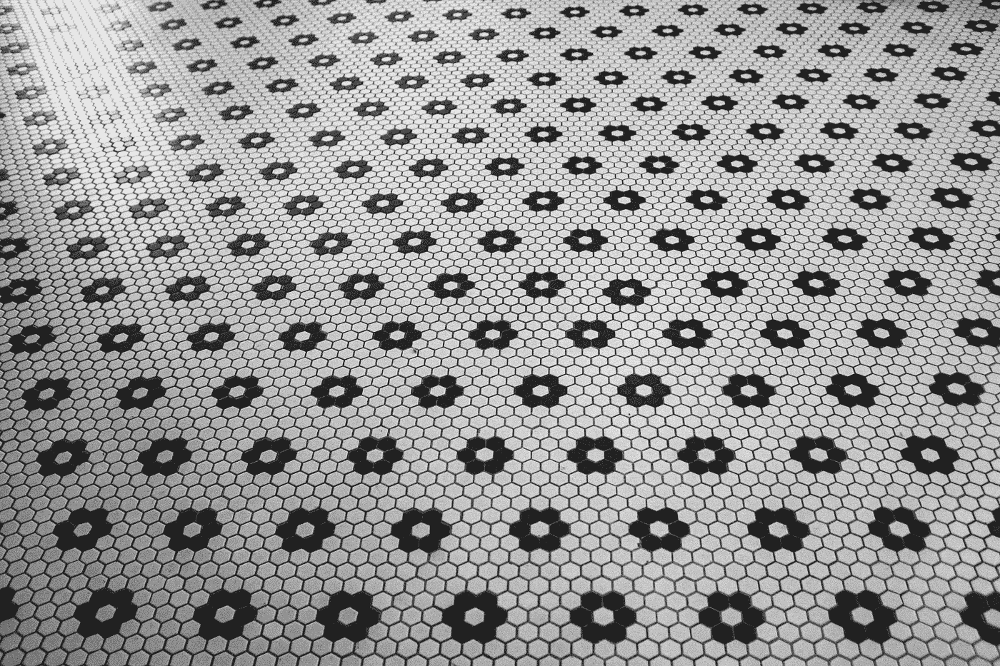
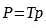
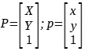
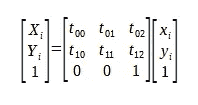
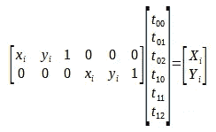
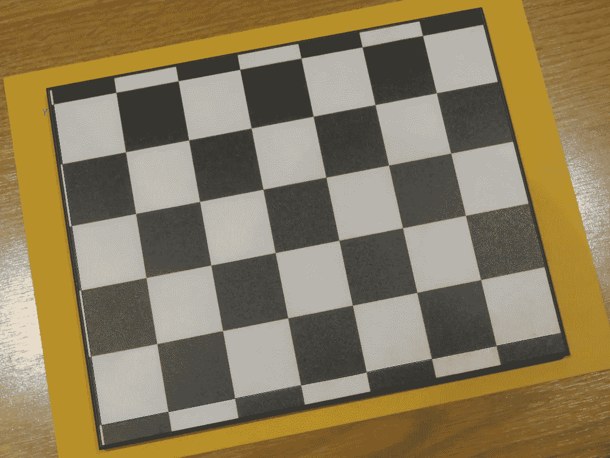
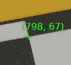
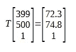
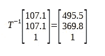
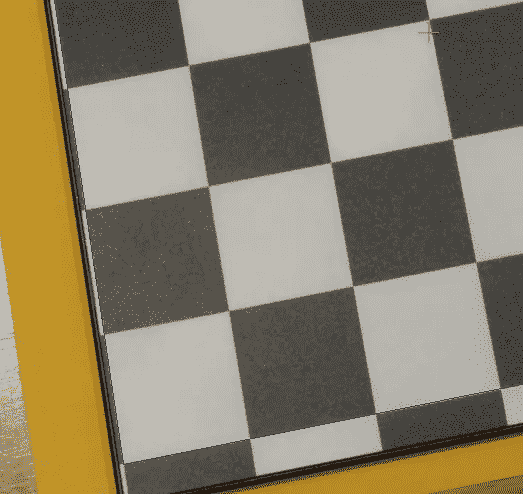

# 平面场景的坐标

> 原文：<https://towardsdatascience.com/coordinates-of-a-flat-scene-b37487df63ca?source=collection_archive---------18----------------------->

## 从像素转换到毫米，反之亦然

你有没有想过生活在平原会是什么样子？我不知道你怎么想，但是我不想把宇宙降级到二维。我对 3D 空间提供的可能性感到满意，比如在我的鞋带上打结和其他拓扑满足感。

当编码自动化检查时，通常不得不冒险进入平原。例如，您可以考虑一个检测系统，其中零件在传送带上移动，摄像机从顶部捕捉图像。在这个场景中，感兴趣的对象被限制在传送带平面上，因此场景本质上是二维的。另一个例子是待检查的物体具有平坦表面的情况。可能希望在图像中定位这些表面，以检查缺陷的存在或验证某些特征是否存在。

在由单个相机拍摄的 3D 场景的一般情况下，场景中的点的 3D 坐标和图像中的 2D 坐标之间没有一对一的关系。多个 3D 点将被投影到给定的图像点。你可以通过想象你正在通过一系列多个透明的窗口拍照来想象这一点。如果每个窗户上都有一只苍蝇，而且每只苍蝇都对准相机的焦点，那么你只能看到一只苍蝇。最近的一个会遮挡其他的，因为苍蝇占据的所有 3D 点都被投影到同一个像素。换句话说，场景中的 3D 坐标和图像中的 2D 坐标之间存在多对一的关系。

图片由 [Fl](https://unsplash.com/@fraconca) á [维奥康卡](https://unsplash.com/@fraconca)发自 [Unsplash](https://unsplash.com/photos/IcOz5cCQooI)

在单个平面中具有有趣特征的情况下，情况是不同的。您可以记下感兴趣的平面(位于 3D 世界中)和图像平面(坐标以像素为单位)之间的线性关系。在这种特殊情况下，感兴趣平面上的点的 2D 坐标(去掉 Z 坐标，我们将它任意设置为 0)和图像中的 2D 坐标之间存在一一对应关系:这是一个[单应](https://en.wikipedia.org/wiki/Homography_(computer_vision))。让我们考虑相机图像平面和 3D 场景中感兴趣的平面之间的映射。

图片来自 [Unsplash](https://unsplash.com/photos/0tj3kW1DmY8)

> 一个同性恋？听起来很棒。现在，如何计算呢？

关键是在平面上具有已知坐标(通常以毫米为单位)的点与它们在图像中的坐标(以像素为单位)之间有对应关系。我们知道，用一个[型号](https://en.wikipedia.org/wiki/Pinhole_camera_model)的针孔摄像机，这些对应点以线性关系联系在一起。

*T* 是从像素到毫米的 3x3 变换矩阵。(X，Y)是约束到感兴趣平面的点的 2D 坐标(参考轴在该平面内)，而(X，Y)是其对应的像素坐标。

> 为什么我们要添加第三个总是设置为 1 的虚拟坐标呢？

该变换是缩放、剪切、旋转和平移的组合。这些操作可以用 2×2 矩阵和一个附加的 2×1 矢量来表示。通过引入虚拟第三坐标(即*齐次*表示)，我们可以用一个 3×3 矩阵封装复合转换。

> 这是一个紧凑的问题。

**我们的目标将是计算变换矩阵 *T* ，**，这将允许我们从图像中的相应坐标获得场景中点的坐标。让我们显式地写出转换方程，对于给定的对应关系( *X* ᵢ *，Y* ᵢ *，x* ᵢ *，y* ᵢ):

将方程重组为 *Az = b* 的形式后，其中 *z* 包含我们的未知数{t₀₀，… t₁₂}:

我们看到，每封信都为我们提供了两个 6 个未知数的线性方程。为了解这个线性方程组，我们需要至少三个对应，以得到最少 6 个线性独立的方程。在实践中，我们将尝试获得三个以上的对应，并用最小二乘法求解超定系统。

下面的代码和图片可以在这个 [github 库](https://github.com/sebastiengilbert73/tutorial_homography)中找到。

图像*checkerboard.png*显示的是一个平面。X 和 Y 轴用蓝线标注。

作者 checkerboard.png

对物理对象的测量允许我们将 2D 坐标(以毫米为单位)与其对应的坐标(以像素为单位)进行映射。

将(798，67)手动识别为真实世界坐标(214.2 毫米，178.5 毫米)的对应关系

有了四个这样的对应(彼此尽可能远)，超定方程组可以用 numpy 函数[**numpy . linalg . lstsq()**](https://numpy.org/doc/stable/reference/generated/numpy.linalg.lstsq.html)来求解

有了{t₀₀，… t₁₂}矩阵条目(在上面的代码片段中用向量 *z* 表示)，我们就有了我们的变换矩阵 *T* 。有了它，我们可以得到一个点的毫米坐标，我们有像素坐标。例如，将像素坐标(399，500)与 T:

预测值(72.3 毫米，74.8 毫米)与测量坐标(71.4 毫米，71.5 毫米)的误差在 4 毫米以内。4 mm)。相反，通过反转 T，我们可以得到一个点的像素坐标，我们有毫米坐标。例如，点(107.1 毫米，107.1 毫米)位于原点右侧三个方格处。

逆变换预测其舍入后的像素坐标应为(496，370):

绿色十字表示预测位置(107.1 毫米，107.1 毫米)。它落在离实际位置几毫米的地方(向右三格，原点向上三格)

正如我们所见，预测很接近，但不准确。这可能是因为我们假设了一个简单的针孔摄像机模型。为了超越针孔照相机模型，我们的成像系统的校准将需要考虑任何非线性失真。

我们已经介绍了构建变换矩阵的步骤，当我们处理平面场景时，变换矩阵给出了像素坐标和毫米坐标之间的线性关系。这是一项基本的计算机视觉操作，需要在自动化检测中经常执行。在实践中，待检查的零件可能具有一些易于定位的基准标记或独特特征。平面上特征的已知 2D 位置(以毫米为单位)及其检测到的图像位置(以像素为单位)将构成一组对应关系，用于计算变换矩阵 *T* 。然后，已知真实世界坐标的平面上的任何物体都可以在图像中定位，即使这个物体很难检测到，甚至不存在。

请随意试验[代码](https://github.com/sebastiengilbert73/tutorial_homography)，并且[让我知道](https://www.linkedin.com/in/s%C3%A9bastien-gilbert-69735219/)您认为
可能适用的用例。

假设感兴趣的平面不通过照相机的焦点

针孔相机模型忽略了镜头失真和失焦模糊。它是真实相机的一阶近似。