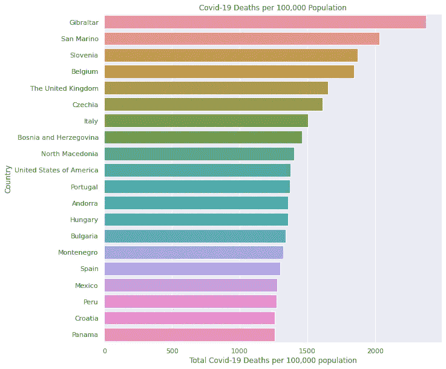
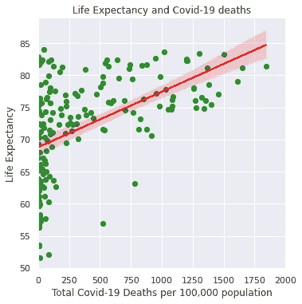

# 冠状病毒相关性

> 原文：<https://towardsdatascience.com/coronavirus-correlations-5f49e5bb9710?source=collection_archive---------30----------------------->

## 探索新冠肺炎国家死亡率与各种社会经济指标之间的相关性。

冠状病毒(新冠肺炎)扰乱了现代世界，这在近代史上是前所未有的。这种病毒的影响只能与二十世纪世界大战造成的破坏相提并论。这种感染已经肆虐地球一年多了，但是关于这种疾病的起源、传播和严重性的许多问题仍然没有答案。持续激烈辩论的一个关键问题是“为什么病毒对一些国家的影响比其他国家更大？”。这篇文章的目的是用数据来说明答案可能非常复杂和令人费解。

下图显示了受疫情影响最严重的 20 个国家。在 x 轴上，我们绘制了一个国家的“每 10 万人口累计死亡人数”(CDP)。这一数字已相对于人口进行了标准化，并取自世界卫生组织(世卫组织)的官方网站，用于冠状病毒更新[1]。CDP 的全球平均值为 30.79。然而，从下文可以清楚地看出，许多国家的情况比这糟糕得多。令人惊讶的事实是，这些受影响严重的国家大多来自拥有良好卫生保健设施的高收入国家，如比利时(第 4 位)、英国(第 5 位)和美国(第 10 位)。即使在这些国家中，趋势也不一致。英国、意大利、西班牙和法国的 CDP 分别为 1651、1505、1300 和 1200，而邻国德国的 CDP 为 734，几乎低了一半。

作者图片

为了进一步分析，使用 python 的**WB Data**API[2，3]，从世界银行的开放数据存储库中提取了关于各种社会经济指标的数据。目的是找出 CDP 和这些指标之间的相关系数。我们在这项研究中同时使用了 Spearman 和 Pearson 系数，因为数据中有异常值，并且不能假定变量和 CDP 之间存在线性关系。一般来说，皮尔逊系数(P)略低于斯皮尔曼系数(S)。让我们先来看看 2019 年一个国家的 CDP 与其使用购买力平价(GDPP)的人均 GDP 的相关性[4]。下面的散点图显示了两个变量之间的关系。CDP 与 GDPP 呈正相关(S=0.54，P=0.36)。与直觉相反的是，数据显示，与较贫穷国家相比，较富裕国家的人均新冠肺炎死亡率更高。

作者图片

世界银行的“营商便利度”(EDB)排名是一个相对较新的综合指标，它考虑了一个国家的各种经济因素。在 EDB，高职位代表着一个运转良好的监管和法律体系，拥有高效的公共官僚机构[5]。该指数排名最高的国家是发达的高收入国家，如新西兰(第 1)、新加坡(第 2)、美国(第 6)和英国(第 8)等。同样矛盾的是，EDB 的国家排名与 CDP 显著负相关(S=-0.45 和 P=-0.44)。EDB 排名靠前的国家在新冠肺炎相关死亡人数方面表现更差。这里需要强调的是，这些相关性并不表明新冠肺炎相关死亡与国家财富之间存在因果关系。但数据分析确实提出了一些附带问题，即来自中低收入国家的新冠肺炎报告数据的可靠性问题。这也暗示了可能影响感染严重程度的更深层的社会经济因素的存在。

一个非常重要的因素是人口统计学和新冠肺炎相关死亡之间的联系。研究已经表明，这种病毒对老年人更加危险。一个国家的预期寿命与 CDP 的相关性相当高且显著(S=0.57，P=0.50)[6]。下图显示了这种关系。CDP 与人口增长的相关性也很高且为负(S=-0.52，P=-0.48)[7]。人口增长率较高的县比人口增长率较低的国家要好得多。较高的城市人口占总人口的百分比也与 CDP 有很强的正相关性，表明生活在城市的人受到疾病的不利影响更大(S=0.48，P=0.40)[8]。该数据表明，新冠肺炎相关死亡与人口统计学之间有很强的联系，这方面应该是严格研究的主题。

作者图片

总之，我们试图强调一些与新冠肺炎人口标准化死亡率统计相关的社会经济指标。人口统计学就是这样一个重要因素。还有一些违反直觉的观察结果，对中低收入国家报告的新冠肺炎数据的准确性提出了质疑，需要进行调查。在此必须指出，这一分析绝非详尽无遗。在未来的研究中，肯定还有其他指标需要考虑，事实上，这些数据确实支持这些隐藏变量的存在。数据是用来分析的，愿力量与数据探索者同在！

注:使用了社会经济指标的最新数据，有些指标的数据是几年前的。
此分析的代码可在以下网址公开使用:
[https://github . com/janjuatest/Public-Sector/blob/main/corona . ipynb](https://github.com/janjuatest/Public-Sector/blob/main/Corona.ipynb)

参考文献和脚注:

1.  https://covid19.who.int/table
    世卫组织冠状病毒病(新冠肺炎)仪表板，数据检索于 2021 年 2 月 8 日。
2.  世界银行公开数据，
    [https://data.worldbank.org/](https://data.worldbank.org/)
3.  世界银行数据 Api，
    [https://Data help desk . world Bank . org/knowledge base/topics/125589](https://datahelpdesk.worldbank.org/knowledgebase/topics/125589)
4.  世界银行按购买力平价计算的人均国内生产总值指标 ID 为 NY。GDP.PCAP.PP.CD
    这种相关性是用 168 个国家的数据计算出来的。
5.  [https://www.doingbusiness.org/en/rankings](https://www.doingbusiness.org/en/rankings)
    世界银行 EDB 指标 ID 为 IC。这种相关性是用 174 个国家的数据计算出来的。
6.  世界银行关于一个国家预期寿命的指标 ID 是 SP。在
    中，相关性是用 181 个国家的数据计算出来的。
7.  世界银行指标 ID 人口增长率为 SP。这种相关性是根据 186 个国家的数据计算出来的。
8.  世界银行城市人口占总人口百分比的指标 ID 为 SP。这种相关性是根据 185 个国家的数据计算出来的。