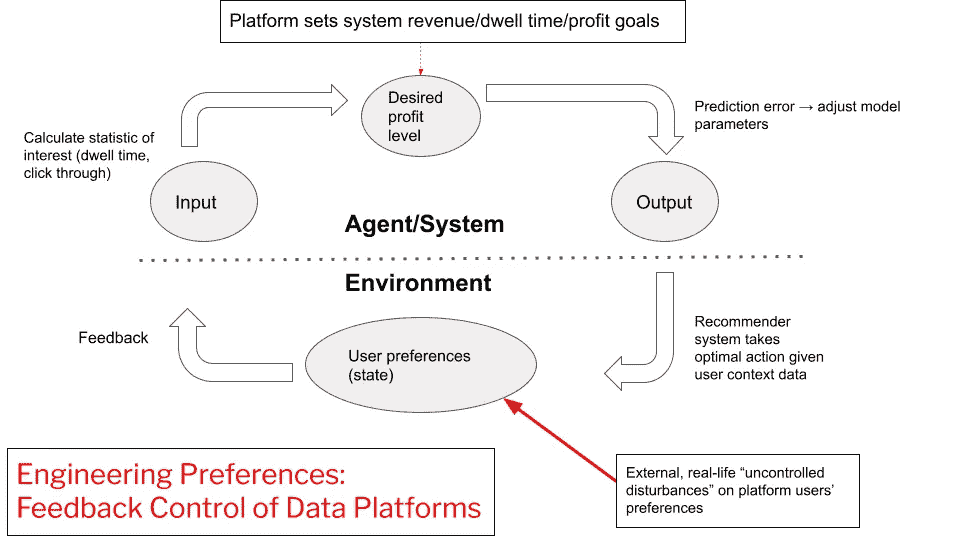
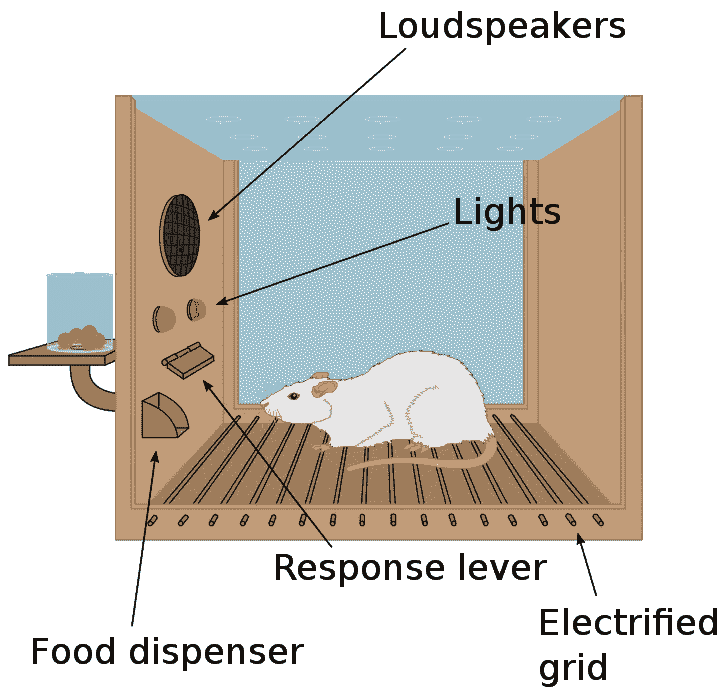
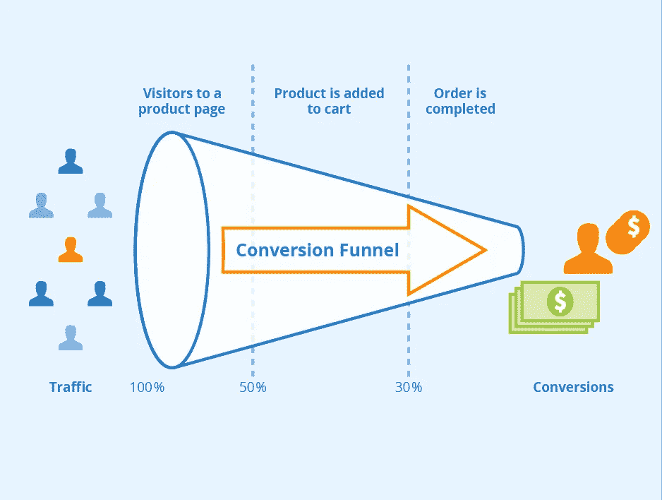

# 企业需求和人工智能的未来，第一部分

> 原文：<https://towardsdatascience.com/corporate-imperatives-and-the-future-of-ai-development-part-i-773f5a1a352b?source=collection_archive---------15----------------------->

## [思想和理论](https://towardsdatascience.com/tagged/thoughts-and-theory)

## 经济意识形态有没有拉拢 AI 研发？

企业追求股东价值最大化是在慢慢破坏人的价值吗？照片由[雷扎·哈桑尼亚](https://unsplash.com/@rezahasannia?utm_source=medium&utm_medium=referral)在 [Unsplash](https://unsplash.com?utm_source=medium&utm_medium=referral) 上拍摄

新冠肺炎·疫情标志着人类与数字技术关系的一个转折点。在线合作、远程学习和远程工作成为新的常态。我们现在每天的平均屏幕时间可能比以往任何时候都长。包括传感器、设备和应用在内的新技术的巨大网络，加上 [5G](https://en.wikipedia.org/wiki/5G) 、[物联网](https://en.wikipedia.org/wiki/Internet_of_things) (IOT)、[边缘计算](https://en.wikipedia.org/wiki/Edge_computing)和 AI/ML 的进步，为自动化数据收集和影响用户行为以实现公共政策和企业目标提供了新的可能性。在这里，我考虑基于强化学习(RL)的技术，因为它在商业上应用于个人和社会。

为什么关注 RL？根据 deep mind 的大卫·西尔弗 T19 和理查德·萨顿最近的一篇论文 T17，人工智能很可能是我们实现人工智能的最佳机会。当然，Deepmind 是谷歌母公司 Alphabet Inc .的一部分。

这篇文章探讨了以下问题:

*   公司对股东价值最大化的追求，加上新自由主义经济思想，是否正在将人工智能的研究、开发和应用推向潜在的病态方向？
*   我们应该相信市场驱动的“私人利益”人工智能研究和开发将符合透明、公正、公平、责任、问责、信任、尊严、可持续和团结的以人为本的价值观吗？

## 强化(学习)简介

今天，由行为主义心理学家给出的对*强化*的最初定性描述可以——并且越来越多地——以数字方式实现，并以公司利润最大化为目标。这些数字干预对他们的目标——使用数字系统并与之互动的个人——来说是有效的*隐形*。在我们的个人设备和应用程序上，我们孤立无援地在 [*信息圈*](https://en.wikipedia.org/wiki/Infosphere) 中导航，不知道我的谷歌是如何或者为什么以这种方式“个性化”而你的是那种方式。然而，数据平台可以看到、知道并分析所有信息。这个平台在数字上无所不知，几乎无所不能，但显然不是仁慈的。

最初作为强化的语言学描述，被称为桑代克的 [*效应定律*](https://en.wikipedia.org/wiki/Law_of_effect)*已经逐渐演变成一种精确的算法。“定律”指出，过去导致积极奖励的行为在未来更有可能重复，而导致消极奖励(惩罚)的行为则不太可能重复。至关重要的是，这种想法现在可以由计算机来实现，以自动学习在大规模上操纵人类个体和集体的行为。最近的一篇[论文](https://www.pnas.org/content/117/46/29221.short)为 RL 在人类身上的“对抗性”使用提供了关键的经验证据。*

*RL 是一种看似简单的形式主义。它的算法通过提供一种算法机制，允许理想化的**代理**根据过去的经验，使其行为最佳地适应其**环境**，从而使效果法则变得清晰。然而，RL 算法的理论和实践性质是复杂的。计算机科学、统计学、经济学和认知科学等不同的领域都有大量的相关文献。但直到现在，这些科学见解才渗透到面向消费者的技术中。*

*把 RL 看成是解决问题的通用方法。它通过学习感知刺激(状态)和行动之间的*工具*关联来工作，以便最大化算法设计者确定的一些积极回报。一个基本的交互序列看起来是这样的:代理观察环境的状态，选择一个动作，环境*转换*到一个新的状态。代理人的目标是找出哪种状态下的哪种动作序列导致最大的累积奖励。与*监督学习*范式*，*不同的是，智能体只通过奖励信号接收关于其在给定状态下行动质量的“评估性”反馈——没有“基本事实”告诉它什么是“正确的”行动。*

*RL 不仅仅是动物学习中一个有趣的话题。RL 已成功应用于机器人、临床决策和个性化医疗、能源网格优化和“及时”行为干预中的问题。RL 是一种优化控制任何复杂系统的手段，包括由数百万用户组成的数字平台。任何你可以想象为决策序列的东西都可以用 RL 形式来建模。*

*RL 也可以说是我们关于动物如何通过试错来学习复杂行为的最佳理论。例如，在[计算神经科学](https://en.wikipedia.org/wiki/Computational_neuroscience)中，RL 模型的参数可以非常精确地拟合实验收集的人类(和猴子)行为数据，这表明我们大脑的某些区域实现了类似 RL 算法的东西。事实上，腹侧被盖区(VTA)的[多巴胺神经元](https://en.wikipedia.org/wiki/Dopamine)的阶段性活动被认为编码了*奖励预测误差*(对应于对事件的惊讶，并随后驱动各种对我们环境变化的注意机制)*。*奖励预测误差的概念也用于基于[时间差异学习](https://en.wikipedia.org/wiki/Temporal_difference_learning) g 更新 RL 中的状态值估计，从而将 AI 与神经科学联系起来。*

## *基于 RL 的个性化的经济含义*

*如果我们的大脑真的实现了 RL 算法，那么当我们在社交媒体平台上与基于 RL 的系统交互时，我们就参与了类似多代理 RL 的场景。但是我们的利益一致吗？我们是在合作，还是陷入彼此的冲突？*

*如果我们处于冲突中，对个人的长期认知影响以及对社会的政治和社会影响是什么？肖珊娜·祖博夫、[卡伦·杨](https://www.birmingham.ac.uk/staff/profiles/law/yeung-karen.aspx)和[米蕾尤·希尔德布兰特](https://en.wikipedia.org/wiki/Mireille_Hildebrandt)和其他学者关心的是，通过几十年的动物学习、反馈控制、人工智能/人工智能和计算神经科学研究获得的知识如何部署在社交媒体平台上。他们的工作表明，经济需求如何使科学知识的应用偏向于以牺牲人类长期福祉为代价来产生短期、直接利润的技术。*

*但是，对预测复杂系统(特别是经济和自然生态系统)行为失败的仔细历史考察应该提醒我们谦逊认知的重要性。控制可能是理解复杂自然现象的必要条件，但不是充分条件。气候变化和金融危机，有人知道吗？*

*下面是一个非常简单的示意图，说明反馈控制的基本过程如何通过社交媒体平台上的个性化推荐系统来实现。*

**

*平台更好和更多的数据行为收集意味着对“系统状态”更精确的测量，这是在平台上交互的人类用户的集合。对未来状态的更好的预测使得更容易引导、推动或“控制”系统朝着期望的方向发展。基于强化学习的推荐系统在旨在实现公司目标的平台上充当用户“环境”的自适应控制器。来源:作者。*

## *行为主义、科学和深度神经网络*

*行为主义者是第一个看到概率、统计和强化之间联系的人，尽管他们依赖一种避开大样本和统计推断的古怪方法。然而，随着 Herrnstein 的 [*匹配定律*](https://en.wikipedia.org/wiki/Matching_law) 的发现，行为主义者意识到，通过对最初随机试错行为的适当强化，动物可以学会“匹配”它们环境中的统计规律。也就是说，动物(和人类)似乎会*自然地*调整行为频率，以接近环境的潜在回报统计。*

*通过在正确的时间以正确的方式进行干预，动物的行为可以被逐渐塑造或控制，以解决任意的任务，例如鸽子通过奖励塑造学习堆叠木块以达到食物分配杆。这表明，当我们行为时，无论我们的大脑做什么，它们都会实现类似 RL 算法的东西。*

*行为主义基于一种以工程为中心的科学哲学，这种哲学起源于奥地利物理学家恩斯特·马赫，后来被物理学家 T2·珀西·布里奇曼改编，最后由 T4 的 BF·斯金纳普及。马赫认为，科学应该致力于压缩知识，而不是不必要地扩大其理论词汇——除非这样做可以解释更广泛的经验观察到的现象。一种严格的科学方法理想地去除了所有的噪音和冗余，只保留信号，然后将信号传达给未来的科学家，以进一步压缩和理解，直到可能找到万物的统一理论。*

*马赫有影响力的观点结合了进化论和信息论的一些方面来解释科学知识的积累和压缩。他的思想后来也影响了科学的实证主义哲学，这种哲学消除了对不可观察的原因的谈论以及其他源自康德和黑格尔哲学的“形而上学的、先验的晦涩难懂的东西”。行为主义要求将 [*意向性*](https://en.wikipedia.org/wiki/Intentionality) 的精神术语替换为 [*由实验者定义的*](https://en.wikipedia.org/wiki/Operationalization)操作性定义的行为。例如，在 1938 年的一篇论文中，爱德华·托尔曼将老鼠在迷宫中的“来回张望”等同于“意识的行为主义定义”。不可观察的精神状态，如关于的*“信念”、“欲望”或“意图”，或代表生物体环境的*特征的*，现在在理论上是禁区。**

*但是行为主义并不完全错误。虽然今天经常受到批评，行为主义的见解已经渗透到各个领域。它的主要罪过在于它急于将人类经历的所有*降低到无意识的僵尸般行为的水平，而事实上，我们的行为中只有*是由这些次个人的、目标导向的过程驱动的。人文主义者不喜欢这种不公正地贬低自我意识在人类思考中的作用，并把人类的自主性、自由意志和道德责任归结为一系列环境互动，这些互动可能受到并不总是仁慈的社会工程师的控制和塑造。***

## ***控制平台用户的强化计划***

***行为主义与深度学习的进步相结合，标志着一个基于平台的观察、预测和控制用户的新时代。JB Watson、Skinner、Egon Brunswik、Edward Tolman 和其他人的行为主义守卫者依赖于发射行为的共时定义。他们只关心是否有老鼠或鸽子在某个时间点按下了控制杆。老鼠用左臂还是右臂并不重要。就操作定义而言，这两项行动是相同的。要了解行为主义对当今个性化研究的影响，只需将“杠杆按压”替换为“点击”同样的想法也适用。***

******

***剥皮器盒子。来源:[维基百科](https://en.wikipedia.org/wiki/Operant_conditioning_chamber)。***

***早期的行为主义者缺乏技术来分析导致特定杠杆按压的行为(状态)的复杂时间序列。纸笔根本效率不高。BF 斯金纳将开发[斯金纳盒子](https://en.wikipedia.org/wiki/Operant_conditioning_chamber)来处理这个问题。这个设备实际上实现了一个特定的[强化计划](https://en.wikipedia.org/wiki/Reinforcement#Intermittent_reinforcement_schedules)，它是描述在操作性条件反射中某些目标行为如何被奖励或惩罚的规则。通常使用固定或可变的时间间隔或试验比率。***

***在 1958 年发表在美国心理学家杂志上的一篇文章中，斯金纳描述了强化时间表是如何被一个用物理术语描述的“程序系统”执行的。我用加粗的关键词和短语来说明与 RL 的联系，因为它可能会被一个旨在加强有利于其业务目标的用户行为的社交媒体平台所应用。***

> ***由一个 ***编程系统*** 安排一个加固进度，该进度可以用物理术语来指定。在钥匙和弹匣之间的电路中引入一个时钟，以便在给定的时间间隔后对钥匙的第一个响应将是 ***加强*** 。在电路中引入一个计数器，根据每个强化发出的响应数量来建立一个偶然性。***
> 
> ***由于精心安排的结果，鸽子、老鼠和猴子在过去的五年里做了它们物种成员从未做过的事情。这并不是说他们的祖先没有这种行为的能力； ***大自然从来就没有安排过有效的序列表*** 。***
> 
> ***…从强化研究中涌现出来的新的原理和分析方法可能被证明是二十世纪最有成效的社会工具之一。***

## ***强化学习的创新***

***斯金纳的原始“编程系统”今天已经演变成以商业为中心的 RL。RL 的商业价值源于它能够无形地自动干预数字空间，从而推广昂贵的 A/B 测试。事实上，RL 技术的进步越来越吸引企业和政府对实现财务和公共政策目标的兴趣(例如，自动化和个性化的“轻推”)。***

***然而令人担忧的是，现在基于[递归神经网络](https://en.wikipedia.org/wiki/Recurrent_neural_network) (RNNs)(包括[lstm](https://en.wikipedia.org/wiki/Long_short-term_memory)和更新的[基于注意力的变压器](https://en.wikipedia.org/wiki/Transformer_(machine_learning_model)))的深度神经网络(DNN)架构，可以以自我监督的方式发现和编码这些复杂的行为交互序列，如 RL 形式中的*状态*。DNNs 允许我们应用黑盒函数逼近器来自动生成状态表示，以调节 RL 代理的动作。DNNs 可以处理非线性用户-项目关系和未标记的非结构化数据，如图像、文本和交互序列，极大地扩展了个人数据收集的可能性。***

**这些新技术进一步允许我们放松 RL 中使用的传统[马尔可夫决策过程](https://en.wikipedia.org/wiki/Markov_decision_process)的严格“马尔可夫”假设。这些漫长而复杂的行为序列中的规律可以被自动而有效地发现——几乎不需要人类理解——平台可以通过正确选择旨在实现奖励的行动来指导或塑造它们。从平台的角度来看，*控制*就是在给定用户处于特定状态(以 RNN 为代表)的情况下，选择一个最优的行动，以获得最大的累积奖励。**

## **效用和平台经济学**

**平台数据科学家假设“停留时间”和“点击率”等行为指标允许他们窥视平台用户的内心世界。数百万美元花费在数据科学研究上，专注于以业务为中心的“参与度”指标，这些指标来自大杂烩式的营销理论(将可观察到的行为等同于“客户满意度”的表达)和*规范*经济理论，如 [*揭示对各种事务状态或对象的偏好*](https://en.wikipedia.org/wiki/Revealed_preference) ，按其对用户的效用排序。**

**现代数据科学家保留了行为主义的大部分方法，同时更新了他们的理论词汇，以包括不可观察的潜在心理状态。但这样做的原因是务实的，而不是认识论的。定位不可观察的潜在偏好允许更好、更准确地预测用户行为，并且似乎口头上尊重消费者作为一个独特的思维、感觉和自我意识的人，其主观体验不同于海鞘。然而，在实践中，同样的效用理论形式适用于海鞘和人类平台用户。**

**正如哲学家如[阿玛蒂亚·森](https://en.wikipedia.org/wiki/Amartya_Sen)、[伊莉莎白·安德森](https://en.wikipedia.org/wiki/Elizabeth_S._Anderson)和[查尔斯·泰勒](https://en.wikipedia.org/wiki/Charles_Taylor_(philosopher))很久以前指出的，效用是经济学的一元通用货币。所有有价值的问题都归结为效用。它现在在数据科学中也是一个上升的概念，尽管它受到严重的理论和哲学问题的困扰。然而，总的来说，工程师和数据科学家似乎乐于依赖效用的概念。想想有多少*有益于社会的数据科学计划是围绕着 ***社会福利最大化*** 的功利主义观念制定的。***

**效用至少融合了价值这个词的三种含义:经济价值、道德价值和数字价值。很容易看出这一举措对算法驱动的数字平台的吸引力。道德价值是模糊的东西，不容易理解，而且经常引起争议。将道德价值简化为一个也可以用金钱来表达的数字，使得决策变得简单，更重要的是，在计算上更容易处理。它允许对科学计算进行自然主义的伦理学还原。例如，如果道德价值可以归结为快乐(即“兴趣”)，快乐可以归结为行为现象(即停留时间)，行为现象可以归结为神经元活动，那么关于“不可通约的价值”或“商品的多样性”的问题可以礼貌地回避。**

**数据科学中使用的效用理论的规范方面尤其危险，因为它夹杂了各种关于人性和认知的不合理假设。显示偏好理论建立在理性选择理论的基础上:观察到的行为被认为是理想化合理化过程的结果，其中效用和概率以最佳方式结合，如贝叶斯法则所述。**

**如果揭示的偏好被规范地看待——作为具有完全信息、无限时间和计算资源的理想化贝叶斯代理的结果——那么我们也为*消费者主权*的意识形态找到了正当理由。当消费者的选择是可证明的最佳数学程序的输出时，我们有什么资格去批评他们呢？现代经济理论的教父[保罗·萨缪尔森](https://en.wikipedia.org/wiki/Paul_Samuelson)在行为主义主导学术心理学的时候发展了显露偏好理论，这并不是巧合。**

## **数字营销漏斗和老鼠迷宫**

**1938 年，爱德华·托尔曼(Edward Tolman)写道，老鼠迷宫作为一种研究动物学习过程的工具，具有强大的力量，这预示着数字营销漏斗的现代理念。**

> **现在，让我以最后的信仰告白来结束。我相信，心理学上的一切重要事情……都可以通过继续****的实验*** 的理论分析 ***的决定因素*** 在 ***选择点*** 在 ***迷宫*** 中进行本质上的探究。***

******

***考虑到经济需要，RL 将越来越多地被用作针对企业目标的人类行为修正的自动化手段。对于数字营销来说，RL 可以用来系统地影响用户在选择选择点的行为，以达到产品购买(转化)的目的。漏斗的各个部分可以被视为用户状态**和营销干预(例如，通知/展示/推荐商品 x)的**动作**。最佳营销策略选择给定用户状态下的最佳行动。更好的用户监视和数据捕获意味着更细粒度的状态表示。来源:[可行性](https://www.seobility.net/en/wiki/Conversion_Rate)。*****

***如果比较不清楚，平台的用户就像迷宫里的老鼠。这个平台是公司的实验者，他希望你跑到迷宫的尽头，购买一些产品或点击一些广告。因为数据平台可以以类似 [*全景视觉* -](https://en.wikipedia.org/wiki/Panopticon) 的方式全面监控和记录用户行为，所以 RL 算法现在可以用来塑造和引导它朝着平台的业务目标发展。事实上，通过指定奖励函数，可以同时实现几个优化目标。例如，奖励可能是点击行为(控制浏览行为)和购买(确保 RL 代理选择最终有助于购买的行为，而不是简单的大量点击)的函数。***

***你可以想象一个 RL 代理可能如何选择一个最优策略(即，一系列干预行动)来推动用户购买更多的产品，为某些政治候选人投票，或者——举一些行为矫正的非邪恶应用的例子——减肥或戒烟。数字营销和计算广告现在是行为修正科学与 RL 相遇的地方。结合[的生成性对抗网络](https://en.wikipedia.org/wiki/Generative_adversarial_network) (GANs)和创建适应性强的“个性化”音频、视频和基于图像的内容的能力，可能性是无限的。数十亿美元将被创造，而目前在这个领域几乎没有监管。***

***想象一下在中国这样的社会中这是多么的巨大。RL-agents 可以在*淘宝*、*微信*、*美团外卖*、 *JD* 、*滴滴出行出行*等平台上每天与数十亿用户互动。一个巨大的多智能体 RL 系统可以使用由中国共产党拥有和运营的中央数据存储器[“重放缓冲器】](https://en.wikipedia.org/wiki/Deep_reinforcement_learning)来构建，其中无数专门的 RL 智能体的个体交互通过汇集状态-行动-回报历史来共享和改进行为政策。虽然有些牵强，但这并非不可能:斯坦福大学的 2021 年人工智能指数报告显示，中国在人工智能期刊引用方面已经超过美国。***

******

***Joshua Hoehne 在 [Unsplash](https://unsplash.com?utm_source=medium&utm_medium=referral) 上拍摄的照片***

## ***私人利益中的数据科学&制造怀疑***

***将企业需求与自动化行为修正技术混合在一起是一个社会灾难的处方。举个例子，*华尔街日报*最近发表了一篇文章，披露了脸书如何在 2017-2018 年左右对其新闻推送算法进行[修改，以抵消用户参与度下降的影响](https://www.wsj.com/podcasts/the-journal/the-facebook-files-part-4-the-outrage-algorithm/e619fbb7-43b0-485b-877f-18a98ffa773f)。这些变化旨在鼓励更多的个人联系和改善心理健康，但它们适得其反。相反，该算法实际上成为了一台愤怒和错误信息的传播机器，企业利润需求是扎克伯格和其他人没有采取任何行动来对抗随之而来的社会外部性的主要原因。***

***然而，脸书的研究负责人对《华尔街日报》的说法进行了官方反驳。但是这有点像期望菲利普莫里斯给你关于吸烟影响的公正信息。鉴于企业利润的必要性，很难知道该相信什么。不幸的是，如果学术人才继续以目前的速度流失，前景似乎并不乐观。斯坦福大学的人工智能指数报告指出，现在北美 65%的人工智能博士毕业后进入行业，而 2010 年只有 44%。***

***因此，我们能做些什么来对抗不可避免地使用基于 RL 的技术作为以牺牲我们的精神健康、政治和社会稳定为代价来获取更大公司利润的手段吗？在他的书《私人利益中的科学》中， [谢尔登克里姆斯基](https://en.wikipedia.org/wiki/Sheldon_Krimsky)详细描述了在烟草、产品安全、环境污染、工作场所有毒物质以及药物对成人和儿童的疗效和副作用等领域研究“被忽视的人类需求和不公正”的自由思想科学家“稀疏队伍”背后的历史。***

***像内奥米·奥雷斯克斯和克林姆斯基这样的学者揭示了协调一致的企业战略**制造怀疑，以便在诸如吸烟和气候变化等具有集体重要性的问题上故意混淆和误导公众。这一战略的前提是有害后果的不确定性有利于现状。极不可能发生的危险，即使很大，也不需要采取预防措施。为什么平台不能使用类似的策略来“搅浑”青少年福祉、心理健康和社交媒体使用的研究水呢？我们已经看到类似的事情被用来回应脸书的告密者 Frances Haugen。*****

****企业数据平台掌握着回答具有重要社会意义的类似问题的关键。他们收集和控制数十亿用户的行为数据，从广告中获得大量现金，并可以随意干预数百万用户的在线体验，以测试关于情感传染等事情的因果假设。资金紧张、渴望发表论文的数据科学学者很难与之竞争。****

## ****为了公众利益走向数据科学****

****克林姆斯基有力地指出，我们必须捍卫美国研究机构的完整性，尤其是研究型大学。为什么？因为****

> ****大学不仅仅是智慧的源泉……大学是一个舞台，通过这个舞台，有奉献精神的男男女女可以为了社会的进步而向权力说真话。****

****我们可能需要政府监管机构和机构的帮助，以使公共利益数据科学研究成为现实。但立法者需要认识到，有意义的平台研究不仅需要访问行为数据，还需要访问推荐服务系统本身。好的科学旨在揭示现象的不可观察的原因；它必须超越简单地描述以前由平台管理的数据集中可观察到的相关性。最后，公共利益而非私人利益的学术数据科学研究遵守国际[人类受试者研究伦理](https://en.wikipedia.org/wiki/Human_subject_research)协议，我们可能还需要更新这些协议，以反映对社会负责的数据科学研究的新范式。****

****因此，这是为了培养新一代愿意向当权者说真话的学术数据科学家。****