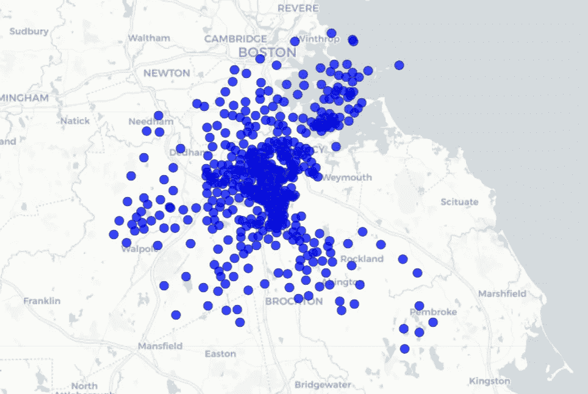
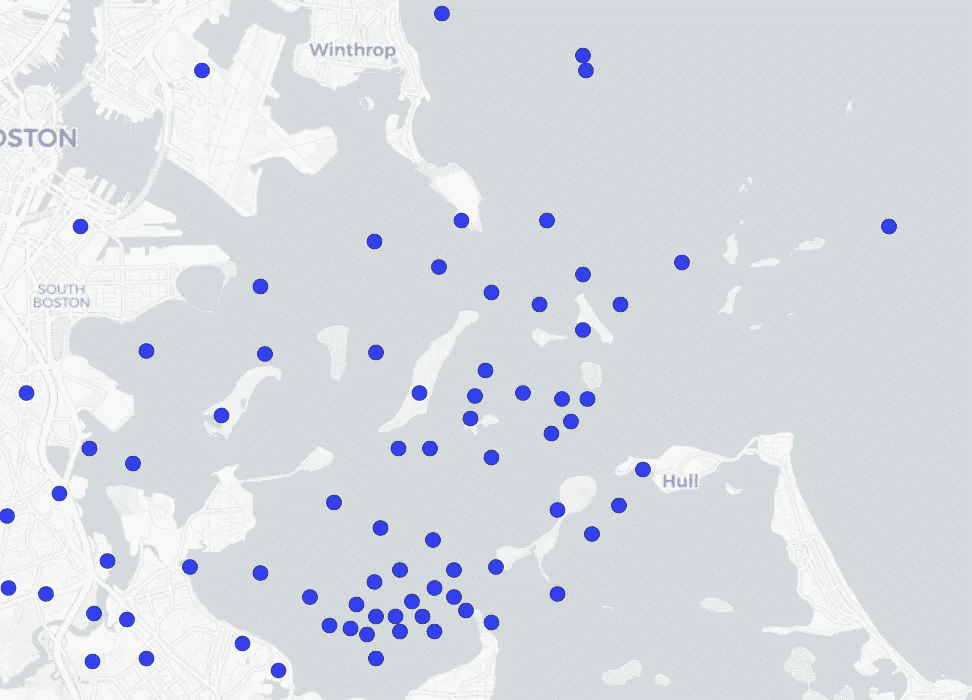
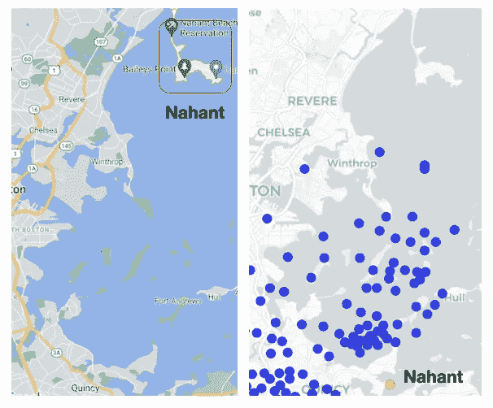
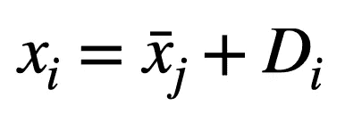
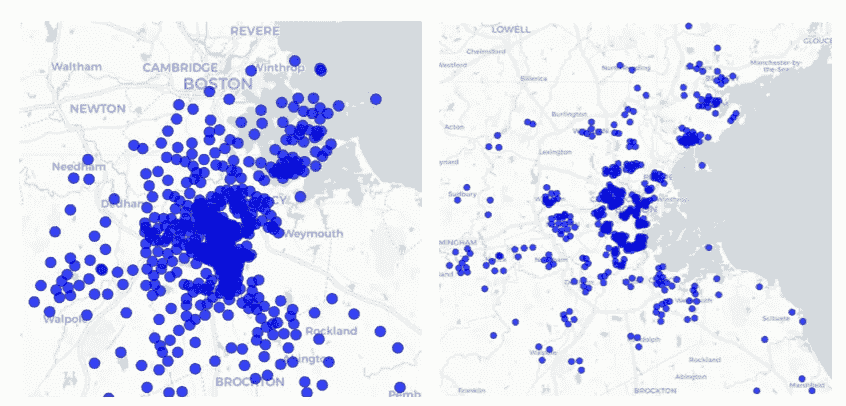

# 纠正波士顿住房市场数据集

> 原文：<https://towardsdatascience.com/correcting-the-boston-housing-market-dataset-aa8cfabfa085?source=collection_archive---------45----------------------->

## 使用谷歌的地理编码器 API 修正纬度和经度坐标

图片来自 Sam Clarke 在 Unsplash ( [来源](https://unsplash.com/photos/ZEfFgaXVaV4))

> **TL；博士**
> 
> 波士顿住房市场数据集的纬度和经度不正确。校正后的数据集可以在这里找到[。](https://github.com/namiyousef/ai_hack_2021/blob/main/data/Boston_Housing_Market_Challenge/boston_fixed.csv)

波士顿住房市场数据集无处不在。尽管如此，纬度和经度值是错误的。这篇文章相当短，旨在:a)引起人们对问题的注意，b)提供校正数据集的链接，以及 c)描述用于校正数据集的方法。

## 数据集有问题

如图 1 所示，住宅的快速绘图显示了纬度和经度的问题。

图 1:校正前的住宅图

我们首先注意到大量的城镇实际上出现在水中，如图 2 所示。

图 2:放大的图片显示许多城镇出现在水中

此外，我们可以通过检查谷歌地图上的各个城镇来确认纬度和经度是不正确的。图 3 显示了一个在 **Nahant** 的住宅的例子。

图 3:(左)**出现在谷歌地图上的 Nahant** 和(右)**使用数据集坐标的 Nahant**

这个数据集的很多在线分析都没有考虑这个问题(比如这里的)。尽管他们进行了出色的分析，但住宅的绘制是错误的。

## 修复方法

为了固定数据集，做了一个关键的假设。这就是纬度和经度的误差实际上是它们都移动了一个常量。在这个公式中，我们猜测误差是系统性的，而不是随机的。

我们假设每个**住宅**到其各自**城镇中心**的距离是一致且正确的。我们猜测这个误差实际上来自于城镇中心的转移。然后我们定义:

其中 **x_i** 是我们数据集中一个住宅 **i** 的坐标(纬度或经度)， **x_bar_j** 是住宅 **i** 所在城镇 **j** (即城镇中心)的平均坐标， **D_i** 是住宅 **i** 到城镇中心 **x_bar_j** 的坐标距离

基于我们对误差性质的假设，这意味着如果我们用修正的 **x_bar_j*** 替换**x _ bar _ j ***，保持 **D_i** 不变，我们可以找到每个住所的修正位置。

为了找到正确的城镇中心 **x_bar_j*** ，我们使用了谷歌的地理编码器 API。这方面的代码如下所示:

完整的实现可以在[这里](https://github.com/namiyousef/ai_hack_2021/blob/main/data_exploration/Correcting_lat_long.ipynb)找到。

## 结果

下面的图 4 并排显示了校正和未校正的坐标。

图 4:(左)未修正的城镇坐标和(右)修正的城镇坐标

值得注意的是，坐标比校正前更有意义，因为:

*   水上没有住宅
*   住宅成群出现(这是有道理的，因为它们应该来自同一个城镇)

可在处[找到校正数据集的链接。](https://github.com/namiyousef/ai_hack_2021/blob/main/data/Boston_Housing_Market_Challenge/boston_fixed.csv)

我希望这篇文章对希望对波士顿住房市场数据集进行分析的数据科学初学者(或专家)有所帮助。

*除非另有说明，所有图片均由作者制作。*