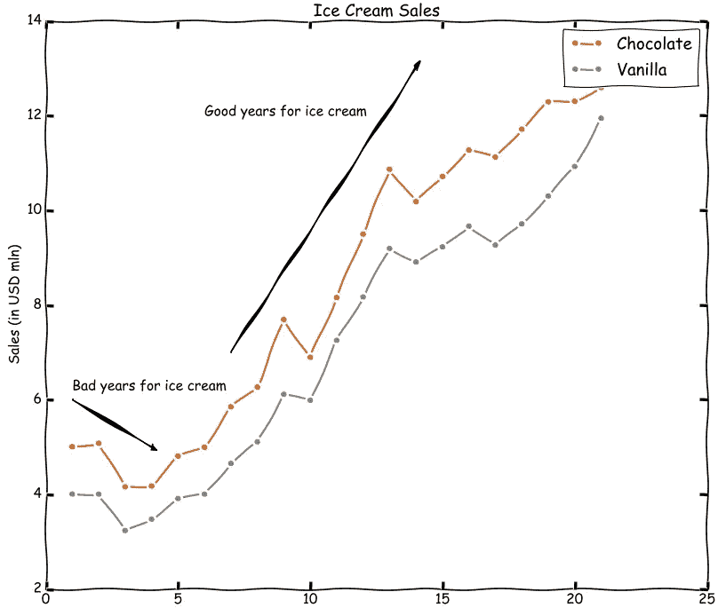
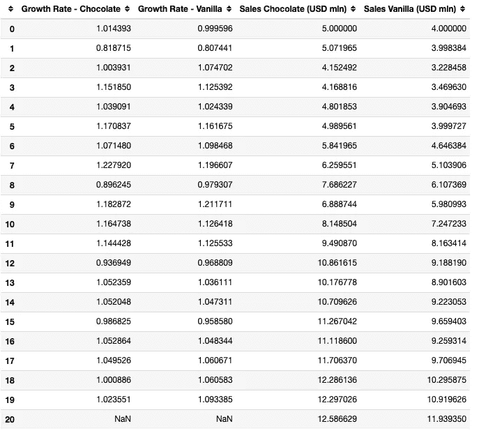
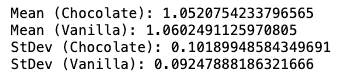
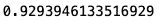
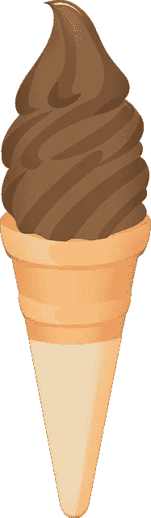
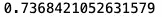
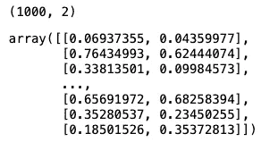
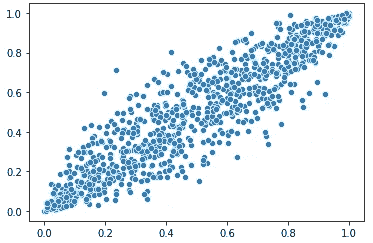
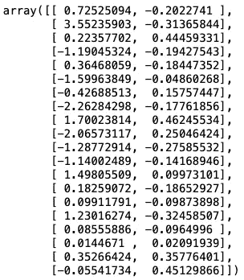
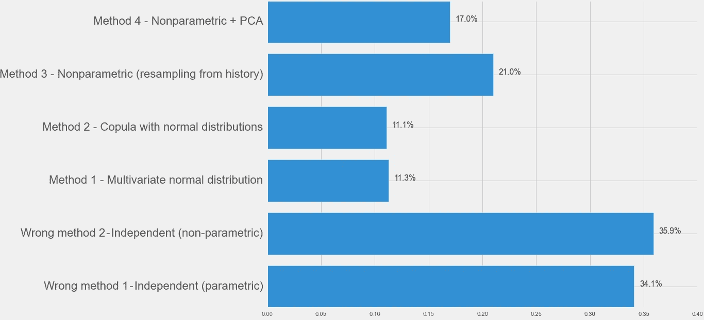

# 蒙特卡罗模拟中的相关变量

> 原文：<https://towardsdatascience.com/correlated-variables-in-monte-carlo-simulations-19266fb1cf29?source=collection_archive---------6----------------------->

## [入门](https://towardsdatascience.com/tagged/getting-started)

## 香草冰淇淋的销量能超过巧克力吗？


图片由[尼基👉请保持安全👈](https://pixabay.com/users/nickype-10327513/?utm_source=link-attribution&utm_medium=referral&utm_campaign=image&utm_content=4251583)来自 [Pixabay](https://pixabay.com/?utm_source=link-attribution&utm_medium=referral&utm_campaign=image&utm_content=4251583)

**目录:**

*   介绍
*   问题陈述
*   数据准备
*   错误方法 1-独立模拟(参数化)
*   错误方法 2-独立模拟(非参数)
*   方法 1 —多元分布
*   方法 2-具有边缘分布的连接函数
*   方法 3——模拟销售增长的历史组合
*   方法 4——使用 PCA 消除商店销售增长的相关性

## 介绍

蒙特卡洛模拟是销售、资产回报、项目投资回报率等的一个很好的预测工具。

在之前的[文章](/intro-to-monte-carlo-simulations-using-business-examples-794fae76e832)中，我提供了如何在商业环境中使用蒙特卡罗模拟来预测一系列可能的商业结果及其相关概率的实用介绍。

在本文中，我们将解决蒙特卡洛模拟中相关变量的挑战。我们将研究 4 种处理相关性的适当方法。

## 问题陈述

在我们的样本数据集中，20 年前，巧克力冰淇淋的年销售额为 500 万美元，香草冰淇淋的年销售额为 400 万美元。巧克力冰淇淋的需求量比香草冰淇淋多 25%。

在过去的 20 年里，对巧克力和香草的需求都在增长，但是巧克力和香草之间的销售差距已经缩小。去年，巧克力冰淇淋销售额为 1260 万美元，香草冰淇淋销售额为 1190 万美元。现在对巧克力的需求仅比香草多 6%。

**注** —巧克力和香草冰淇淋的销量**正相关**，即巧克力冰淇淋和香草冰淇淋的销量往往同增同减。

**问题**:明年会是香草冰淇淋销量超过巧克力冰淇淋销量的一年吗？



巧克力和香草冰淇淋销售之间相互关系的图解(图片由作者提供)

解决方案:我们可以运行蒙特卡洛模拟来回答我们的问题。

独立模拟巧克力和香草冰淇淋的销售是错误的。

## 数据准备

我们首先配置巧克力和香草冰淇淋销售的样本起始销售数字。选定的数字分别为 500 万美元和 400 万美元。我们假设大多数人都有点偏爱巧克力冰淇淋。

```
START_CHOC = 5
START_VAN = 4
```

然后，我们想要绘制 20 个随机的年销售增长率，假设香草和巧克力冰淇淋的销售增长率遵循**多元正态分布**。这是正态分布的扩展，我们假设两种冰淇淋口味的销售增长率都遵循正态分布，但两个正态分布之间存在关系。

我们假设两种口味的平均增长率为 5%，标准偏差为 10%，两种口味的增长率之间的相关性为 0.9。

```
# Config for multivariate normal distribution
CORR = 0.9
MU = 1.05
SIGMA = 0.1
```

下面是生成增长率和年销售额的代码。

```
# Generate sales and growth rates for 20 periods
# using a multivariate normal distribution
cov_matrix = [[(SIGMA**2), CORR*(SIGMA**2)], 
              [CORR*(SIGMA**2), (SIGMA**2)]]distribution = ss.multivariate_normal(
    mean=[MU, MU], cov=cov_matrix)sample_data = distribution.rvs(20, random_state=5)chocolate_growth = sample_data[:, 0]
vanilla_growth = sample_data[:, 1]chocolate_sales = np.cumprod([START_CHOC] + list(chocolate_growth))
vanilla_sales = np.cumprod([START_VAN] + list(vanilla_growth))# Prepare dataframes
growth_df = pd.DataFrame(data={
    "Growth Rate - Chocolate": chocolate_growth,
    "Growth Rate - Vanilla": vanilla_growth})sales_df = pd.DataFrame(data={
    "Sales Chocolate (USD mln)": chocolate_sales,
    "Sales Vanilla (USD mln)": vanilla_sales})df = pd.concat([growth_df, sales_df], axis=1)
df
```



冰淇淋销量和增长率(图片由作者提供)

## 错误方法 1-独立模拟(参数化)

首先，我们将运行一个蒙特卡洛模拟，我们将研究香草和巧克力销售的统计分布，但是将这两种分布都视为独立变量。这是一个错误的方法，因为香草和巧克力冰淇淋的销售是相互关联的。

我们知道分布的参数，因为我们已经创建了数据集，假设巧克力和香草的销售增长率遵循均值为 1.05(平均增长 5%)和标准差为 0.1 (10%)的正态分布。参见上一节。

然而，让我们假设我们不知道这些参数，以便复制我们在现实生活中会面临的挑战。我们必须使用历史数据来估计参数。

```
# Estimate means
mean_choc = np.mean(df["Growth Rate - Chocolate"])
print(f"Mean (Chocolate): {mean_choc}")mean_van = np.mean(df["Growth Rate - Vanilla"])
print(f"Mean (Vanilla): {mean_van}")# Estimate standard deviations
std_choc = np.std(df["Growth Rate - Chocolate"],
                 ddof=1)
print(f"StDev (Chocolate): {std_choc}")std_van = np.std(df["Growth Rate - Vanilla"],
                ddof=1)
print(f"StDev (Vanilla): {std_van}")# Define normal distributions
distribution_choc = ss.norm(mean_choc, std_choc)distribution_van = ss.norm(mean_van, std_van)
```



来自 20 年样本的平均值和标准偏差(图片由作者提供)

接下来，我们模拟巧克力和香草冰淇淋销售的 1000 个样本增长率。

```
growth_vanilla = distribution_choc.rvs(1000, 
    random_state=1)growth_chocolate = distribution_van.rvs(1000, 
    random_state=2)
```

现在让我们准备一个函数，我们可以用它来检查香草的销售额是否会超过巧克力的销售额。

```
def exceed_check(growth_vanilla, growth_chocolate):
    '''This function takes sample growth rates for
    vanilla and chocolate ice cream sales and checks
    if vanilla ice cream sales would exceed chocolate
    given the combination of growth rates.

    Args:
    growth_vanilla (list): growth rates for vanilla sales
    growth_chocolate (list): growth rates for chocolate sales

    Returns:
    flags_list (list): A list of True/False flags indicating
        whether vanilla sales exceeds chocolate sales for the
        given combination of growth rates
    mean_pass_rate: Mean value of flags_list indicating the 
        probability vanilla sales exceeds chocolates given the 
        combination of growth rates
    '''
    # Last year's chocolate and vanilla ice cream sales
    # set as constants to improve performance
    FINAL_CHOCOLATE = 12.59
    FINAL_VANILLA = 11.94

    flags_list = [v*FINAL_VANILLA > c*FINAL_CHOCOLATE 
        for v,c in zip(growth_vanilla, growth_chocolate)]

    mean_pass_rate = np.mean(flags_list)

    return flags_list, mean_pass_rate
```

最后，我们来查一下香草销量超过巧克力的概率…

```
exceed_check(growth_vanilla, growth_chocolate)[1]
```

概率: **34.1%**

## 错误方法 2-独立模拟(非参数)

在第二个错误的方法中，我们独立地模拟了巧克力和香草的销售增长率，但是**我们没有假设任何统计分布**。我们从**历史**中得出样本增长率。

```
growth_vanilla = df["Growth Rate - Vanilla"].dropna(
    ).sample(1000, replace=True, random_state=1)growth_chocolate = df["Growth Rate - Chocolate"].dropna(
    ).sample(1000, replace=True, random_state=2)
```

现在我们检查香草销售额超过巧克力的可能性…

```
exceed_check(growth_vanilla, growth_chocolate)[1]
```

概率: **35.9%**

到目前为止，我们分别对待巧克力和香草销售的两种错误方法给了我们 34%到 36%之间的可能性…毕竟明年很有可能是香草冰淇淋爱好者之年…


图片来自 [Pixabay](https://pixabay.com/?utm_source=link-attribution&utm_medium=referral&utm_campaign=image&utm_content=32094) 的 [Clker-Free-Vector-Images](https://pixabay.com/users/clker-free-vector-images-3736/?utm_source=link-attribution&utm_medium=referral&utm_campaign=image&utm_content=32094)

## 方法 1-多元分布

我们将用来检查香草销售额是否可能超过巧克力销售额的第一个适当方法是估计代表数据的多元分布，并从该样本中得出潜在增长率。多元分布模拟多元变量的**组合分布**。相关性被捕获。

请记住，我们实际上是从多元正态分布中生成的数据，巧克力和香草的平均值为 1.05，标准偏差为 0.1，相关性为 0.9。不过，这里我们将假设我们不知道参数，我们将使用历史数据来估计分布参数，就像我们在独立参数模拟中所做的那样(“错误方法 1”一节)。

我们已经估算了前面提到的平均值和标准偏差，但是我们仍然需要估算巧克力和香草冰淇淋销售之间的相关性。

```
corr = df.corr().iloc[0, 1]
corr
```



估计的相关性与我们用来生成数据的实际值 0.9 相差不远(图片由作者提供)

我们现在可以从多元正态分布中得出 1000 个样本的增长率…

```
# We need to recalculate the covariance matrix
# using the estimated paramaters
cov_matrix = [[std_choc**2, corr*std_choc*std_van], 
              [corr*std_choc*std_van, std_van**2]]growth_rates = ss.multivariate_normal(
    mean=[mean_choc, mean_van],
    cov=cov_matrix).rvs(1000, random_state=1)growth_chocolate = growth_rates[:, 0]
growth_vanilla = growth_rates[:, 1]
```

最后，我们计算香草销售额超过巧克力的概率…

```
exceed_check(growth_vanilla, growth_chocolate)[1]
```

概率: **11.3%！**请注意，在我们考虑了巧克力和香草冰淇淋销售之间的相关性后，这种可能性现在低了很多。

看起来巧克力可能仍然是主要的口味…



图片来自[请不要出售我的作品，因为是来自](https://pixabay.com/users/annaliseart-7089643/?utm_source=link-attribution&utm_medium=referral&utm_campaign=image&utm_content=5890343) [Pixabay](https://pixabay.com/?utm_source=link-attribution&utm_medium=referral&utm_campaign=image&utm_content=5890343) 的

## 方法 2-具有边缘分布的连接函数

在上一节中，我们看了多元正态分布。巧克力和香草冰淇淋的销量都服从正态分布，它们是相关的。这使得用多元正态分布来表示它们变得很容易。

有时，我们可能有两个或更多来自不同统计分布的变量，并且没有已知的多元分布可以解释它们的组合分布。如果我们确实知道变量 **+** 的**个体(边际)分布**，我们知道它们之间的**相关性**，那么**连接函数**可以有所帮助。

对系词的详细解释超出了范围，但简单地说…

假设一个变量可能的最低值是 0，最高值是 1。Copulas 生成该范围内的值的组合，从而保持变量之间的**相关性所暗示的关系**。由于我们的变量是巧克力和香草冰淇淋销售额，并且它们正相关，当香草冰淇淋也具有高价值时，copulas 将绘制更接近 1(最高值)的巧克力冰淇淋销售额增长值，反之亦然。

有一些现有的库可以安装来利用 copula，但下面我们将使用 hack 从头构建一个 copula(高斯函数),这可能有助于更好地理解这个过程。

首先，我们需要重新计算巧克力和香草销售增长这两个变量之间的相关性，因为 copulas 是基于**等级相关性的。**在上一节中，我们计算了皮尔逊相关系数，但现在我们将使用 **Kendall 的 Tau** 来衡量等级相关性。等级相关性是基于计算值的等级之间的相关性，而不是值本身。

```
corr = ss.kendalltau(
    df.dropna().iloc[:, 0], df.dropna().iloc[:, 1])[0]corr
```



0.74 的等级相关性低于我们之前计算的 0.93 的相关性(图片由作者提供)

现在我们可以构建我们的系词…

```
# We set variances to 1 because the covariance matrix we 
# are constructing will be used with a multivariate normal 
# distribution of means 0 and std 1 to derive a copula
cov_matrix = [[1, corr], 
              [corr, 1]]# We will draw 1000 combinations from the distribution
random_vals = ss.multivariate_normal(cov=cov).rvs(
    1000, random_state=1)# Finally a cumulative density function for a distribution
# ranges between 0 to 1 so it will be used to convert the
# drawn samples to the values we need for our copula
copula = ss.norm.cdf(random_vals)
print(copula.shape)
copula
```



作者图片

我们可以看到 copula 有 1000 个跨 2 个变量的相关条目，它们的范围从 0 到 1。

下面是我们两个变量的相关 copula 值的散点图。

```
sns.scatterplot(x=copula[:, 0], y=copula[:, 1])
```



作者图片

介于 0 和 1 之间的 copula 值捕获了变量之间的相关性，因此现在我们只需将 0–1 值转换为我们希望用于巧克力和香草冰淇淋销售增长率的实际值。

我们使用百分点函数来表示每个变量在转换中的分布。我们已经在独立参数模拟部分估计了分布(“错误方法 1”)。不同之处在于，我们现在不只是从每个分布中随机抽取值，而是使用 copula 值和百分点函数从每个分布中抽取**相关随机值**。

```
# distribution_choc and distribution_van area already
# calculated in previous sections
growth_chocolate = distribution_choc.ppf(copula[:, 0])
growth_vanilla = distribution_van.ppf(copula[:, 1])
```

最后，让我们将这些增长率传递给我们的函数，以检查香草销售额超过巧克力销售额的可能性…

```
exceed_check(growth_vanilla, growth_chocolate)[1]
```

概率: **11.1%**

11%的概率与上一节中的概率相似，证实了我们在最初应用的 2 个错误方法中严重高估了概率。

这种方法有几个步骤，可能需要对不同的概念进行更彻底的解释。不过需要记住的一点是，我们使用 copula 生成的介于 0 和 1 之间的值可以用于任何统计分布的组合。

我们的例子很简单，因为两个变量的分布都是正态的，所以上一节的方法(多元正态分布)是足够的，实际上应该产生与本节相同的结果。但是想象一个不同的场景，其中变量 A 是正态分布，变量 B 是二项式分布等等。在这种情况下，将需要系词。

一个假设的场景是预测电影票销售和爆米花销售，其中我们将电影院游客的数量建模为泊松分布，然后我们使用二项式分布来建模爆米花销售，其中每个买票的电影院游客都有一定的概率购买爆米花。

## 方法 3——模拟销售增长的历史组合

这是一种类似于独立非参数模拟的简单方法(第 2 节“错误方法”)，其中我们不估计任何统计分布，而是直接从历史中抽取样本。

我们应用的**修正**是，我们不**独立地**从不同的历史点获取巧克力和香草销售的历史增长率。相反，我们随机选取历史上的一个点，从历史上的同一点**中选取两个增长率。**然后，我们在历史中绘制另一个点，并做同样的事情，直到我们达到我们想要运行的模拟轮数。

例如，我们回放历史，并在第一轮模拟中从第 5 年开始计算两种口味的增长率，然后在第二轮模拟中从第 11 年开始计算，依此类推。

在“错误方法 2”一节中的独立方法中，例如，我们可以在同一轮模拟中采用第 5 年香草的增长率，以及第 11 年巧克力的增长率。我们在重演巧克力和香草冰淇淋的销售历史，两者相互独立。

```
resampled_history = df[["Growth Rate - Chocolate", 
    "Growth Rate - Vanilla"]].dropna(
    ).sample(1000, replace=True, random_state=1)growth_chocolate = resampled_history["Growth Rate - Chocolate"]
growth_vanilla = resampled_history["Growth Rate - Vanilla"]exceed_check(growth_vanilla, growth_chocolate)[1]
```

概率: **21%** 这一概率高于从最后两种适当方法得出的预期的约 11%，但低于错误模拟方法暗示的约 35%。

这种方法依赖于有足够的历史记录，通常更适合于财务数据，例如，我们有许多历史数据点。

在我们的示例中，我们只有 20 年的数据，代表巧克力和香草冰淇淋销售的 20 种历史增长率组合。这是一个很小的数字，我们会对过去发生的一些事情给予过多的重视。

## 方法 4——使用 PCA 消除商店销售增长的相关性

在前一种方法中，我们的方法面临的挑战是，我们只从 20 个数据点进行重新采样，因为我们有 20 个香草和巧克力冰淇淋历史销售增长的组合。

在独立的非参数模拟中(“错误方法 2”部分)，该方法是错误的，因为我们将香草和巧克力的销售增长率视为独立的。这使得我们有 400 (20 x 20)个历史数据点进行重新采样，因为我们可以将巧克力的 20 个历史销售增长率中的任何一个与香草的 20 个历史增长率中的任何一个结合起来。我们能够将第一年巧克力的增长率与第二年香草的增长率结合起来…在方法 3 中，我们做不到。

在这最后一种方法中，我们遵循一个非常相似的方法，即我们不估计任何统计分布，我们重放历史增长率。

这个方法的核心是我们首先去关联两种口味的冰淇淋销售增长率。这种方法将允许我们将某一年的巧克力的历史增长率与另一年的香草的历史增长率结合起来，因为我们消除了我们必须控制的相关性。我们最终会有更多的数据点需要重新采样。

步骤 1 是使用去相关方法。我们在这个例子中使用主成分分析，我想你应该很熟悉。Choletsky 分解也是金融中一种流行的替代方法。

请注意，PCA 通常用于数据科学中的降维，但我们真正感兴趣的是这样一个事实，即 **PCA 组件是去相关的**。在我们的例子中，我们不希望减少维度，所以我们将传递两个变量(巧克力和香草的销售增长率),我们将获得两个去相关的组件。由于这些主要成分是去相关的，我们可以混合和匹配历史上不同时间点的成分，并得到巧克力和香草销售增长率的 400 种组合，我们可以从中重新取样。

```
pca = PCA(n_components=2)# Normalize chocolate and vanilla growth rates to apply PCA
normalized_chocolate = (
    df["Growth Rate - Chocolate"].dropna() - mean_choc
) / std_chocnormalized_vanilla = (
    df["Growth Rate - Vanilla"].dropna() - mean_van
) / std_van# Apply PCA transformation on normalized values
components = pca.fit_transform(
    np.array([normalized_chocolate, 
    normalized_vanilla]).T)components
```



代表 20 年数据的 20 x 2 阵列和 2 个 PCA 组件(图片由作者提供)

接下来，我们运行 1000 次模拟，从元件阵列中取样。

```
np.random.seed(1)sampled_components = [[x[0], x[1]] for x in zip(
    # Sampling 1000 entries from first PCA component
    np.random.choice(components[:, 0], 1000),
    # 2nd PCA component
    np.random.choice(components[:, 1], 1000))]
```

下一步是通过反转我们已经完成的转换(标准化和主成分分析)将采样成分值转换为增长率。

```
inverse_pca = pca.inverse_transform(sampled_components)# Denormalizing
growth_chocolate = [(x * std_choc) + mean_choc 
    for x in inverse_pca[:, 0]]
growth_vanilla = [(x * std_van) + mean_van 
    for x in inverse_pca[:, 1]]
```

最后…

```
exceed_check(growth_vanilla, growth_chocolate)[1]
```

概率: **17.1%** 更接近我们基于方法 1 和方法 2 预期的 11%。

## 结论

下面是我们预测的香草冰淇淋销量超过巧克力的可能性。我们使用了 2 个错误的方法和 4 个合适的方法。



作者图片

两个错误的方法，运行蒙特卡罗模拟，假设香草和巧克力冰淇淋的销售是独立的，**大大高估了**香草的销售可能在明年超过巧克力的概率。

因为两种口味的销售被认为是独立的，所以有一个**不切实际的高概率**被认为香草的销售将会比正常的增长率高得多，而巧克力的销售将会比正常的增长率低得多。现实表明，这两种口味的销售彼此正相关，因此在大多数情况下，这两种口味的增长都很高，或者都很低，表现略有不同。

方法 1 和 2 是最准确的，这意味着香草有 11%的可能性超过巧克力。这是因为实际数据来自多元正态分布。然而，最佳方法的选择取决于手头的数据集。

方法 1 和 2 要求基本的统计分布能够被相当精确地估计。方法 3 和 4 依赖于拥有足够大的数据集。

最重要的一点是不要忽略蒙特卡罗模拟中的相关性。