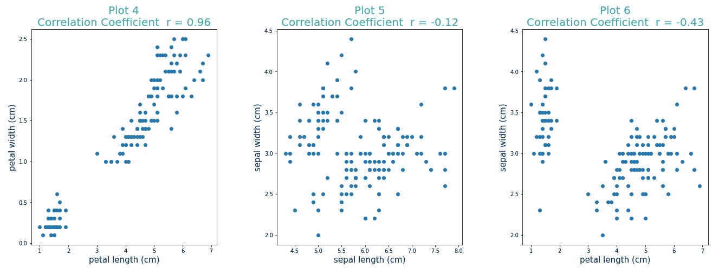

# 相关性和因果性——“啤酒和尿布”的故事？

> 原文：<https://towardsdatascience.com/correlation-and-causality-a-beer-and-diaper-story-27a064f4f995?source=collection_archive---------32----------------------->

## 用图解和例子理解相关性和因果关系

图片由 [SparrowsHome](https://pixabay.com/users/sparrowshome-4168069/?utm_source=link-attribution&amp;utm_medium=referral&amp;utm_campaign=image&amp;utm_content=4020617) 来自 [Pixabay](https://pixabay.com/?utm_source=link-attribution&amp;utm_medium=referral&amp;utm_campaign=image&amp;utm_content=4020617)

我猜想你正在为一家在线零售商设计推荐引擎。你做的一切都是对的(至少你是这么认为的……)。在结果中，你发现当啤酒被男性购买时，你的算法正在推荐尿布。牵强的想象？还是你的算法推荐错了还是对了？啤酒和纸尿裤有关联吗？或者他们有因果关系——可笑吧？

了解不同自变量和因变量之间的关系是探索性数据分析或机器学习模型构建的关键步骤之一。相关性、共线性、协方差和因果关系是理解这种关系的一些选项。在本文中，我们将讨论相关性和因果关系。

让我们更好地理解这些术语。相关性的正式定义是，在统计学中，相关性或依赖性是两个随机变量或二元数据之间的任何统计关系，无论是否是因果关系。(来源: [*维基百科*](https://en.wikipedia.org/wiki/Correlation_and_dependence) *)*

并且，因果关系(也称为因果关系，或原因和结果)被定义为— *是一个事件、过程、状态或对象(原因)对另一个事件、过程、状态或对象(结果)的产生产生影响，其中原因部分地对结果负责，结果部分地依赖于原因。(来源:* [*维基百科*](https://en.wikipedia.org/wiki/Correlation_and_dependence) *)*

唷…令人费解，对吧？这是大多数统计术语的问题。所以让我们来分解一下—

1.  有什么关联？
2.  什么是因果关系，即原因和结果？
3.  如何确定因果关系

# **有什么关联？**

简而言之，相关性是两个变量之间的关联或变化的度量。这两个变量之间的关系用强度和方向来解释。如果一个变量的增加导致第二个变量的增加，那么这两个变量是正相关的。如果一个变量的增加导致另一个变量的减少，那么两个变量是负相关的。同样，如果一个变量的变化导致另一个变量的显著变化，那么两个变量是强相关的，否则是弱相关的。

当讨论相关性时，最常见的是线性相关性(例如，身体的重量与身体的质量线性相关，即 W = mg，其中 m 是质量，g =重力或重力加速度)。然而，两个变量也可以具有非线性关系(例如，圆的体积和半径具有非线性关系)

**相关系数**

相关系数提供了幅度和方向的信息。基于不同类型数据(正态与非正态数据、连续与离散或分类数据、有序数据等)，有不同的方法来计算相关系数。)-

***皮尔逊积差相关系数*** :又称皮尔逊相关系数或简称皮尔逊系数，是一种衡量两个变量之间相关性的统计方法。该系数提供了线性关联强度的度量。皮尔逊相关系数从-1 到 1 不等。正负符号表示关系的方向，数值表示关系的强度。

图片由[萨加尔·加瓦利](https://medium.com/u/f938a1276339?source=post_page-----27a064f4f995--------------------------------)拍摄

让我们看看皮尔逊系数的例子:

1.  模拟数据(图 1、2 和 3)及其相关系数，以了解如何解释皮尔逊系数。

图片由[萨加尔·加瓦利](https://medium.com/u/f938a1276339?source=post_page-----27a064f4f995--------------------------------)

2.使用“来自 scikit-learn 库的 Iris 数据集”的皮尔逊系数

图片由[萨加尔·加瓦利](https://medium.com/u/f938a1276339?source=post_page-----27a064f4f995--------------------------------)

然而，为了有效地使用人员系数，应满足以下假设:

1.  两个变量都是连续的，并且是联合正态分布的。如果 aX +bY 具有正态分布，则两个变量 X 和 Y 被认为是联合正态分布的。
2.  数据中没有异常值。极端异常值对系数值有不适当的影响。(地块 7 和地块 8)

图片由[萨加尔·加瓦利](https://medium.com/u/f938a1276339?source=post_page-----27a064f4f995--------------------------------)

与皮尔逊相关系数类似，还有其他类型的相关系数，如**斯皮尔曼相关系数**，用于非正态分布的连续数据、有序数据或具有有效异常值的数据。其他类型的相关系数包括 Kendall、Phik 和 Cramér 的 V 相关系数等。

# 什么是因果关系，即原因和结果？

两个变量之间的因果关系可以用因果关系来定义。如果一个行为或事件(原因)导致了一个现象(结果),那么这个行为或事件和这个现象(另一个行为或事件，观察，结果)就有因果关系。

理解两个变量是否具有因果关系(即两个变量之间的因果关系)对于机器学习模型的建立是至关重要的。然而，在对相关的两个变量之间的关系进行分类时，必须小心谨慎；相关性并不意味着因果关系。

# 如何确定因果关系？

现在，要确定两个变量是否有因果关系，需要满足一定的条件。

1.  逻辑表明原因和事件应该是连续的事件，即一个接一个。这就形成了确定因果关系的第一个条件——**时间顺序**。例如，为了通过营销努力增加销售额，营销必须在 delta 增加销售额之前进行。
2.  **关联**:两个变量要有因果关系，首先要有关联。如果两个变量之间没有关系，就不可能有因果关系。通常使用相关系数来识别关联性。
3.  所有其他的因果解释都应该被排除。例如，变量 A 和 B 之间的关系可能是以下任何情况的结果:

*   事件 A 和事件 B 可能是事件 c 的结果。例如，空调销售量的增加不可能是冰淇淋销售量增加的原因，但两者都是夏季温度升高的结果。
*   事件 A 是事件 B 的必要条件，但不是事件 B 的原因。例如，燃烧需要氧气，但不是燃烧的原因。
*   事件 A 会导致事件 C，而事件 C 又会导致事件 D，最终导致事件 b。

确定因果关系的主要方法之一是进行实验(如假设检验、A/B 检验或对照组研究)并检验结果。在设计实验时，必须小心避免偏见，并检验上述标准的有效性。

然而，对于大多数数据科学家来说，这在大多数情况下也是不切实际的——在大多数情况下，数据已经被收集并提供给你了。在这种情况下，必须依赖前两个标准(时间排序和关联)，而对于第三个标准，则依赖业务用户。执行分析，完成建模并测试问题的结果。如果是有效的和想要的，一切都准备好了，如果不是，就必须回到绘图板，重新评估因果关系。

***你遇到过这样有趣的关系吗？请在下面的评论中告诉我——谢谢。***

**附言:**

1.  这里举的啤酒和尿布的例子是为了增加读者的兴趣。然而，啤酒和尿布似乎在零售行业的设置中没有任何关联。在这里阅读关于它的起源和争论的详细故事[。](https://tdwi.org/articles/2016/11/15/beer-and-diapers-impossible-correlation.aspx)
2.  绘制散点图和计算皮尔逊系数的代码(图 1-6):

代码由[萨加尔·加瓦利](https://medium.com/u/f938a1276339?source=post_page-----27a064f4f995--------------------------------)