# 直观解释相关性

> 原文：<https://towardsdatascience.com/correlation-explained-visually-4875448e8e56?source=collection_archive---------11----------------------->

## 皮尔逊相关的几何方法有助于深入理解它，并更准确地解释其结果。

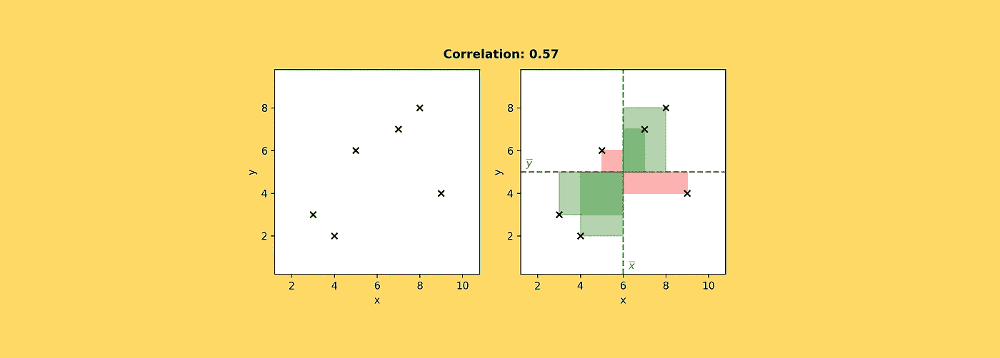

[图片由作者提供]

不时会有人过来说“我终于找到了皮尔逊相关的替代品”。事实是——尽管有缺点——皮尔逊相关系数(又称 T0 系数)因其简单、稳健和可靠而难以替代。

但是，冷硬公式可能有点难以把握。因此，我试图找到皮尔森的 *r* 的视觉解读，我希望它能帮助你(就像它帮助我一样)深入理解它。

# 从公式开始

你可能已经见过这个公式成千上万次了:

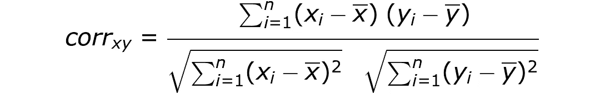

皮尔逊相关系数公式。[图片由作者提供]

如果你对代码比对数学更熟悉，那么你会更喜欢这个 Python 片段:

```
import numpy as npx = np.array([1,2,3,4])
y = np.array([7,6,8,9])codev_xy = np.sum((x — np.mean(x)) * (y — np.mean(y)))
ssd_x = np.sum((x — np.mean(x)) ** 2)
ssd_y = np.sum((y — np.mean(y)) ** 2)corr_xy = codev_xy / np.sqrt(ssd_x * ssd_y)
```

# 但是公式 ***是什么意思*** ？

该公式可以分解为三个具有一些著名名称的构造块:


皮尔逊相关的三个组成部分。[图片由作者提供]

**最有趣的部分是分子:**。其实**分母只是一个归一化因子，绑定了-1 和 1** 之间的相关系数(数学证明见[此处](https://math.stackexchange.com/questions/564751/how-can-i-simply-prove-that-the-pearson-correlation-coefficient-is-between-1-an))。实际上，在其他条件相同的情况下，相关性越大，相关系数越大。

这个配方可能看起来有点模糊，但是再看一眼，就很清楚它只由两种成分组成:

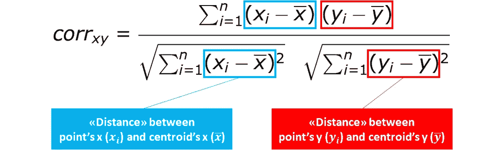

皮尔逊相关系数是由“距离”构成的。[图片由作者提供]

而且，因为我们只处理二维( *x* 和 *y* )，所以在一个图中表示它们很容易。

所以，让我们借助一些数据点，将相关性带入生活吧！

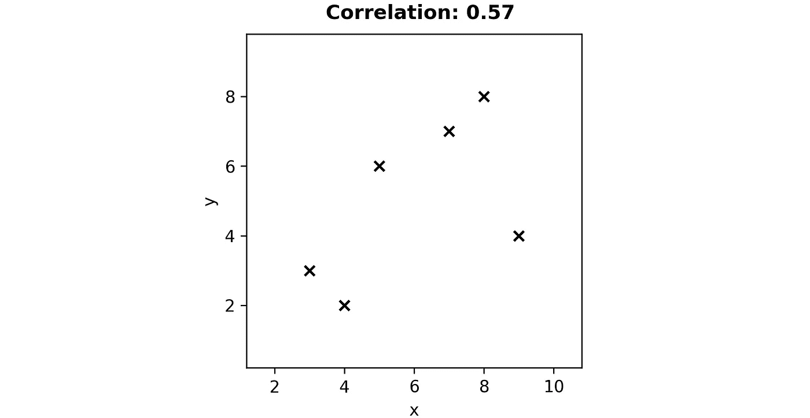

一些数据点。[图片由作者提供]

从几何学上来说，共生现象很容易被发现。它只是每个数据点和质心之间的所有“矩形”的面积之和(即以 *x* 的平均值作为其自身的 *x* 以及以 *y* 的平均值作为其自身的 *y* 的点)。

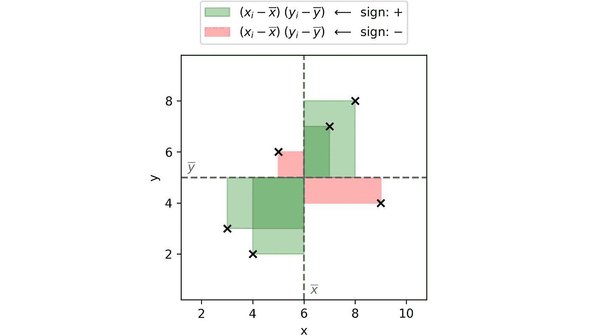

相互依存的图形解释。[图片由作者提供]

真正起作用的是每个矩形的“符号”!事实上，

*   **右上**和**左下象限**(图中绿色)中的矩形有**正号**，因此它们被添加到 codeviance 中。当 *x* 和 *y* 都高于(或都低于)平均值时，就会出现这种情况。换句话说，它们是**一致的**。
*   **左上**和**右下象限**(图像中的红色)中的矩形有**负号**，因此它们被从余度中减去。当 *x* 高于(低于)平均值，而 *y* 低于(高于)平均值时，就会出现这种情况

因此，当大多数数据点相对于 *x* 和 *y* 一致时，我们可以近似地说**相关性(以及相关性)为正。反之，大部分点不和谐时为负。想想也很有道理:codeviance 试图表达 *x* 和 *y* 如何“一起改变”。**

为了完整起见，我们也可以将分母的构件形象化:

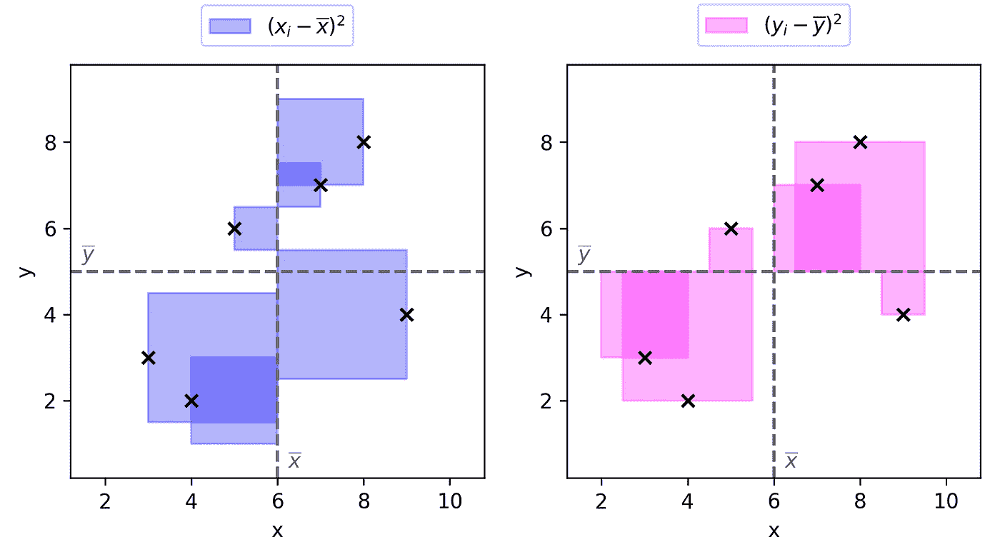

离差平方和的几何解释。[图片由作者提供]

最后的结局是:

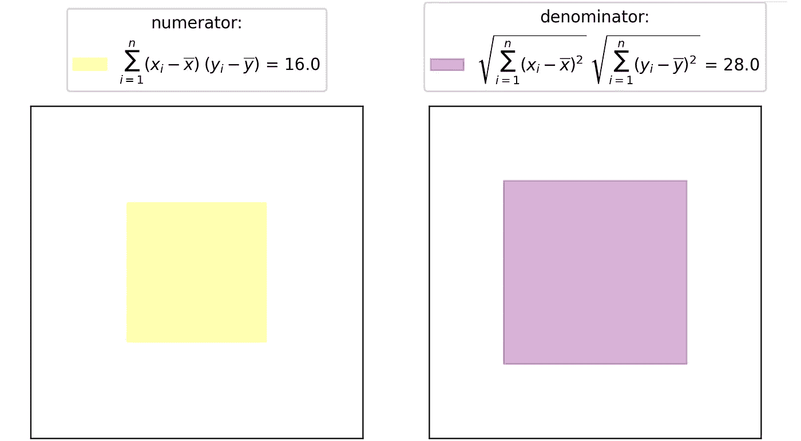

分子和分母的最终结果。[图片由作者提供]

在大多数值得注意的情况下，现在很容易弄清楚为什么相关系数是现在这个样子。例如，让我们看看其中的两个:

1.  辛普森悖论；
2.  对称关系。

# 1.辛普森悖论

辛普森悖论是数据科学面试中反复出现的话题。这让很多人感到困惑。但是希望，多亏了这种图形化的方法，你再也不会感到困惑了！

我们举个例子，灵感来自 [ResearchGate](https://www.researchgate.net/figure/Example-of-Simpsons-Paradox-Despite-the-fact-that-there-exists-a-negative-relationship_fig1_256074671) 。

你有两个群体:男性和女性。你对两组都进行了一些医学治疗(而且，由于男性更高更重，他们接受了更高的剂量)。你计算剂量和恢复之间的相关性，它是强正的:0.68。很好，这意味着药物是有效的，对吗？

嗯，等一下。你看一下两组的曲线图，你会注意到下面的情况:

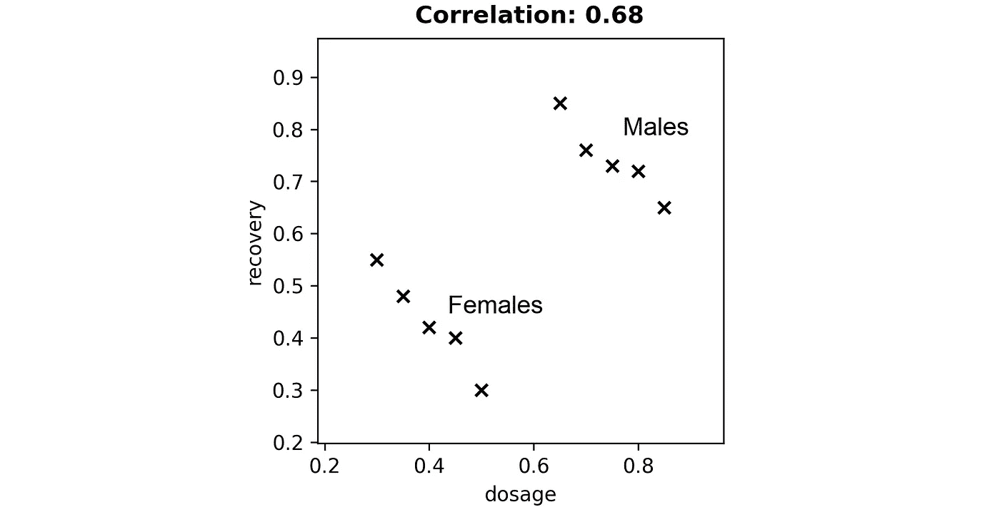

一些数据点说明了辛普森悖论。[图片由作者提供]

虽然在每组中剂量和恢复之间存在反比关系(这应该与负相关相关)，但是您的皮尔逊*r*是强正的。这是为什么呢？

通过我们的几何解释，我们可以立即了解正在发生的事情:

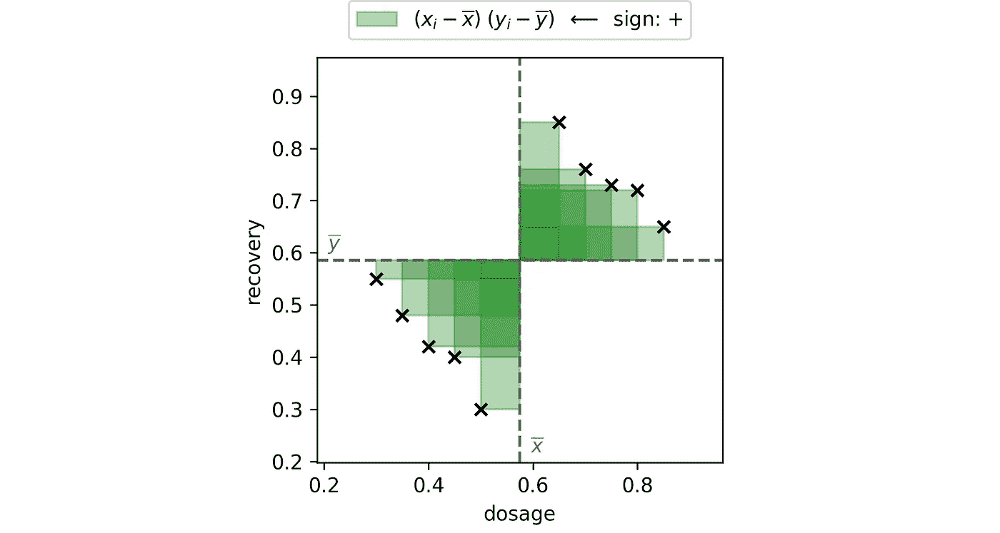

辛普森悖论:计算偏差。[图片由作者提供]

实际上，与剂量平均值和恢复平均值相比，所有男性都在右上象限，而所有女性都在左下象限。因此，即使在每个单独的组中，这种关系是负的，但是这种相关性在很大程度上是正的。因此，正相关。

将所有东西放在一起:

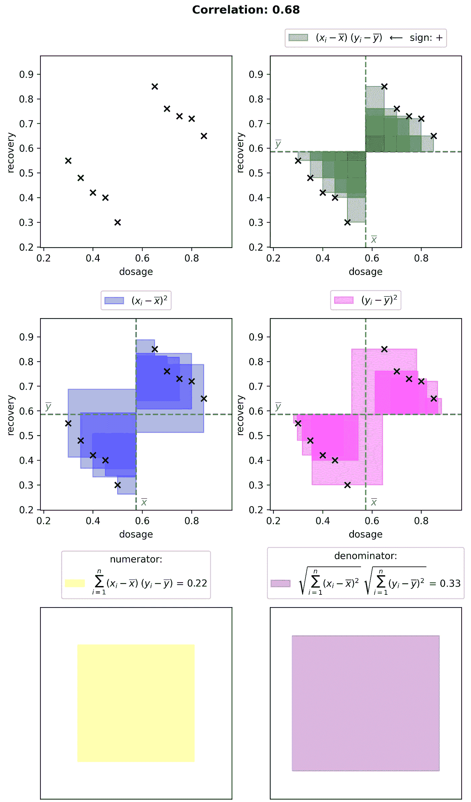

辛普森悖论的几何解释。[图片由作者提供]

# 2.对称关系

当两个变量具有“对称”关系时，它们的相关性将(接近)为零。

为了理解为什么会发生这种情况，让我们取一条关于 *y* 对称的抛物线(但对于 *x* 也是一样)。

现在，很明显为什么分子是零。事实上，左侧的所有数据点都与右侧的数据点“抵消”(即，它们具有相反的符号)。

我们来直观的证明一下:

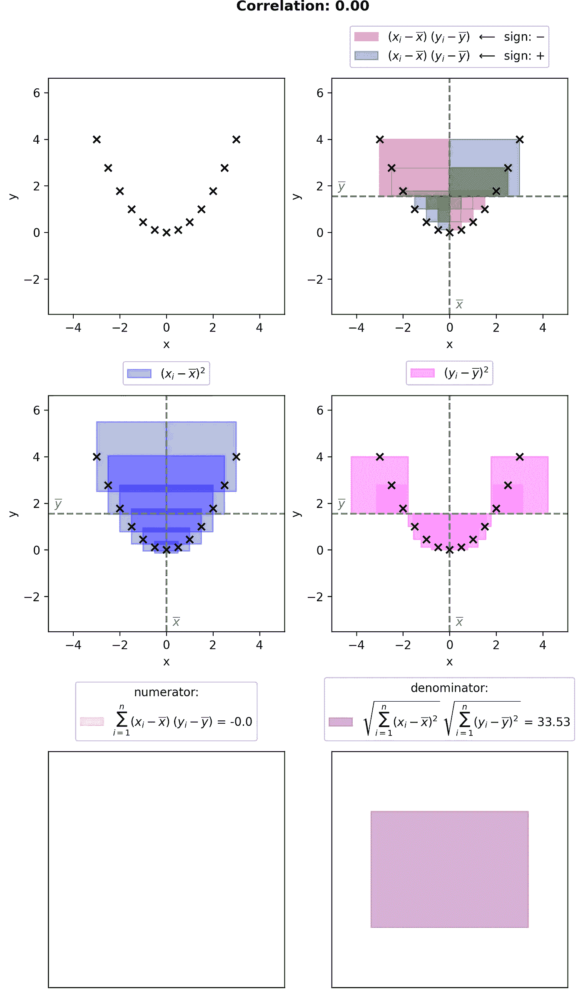

抛物线皮尔逊相关的几何解释。[图片由作者提供]

感谢您的阅读！我希望这篇文章对你有用。

如果你对我在剧情中使用的 Python 函数感兴趣，你可以在[Github 项目](https://github.com/smazzanti/correlation_explained_visually/blob/main/correlation_explained_visually.ipynb)中找到它。

我感谢反馈和建设性的批评。如果你想谈论这篇文章或其他相关话题，你可以发短信给我[我的 Linkedin 联系人](https://www.linkedin.com/in/samuelemazzanti/)。