# 同量异位标记蛋白质组学中的相关性

> 原文：<https://towardsdatascience.com/correlation-in-isobaric-labeling-proteomics-926045214f96?source=collection_archive---------44----------------------->

## 在基于同位素标记质谱的蛋白质组学中，基本统计量是如何表现的？

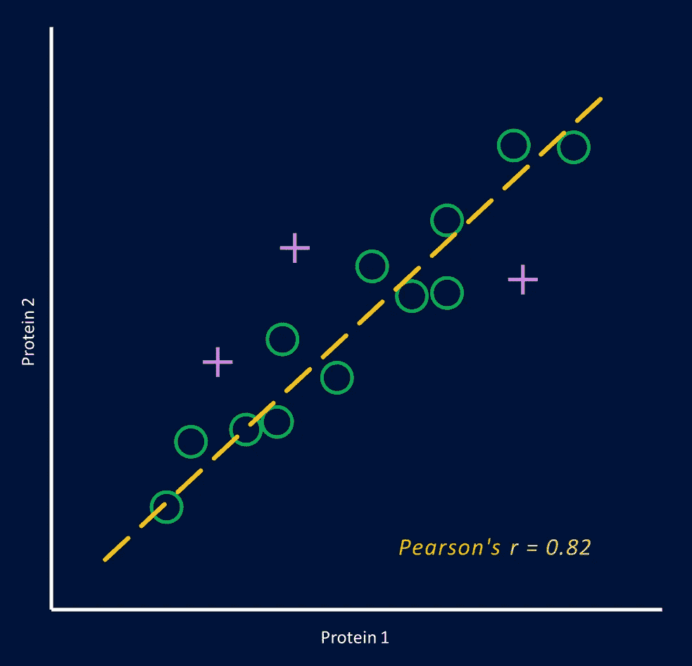

作者图片

皮尔逊相关系数用得很多。介绍完毕。我们利用它作为各种数据集中线性相关的量度，今天我想讨论一下这种无处不在的统计指标在蛋白质组学中的应用。我将重点介绍基于质谱(MS)的同量异位标记蛋白质组学，这是一种在生物学和临床研究中测量相对蛋白质丰度的流行技术。如果你想了解更多关于这项技术的信息，可以看看我之前的文章或者 Rauniyar 和 Yates 的开放访问 T2 评论。

## 假设和数据结构

同量异位标记蛋白质组学可以应用于不同种类的实验，但是典型的设计具有以下共同点:

*   研究中的样本彼此相似，它们属于相同的生物物种和相同的类型，例如，都是血浆样本。与此相关，我们预计**在不同的条件下**，大多数蛋白质的丰度保持相当稳定。
*   从每个样品中取出等量的蛋白质材料，例如，通过具有分光光度检测的生化蛋白质分析来测量。例如，均衡蛋白质含量通常是可行的，而精确估计活检组织的干重可能是困难的。

但是固定蛋白质总量意味着我们可以有效地利用相对量。这反过来意味着同量异位标记蛋白质组数据是 [**组成的**](https://en.wikipedia.org/wiki/Compositional_data) ，对组成数据应用相关性分析应该谨慎，正如在许多出版物中所讨论的，例如，在 Lovell 和合著者【2】的论文[中，作者清楚地说明了解释组成基因表达数据相关性的危险。](https://journals.plos.org/ploscompbiol/article?id=10.1371/journal.pcbi.1004075)

此外，同量异位标记质谱数据由于其获取方式而具有内在的组成性，正如 O'Brien *等人*【3】在 [2018 年的一篇论文中所讨论的。简而言之，标记批次中所有样品的定量信号在相同的光谱中获得，并且信号的总丰度通常受到限制，这取决于环境和某些获取设置。这意味着一批中的肽信号强度不是相互独立的:](https://pubs.acs.org/doi/10.1021/acs.jproteome.7b00699)


同时测量整个标记批次的同量异位报道分子强度，并且通常不是相互独立的。作者图片

然而，尽管数据具有多种成分的性质，但对于相关性分析来说，事情并不都是令人沮丧的。由于样本之间很大程度上彼此相似，我们预计只有参与有趣生物过程的某些蛋白质会(有希望)在样本之间发生急剧变化，而可能不是最丰富的蛋白质。任何特定蛋白质对总丰度的影响都可以忽略不计。然而，从鸟瞰图来看，每个样本中上升和下降的蛋白质应该相加。那么，同量异位素标记数据集的关联情况是怎样的呢？

为了说明真实数据的相关性，我将使用由十个*大肠杆菌*样本组成的研究。MS 数据可从 PRIDE archive 网站获得，我已经重新处理了文件，并将蛋白质丰度表和所有相关代码放入 GitHub 储存库。在加载、过滤和对数转换报道分子强度值后，我们得到列中有 10 个样品、行中有 1836 个蛋白质的表，其中 Uniprot 成员作为索引:

数据集包括 5 种不同的遗传/刺激条件，每种条件在 2 个生物重复中平行制备。重复对(1/2、3/4、5/6、7/8、9/10)中的样品非常相似，而条件之间存在显著差异。正如你在上面看到的，除了 P25665，对数转换的报告强度值在每一个显示的蛋白质行中都是稳定的，这符合我们对样品相似性的假设。这些值的分布并不完全像钟形曲线，但是它们是对称的、单峰的，并且具有非常接近的中间值:

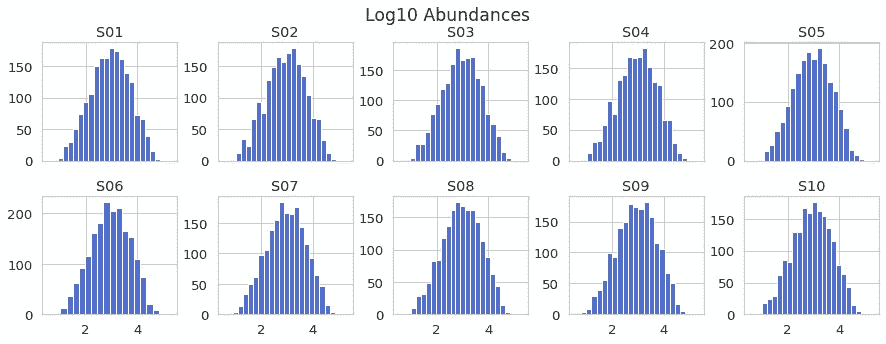

作者图片

事实上，这些值非常集中，因为它们已经被总肽强度标准化。由于我们提取了等量的蛋白质，我们预计每个样品的总信号强度大致相等。如果不是后者，我们可以假设出现了问题，例如蛋白质浓度测量或样品制备过程中的异常，可以通过调整总丰度或中值丰度进行纠正。在这种情况下，在处理 LC-MS 文件的过程中，每个样品的总强度都被提取出来，然后进行均衡。蛋白质表中的列和确实非常相似:

```
dfLog.sum()S01    5407.358507
S02    5415.529107
S03    5421.951839
S04    5413.545848
S05    5420.977531
S06    5410.352606
S07    5424.180405
S08    5425.054158
S09    5399.895850
S10    5405.012957
dtype: float64
```

总和略有不同，可能是因为平衡发生在工作流程的中间，一些肽和蛋白质在最终报告前被过滤掉。是的，这种规范化强化了数据的组合性质！但我认为这是合理的，因为这是根据基于实际相等蛋白质含量的实验设计完成的。它不创造组合性，而仅仅反映实验性设计。

## 样本-样本相关性

让我们来看看样本间对数 10 转换的同量异位素报告子丰度的成对相关性。计算的一个原因是评估样本之间的相似程度。然而，查看散点图，我们注意到所有的相关性都非常好，无论是在生物重复之间还是在不同条件之间:

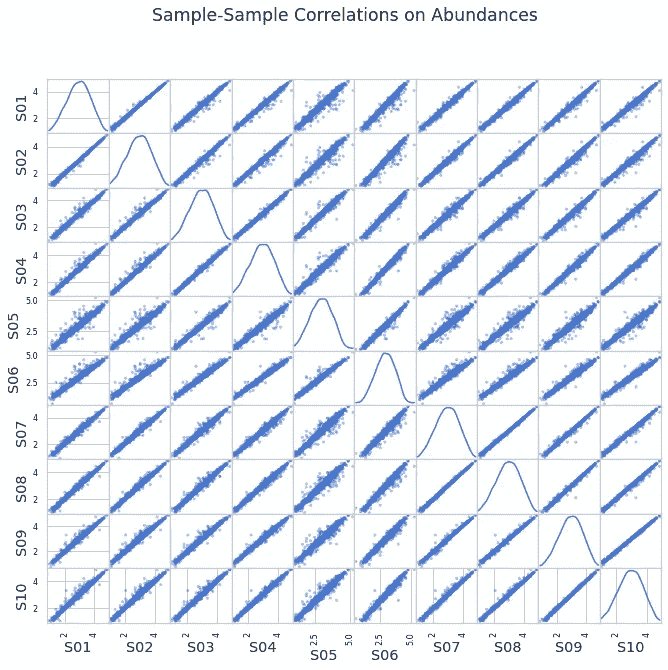

作者图片

皮尔逊相关系数都很高，在 1.0 左右:

很容易看出它们如此相似的原因:定量光谱中的总强度取决于绝对肽量和其他因素，并且对于批次中的所有样品，它同步变化。由于大多数蛋白质在样品间保持相对恒定，对于大多数数据行，所有样品的绝对信号强度将非常相似，产生高相关系数。

不过，我们不需要查看绝对信号强度。该分析针对的是相对蛋白质丰度，那么我们为什么不缩放数据呢？将每行中的值除以该行中的平均强度，并对缩放后的值进行对数变换后，我们得到了结构非常不同的数据集。大多数值现在集中在 0 附近，分布看起来比以前更像钟形:

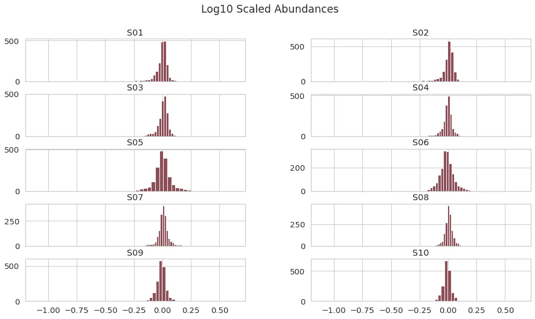

作者图片

缩放后的数据集具有完全不同的相关性前景:

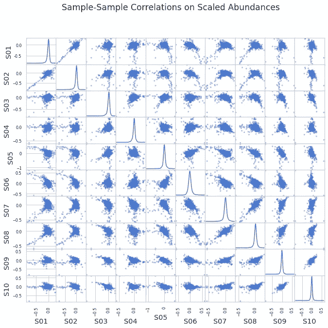

作者图片

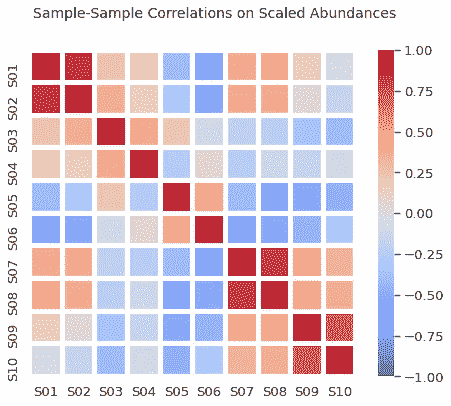

作者图片

现在有了正相关和负相关，这是意料之中的，因为我们已经将每个蛋白质的值的总和限制为一个常数。我们有效地增加了另一个层次的组合性！但是我们能从这个多成分数据集中的相关性推断出有用的信息吗？我们有成对的 1/2、3/4 等生物学重复，它们之间的相关性确实很好，而生物学上不同的样品之间的相关系数的绝对值较低，符号为正或负。所以在某种程度上，这些相关性确实揭示了样本之间的相似关系。

缩放同量异位素数据的另一个实用方法是使用其中一个样本作为分母。例如，该样本是疾病研究中的健康对照，或者是可用于数据集之间可比性的参考样本。假设样品 S01 是我们数据集的分母:


作者图片

所有的相关性都变成了正号！我们还没有引入蛋白质值的限制，就像我们对蛋白质平均值进行缩放时一样，所以我们不希望正相关和负相关处于某种平衡状态。同时，我们仍然看到生物复制之间的相关性更高。

样本间的相关性可能不是比较重复的完美方法，因为相关性的前景是由分母的选择决定的。如果我们除以对照，与对照非常不同的样品可能表现出高相关系数，而对照样样品可能具有低的成对相关性，这仅仅是因为经对数变换的相对强度在 0 附近，并且受噪声的影响大于强相对变化。

## 蛋白质-蛋白质相关性

蛋白质丰度的成对相关性可用于构建在全球范围内表征蛋白质/基因之间关系的相关性网络。我们可以计算所有蛋白质之间的相关性，将行为相似的蛋白质分组，找到各组之间的关系等等，这非常酷[5]！这是我们的*大肠杆菌*数据集的蛋白质-蛋白质相关矩阵，根据对数强度计算得出:

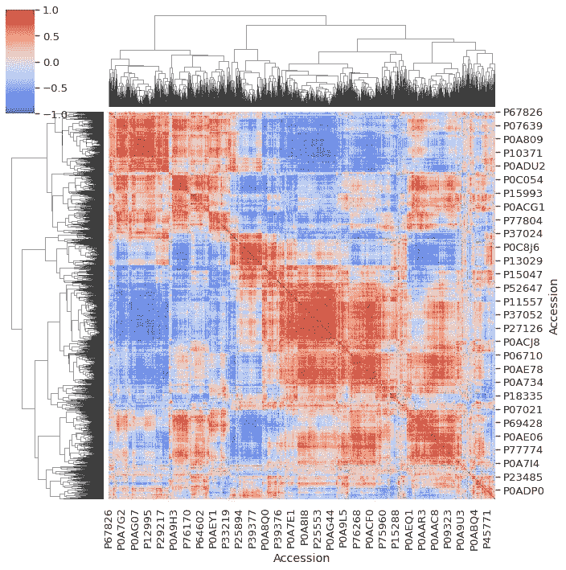

作者图片

看起来很迷人！正负符号相关性或多或少处于平衡状态，鉴于数据集的组成性质，这是可以预料的:随着一些蛋白质的相对强度下降，其他蛋白质也下降。较低的绝对值是普遍的，如果我们取相关矩阵，提取上面的三角形而不取对角线，展平阵列并构造直方图，这就变得很清楚了:

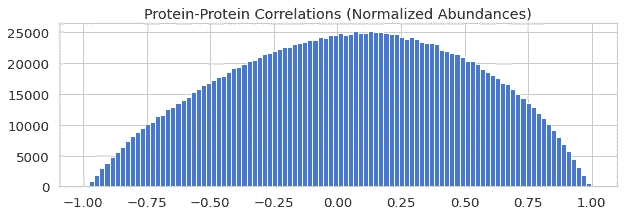

作者图片

我们预计蛋白质-蛋白质相关性不会受到重新缩放的影响。事实上，如果我们采用均值标度表并计算相关系数，分布结果是相同的:

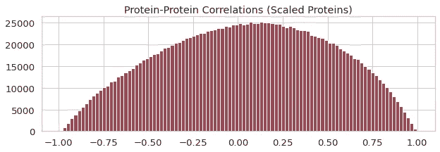

作者图片

我们的原始数据矩阵包含 5 个不同的条件，每个条件 2 个重复。虽然观察组内重复的再现性很重要，但我们可以对重复值进行平均，并获得每个条件下每个蛋白质的单个值，用于进一步的生物学解释。从图片中移除生物可变性使得关联图更加清晰:

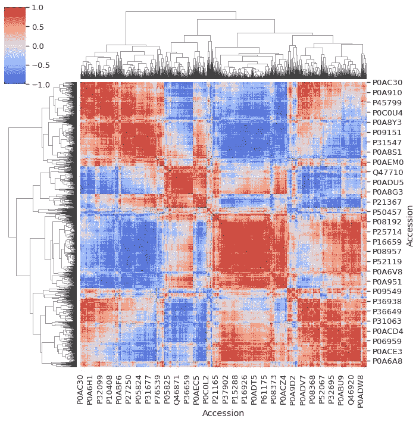

作者图片

正如我们之前讨论的，根据实验设计，数据集已被归一化为每个样本中相等的总丰度。如果没有执行标准化会发生什么？让我们模拟蛋白质丰度的系统偏差，假设 S02 的浓度测量值错误，我们采集了多余的材料，而 S04 和 S08 的平均强度较低，假设过滤单元在样品制备过程中悄悄泄漏:

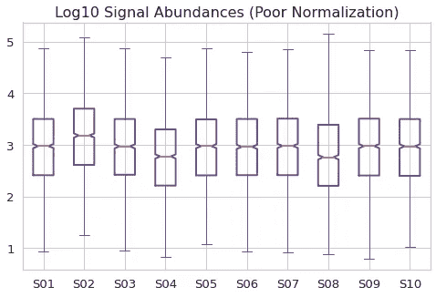

作者图片

不规则是明显的，但也没那么糟糕吧？相比之下，相关矩阵的变化是剧烈的:

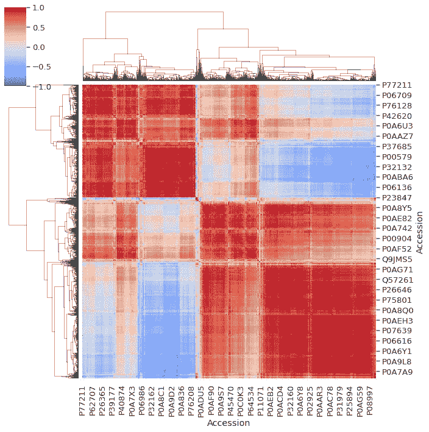

作者图片

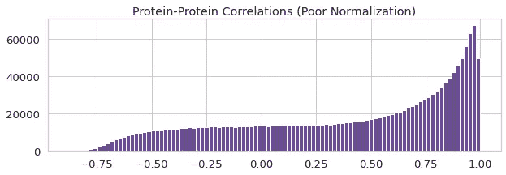

作者图片

蛋白质在全球范围内变得高度相关！回到假设，我们让大多数蛋白质保持在几乎恒定的水平，当我们引入高于背景噪声水平的偏移时，它对受影响样品中的强度的影响最大。我认为这加强了在 LC-MS 数据处理过程中标准化的重要性:如果我们研究相似的样品并计算相同的蛋白质含量，我们最好确保样品平均值/中位数在结果数据集中没有偏差，因为我们的假设表明分布应该集中。

## 结论

我们已经查看了同量异位标记基于 MS 的蛋白质组数据中的样本-样本和蛋白质-蛋白质相关性，蛋白质表和 Python 代码可在 GitHub 上获得[。我们已经讨论了数据的组成性质，这意味着在解释相关性时应该谨慎。样品间的相关系数受我们测量蛋白质值的方式影响很大，无论样品的性质如何，未经测量的报道强度的相关系数都非常高。蛋白质-蛋白质相关系数受到总样品丰度标准化的强烈影响。](https://github.com/dev-ev/isobaric-correlations)

## 参考

[1] N .劳尼亚尔和 J. R .耶茨，三。[鸟枪法蛋白质组学中基于同量异位标记的相对定量](https://pubs.acs.org/doi/abs/10.1021/pr500880b) (2014)，蛋白质组学研究杂志，13，12，5293–5309。开放访问。

[2] D .洛弗尔*等人*。[比例性:相对数据相关性的有效替代](https://doi.org/10.1371/journal.pcbi.1004075) (2015)，PLOS 计算生物学 11(3): e1004075。开放访问。

[3] J.J .奥布莱恩*等人*。[组成蛋白质组学:空间限制对利用同量异位标签进行蛋白质定量的影响](https://pubs.acs.org/doi/10.1021/acs.jproteome.7b00699) (2018)，J. Proteome Res. 17，1，590–599。根据 [CC-BY license](https://pubs.acs.org/page/policy/authorchoice_ccby_termsofuse.html) 开放访问。

[4]j . jerlstrm Hultqvist*等* [一种噬菌体酶诱导细菌代谢扰动，赋予一种新的混杂功能](https://doi.org/10.1038/s41559-018-0568-5) (2018)，Nat Ecol Evol 2，1321–1330

[5]朗菲尔德和霍瓦特。 [WGCNA:用于加权相关网络分析的 R 包](https://bmcbioinformatics.biomedcentral.com/articles/10.1186/1471-2105-9-559) (2008)，BMC 生物信息学 9，559。开放访问。