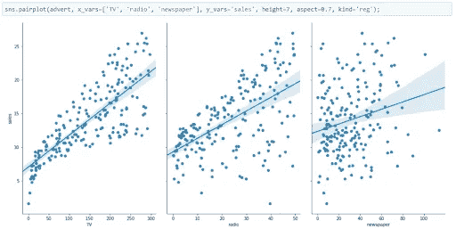

# 相关性与因果性

> 原文：<https://towardsdatascience.com/correlation-vs-causation-3e3481c71fef?source=collection_archive---------37----------------------->

## 比较相关性和因果性

Benjamin Behre 在 [Unsplash](https://unsplash.com?utm_source=medium&utm_medium=referral) 上的照片

相关性也称为关联。它指的是两个不同实体或数据点之间的关系。当一个事物上升时，另一个事物下降，反之亦然，这意味着它们一起变化。

让我们以一家跨国公司为例，该公司正在研究其过去 10 年的销售数据，这些数据包含每年以美元计算的销售额和不同的特征，如通过电视、广播和报纸投放的广告金额。

为了理解这些数据，我们创建了散点图，并发现所有这些特征都与销售额呈线性正相关。如果我们增加在这些广告上的花费，销售额也会增加，反之亦然。

来源([作者](https://www.linkedin.com/in/himanshusharmads/))

正如你在这里看到的，我们无法明确说明是销售导致了广告的增加，还是广告导致了销售的增加，或者是否有第三个因素导致了销售和广告的增加。这是因果关系的问题，因为在这里我们不能决定什么导致什么。

为了理解什么是因果关系，让我们举个例子。但在此之前，我们应该知道，因果关系是指由于某种原因导致的事情，如德里因 covid 病例增加而实行封锁。在这种情况下，我们可以说增加的 covid 案例导致了锁定。

让我们举一个例子，我们正在研究德里由于不同原因造成的事故数量，在这个数据集中，我们发现大多数事故发生在司机打电话的时候。那么，这是否意味着如果你在德里打电话，你会遇到事故？

答案是否定的。因为事故背后的主要原因可能是粗心大意或打电话时没有注意交通状况。我们需要明白，相关性是一个量化两个不同事物之间关系强度的数字量。而因果关系可以被认为是一个结论，它表明某事物引起了某事物。

因此，在预测特征和目标变量之间的因果关系和相关性之间的差异时，理解这一点非常重要。我希望读完这篇文章后，你能清楚地理解因果关系和相互关系。

本文是与 [Piyush Ingale](https://medium.com/u/40808d551f5a?source=post_page-----3e3481c71fef--------------------------------) 合作的。

# 在你走之前

***感谢*** *的阅读！如果你想与我取得联系，请随时通过 hmix13@gmail.com 联系我或我的* [***LinkedIn 个人资料***](http://www.linkedin.com/in/himanshusharmads) *。可以查看我的*[***Github***](https://github.com/hmix13)**简介针对不同的数据科学项目和包教程。还有，随意探索* [***我的简介***](https://medium.com/@hmix13) *，阅读我写过的与数据科学相关的不同文章。**