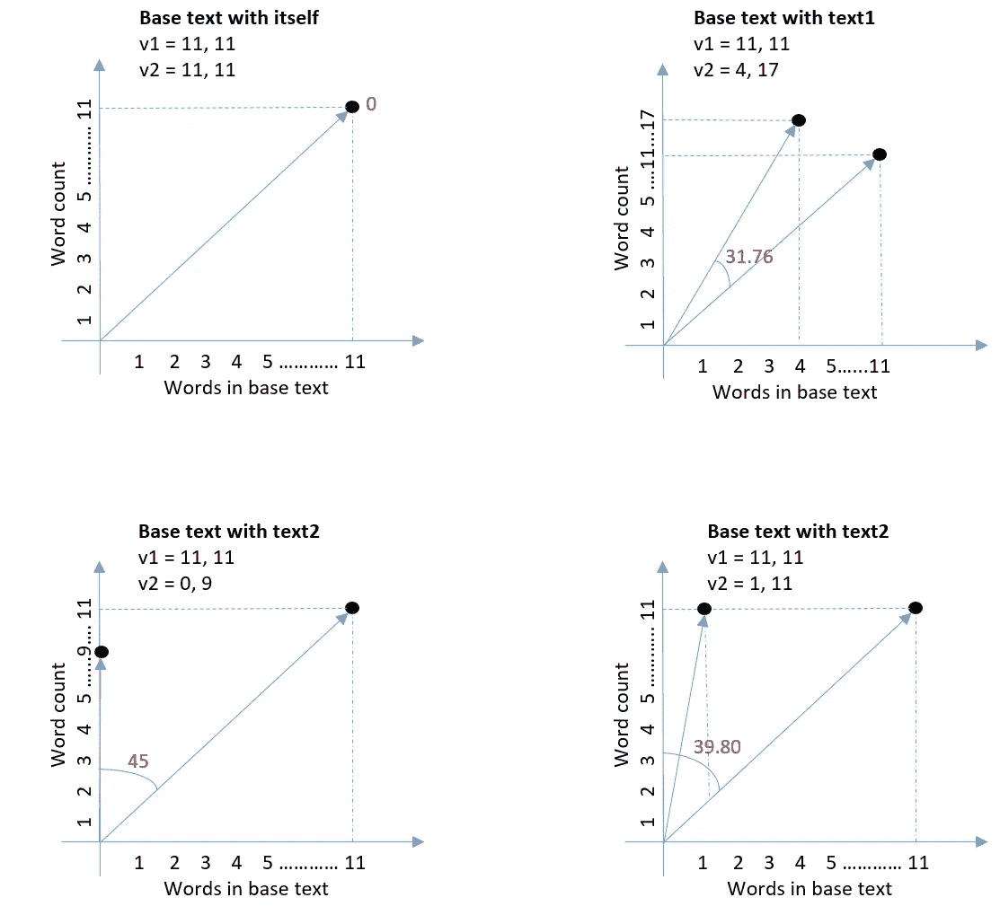
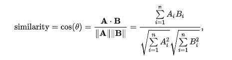
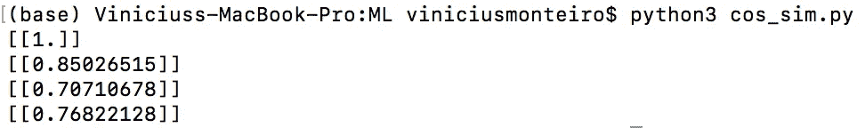

# 余弦相似直觉及其 Python 实现

> 原文：<https://towardsdatascience.com/cosine-similarity-intuition-with-implementation-in-python-51eade2674f6?source=collection_archive---------13----------------------->

## 包括使用余弦相似性公式的实际计算


图片由来自[皮克斯拜](https://pixabay.com/?utm_source=link-attribution&utm_medium=referral&utm_campaign=image&utm_content=702784)的[皮特·林福思](https://pixabay.com/users/thedigitalartist-202249/?utm_source=link-attribution&utm_medium=referral&utm_campaign=image&utm_content=702784)拍摄

机器学习中经常会出现这种情况，你需要比较数据，分析它们有多相似。

例如，在[自动文本摘要](https://www.researchgate.net/publication/220974615_Automatic_Text_Summarization_Using_a_Machine_Learning_Approach)中，在训练期间，您需要识别原始文档中的哪些句子与参考摘要中的句子相似。评估摘要的质量也需要这样做。

或者你可能需要将一份文件分类，比如说，科学、育儿或技术。

一种用于计算两个文本之间相似度的技术叫做[余弦相似度](https://www.sciencedirect.com/topics/computer-science/cosine-similarity)。

考虑下面的基本文本和其他三个文本。我想测量文本 1、文本 2 和文本 3 与基本文本的相似程度。

```
**Base text** Quantum computers encode information in 0s and 1s at the same time, until you "measure" it**Text1**
A qubit stores "0 and 1 at the same time" in the same way how a car travelling north-west travels north and west at the same time**Text2**
Considering how quickly the brain reorganizes, it’s suggested that dreams are a defence mechanism**Text3**
Computers will come with more processing power due to more advanced processors
```

你是怎么做到的？

# 文本变成了载体

这个案例很简单，可以帮助你清楚地想象它是如何工作的。

首先，你需要选择——在什么方面相似？！比如同样字数的两个文本相似吗？

这里有两个属性，或称为特征，我用来衡量相似性。

*   字数统计(无介词或冠词)
*   基础文本中的单词



图一。作为向量表示的文本。按作者。

这两个属性可以被认为是向量的元素，如图 1 所示。如您所见，X 轴和 Y 轴代表了这些特征。

这两个矢量之差形成一个角度。这个角度告诉你它们有多相似或不同。

0 度角=它们是一样的。

90 度角=它们彼此相反。

# 余弦相似性

虽然知道角度会告诉你文本有多相似，但最好是 0 到 1 之间的值。1 表示文本相同。

这就是余弦相似性出现的原因。这是计算它的公式。



图二。来源:[https://en.wikipedia.org/wiki/Cosine_similarity](https://en.wikipedia.org/wiki/Cosine_similarity)

这里有一些数学让你玩得开心。

a 和 B 是两个文本的向量表示。分子 A . B 表示两个向量的点积。||A 或 B||表示矢量的大小。

让我们来计算其中一对——基础文本和文本 1。

```
Let A be the Base text vector = 11, 11
Let B be text1 vector = 4, 17**Dot product of A and B** = 11 * 4 + 11 * 17 (A first element times B first element + A second element times B second element)
= 44 + 187
= 231The magnitude is taken by squaring each element and adding them up, then taking the square root.||A|| = **√**11**² +** 11²
||B|| = **√**4**² +** 17²||A|| = 15.5563
||B|| = 17.4642||A||*||B|| = 15.5563 * 17.4642
= 271.6783Cos sim = 231 / 271.6783
**= 0.85 (85% similar!)**
```

# Python 代码

代码很简单，特别是因为我使用了一个内置函数来计算余弦相似度。

Python 代码。来源: [codebasics](https://www.youtube.com/watch?v=m_CooIRM3UI) 。

结果如下:



# 结论

正如您在结果中看到的，文本 2 与基础文本不太相似。Text2 是关于梦的，和关于量子计算机的基础文字没有任何共同之处。

但是，你有没有注意到，有 70%的相似！？这不可能。

那是因为我选的功能不太对。单词特别重要。除非这是我真正想要的——字数相似的文本是相似的，主题无关紧要……这是对文本比较的一种奇怪的理解。

在以后的文章中，我将更多地探索现实世界中用于特性选择的技术。

感谢阅读。

***延伸阅读:***

[](https://medium.com/programming-for-beginners/the-other-approach-to-solve-linear-regression-90be71778b58) [## 求解线性回归的另一种方法

### 正规方程介绍。

medium.com](https://medium.com/programming-for-beginners/the-other-approach-to-solve-linear-regression-90be71778b58) [](https://medium.com/programming-for-beginners/unsupervised-versus-supervised-machine-learning-1e55aeb3d2df) [## 无监督与有监督的机器学习

### 关于两种学习方式的初学者指南

medium.com](https://medium.com/programming-for-beginners/unsupervised-versus-supervised-machine-learning-1e55aeb3d2df)