# 机器学习有可能预测到 GameStop 的疯狂吗？

> 原文：<https://towardsdatascience.com/could-machine-learning-have-predicted-gamestop-madness-aae8d9f7f77e?source=collection_archive---------18----------------------->

## 因为数据也有话要说…

马克西姆·霍普曼在 [Unsplash](https://unsplash.com?utm_source=medium&utm_medium=referral) 上的照片

我非常怀疑到今天为止你仍然不知道过去几天 GameStop 发生了什么。但是，假设你不知道。那没问题，除了一些头条，我也没有。像任何其他被误导的人一样，我决定阅读一些文章来了解正在发生的事情。经过进一步的调查，我被这个现象的名字震惊了。出现了一个新名词:“模因股票”。

我不想详细描述发生了什么，因为有很多信息，你会从其他伟大的、更有见识的作家那里找到更好的解释。但是，嘿，一个简短的概述不会伤害任何人。

GameStop 是一家中型零售商，没有什么特别之处。上周它的股票从 20 美元涨到了 400 多美元。最令人印象深刻的是，没有任何关于他们新的创新战略的消息，也没有关于他们销售的令人难以置信的报告，也没有他们聘请了 500 名数据科学家在他们的业务中使用人工智能。没什么。

> 股价上涨仅仅是因为 Reddit 中的协调小组决定投资它。

如果你想知道更多的原因，请在此之后再做，我会为你重新定向一些很棒的资源。如果你从这里开始，你可以和我一起试着用股市数据来理解这一点。

作为一个有一定金融知识的数据科学家，我会全程指导我的思考过程。我们将深入研究这个问题，像任何其他问题一样，思考是否可以使用机器学习来预测发生的*。*

# *股票市场数据*

*谈到股票市场，这有点令人生畏:市场上有数万亿种策略和指标，只有少数几个“定量分析师”可以声称知道所有这些。如果你不是其中之一，那你来对地方了！。我不认为你在这里需要任何这方面的知识。我将通过一些关于市场提供的最相关信息的直观解释来指导你，这对你理解将要发生的事情应该绰绰有余。*

*在我们继续之前，有必要介绍两个术语:数量和价格。在它们上面你会找到预测股票市场所需的大部分信息。 ***成交量*** 是指在特定时间范围内买入或卖出的资产数量。 ***价格*** 反映了——不出所料——交易的平均价格。*

*像任何其他数据科学问题一样，我们应该从查看数据开始，以便更好地理解上下文。感谢 [yfinance](https://pypi.org/project/yfinance/) ，我们可以收集数据，使用 [mplfinance](https://github.com/matplotlib/mplfinance) 我们可以顺利地将价格和交易量结合在一个可视化界面中。在下图中，你会发现 GameStop 的股票。*

*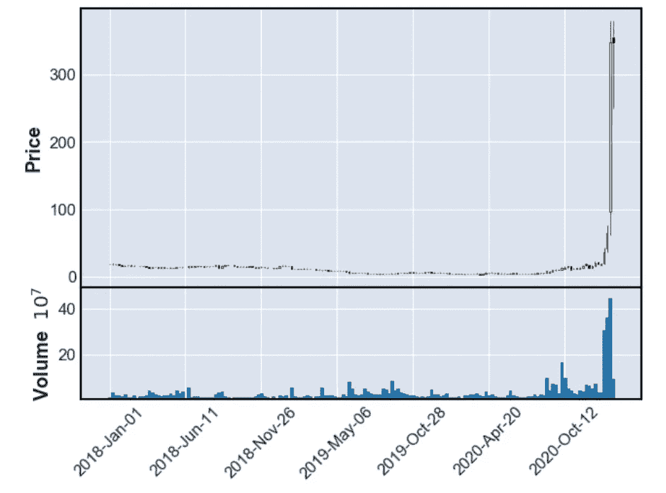*

*图片作者。这里的代码。*

*这里我想让你注意两件事。首先，价格非常稳定，并且在缓慢下降。第二， ***成交量一直没有很高，直到现在*** 。这一点非常重要，因为我希望大家关注音量。让我们把上个月的情况放大一点。*

*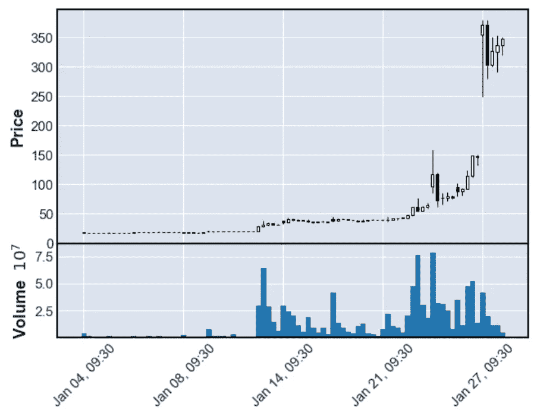*

*图片作者。这里的代码[为](https://gist.github.com/MauricioLetelier/9bf1c03cc7bb36b755eda67960269b64)。*

*1 月 13 日成交量大幅增加。该股当天收盘时，价格几乎翻了一倍。在接下来的日子里，交易量逐渐减少，在 1 月 22 日达到最大值。*

*如果我们看到这一点，我可能会认为，在接下来的几天里，成交量一次又一次地推高了价格。但你可能会说，“不是数量，而是人”。*

> *数据科学家实际上做的是检查数据是否反映了一些潜在的现实。*

*在这里，数量增加的原因是集体的、协调的努力，而不是数量本身。但一旦成交量实际增加，数据揭示出“有事”正在发生的信息。*

*不可否认的事实是，其他人用成交量来投资。正是在那里， ***你已经失去了真正原因*** 的每一条线索。你无法知道这只股票因为 Reddit 的影响涨了多少，又因为不寻常的成交量涨了多少。对我们来说幸运的是，交易量还在，它还在给我们关于价格的有价值的信息。*

*仅仅看一个案例可能是不够的。读得多一点，我意识到这种事以前也发生过。对于赫兹:*

*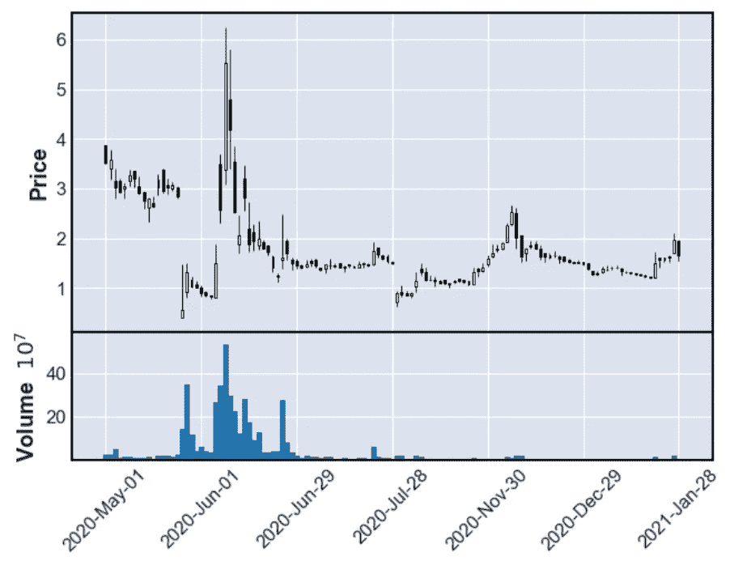*

*图片作者。这里的代码[是](https://gist.github.com/MauricioLetelier/2ee2063732e55c572a3bca268ff1afa2)。*

*柯达。*

*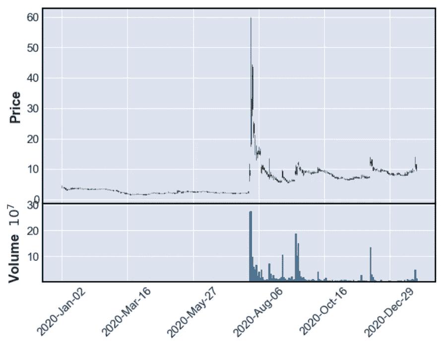*

*图片作者。这里的代码[是](https://gist.github.com/MauricioLetelier/0a41bdc8a48166519e2f390c467f4063)。*

*诺基亚。*

*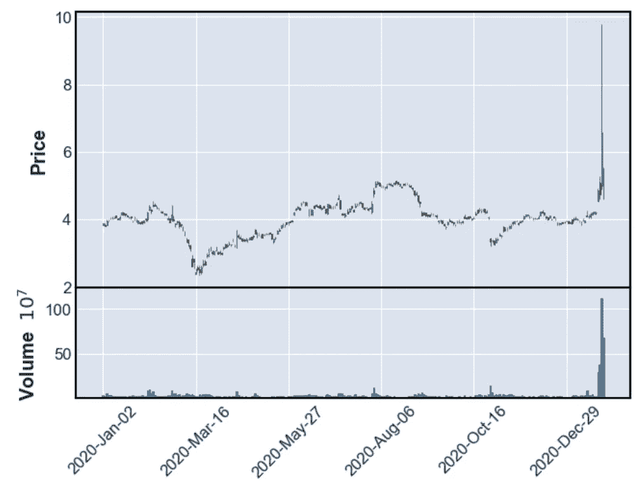*

*图片作者。这里的代号[。](https://gist.github.com/MauricioLetelier/04190ae79316df87b13cb32da9bad58e)*

*还有 AMC。*

**

*图片作者。此处代码[。](https://gist.github.com/MauricioLetelier/39bd41e4389e74ce0d1c337ff5679b78)*

****图案与*** 相同。前所未见的交易量和难以想象的价格。*

*为了让您看到典型图表的样子，我将显示亚马逊的股价和成交量。*

*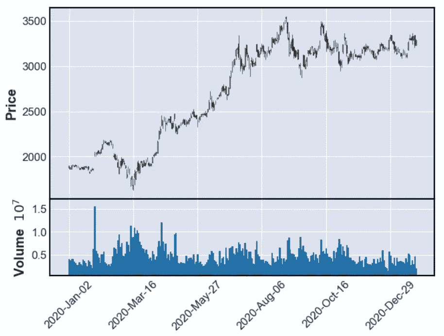*

*图片作者。这里的代码[是](https://gist.github.com/MauricioLetelier/9077c1214e698917cff1e90f8408a804)。*

*差异令人震惊。一只普通的股票会振荡，但是成交量在一个很小的区间内。不寻常的库存达到最低值的 50 多倍。*

*在没有将问题框架化为机器学习问题的情况下，我永远不会假设体积是决定性的预测变量。上面的想法只是指出可能有用的信息。*

# *预言；预测；预告*

*那么，我们想预测什么呢？如果我们想仅用市场信息来预测一次反弹， ***我们可以做得更好，因为价格和交易量都反映了*** 原因。预测下一个“迷因股票”这样不可预测的事情是不可能的。但是，更有意义的是在它一发生就预测它。一个“早期发现”就足够了。因此，我们需要检索的数据应该是低间隔的。*

*那么，使用什么类型的机器学习类型呢？后者非常重要，因为尝试对超低发生率事件使用监督学习可能不是最佳方法。尽管如此，无监督学习也有自己的分支 ***异常检测*** 。发现异常现象并不一定意味着股票会上涨，但肯定会告诉我们是否有什么奇怪的事情正在发生。*

*为此，我们将使用过去两个月的 5 分钟间隔数据(由于 API 限制)。我们将用前 40 天来训练模型，以检查模型是否能检测出奇怪的行为。这是为了 ***模拟*** 我们在 1 月 12 日将我们的模型投入生产。*

*直接使用价格和数量作为特征是很有诱惑力的。但一只股票可以上涨很多，这不一定是异常现象。出于这个原因，使用连续观测值之间的差值更安全。我们将使用不同的特征，包括成交量、价格和一些交易者常用的指标，每一个都与*有所区别。 [ta 包](https://github.com/bukosabino/ta)创造指标太棒了。**

*****K-means*** 是一种迭代定义质心的算法，试图最小化每个数据点与定义的质心之间的距离。您最终得到一些质心，聚类被定义为最接近特定质心的一组数据点。**

**对于这种情况，想法是观察训练数据中数据点和聚类之间的距离。然后，使用 25 个最大距离的平均值作为参考，如果来自预训练聚类的距离比参考大三倍，则我们将其宣布为异常。重要的是，我们将使用三个聚类来训练模型，只考虑最小的距离。**

**我们为每一只想要分析的股票训练一个模型。让我们先从 TSLA 开始，让你明白这个想法。第一种颜色表示训练数据，第二种颜色表示测试数据。异常的形状将是菱形。**

> ****注**:在下面，你会找到特斯拉股票的代码。你只需要改变其他情况下的参数。此外，可视化要求您在运行之前使用正确的参数运行以下代码。**

**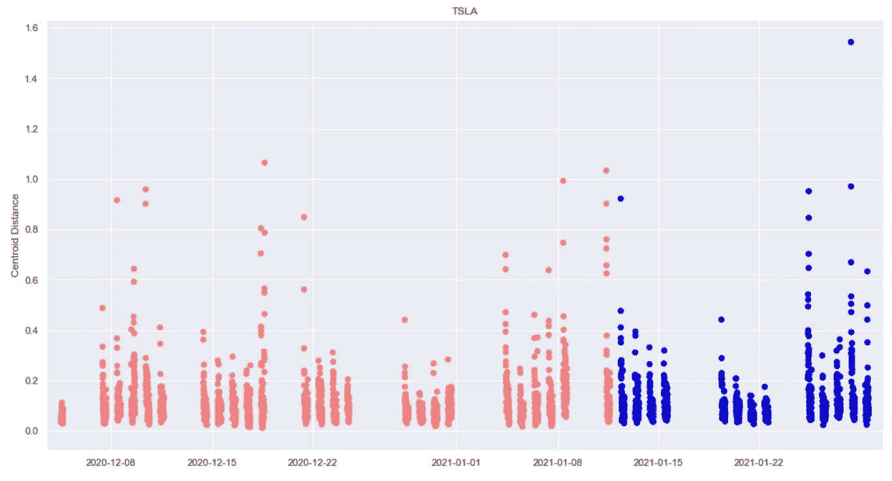**

**图片作者。这里的代码[是](https://gist.github.com/MauricioLetelier/8252ce4b8ba6c1441a6e510919945edf)。**

**下面是另一个使用谷歌股票的例子。**

**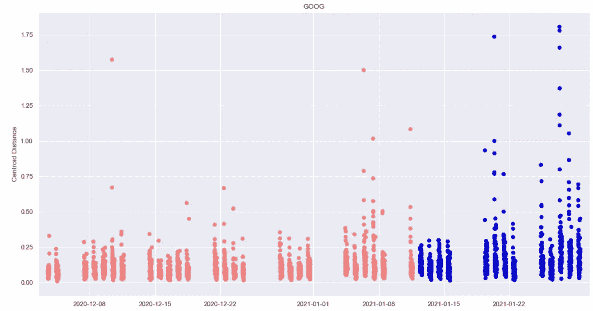**

**图片作者。这里的代码[是](https://gist.github.com/MauricioLetelier/158aa2facc82fc64a327c8ed4f3b1fe8)。**

**无论是特斯拉还是谷歌，我们都没有发现任何异常。这很有趣，因为这些股票的行为相当活跃。在这里，我们可以推断该模型能够理解有规律的运动，因为新的数据点从未离开预训练的质心太远。**

# **GME 的故事**

**好了，现在是时候记住我们最初的问题了。这是可以预测的吗？。让我们从 1 月 11 日 GME 的最后一次训练数据开始模拟。想象一下，你负责这个模型，你看到如下。**

**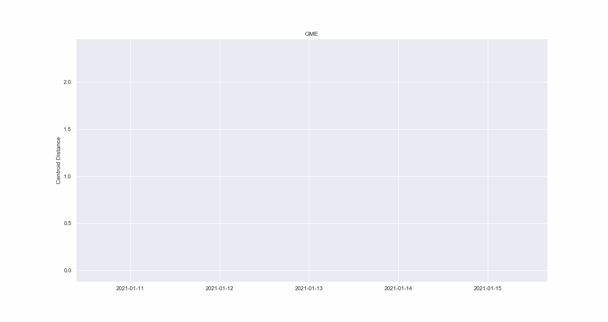**

**图片作者。这里的代码[为](https://gist.github.com/MauricioLetelier/e4a25fd2d6df819d69f36e9c53f8902e)。**

**1 月 12 日没什么奇怪的。但是在 1 月 13 日和 14 日，你会得到大量的异常，与其他数据点的质心的距离看起来比正常的一天要远。看到这里，你开始想，我应该采取行动吗？。下周再说吧。**

**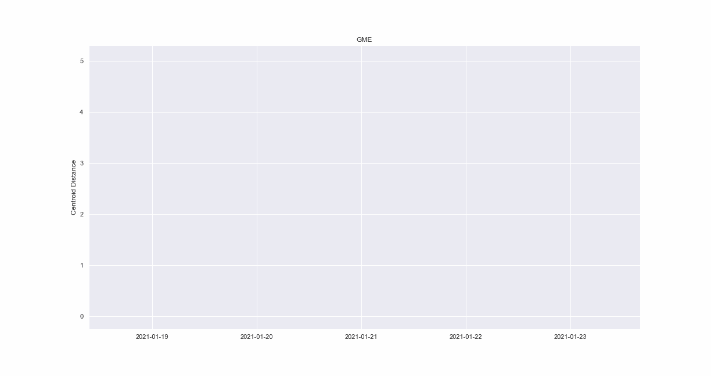**

**图片作者。这里的代码[是](https://gist.github.com/MauricioLetelier/c52a0576b54c5ef7722b4a24bf01339d)。**

**19 日，出现了一些异常，你会有点担心，但仍然没有决定性的东西。的确，在那之后，你会在 20 日和 21 日有两天没有异常。也许一切又恢复正常了，你可以暂时放松一下。但是在 22 日下午，一切都变得疯狂了。几乎你收到的每一个新数据点都是异常的。记住，在每个数据点之间，你有 5 分钟的时间。想象你自己一遍又一遍地接收这个信息超过 2 个小时。**

**距离几乎达到了我们定义的阈值的三倍。显然，“有事”正在发生。但是是时候看看一切都失控的那一周了。**

**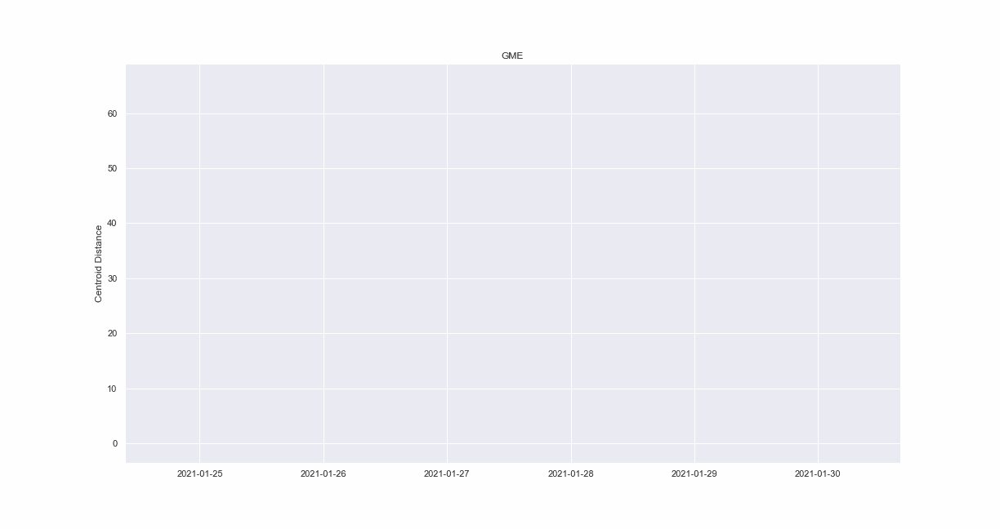**

**图片作者。此处代码[。](https://gist.github.com/MauricioLetelier/2bd6b289a8dccdf6481b174ba3dfb978)**

**视觉效果会自己说话。上周只有异常。**

**最后，整个画面。**

**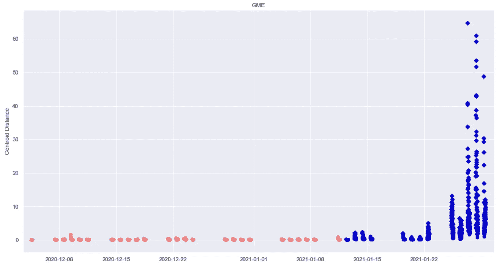**

**图片作者。这里的[代号](https://gist.github.com/MauricioLetelier/17391afb442b67dce10bdd5cbc4ad00e)。**

# **机器学习可能预测到 GameStop 的疯狂吗？**

**给定最后的信息，是时候回答我们最初的问题了。我想围绕机器学习算法的可能性展开讨论。在上一节中，我们看到，甚至在股票达到最高价的两周前就发现了异常。**

**这是否意味着我们可以预测到这一点？ ***绝对不是*** 。**

**我们发现了一些异常，在我们观察它们的同时，价格也在上涨，但这并不一定能告诉我们，股票在未来肯定会上涨或下跌。我们必须非常小心异常现象代表了什么。**

**股票价格由复杂的交易算法甚至更复杂的人类行为所控制。上周，有一件事情变得很清楚，那就是试图预测社会现象是最具挑战性的任务之一，因为它取决于许多因素，其中大多数甚至不可能作为数据检索。**

**使用的方法证明了股票正在经历一些不寻常的情况，仅此而已。我们需要的不仅仅是机器学习算法来预测上周发生的事情。也许一个拥有这些信息以及更多信息的金融专家可能已经预料到了这一点。但是，机器学习模型本身完全依赖于它们所接受的应用程序。**

# **最后的想法**

**使用异常检测方法，我们发现这个事件在成为现实之前揭示了一些线索。需要进一步的调查来确定这是否真的可以在其他场景中工作。**

**比技术讨论更重要的是，我认为我们应该分析股票市场的缺陷。人们一直拥有这种力量，但它从未以这种方式使用过。监管机构目前正在谴责这种行为，但现在是时候真正深入研究大型对冲基金的做法了。您刚刚看到了使用公开信息(如价格、交易量和一些指标)来检测异常是多么容易。想象一下监管者的可能性，因为他们有更多的详细信息。**

**我确信 ***机器学习将成为监管者*** 的最佳盟友之一。现在他们的工作是迈出第一步。**

# **再见**

**我真的希望这个博客能让你感兴趣。如果你喜欢就跟着我！很快会有更多内容！。**

****

**我也在 [Linkedin](http://www.linkedin.com/in/maletelier) 和 [Twitter](https://twitter.com/maletelier) 上。我很乐意与你交谈！如果你想多读一点，看看我最近的一些帖子:**

** [## 2021 年前 5 大数据科学工作角色

### 数据科学家不是一个…

towardsdatascience.com](/top-5-data-science-job-roles-for-2021-c487fd4ed1c6)  [## NumPy 中从头开始的 ROC 曲线和 AUC(可视化！)

### 因为你只有在建造它的时候才会学到它。

towardsdatascience.com](/roc-curve-and-auc-from-scratch-in-numpy-visualized-2612bb9459ab) 

# 承诺的文章

 [## GameStop 的惨败证明我们正处于一个“迷因股”泡沫中

### Redditors 和华尔街之间的新动态揭示了 2021 年的股票市场

marker.medium.com](https://marker.medium.com/gamestop-proves-were-in-a-meme-stock-bubble-b3f39163a77f)  [## GameStop 对冲基金股市惨败由互联网解释

### 新闻 Reddit 买下了所有的“gamestonk ”,华尔街恐慌了。这些游戏到底发生了什么…

www.denofgeek.com](https://www.denofgeek.com/games/gamestop-gme-nokia-amc-hedge-fund-stock-market-wall-street-memes/)**