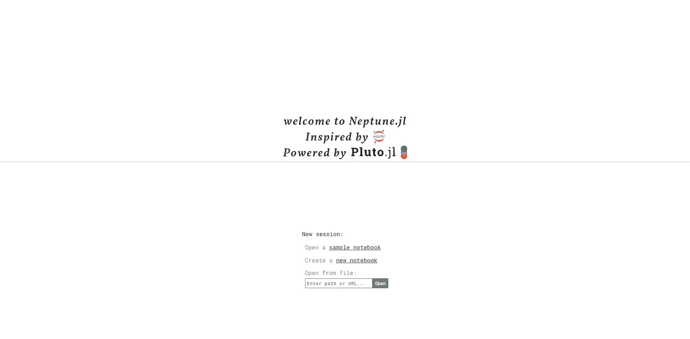

# 海王星真的能取代木星吗？

> 原文：<https://towardsdatascience.com/could-neptune-really-replace-jupyter-9a90d6432325?source=collection_archive---------11----------------------->

## 非交互式笔记本的 Neptune 包概述


[https://pixabay.com/images/id-2947880/](https://pixabay.com/images/id-2947880/)

# 介绍

去年 10 月，我看了一个名为 Pluto.jl 的 Julia 包。Pluto.jl 是一个用于 Julia 编程语言的笔记本服务器，它有许多独特的功能，使它在竞争中脱颖而出。由于我主要是一个 IJulia 用户，我当然会将这个解决方案与 Jupyter 笔记本进行比较。从很多方面来说，我相信笔记本之间是互相打击的。然而，我在 Pluto.jl 和它背后的想法上遇到了一些根本性的问题，这使得我个人的笔记本比 Jupyter 上的更不实用。如果你想看那篇文章，你可以在这里看:

[](/could-pluto-be-a-real-jupyter-replacement-6574bfb40cc6) [## 冥王星有可能真正取代木星吗？

### 对 Pluto.jl 笔记本和 Julia 编程的其他开发解决方案的简要概述和比较…

towardsdatascience.com](/could-pluto-be-a-real-jupyter-replacement-6574bfb40cc6) 

我发现在我使用 Pluto.jl 的经历中，它比我使用过的任何其他解决方案都要乏味得多。我要再次指出，这是我的选择，不是一揽子计划的错。然而，我发现笔记本的反应性质经常会妨碍任何代码单元的执行。这很难处理，因为在理论上，Pluto.jl 听起来很神奇。笔记本是反应式的，因此不存在会降低笔记本可复制性的状态问题。这种担忧是我从我最喜欢的机器学习爱好者之一 Joel Grus 那里继承来的，他也是我最喜欢的一本来自 O'Reilly 的书的作者。直接引用 Grus 的话，

> "我们可以通过简单地改变这些单元格的执行顺序来完全误导我们的输出."

当然，这样的概念对于科学这样的东西来说是非常可怕的，尤其是在创造可重复的研究方面。Pluto.jl 试图通过添加反应特性来解决这个问题，但在我看来，它没有足够有效地跟上你正在做的事情，因此有点不足。此外，必须开始和结束任何多行单元也是相当乏味和烦人的。尽管反应功能在这方面失败了，但我认为冥王星笔记本还有很多其他可取之处。这就是 Neptune.jl 拿蛋糕给我赢的地方。

# 海王星

Neptune.jl 是冥王星笔记本的一个新的修改，它的主要目的是成为冥王星而没有反应功能。这意味着在 pure Julia 中使用笔记本单元的能力现在是可能的，而不必处理 Pluto 在您和您的代码之间的反应。这对我来说是可取的，因为我们可以有效地切断 Python 作为 Julia 语言和内核之间的桥梁，而完全使用纯 Julia。

更令人兴奋的是海王星和冥王星笔记本如何保存文件。Neptune 文件不存储在包含一堆 JSON 数据的 IPython 笔记本中，这些数据告诉 Jupyter 如何解码所有的细胞。相反，Neptune 文件被安全可靠地存储，嵌套在一个. JL 文件中，markdown 单元格被制成多行字符串。对我来说，这是一个相当大的卖点，利用像海王星或冥王星比 Jupyter 笔记本电脑。此外，这可能是一个巨大的进步，因为现在我们可以将应用程序和笔记本放在同一个文件中。不仅如此，我们的应用程序可以立即被很好地记录，因为我们所有的注释现在都保留在其中。JL 文件！我们总是可以通过用 Julia 调用它来运行这个文件。我们甚至可以包括它，这是一个朱莉娅文件！在这方面，Julia 文件将比笔记本文件更加多样化。

我对此唯一的担心是从不同的应用程序查看这款笔记本电脑。有几次我在 Github 里面查看一个笔记本的源码。这对于海王星或冥王星来说是不可能的。然而，我认为在大多数情况下查看 Julia 代码实际上是合适的，而且只要不使用 show()方法来显示 HTML 或图像，这甚至可能是 Github 的首选。

Neptune 还做了一些其他的改变，但是为了检验这些改变，我们需要添加带有 Pkg 的包。有一段时间，这个包在 Julia General registry 中不可用，但现在它已经注册了，我们可以通过 Pkg REPL 添加它。

```
julia > ]
pkg > add Neptune
```

现在我们将导入 Neptune 并使用 Neptune.run()方法来启动一个新的笔记本服务器。

```
using Neptune; Neptune.run()
```



(图片由作者提供)

如果您曾经使用过 Pluto.jl，您可能会认出这个主屏幕，因为除了中间的文本之外，它完全相同。在这里，我们也能很好地描述海王星到底是什么。Neptune 是一个笔记本服务器，它遵循 Jupyter 提出的思想，这是该软件包的灵感来源，但该服务器也由 Pluto.jl 的一个分支提供动力。

创建一个新的笔记本，我们很快看到来自 Pluto.jl 的反应无处可见——对我个人来说，这是一个非常令人愉快的景象。然而，我仍然感到沮丧的一个问题是无法使用 shift+enter 热键来创建新的单元格。很容易理解为什么不是这样，我认为在执行之前测量这样一个单元格的输入来检查热键输入可能会导致比它实际价值更多的麻烦。也就是说，我确实相信大多数数据科学家都非常频繁地使用这个热键，所以我认为这肯定是一个令人沮丧的事情。在我看来，每次我想添加更多代码的时候，都要把手伸向我的鼠标，这是令人难以置信的乏味。

将输出置于输入之上的风格选择也是我有意见的。我觉得这很荒谬。输出是输入的直接结果，并且总是在输入之后，我们不从下到上阅读页面，所以输出在单元格之上没有多大意义。我一直认为细胞没有运行，而实际上它们运行了，输出只是在细胞的上面而不是下面。当然，这是对 Pluto.jl 的抱怨，不是对 Neptune.jl 的抱怨，而是 Neptune.jl 是 Pluto.jl 的分叉，意味着它也继承了它的问题。然而，我要说的关于海王星的一件消极的事情是，这个图标真的很丑。对于这样的东西，这听起来可能是一个糟糕的批评，确实如此，但我更希望没有这样的评论，而不是有一张后面有白色背景的图片，它的长宽比是错误的。

幸运的是，有一个东西已经从 Neptune.jl 中删除了，它在 Pluto.jl 中。这个删除的特性是我在 Pluto.jl 中所鄙视的，它无法创建没有开始和结束的多行代码单元格。很容易理解为什么会这样，我想这可能是由于 Pluto.jl 保存文件的方式。然而，我发现每当我想写一行新的代码时，都需要写 begin 和 end，这很烦人。有趣的是，实际上我可能是建议这种改变的人，所以我非常高兴看到它在海王星如此完美地度过。

# 结论

本着开源的精神，我们收到了一个 Pluto fork，我相信它对原来的笔记本进行了很多戏剧性的改进。虽然 Pluto.jl 中的许多概念都很酷，但我认为它们中的许多也妨碍了 Julia 编程。在很多情况下，我对将反应作为笔记本的一部分感到非常恼火。我认为，反应实际上仍然是一个伟大的想法，但可能仍然需要一些肘油脂和智能编程投入其中，以真正显着。

那么问题来了，这真的能代替 Jupyter 笔记本和 IJulia 用于 Julian 数据科学吗？现在，我不得不说我的答案是否定的。我这么说的主要原因是因为 Neptune.jl 仍然有一些从冥王星遗留下来的输出错误。有时，输出就是不出现——当然，这可能会令人沮丧。我认为. jl 文件中的笔记本的概念确实很吸引人，我确信有一天我能看到像这样的笔记本解决方案很好地工作。然而，不幸的是，今天可能不是那一天。写这篇文章实际上让我想创建我自己的笔记本服务器，以便创建我想要的样子。那肯定会是一个有趣的项目！

虽然我认为海王星对我个人来说是一个更好的解决方案，但我仍然会坚持使用 IJulia。不幸的是，我认为冥王星有一些缺陷会带到海王星，但这两个包肯定都有未来——这让我很兴奋！我认为只要稍作调整，这两款笔记本服务器都可以很好地替代 Jupyter。然而，我要说，我认为这在很大程度上取决于个人偏好。我只是碰巧更喜欢 Jupyter 而不是这两个软件包，其他人可能不会有同样的感觉，所以我鼓励读者尝试这两种笔记本电脑，并自己决定哪个更好！感谢你的阅读，我希望这篇文章能帮助你找到最好的笔记本来写 Julia！