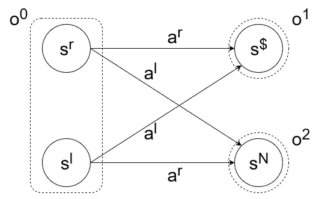
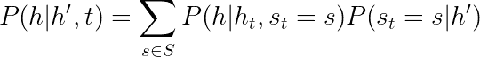
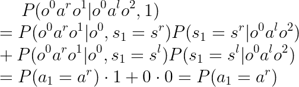

# 强化学习的反事实 I:“如果……会怎样？”

> 原文：<https://towardsdatascience.com/counterfactuals-for-reinforcement-learning-i-what-if-d70188fb83c2?source=collection_archive---------9----------------------->

## [思想和理论](https://towardsdatascience.com/tagged/thoughts-and-theory)

## POMDP 框架和反事实简介

在哲学中，一个反事实思维实验问:“如果发生的是 A 而不是 B，会发生什么？”。从这种假设的考虑中获得对现实世界的洞察力是人类智慧的一个重要方面。

这个由两部分组成的系列将探索如何在强化学习框架内模拟反事实思维，以及这如何有助于创造更安全的代理。在这第一部分，我将奠定数学基础，在下一部分，我将解释如何将反事实应用于奖励函数学习的设置。这个系列是独立的，唯一的要求是理解强化学习，特别是马尔可夫决策过程。如果你想了解更多关于反事实研究的动机，你可以看看我以前的文章，关于[强化学习的学习奖励函数的问题](/how-learning-reward-functions-can-go-wrong-6e794e42f4fc)。

## 部分可观测马尔可夫决策过程

我们知道，马尔可夫决策过程(MDP)包括

*   状态的集合
*   答:动作的集合
*   t:在给定一个状态和一个动作的情况下，确定下一个状态的概率的转移函数
*   r:奖励函数，给状态和动作的历史分配一个分数

MDPs 中的时间通常以离散的时间步长来度量，代理在时间步长 t 的动作 a(t)跟随在同一时间步长的观察状态 s(t)之后。使用 R，一个代理因状态和动作序列 o(1)a(1)o(2)a(2)…而得到奖励，目标通常是使奖励最大化。为此，我们寻找一个策略，它是一个从状态到行为分布的函数，并决定代理的行为。

MDP 是一个多功能模型，是强化学习的核心。然而，有时使用更精细的模型是方便的。例如，一个代理的传感器可能无法明确区分某些状态。你可以将此建模为 MDP，其中状态对应于对真实状态的信念。这就是计算机程序的实现方式。但在数学上，用所谓的部分可观测马尔可夫决策过程(POMDP)来表达这种不确定性更容易。给定一个 MDP (S，A，T，R)，POMP 增加了两个额外的元素:

*   ω:可能的观察值的集合
*   o:状态观测函数，给出给定环境状态下的观测值的概率分布。

在 POMDP 中，代理看不到真实的状态。相反，代理的输入是一个使用 o 从状态中概率确定的观察值。

为了稍后讨论反事实，我还需要定义历史:POMDP 上的历史 h 是观察和动作的序列 h = o(1)a(1)o(2)a(2)…其中 o(n)和 a(n)代表 POMDP 的时间步长 n 上的观察和动作。因为我所说的 POMDP 总是很清楚的，所以我将使用类似 P(h)的符号来表示在给定的 POMDP 中看到历史 h 的概率。P(s(n) = s)将用于谈论时间步长 n 处的状态是特定状态 s 的概率。相反，P(a(n) = a)是代理在时间步长 n 处采取行动的概率。

让我们考虑一个如何将问题建模为 MDP 的例子。在我们的场景中，代理参加一个游戏节目，并在两扇门中选择一扇门来赢得奖品。其中一扇门后是现金奖励，但如果代理人选择错误，他们就不得不空手而归。这个模型的基础环境很简单:有两个潜在的初始状态，表示为 s(l)和 s(r ),分别对应于奖品在左门或右门后面。可用的操作是打开任一扇门:a(l)代表左侧，a(r)代表右侧。根据我们的初始状态，在选择一个动作后，代理将转换到赢得现金奖励 s($)的最终状态，或者什么都没有 s(N)。让问题变得棘手的是，代理人不知道他从哪个初始状态开始。两个初始状态对应于相同的观测值 o⁰，而最终状态导致 s($)的不同观测值 o 和 s(N)的不同观测值 o。

gameshow 问题的 POMDP。图片由作者提供，灵感来自[【2】](https://www.alignmentforum.org/posts/5bd75cc58225bf06703752a9/counterfactuals-on-pomdp)

在这个 POMDP 上有四个可能的历史:o⁰a(r)o、o⁰a(r)o、o⁰a(l)o 和 o⁰a(l)o。为了最大化他们获胜的机会，代理人想要一个策略，最大化创建以观察值 o 结束的历史的概率。由于第一个观察值总是 o⁰，唯一的变量是代理人在第一个时间步中采取的行动 a，所以我们在寻找概率 P(o⁰ao)。但是，挑门会导致中奖的概率是由第一态 s(1)的真性情的概率决定的:p(o⁰a(r)o)= p(s(1)= s(r))p(a(1)= a(r))p(o⁰a(l)o)= p(s(1)= s(l))p(a(1)= a(l))。用不太数学的术语来说，当选择正确的门时获胜的概率与奖品在右边并且代理打开右边的门的概率相同，对于左边的门也是一样。如果我们假设获胜的门是由 gameshow 跑步者随机选择的，那么 P(s(1) = s(r)) = P(s(1) = s(l)) = 0.5，代理不能通过选择 a(1)的概率比随机做得更好。

这个难题就是反事实发挥作用的地方。如果我们假设选择左边的门会导致失败，那么推断状态 s(1)的真实性质是微不足道的，我们需要选择右边的门才能获胜。我们如何用数学方法对此进行编码？

## POMDPs 上的反事实概率

为了正确解释 POMDPs 上的反事实，我首先需要解释一些潜在的假设。通俗地说，反事实推理可以用这样的陈述来表达，“如果是 X 的情况，那么我们可以推断 Y”——在我们的例子中，这变成了“如果是选择左边的门什么也没有导致，那么我们可以推断选择右边的门导致奖励”。就 POMDs 而言，X 和 Y 是关于历史的陈述:“如果反事实历史 h '已经发生，那么我们可以推断历史 h 具有这种可能性”。然而，在没有进一步假设的情况下，不可能从 h '推断出 h。在我们的例子中，反事实的历史将是 h' = o⁰a(l)o。通过使用“常识”，知道 h '将如何进行让我们推断出 P(o⁰a(r)o ) = P(a(r))，因此代理人应该设置 P(a(r)) = 1。然而，在数学上，时间步长 1 处的观测 o⁰可以指示 s(1) = s(r)或 s(1) = s(l)，因此最终 P(o⁰a(r)o 归结为 s(1)的概率分布。

数学结果与我们的“常识”预期不同，因为我们还没有对潜在的假设进行编码，即除了我们改变的行为之外，世界上所有其他事实都保持不变。具体来说，这包括我们改变事物时的世界状态。因此，我们需要假设 h 和 h '仅在时间步长 t 之后才发散，因此到那时为止，它们的观察和动作是相同的。我们将使用 h(t)来表示由 h 和 h’共享的直到步骤 t 的历史。此外，我们需要假设“世界的真实状态”在 t 之前对两者都是相同的。换句话说，如果 s(n)是在 h 中产生第 n 个观察值的状态，类似地，对于 s'(n)和 h '，那么对于 n ≤ t，s(n) = s'(n)

在给定的 POMDP 上，我们现在可以推理 P(h | h '，t):给定在 t 处偏离 h 的反事实历史 h '，看到 h 的概率。首先，当我们看到反事实的历史:P(s(t) = s | h ')时，真实状态在分歧点 s。进一步，我们需要概率化，当时间步长 t 的真实状态为 s 时，在看到历史 h(t)之后，我们最终会看到历史 h: P(h | h(t)，s(t) = s)。这三个概率之间的关系如下:

给定在 t 处偏离的反事实历史 h '的概率公式。

对于每个可能的状态 s，如果 s 在收敛点 t 是真实状态，则获得历史 h 的概率乘以如果我们假设反事实，则 s 是真实状态的概率。

用这个公式，很容易获得关于 P(o⁰a(r)o 的“常识”结果)。在这种情况下，t=1，因为只有第一次观察对 h '和 h 是相同的。

第二行中左边的项是代理打开右边门的概率，因为当真正的初始状态是 s(r)时，那么门的选择将确定性地导致 0 或 0。右边的项简化为 1，因为给定选择左边门导致没有赢得任何东西的历史，初始状态一定是 s(r)。在第三行中，两个术语都简化为 0，因为它们描述了矛盾事件的概率:当在初始状态下，钱在左边的门后面，那么打开右边的门不会导致获胜的观察结果 o。相反，在初始状态下，当打开左边的门导致失败时，奖励不可能在左边。

## 结论和应用

我们已经看到了反事实历史 h '的概念如何帮助我们对期望历史 h 的概率做出推断。这反过来可以帮助我们决定代理人的政策。然而，我们只考虑了一个平凡的例子，其中最佳政策可以通过检查推断。在奖励学习领域[【1】](https://arxiv.org/abs/2004.13654)[【3】](https://arxiv.org/abs/1908.04734)可以找到反事实在 POMPDs 上的真实应用。虽然它受到了本文中给出的数学的启发，但它改变了细节并添加了一些新元素。因此，你应该继续关注本系列的第二部分，在这一部分中，我将探索反事实在奖励学习中的应用！

[1] Armstrong 等人，*在线学习奖励函数的陷阱*，Arxiv，2020 年 4 月 28 日，[https://arxiv.org/abs/2004.13654](https://arxiv.org/abs/2004.13654)

[2]阿姆斯特朗·斯图尔特，*POMDP 上的反事实*，AlignmentForum，2017 年 6 月 2 日，[https://www . alignment forum . org/posts/5bd 75 cc 58225 BF 06703752 a 9/counter factuals-on-POMDP](https://www.alignmentforum.org/posts/5bd75cc58225bf06703752a9/counterfactuals-on-pomdp)

[3] Everitt 等，*强化学习中的奖励篡改问题及解决方案:因果影响图视角*，Arxiv，2021 年 3 月 29 日，[https://arxiv.org/abs/1908.04734](https://arxiv.org/abs/1908.04734)