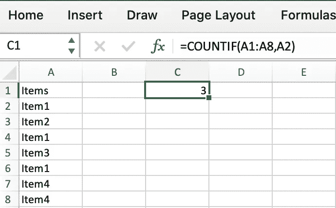
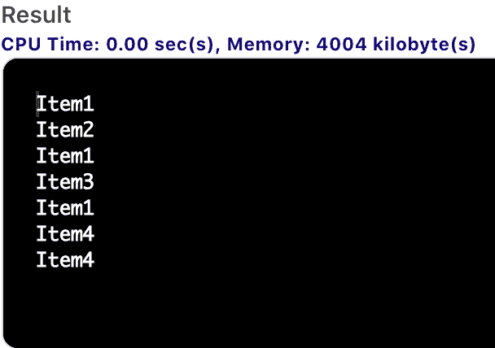
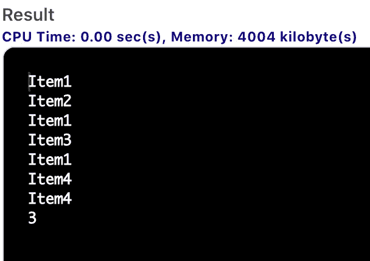
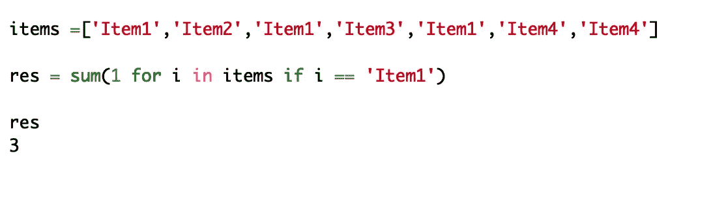
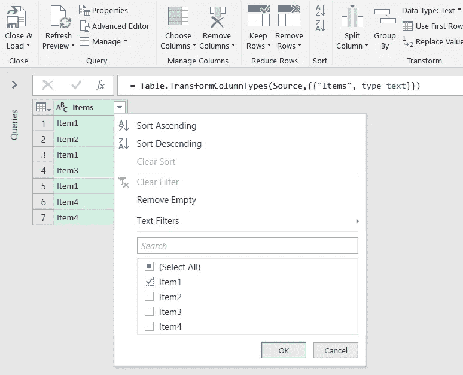
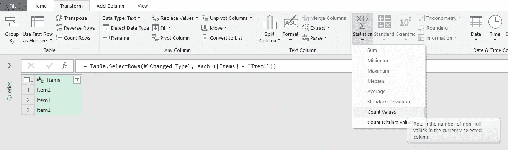
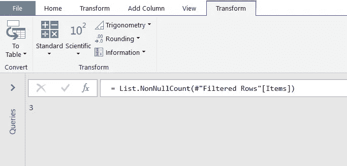

# 5 种语言的 COUNTIF(VBA/SQL/PYTHON/M query/DAX power bi)

> 原文：<https://towardsdatascience.com/countif-in-5-languages-vba-sql-python-m-query-dax-powerbi-639d3d7c6c7f?source=collection_archive---------20----------------------->

## 如何用另一种分析语言制作自己喜欢的 Excel 功能(VBA/SQL/PYTHON/M query/DAX power bi)


莎伦·麦卡琴在 [Unsplash](https://unsplash.com/collections/3782793/mehul-mathrani-%7C-finance?utm_source=unsplash&utm_medium=referral&utm_content=creditCopyText) 上的照片

Excel 是大多数从事数据分析工作的人使用的功能强大的电子表格。数据量的增加和开发用户友好的工具是通过将它们与另一种工具或语言混合来改进 Excel 报表的机会。

在一家财务报告部门工作时，我面临着改进报告工具的需求。开始使用一门新语言的一个简单方法是用另一种语言翻译我们在 excel 中使用的内容。“我该如何旋转它？”“我怎么能找到它？”。

在这篇文章中，我将与你分享如何用 5 种不同的语言制作 COUNTIF:VBA，python，SQL，DAX (Power BI)，M (Power query)。这将是简单的提示，但如果你想获得更详细的文章，别忘了关注我！

# Excel 中的 COUNTIF

COUNTIF 是 Excel 的统计函数之一，用于计算符合条件的单元格的数量。

最简单的使用方法如下:

```
=COUNTIF(Where do you want to look?, What do you want to look for?)
```

但是在“你想找什么？”您可以放置一个条件标准(对于部分条件，它可以是逻辑运算符(、<>、=)和通配符(*、$)。

在这篇文章中，我将使用一个与我写的另一篇文章相似的例子，用 5 种语言介绍 SUMIF:

[](/sumif-in-5-languages-vba-sql-python-m-query-dax-powerbi-2ff6ccf205ee) [## 5 种语言的 SUMIF(VBA/SQL/PYTHON/M query/DAX power bi)

### 如何用另一种分析语言制作自己喜欢的 Excel 功能(VBA/SQL/PYTHON/M query/DAX power bi)

towardsdatascience.com](/sumif-in-5-languages-vba-sql-python-m-query-dax-powerbi-2ff6ccf205ee) 

这将是一个标签与项目的列表在单元格 C2，我们可以把一个 COUNTIF 公式与参数:范围=A2:A8，标准=单元格(A2)。所以基本上我们计算列表中“Item1”的数量。



作者图片

```
=COUNTIF(A1:A8,A2)
```

# VBA 的 COUNTIF

Visual Basic for Application (VBA)是集成到 Microsoft Office 应用程序中的 Microsoft Visual Basic 的实现。

在代码中，可以使用语句“WorksheetFunction.sumif”设置一个变量来存储 COUNTIF 结果的结果。它的工作方式与函数本身完全一样。然后，您可以将结果直接存储到 C2 单元格中。

```
Range(“C2”) = WorksheetFunction.COUNTIF(Range(“A2:A8”), Range(“A2”))
```

现在让我们通过声明变量来正确地做这件事:

```
Sub sumif()Dim wb As Workbook
Dim wsD As Worksheet
Dim Arg1 As Range
Dim Arg2 As Range
Dim Arg3 As RangeSet wb = ThisWorkbook
Set wsD = wb.Worksheets("Sheet1")Set Arg1 = wsD.Range("A2:A8") 'where to find
Set Arg2 = wsD.Range("A2") 'what to find
Range(“C2”)= Application.WorksheetFunction.SUMIF(Arg1, Arg2)
End Sub
```

# SQL 中的 COUNTIF

SQL ( *结构化查询语言*)或 sequel，是一种在数据库中存储、操作和检索数据的标准语言。这是面临 Excel 局限性的公司常用的升级方式之一。通常，第一反应是协商一些预算，以便将数据存储到数据库中，并使用 SQL 与该数据库“对话”,组织和操作数据。这种语言也非常值得赞赏。接近自然语言，在输入简单的 SQL 请求时不会有编码的感觉。

让我们从创建一个包含项目的表开始:

```
CREATE TABLE table1 (
    Item varchar(255)   
);
INSERT INTO table1
VALUES ('Item1');
INSERT INTO table1
VALUES ('Item2');
INSERT INTO table1
VALUES ('Item1');
INSERT INTO table1
VALUES ('Item3');
INSERT INTO table1
VALUES ('Item1');
INSERT INTO table1
VALUES ('Item4');
INSERT INTO table1
VALUES ('Item4');
SELECT*FROM TABLE1;
```

结果如下:



作者图片

请记住，在 SQL 中，当您想要获取信息时，通常会使用表达式 SELECT。基本上，在 SQL 中，你处理数据、表格和关系。因此，你必须很好地理解“我如何才能获得这些信息”，以便进行选择:

从“我必须如何应用”中选择“我将如何获得我想要的”。

因此，在我们的例子中，我们将选择“Item”列的项目等于“Item1”的情况的计数。让我们写出公式，然后分析它:

```
SELECT COUNT(CASE WHEN Item = 'Item1' THEN 1 END) FROM table1;
```

因此，当(SQL 中的 CASE 是一种“IF”函数)Item='Item1 '时，我们选择 CASE 的计数，然后(如果是这种情况)我们计数 1。这适用于表 1。

结果:



作者图片

# Python 中的 COUNTIF

Python 是一种具有通用目的的解释型高级语言。它有广泛的应用，包括数据分析。我们可以通过说“对于所有的应用程序，它的库”来介绍 python。对于数据，不出意外，我们将使用著名的熊猫。

python 中 COUNTIF 有几种方法。我们可以玩数据框，列，分组等等。但是这里我将简单地创建一个包含所有条目的列表，然后循环进入这个列表，每次循环遇到“条目 1”时就加 1。所有这些都存储在一个变量结果中:

```
items =['Item1','Item2','Item1','Item3','Item1','Item4','Item4']
res = sum(1 for i in items if i == 'Item1')
```

结果如下:



作者图片

# M 中的 COUNTIF

m 是工具 power query 背后的强大语言。即使您正在使用查询编辑器，每一步都将使用 M 编写，M 代表数据混搭或数据建模。我强烈推荐看看这种语言，我们可以做的不仅仅是使用图形界面。

关于 COUNTIF，图形界面非常流畅，我们可以直接使用。您只需将表格导入图形界面，然后使用列项中的过滤器:



作者图片

然后选择列“Items ”,并在字段 Transform 上进行计数:



作者图片



按结果显示图像

你得到了计数。另一种方法是使用左边的分组按钮，但在我们的例子中，它会增加更多的步骤，我们可以通过直接过滤和计数来跳过。我将介绍另一个更有用的特性(数据透视表)。

# DAX 中的 COUNTIF:

DAX 代表数据分析表达式。不仅仅是一种语言，它还是一个函数和运算符库，可用于在 Power BI 和 Power Pivot 中构建公式。

COUNTIF 是一个介绍 CALCULATE 函数的好机会。它是 Power BI 中最著名的函数之一，在应用过滤规则后对表达式求值。它更接近于 COUNTIFS，因为您可以应用几个过滤器参数。

```
CALCULATE(<expression>[, <filter1> [, <filter2> [, …]]])
```

Expression:要计算的表达式。

Filter1，2，…:可以是一个布尔表达式，一个表过滤器，甚至是另一个函数。

在我们的例子中，通过在列“Items”=“item 1”中应用一个过滤表，要计算的表达式是 Table1 项的计数

```
countif = CALCULATE(COUNTA(Table1[Items]),Table1[Items] = 'Item1')
```

# 结论

这篇文章是一系列文章的一部分，在这些文章中，我分享了用其他语言实现 Excel 特性的方法。当然，当你决定从 Excel 转向编程时，你的数据分析方法将会完全改变，你将会发现有很多方法可以找到你的解决方案。如果你有其他的方式来做这件事，或者甚至知道如何用其他语言来做这件事，请在评论中分享它们，或者在我的社交网络中联系我！我将很高兴阅读你的想法！