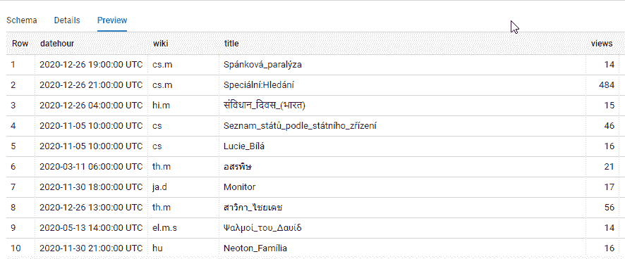
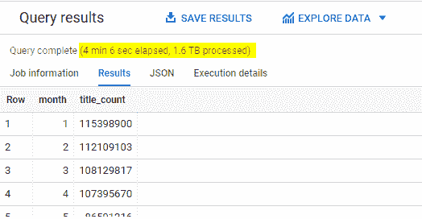
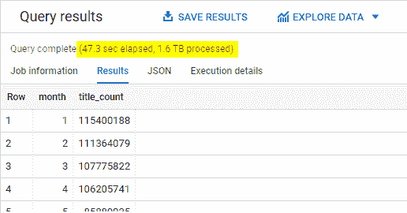
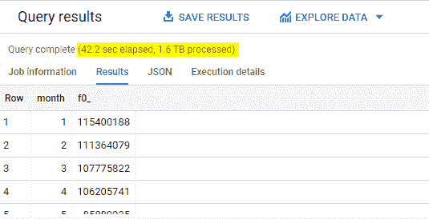

# 使用 HyperLogLog 在 Google BigQuery 中更快地计算唯一元素

> 原文：<https://towardsdatascience.com/counting-unique-elements-faster-in-google-bigquery-with-hyperloglog-bfbcac73495e?source=collection_archive---------55----------------------->

## 使用超对数算法，我们牺牲一些准确性来更快地完成工作。但是速度有多快，以什么样的准确度为代价呢？


克里斯·贾维斯在 [Unsplash](https://unsplash.com/s/photos/math?utm_source=unsplash&utm_medium=referral&utm_content=creditCopyText) 上的照片

超对数(HLL)是一种估计数据集包含多少独特元素的算法。Google BigQuery 利用这种算法对拥有 10 亿行及以上的超大型数据集的**进行了近似唯一元素计数。**

在本文中，我们将讨论两点。

1.  HLL 是什么？
2.  HLL 与其他方法相比如何？

# HLL 是什么？

> 超对数算法可以估计远超过 10⁹的基数，相对精度(标准误差)为 2%，同时仅使用 1.5kb 的内存。
> 
> *-hyperlog log:Philippe Flajolet 等人对接近最优的基数估计算法的分析*

HLL 是许多基数估计算法中的一种，这些算法都是为了解决一个问题而发明的:**如何尽可能快速准确地计算唯一元素的数量**。正如您可能已经猜到的，基数意味着数据集中具有重复条目的唯一元素的数量。

当您有一个非常大的数据集时，这些算法是非常有用的，这个数据集太大了，以至于无法在几秒钟内对多少个唯一条目进行排序和计数。下面是一些真实的使用案例。

*   通过计算在不同时间段传输的数据包的唯一报头对来检测网络攻击(例如拒绝服务)
*   估计 Redis、AWS Redshift 和 Druid 数据集中唯一记录的数量
*   统计一段时间内不同用户的数量，以获得移动应用的实时活动报告

HLL 是由 Philippe Flajolet 和 G. Nigel Martin 在 1984 年提出的 Flajolet-Martin 算法的各种改进的产物。从那以后，Google 采用并改进了它，使之成为 [HyperLogLog++函数。](https://cloud.google.com/bigquery/docs/reference/standard-sql/hll_functions)除了 Google，许多其他技术平台也基于 HLL 实现了自己的数据结构。然而，它们都有相同的基本规则。

> 如果集合中的所有数字都以二进制表示，并且 n 是所有数字中前导 0 的最大数量，则 2^n 是数字的估计唯一计数。

简而言之，**有了 HLL，我们牺牲了一些准确性来更快地完成工作。**但是速度有多快，以什么样的准确度为代价呢？让我们在 Google BigQuery 中运行一些实验。

# HLL 与其他方法相比如何？

让我们从一个大数据集开始。我使用的是维基百科数据集，可以通过谷歌大查询公共数据集获得。为了只提取 2020 年的数据，我用下面的查询创建了一个永久表。

```
# Create a table containing all hourly views per Wikipedia page in 2020 CREATE OR REPLACE TABLE `bigquery-301504.wikipedia.view_2020` AS SELECT * FROM `bigquery-public-data.wikipedia.pageviews_2020` 
WHERE DATE(datehour) < "2021-01-01" AND 
DATE(datehour) > "2019-12-31";
```

这个大表(2.24TB，超过 50 亿行)包含了 2020 年每个维基百科页面标题每小时的浏览量。你可以看看下面的模式。



作者照片

假设我们想知道 2020 年每个月有多少独特的图书被浏览，这里是我们可以编写的最简单的 SQL 查询。

**查询**

```
# Count unique titles viewed per month with DISTINCT method

SELECT EXTRACT(MONTH FROM datehour) AS month, 
COUNT(DISTINCT title) AS title_count 
FROM `bigquery-301504.wikipedia.view_2020` 
GROUP BY month 
ORDER BY month;
```

**结果**



作者照片

当使用 DISTINCT 函数时，Google BigQuery 需要跟踪它见过的每个唯一的日期。因此，运行这个查询需要 4 分多钟。

幸运的是，如果我们愿意牺牲一些准确性，我们可以走得更快。有两种方法可以得出一个大概的数量。

## **选项#1 —近似计数不同**

**查询**

```
# Count unique titles viewed per month with APPROX_COUNT_DISTINCT method

SELECT EXTRACT(MONTH FROM datehour) AS month, APPROX_COUNT_DISTINCT(title) AS title_count 
FROM `bigquery-301504.wikipedia.view_2020` 
GROUP BY month 
ORDER BY month;
```

**结果**



作者照片

好多了，但是我们能不能再用力一点？是的，我们可以。

## 选项 2——HLL

让我们看看如何使用 HLL 来解决同样的挑战，即计算每月观看的唯一标题。

**查询**

```
# Count unique titles viewed per month with HLL method 
WITH hll_count AS (
SELECT EXTRACT(MONTH FROM datehour) AS month, 
HLL_COUNT.INIT(title) title_count 
FROM `bigquery-301504.wikipedia.view_2020` 
GROUP BY month) SELECT month, hll_count. MERGE (title_count) 
FROM hll_count 
GROUP BY month order by month;
```

**结果**



作者照片

当我们放弃甚至不到 1%的准确性时，我们将查询速度提高了 6 倍。当然，有些情况下需要准确性，如财务报告或科学研究计算。否则，如果性能比绝对精度更重要，APPROX_COUNT_DISTINCT 和 HLL 都将派上用场。

尽管对 APPROX_COUNT_DISTINCT 和 HLL 的查询看起来不同，但值得注意的是，两者都使用了相同的 HLL 算法。由于第二种方法更复杂，您可能希望使用 APPROX_COUNT_DISTINCT 来保持代码更干净、可读性更好。

# 离别的思绪

如果你有兴趣了解更多关于 HLL 的演变，请查阅以下文章(按时间顺序排列)。

[数据库应用的概率计数算法](http://www.cse.unsw.edu.au/~cs9314/07s1/lectures/Lin_CS9314_References/fm85.pdf)

[大基数的双对数计数](https://www.ic.unicamp.br/~celio/peer2peer/math/bitmap-algorithms/durand03loglog.pdf)

[HyperLogLog:对一个接近最优的基数估计算法的分析](http://algo.inria.fr/flajolet/Publications/FlFuGaMe07.pdf)

[实践中的超级对数:一种最先进的基数估计算法的算法工程](https://research.google/pubs/pub40671/)

这就是我今天的全部内容。感谢您的阅读，如果您有任何反馈，请告诉我。大家保重，注意安全！

*原载于 2021 年 1 月 13 日*[*【http://thedigitalskye.com】*](http://thedigitalskye.com/2021/01/14/counting-unique-elements-faster-in-google-bigquery-with-hyperloglog/)*。*