# 新冠肺炎和巴西:数据探索

> 原文：<https://towardsdatascience.com/covid-19-and-brazil-a-tragedy-of-5570-cities-in-maps-and-graphs-84886c2154c6?source=collection_archive---------32----------------------->

Andre A. Xavier 在 [Unsplash](https://unsplash.com/s/photos/small-city?utm_source=unsplash&utm_medium=referral&utm_content=creditCopyText) 上拍摄的照片

## 地图和图表中 5570 个城市的悲剧

上周五，2021 年 2 月 26 日，标志着巴西首例新冠肺炎病例记录一周年。在这一时期，病例和死亡的累积统计数字令人恐惧。根据世卫组织统计，该国死于这种疾病的总人数排名第二，病例总数排名第三。如果仔细观察，这些数字可能会更加可怕。

当我们观察巴西各城市时，我们意识到其中几个城市的新冠肺炎死亡人数已经接近 2014 年至 2018 年在这些地方观察到的平均死亡人数。然而，悲剧不是一夜之间发生的。有许多线索表明它会发展到我们今天的位置。震撼了 5000 多个巴西城市中数千个家庭的轨迹是逐步建立起来的。基于 COVID 的死亡人数与巴西各城市总死亡人数的最新平均值的比较，我将在以下段落中更详细地讲述这个痛苦和损失的故事。

# 五年来巴西死亡人数的变化

巴西的死亡数据需要两年时间才能被正确确定并以公开的形式发布。现有的最新数据是 2018 年的。下图显示了 2014 年至 2018 年间该国各种原因导致的死亡总数的变化。

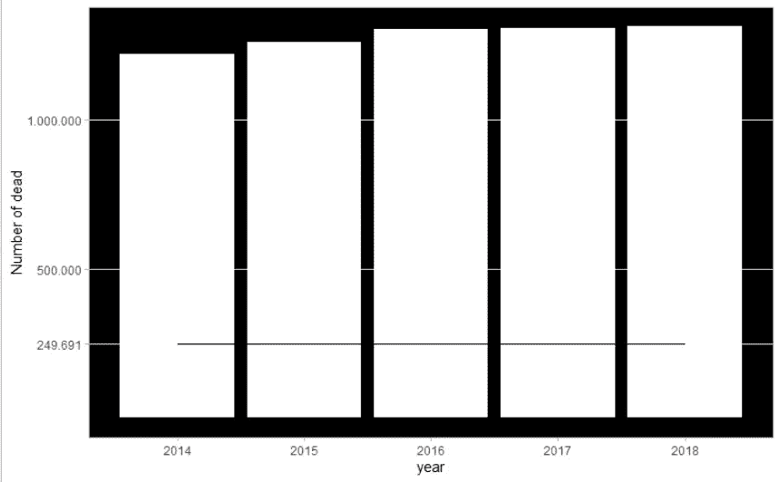

2014-2018 年死亡人数的演变。作者图片

从图表中可以看出，死亡人数始终在 100 万以上，在过去两年略有增加后，过去三年保持稳定。在第一例新冠肺炎病毒感染一周年的当天，巴西有 249，691 人死于该疾病。这在图中由穿过竖线的水平线表示。

调查数据显示，图表中显示的平均值约为 128.2 万人死亡。当我们将 2021 年 2 月 26 日 COVID 累积的死亡人数与该统计数据进行比较时，我们得出结论，该疾病相当于过去五年可用数据计算的所有死亡平均中观察到的死亡人数的 19.5%。这一比率在各市之间差别很大。在本文的其余部分，当阅读各市的死亡百分比时，该数字应被理解为这些地点的死亡人数与 2014 年至 2018 年期间统计的总死亡人数的各自平均值的比较。

# 新冠肺炎在巴西各城市的死亡百分比分布

下图显示了相对于我们在本文中关注的平均值，新冠肺炎造成的死亡百分比在巴西所有城市的分布情况。

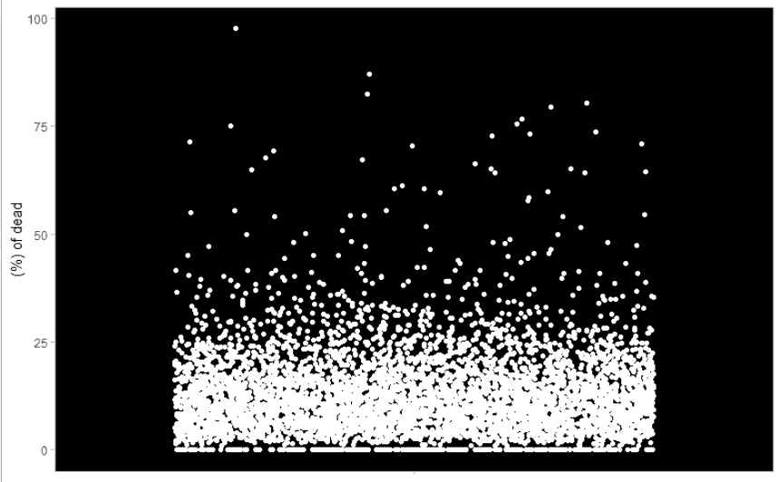

死亡百分比。作者图片

该图显示，绝大多数城市的数值低于 25%，但很容易看出有超过 50%的数值，在一些城市，COVID 相当于平均值的 75%以上，在一个特定的城市，该数值已经达到 99%。没错，2021 年 2 月 26 日，巴西一个自治市记录的 COVID 死亡总人数几乎与五年平均所有可能原因的死亡总人数相同。

以 COVID 的死亡百分比作为参考，我们可以看到，在整个巴西，数百个城市已经超过了平均死亡总数的 19.5%。下图显示了这些城市在巴西各州的分布情况。

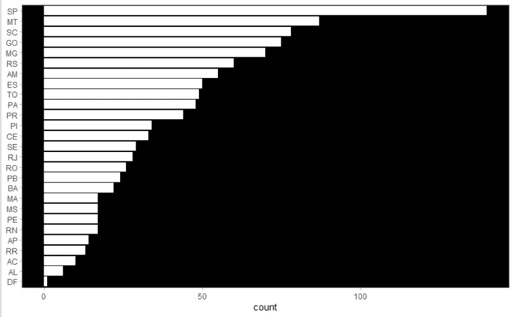

死亡率高于全国的城市数量统计排名。作者图片

拥有第二大城市的圣保罗在图表中表现突出。然而，你接下来看到的并不是你所期望的。像马托格罗索州、亚马孙州、帕拉州和托坎廷斯州这样的州几乎没有直辖市。我们将在后面看到，这些州也出现在死亡百分比高于平均死亡人数 19.5%的 10 个城市的名单中。

# 地图和图形中悲剧的演变

在以下段落中，我展示了巴西各城市在四个特定日期与 COVID 的死亡百分比相关的分布情况。这个想法是为了表明，这些数字朝着我们今天看到的画面一直在进化。我选择了与疾病传播的第一波和第二波高峰时刻相关的三个日期。第四次约会是 2021 年 2 月 26 日。见下图。

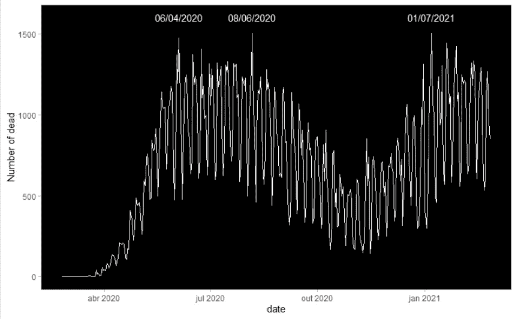

COVID 每日死亡人数的时间序列。作者图片

这些分析是根据巴西的地图完成的。在这里，我们以这样的方式绘制地图，较冷的颜色，接近蓝色的阴影，指的是低于全国 19.5%的城市死亡率。这个数字越低，颜色越冷。接近红色的暖色表示百分比高于参考值的城市。这个数字越高，颜色越暖。

为了得到一个初步的想法，请看下面的 2020 年 3 月 17 日的地图，这是我们作为本文参考使用的数据库中第一个登记死亡的日期。

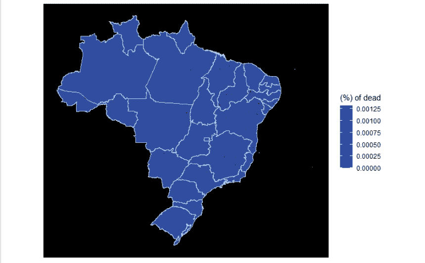

2020 年 3 月 17 日基线图。作者图片

不出所料，整个巴西都被涂成蓝色，毕竟疫情才刚刚开始。

不到三个月，情况就开始发生变化，我们已经可以看到 COVID 统计的死亡百分比超过平均水平的 30%。参见 2020 年 6 月 4 日的地图。

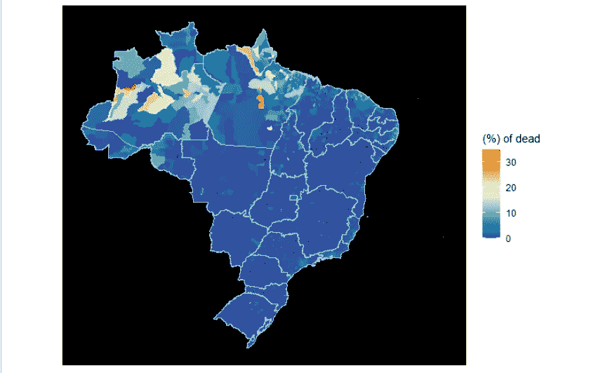

2020 年 6 月 4 日的地图。作者图片

从图中可以看出，在 6 月初，尤其是亚马逊和帕拉市将要发生的事情的第一章已经开始被书写，在地图上代表它们的颜色已经开始呈现暖色调。

下图显示了与平均死亡总数相比，COVID 死亡率最高的 10 个城市。

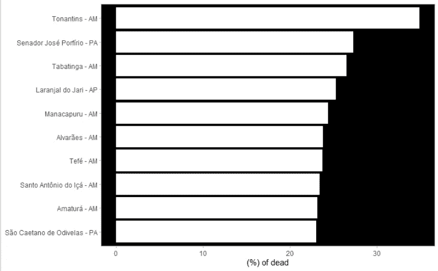

2020 年 6 月 4 日死亡人数(%)的城市排名。作者图片

如上所述，在十个城市中，七个位于亚马孙，三个位于帕拉。在这一天，托南廷斯是巴西唯一一个 COVID 死亡率高于 2014 年至 2018 年平均总死亡率 30%的城市。

从下图可以看出，到 2020 年 8 月 6 日，地图已经明显变暖。

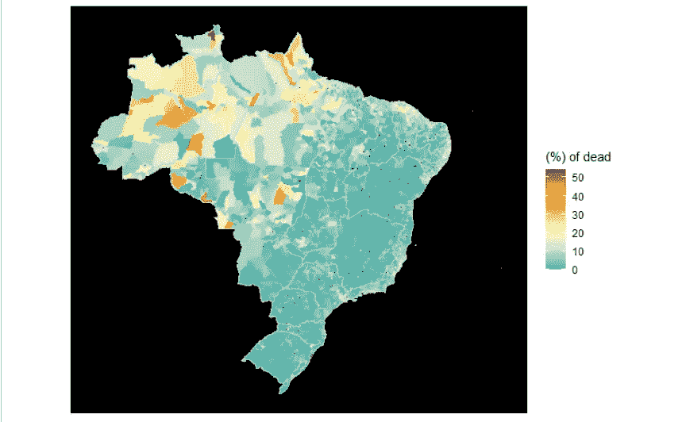

2020 年 8 月 6 日的地图。作者图片

之前占主导地位的强烈蓝色调已经从地图上消失了。该量表显示，已经有一些城市的新冠肺炎死亡率超过了 50%。可以看到，北部地区和中西部部分地区开始以暖色调为主，或者至少是不太冷的色调。

下图显示了死亡率最高的十个城市的最新情况。

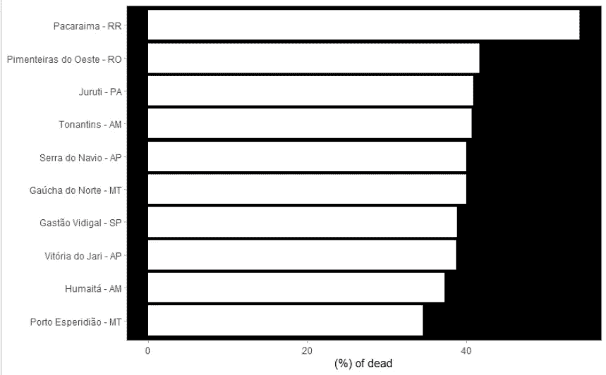

2020 年 8 月 6 日死亡人数(%)的城市排名。作者图片

如果在 2020 年 6 月初，只有一个城市的比率超过 30%，两个月后我们可以看到，所有 10 个城市都远远超过了这一标志，帕拉恰马已经超过了 50%。

2020 年 08 月 06 日的里程碑与第一波 COVID 死亡人数下降轨迹的开始相吻合。不幸的是，休战并没有持续多久，到 2021 年 7 月 1 日，巴西已经出现了单日死亡人数的新纪录。请看下面那天地图的样子。

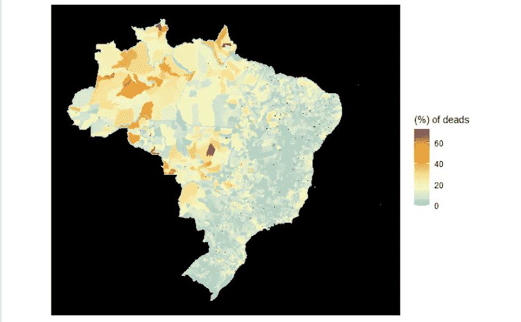

2021 年 7 月 1 日的地图。作者图片

从上面的图像中，你可以看到弱冷色调在整个巴西东部盛行，而暖色调在中西部不太明显，强暖色调在北部占主导地位。色标已经显示有超过 60%的城市。

请参见下图了解排名的更新情况。

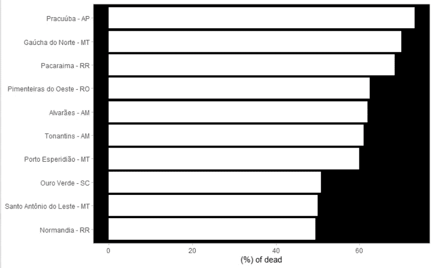

2021 年 1 月 7 日死亡人数(%)的城市排名。作者图片

上图中的十个城市都超过了 50%,其中七个已经超过了 60%。

最后，我们指出了在巴西第一例新冠肺炎病例一周年纪念日的感受。见下图。

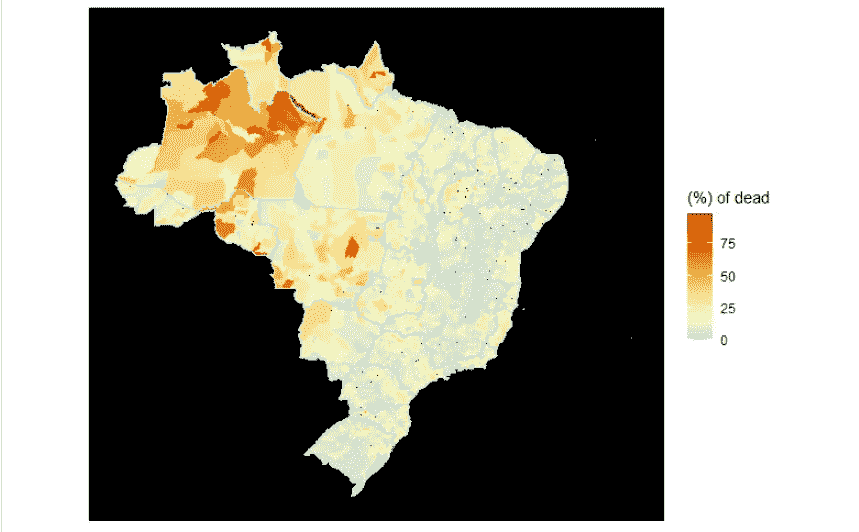

2021 年 2 月 26 日的地图。作者图片

巴西东部的冷色调和弱色调与暖色调和弱色调存在争议。在中西部，我们已经看到更强烈的暖色调获得了更大的空间，而在北部，尤其是在亚马逊州，悲剧正在上演。色标已经显示 75%的比率已经危险地超过，非常接近 100%。

看看下面这些城市的排名。

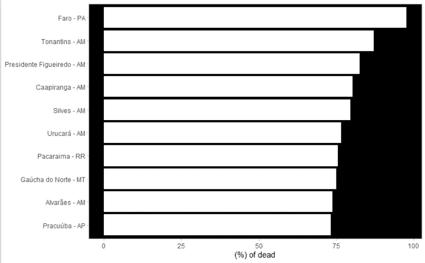

2021 年 2 月 26 日死亡人数(%)的城市排名。作者图片

图中可见亚马逊(AM)和帕拉(PA)在图中盛行。也可以看出，8 个直辖市超过死亡人数的 75%；更可怕的是，在 Pará的 Faro 市，据核实，COVID 在一年内杀害的人数相当于该市登记的所有死亡人数的年平均数。对于这个巴西北部的小自治市来说，这似乎是对悲剧最好的定义。

# 2021 年作为 2020 年的重演？

超过 25 万人死亡后，情况似乎不会很快好转。免疫接种运动出现延误，公共权力机构几乎没有努力颁布更严格的措施，迫使社会疏远，人们对紧急援助的持续性表示怀疑，这种援助可能成为减少疫情影响甚至减少流动性的工具，甚至部分人口似乎更相信误导性措施，而不是科学和集体意识，这些措施往往是由那些应该保护人们免受疾病的人传播的。

现在看来，2020 年及其可怕的统计数据将在 2021 年重演悲剧。

# 代码和数据

这些数据可以从两个致力于提高巴西开放数据质量和可用性的组织下载。【2014 年至 2018 年间巴西的死亡人数数据由 [Base dos Dados](https://basedosdados.org/dataset/br-ms-sim/resource/c102e36d-9b3a-4def-9935-f58229ab86ae) 提供。另一方面，COVID 的死亡人数来自数据初创公司 [Brasil.io](https://brasil.io/dataset/covid19/files/) 的努力。

数据处理和分析的代码可在我的 [Github](https://github.com/fernandobarbalho/covid_municipios) 上获得。