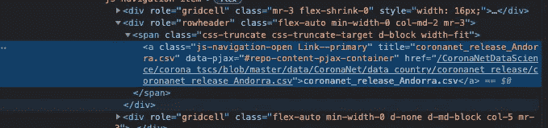
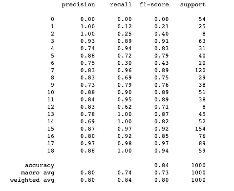
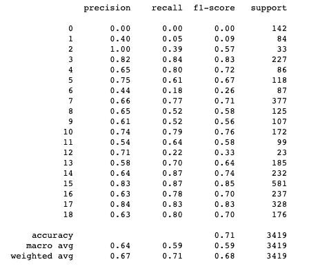
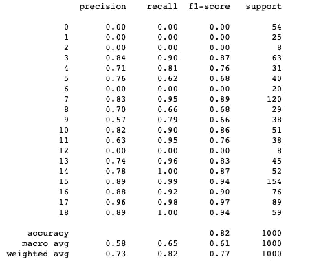
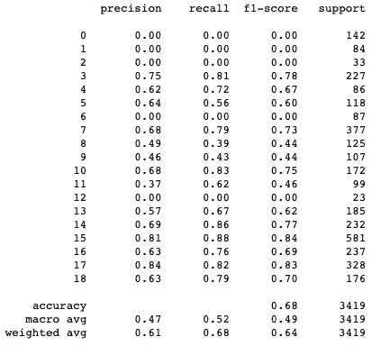

# 基于神经网络的新冠肺炎保单多分类

> 原文：<https://towardsdatascience.com/covid-19-policies-multi-classification-with-neural-network-d85cbc0f90c0?source=collection_archive---------25----------------------->

## *记录我调整 ML 模型的学习曲线，该模型可以分类 20 个类(将来甚至更多)*


[奥比·奥尼耶多尔](https://unsplash.com/@thenewmalcolm?utm_source=medium&utm_medium=referral)在 [Unsplash](https://unsplash.com?utm_source=medium&utm_medium=referral) 上的照片

# **小介绍~**

在进入工作的细节之前，我想留出一些空间来分享这个项目和这篇文章背后的动机的总结。

我在 Coronanet.org 度过了一段美好的时光，这是一个了不起的跨国团队，有 500 多名研究助理在一起工作，收集全球新冠肺炎政策的数据。我们的最终目标是以最有用的形式发布尽可能多的政策数据集，然后这些数据集可以用于不同类型的研究/新闻工作。我们组织收集的数据的许多方法之一是手动通读并将其分类为 20 种不同的策略类型(社交距离、锁定等，随便你怎么说)和其他子类型。事实上，许多保单看起来并不清楚它们属于任何特定的保单类型，而且每天都有大量的传入数据，这证明很难仔细检查每一份保单的标签准确性。这就是我们开始用不同的 ML 模型进行实验的地方，以寻找一种可以识别错误编码并比人工工作更有效地清除这些错误的算法。

随着对最佳模式的探索的继续，已经并将会有许多变化。因此，我想记录一些我个人取得的进步、成功和局限性，因为我在不断学习和寻找更好的模型，希望我能为团队的共同目标做出有意义的贡献，无论大小！所以…

# 让我们开始吧

## 数据收集

我是从我们机构的公开回购上刮来的数据，可以在这里[找到](https://github.com/CoronaNetDataScience/corona_tscs/tree/master/data/CoronaNet/data_country/coronanet_release)。我使用 s *elenium* 只从一些选定的国家收集数据集(这些国家有许多已公布的政策记录)。[注:如果您也使用 Chrome，您需要先将[Chrome driver](https://chromedriver.chromium.org/downloads)**下载到您的电脑上，以便运行并打开浏览器。**

```
**from selenium import webdriverdriver=webdriver.Chrome('/Users/irenechang/Downloads/chromedriver')
driver.get('[https://github.com/CoronaNetDataScience/corona_tscs/tree/master/data/CoronaNet/data_country/coronanet_release'](https://github.com/CoronaNetDataScience/corona_tscs/tree/master/data/CoronaNet/data_country/coronanet_release'))**
```

**由于数据集文件名具有相同的格式，我将为所有我想要抓取并解析成这种格式的国家名称制作一个列表。**

```
***#showing only a few countries*
country_names = ['Germany', 'United States of America', 'Spain', 'Australia', 'India']
countries_to_scrape = []*#parse string together*
for country in country_names:
    countries_to_scrape.append("coronanet_release_" + country + ".csv")**
```

**selenium 的魅力来了，当你站在浏览器自己移动到页面的地方时，它使所有的刮擦都变得愉快。我们会的**

**(1)为每个链接创建 xpath**

**(2)进入每个链接→导航到下载按钮→点击它，**

**以下代码片段实现了全部自动化:**

```
***# get the link for each data file*
urls = []
for country in countries_to_scrape:
    xPath = "//a[[@title](http://twitter.com/title)='"+ country + "']"
    print(xPath)
    link = driver.find_element_by_xpath(xPath).get_attribute("href")
    urls.append(link)**
```

**[注意:如果您以前没有使用过，XPath 是一种查询语言，就像 SQL 一样，但用于 XML 文档，也就是可以在“开发人员工具”中查看的 web“结构”。这里，我们想要提取这些国家的 csv 的链接(也称为 *href* 属性)，这些链接可以在< a >标签中找到，这些标签碰巧具有与所示文本相同的标题(*标题*属性)**

****

**突出显示的部分是我们要导航到的地方**

```
**//a[@title='coronanet_release_Germany.csv']
//a[@title='coronanet_release_United States of America.csv']
//a[@title='coronanet_release_Spain.csv']
//a[@title='coronanet_release_Australia.csv']
//a[@title='coronanet_release_India.csv']**
```

**☝️是来自 *print()* 的结果，这些是我们的*XPath*。接下来，按照类似的过程，我们进入第二阶段，获取原始 csv 文件，并连接所有这些数据帧。**

```
**from parsel import Selector
csv_urls = []
for url in urls:
    driver.get(url)
    sel = Selector(text=driver.page_source)
    raw_csv = driver.find_element_by_id('raw-url').get_attribute("href")
    csv_urls.append(raw_csv)dfs = []
for csv in csv_urls:
    # read each csv into a separate dataframe
    dfs.append(pd.read_csv(csv))big_frame = pd.concat(dfs, ignore_index=True)**
```

## **数据预处理**

**从 big_frame 开始，我只对 2 列感兴趣，“描述”和“类型”。**

**对于其余的预处理步骤，我密切关注 Miguel 的笔记本，可以在这里[找到](https://github.com/miguelfzafra/Latest-News-Classifier/blob/master/0.%20Latest%20News%20Classifier/03.%20Feature%20Engineering/03.%20Feature%20Engineering.ipynb)。他每一步的讲解都非常清晰，非常有帮助，尤其是对于我这样刚开始处理文本数据的人。一般来说，核对表应该是:**

1.  **特殊字符和标点符号**
2.  **下放箱子**
3.  **删除号码**
4.  **词干化和词汇化**
5.  **停用字词(国家名称、地区名称以及在正式文件和政策中使用的字词)**
6.  **标签编码**
7.  **列车-测试分离**

**下面是我的步骤 5 的一个片段:**

```
**#stopwords
nltk.download('stopwords')
stop_words = list(stopwords.words('english'))# include country names in stopwords
country_text = []
for text in df["description_1"].tolist():
    for c in pycountry.countries:
        if c.name.lower() in text:
            text = re.sub(c.name.lower(), '', text)
    country_text.append(text)df["description_2"] = country_textfor stop_word in stop_words:
    regex_stopword = r"\b" + stop_word + r"\b"         df['description_2'] = df['description_2'].str.replace(regex_stopword, '')**
```

## **符合模型**

**首先，由于数据是不平衡的，所以我们将计算类权重，以备以后在神经网络中使用:**

```
**from sklearn.utils import class_weightclass_weights = list(class_weight.compute_class_weight('balanced',                np.unique(df2['type']), f2['type']))class_weights.sort()
class_weights*# assign labels to these weights*
weights = {}
for index, weight in enumerate(class_weights) :
    weights[index] = weight

weights**
```

**Out:
{0: 0.3085932721712538，
1:0.481440839694655，
2:0.491285285，29698，149953，
3:0.682745，50609，
4:0.66。5566646**

**接下来，我们将我们训练和测试集转换成可用的对象形式，并打印出来以供查看:**

```
**dataset_train = tf.data.Dataset.from_tensor_slices((X_train.values, y_train.values))
dataset_test = tf.data.Dataset.from_tensor_slices((X_test.values, y_test.values))for text, target in dataset_train.take(5):
    print('Desc: {}, label: {}'.format(text, target))**
```

**以下是贴有标签的前 5 个描述的结果:**

```
**Desc: b' us embassy montevideo consular section  closed   routine consular services   notice    emergency situations   considered   time ', label: b'Restriction and Regulation of Government Services'Desc: b' pennsylvania governor signed  senate bill    waives  requirement  schools    session  least  days  provides  continuity  education plans  ensures school employees  paid   closure   provides  secretary  education  authority  waive student teacher  standardized assessments   march  ', label: b'Closure and Regulation of Schools'Desc: b"dumka   district   n state  jharkhand   defined  government services  would remain operational   lockdown   follows    law  order agencies -  function without  restrictions   officers attendance - compulsory  grade ''  'b' officers  reduced  %  grade 'c'      district administration  treasury officials -   function  restricted staff    wildlife  forest officers -  function  taking necessary precautions ", label: b'Restriction and Regulation of Government Services'Desc: b'texas     reopening  non-essential businesses starting may      per executive order ga-    hair salons  barber shops  nail salons   tanning salons must maintain mandatory ft distance  patrons    swimming pools  operate  % capacity     may   jail time  removed   enforcement mechanism  update   may   gov  abbott removed jail time   penalty  failing  follow covid- restrictions ', label: b'Restriction and Regulation of Businesses'Desc: b' public safety curfew   imposed  mobile  alabama  effective   pm  april      remain  effect  april      persons shall remain   places  residence  shall    public places ', label: b'Lockdown'**
```

**我们的下一个任务是一次性编码 20 个标签。为此，我创建了一个散列表，以便按类别代码方便地查找值:**

```
**table = tf.lookup.StaticHashTable(
    initializer=tf.lookup.KeyValueTensorInitializer(
        keys=tf.constant(list(category_codes.keys())),
        values = tf.constant(list(category_codes.values()))
    ),
    default_value=tf.constant(-1),
    name="target_encoding"
)[@tf](http://twitter.com/tf).function
def target(x):
    return table.lookup(x)**
```

**使用这些函数，我们可以将训练集和测试集中的标签编码成数字数组。用 *next()* 打印出结果**

```
**def fetch(text, labels):
    return text, tf.one_hot(target(labels), 19)train_data_fetch = dataset_train.map(fetch)
test_data_fetch = dataset_test.map(fetch)next(iter(train_data_fetch))**
```

**输出(第一个 tf。张量是我们的训练数据，第二个是我们转换的训练标签):**

```
**(<tf.Tensor: shape=(), dtype=string, numpy=b'   april   mha writes  states  ensure smooth harvesting  sowing operations   maintaining social distancing   -day lockdown  fight covid-  -  union ministry  home affairs  mha   sent  advisory   states regarding granting   exception  agricultural operations  lockdown restrictions  fight covid-  keeping  mind  harvesting  sowing season   -   advisory  exceptions   allowed  farming operations  farmers  farm workers  procurement  agricultural productions  operation  mandis  movement  harvesting  sowing related machinery  etc '>,
 <tf.Tensor: shape=(19,), dtype=float32, numpy=
 array([0., 0., 0., 0., 0., 0., 0., 0., 0., 0., 0., 0., 0., 1., 0., 0., 0.,
        0., 0.], dtype=float32)>)**
```

## **开始创建模型**

**首先，我们需要在将文本数据输入模型之前对其进行标记。我使用了谷歌已经实现的模型，它将为我们创建一个嵌入层。简而言之，它是这样工作的:**

> **谷歌开发了一个**嵌入**模型， **nnlm** -en- **dim128** ，这是一个基于令牌的**文本嵌入**训练模型，在英文谷歌新闻 200B 语料库上使用了一个三隐层前馈神经网络语言模型。这个模型将文本的任何主体映射到 128 维的嵌入中**

**要使用它，只需传入该型号的链接，该链接可以在这个[网站](https://tfhub.dev/google/nnlm-en-dim128/2)上找到【注意:您可能需要检查以确保您正在使用的版本是最新的，否则它会给你错误】:**

```
**embedding = "[https://tfhub.dev/google/nnlm-en-dim128/2](https://tfhub.dev/google/nnlm-en-dim128/2)"
hub_layer = hub.KerasLayer(embedding, output_shape=[128],input_shape=[], dtype=tf.string,
                          trainable=True)
hub_layer(train_data[:1])**
```

**潜入这一层给了我们什么:**

```
**<tf.Tensor: shape=(1, 128), dtype=float32, numpy=
array([[ 1.85923278e-01,  3.82673025e-01,  8.69123638e-02,
        -2.36745372e-01, -1.19763926e-01, -5.65516986e-02,
         2.45870352e-01,  5.02816178e-02, -2.10541233e-01,
        -4.42932360e-02,  1.28366366e-01,  1.47269592e-01,
         1.41175740e-04,  4.45434526e-02,  2.13784329e-03,
         1.61750317e-01, -2.32903764e-01, -2.10702419e-01,
        -2.09106982e-01,  1.55449033e-01,  4.53584678e-02,
         4.31233309e-02,  1.48296393e-02, -1.68935359e-01,
         1.12579502e-01, -1.03304483e-01,  1.61703452e-01,
         2.13061482e-01, -4.74388264e-02,  1.27027377e-01,
        -3.04564610e-02, -1.92816645e-01, -3.22420187e-02, ... ]])**
```

**神经网络模型的陷阱是过度拟合，一如既往，因此我们通常必须使用脱落层来正则化它。Dropout layer 是一种正则化神经网络的工具，其中许多层的随机输出被忽略，因此稀疏网络将不得不适应纠正来自先前层的错误(阅读更多[此处](https://machinelearningmastery.com/dropout-for-regularizing-deep-neural-networks/))。**

**在不知道我的模型是否会出现这种情况的情况下，我训练了两个模型，一个有脱落层，另一个没有，并比较了它们的结果。对于这些模型，不要忘记使用早期停止。**

```
***#build the basic model without dropout*
model_wo_dropout = tf.keras.Sequential()
model_wo_dropout.add(hub_layer)
for units in [128, 128, 64, 32]:
    model_wo_dropout.add(tf.keras.layers.Dense(units, activation='relu'))
model_wo_dropout.add(tf.keras.layers.Dense(19, activation='softmax'))model_wo_dropout.summary()*#compile the model*
model_wo_dropout.compile(optimizer='adam',loss=tf.keras.losses.CategoricalCrossentropy(from_logits=**True**), metrics=['accuracy'])train_data_fetch = train_data_fetch.shuffle(70000).batch(512)
test_data_fetch = test_data_fetch.batch(512)*#fit the model*
from keras import callbacks
earlystopping = callbacks.EarlyStopping(monitor="val_loss", mode="min", patience=5, restore_best_weights=**True**, verbose=1)
text_classifier_wo_dropout = model_wo_dropout.fit(train_data_fetch, epochs=25, validation_data = test_data_fetch,
                   verbose=1, class_weight=weights, callbacks =[earlystopping])**
```

**对我们的测试和训练集的评估~**

```
***#training errors*
y_train_pred = model_wo_dropout.predict(train_data)

print(classification_report(train_labels.numpy().argmax(axis=1), y_train_pred.argmax(axis=1)))*# test errors*
test_data, test_labels = next(iter(dataset_test.map(fetch).batch(test_length)))
y_pred = model_wo_dropout.predict(test_data)

print(classification_report(test_labels.numpy().argmax(axis=1), y_pred.argmax(axis=1)))**
```

****

**培训结果**

****

**测试结果**

**结果，与我在建立这个神经网络之前尝试作为基线模型的逻辑回归模型相比，提高了 10%，这是一个非常好的景象。我将在完成对漏失层模型的实现后进一步讨论这些结果。**

## **带有脱层的模型，用于确认过度拟合**

**正如我之前所说，为了确认我们的模型是否过度拟合数据，我训练了一个具有几个丢弃层的二级神经网络，并比较了结果。我们可以在 0.1-1.0 的范围内网格搜索最佳压差参数。这里，我用 0.3 作为参数。**

**我们必须重建训练和测试设备。这种模型的唯一区别在于图层构建过程。从这一点开始，所有的一切都与没有脱落层的模型相同。重要的是要注意，我们不应该在输出层(也就是最后一层)之前有脱落层，因为输出层不能再纠正前面层的错误，所以添加另一个脱落层最终会损害模型的性能(我就是这种情况)。**

```
***# re-create train, test data for fitting the model*
train_data_fetch_dropout = dataset_train.map(fetch)
test_data_fetch_dropout = dataset_test.map(fetch)*# build a similar model but with the dropout layers*
model = tf.keras.Sequential()
model.add(hub_layer)
**for** units **in** [128, 128, 64]:
    model.add(tf.keras.layers.Dense(units, activation='relu'))
    model.add(tf.keras.layers.Dropout(0.3))
model.add(tf.keras.layers.Dense(32, activation='relu'))
model.add(tf.keras.layers.Dense(19, activation='softmax'))

model.summary()**
```

**结果如下:**

****

**培训结果**

****

**测试结果**

# **~讨论和扩展问题:**

*   **有和没有脱落层的模型的性能基本相同。即使使用了脱落层，训练和测试误差之间的差异也没有改善。事实上，与没有 dropout 层的模型相比，使用 dropout 层的模型无法预测更多类别的标签(许多类别的准确率为 0%)。然而，在检查了大数据集和正则化没有显著改善模型的事实之后，我不认为过度拟合在这个模型中是个大问题。进一步的分析可能涉及在不同的辍学率值上拟合模型，以确认性能没有提高是因为我们没有选择一个好的辍学率，还是因为数据集本身。**
*   **逻辑回归以及其他 ML 模型在训练和测试误差之间没有那么大的差距。可以说，这些最大似然模型不像神经网络模型那样遭受过度拟合，然而，假定我们已经使用了最佳参数，这些模型很难进一步改进。与此同时，神经网络有很好的机会超越这一点。由于我们的兴趣在于获得更准确的预测，我们将使用神经网络。**
*   **据观察，在我添加了更多的数据点(更多的国家)后，两个模型的总体准确性都提高了。这让我想知道获得所有可用的数据是否会进一步提高准确性。**
*   **在不同的拟合尝试中，精度显示出轻微的波动(由于神经网络模型可能落入“局部最大/最小”陷阱的事实)，但平均而言，结果在范围[0.66-0.71]内，这比我拟合的机器学习模型的平均结果(约 59-60%)增加了约 5-10%。查看混淆矩阵，每个类别中的指标也有所改善。**
*   **另一个可能影响模型预测能力的来源是，许多类别(以健康资源、健康监控和健康测试为例)共享许多共同的词，因此接下来的步骤之一是识别和开发在不同类别中出现很多的停用词的集合，以减少这些类别之间的相似性，并查看这是否会进一步提高性能。**

**总之，这个神经网络模型非常简单，肯定有改进的空间，重点是数据预处理过程(更多停用词、过采样/欠采样)，以及进一步的交叉验证以达到平均精度。话虽如此，这对我来说是一次非常充实的学习经历，也是第一次接触神经网络！如果你已经走了这么远，非常感谢你！我期待着更新你更多关于我的这个模型的未来版本。**

**这个笔记本的完整版本可以在这个 Github repo 中找到:**

**[](https://github.com/irenechang1510/Topic-classification-NN/blob/main/Topic%20classification%20with%20Neural%20Network.ipynb) [## Irene Chang 1510/主题-分类-NN

### 在 GitHub 上创建一个帐户，为 Irene Chang 1510/Topic-class ification-NN 开发做贡献。

github.com](https://github.com/irenechang1510/Topic-classification-NN/blob/main/Topic%20classification%20with%20Neural%20Network.ipynb) 

请随时通过我的 LinkedIn 联系我，如果您有任何问题，我很乐意与您联系！

参考资料:

[1] Dipanjan (DJ) Sarkar，[面向自然语言处理的深度迁移学习—具有通用嵌入的文本分类](/deep-transfer-learning-for-natural-language-processing-text-classification-with-universal-1a2c69e5baa9) (2018)，面向数据科学

[2] Miguel Fernández Zafra，[Python 中的文本分类](/text-classification-in-python-dd95d264c802) (2019)，towardsdatascience**