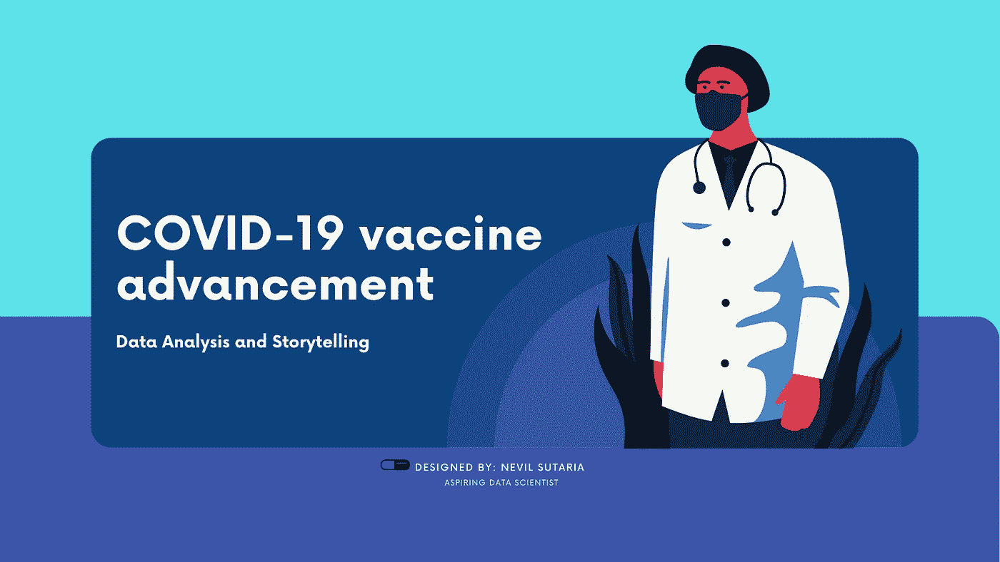
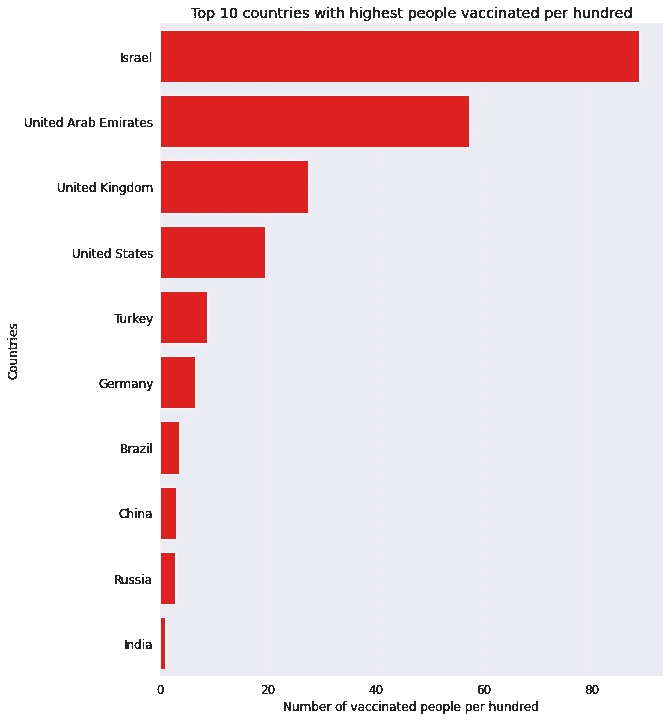
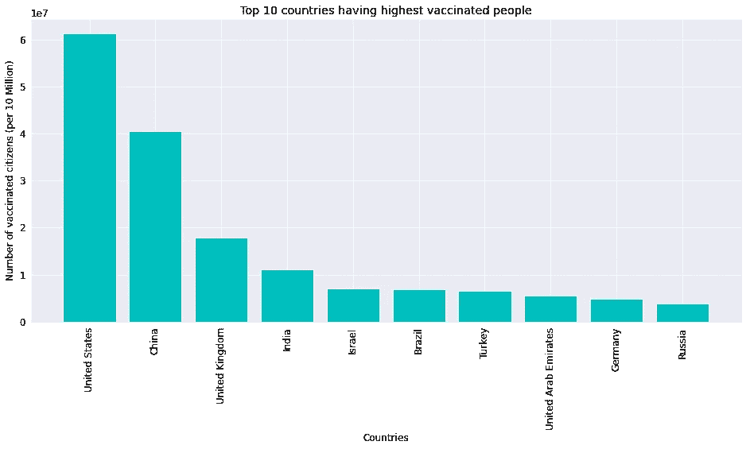
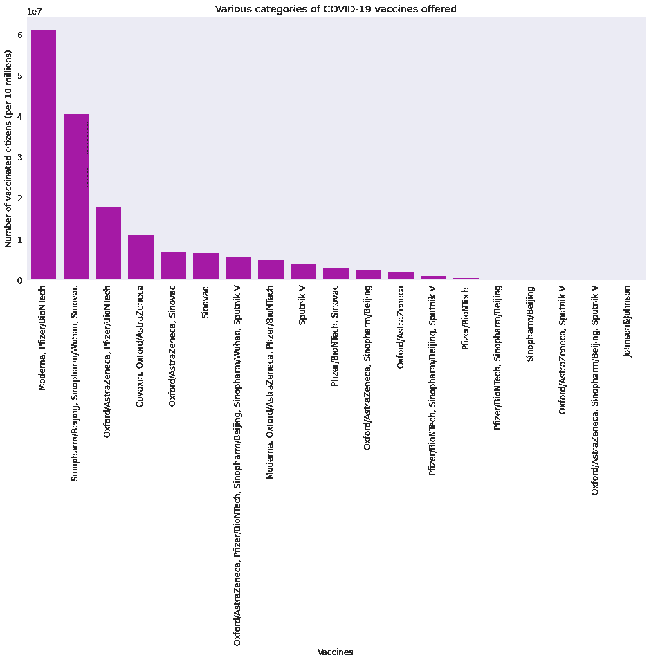
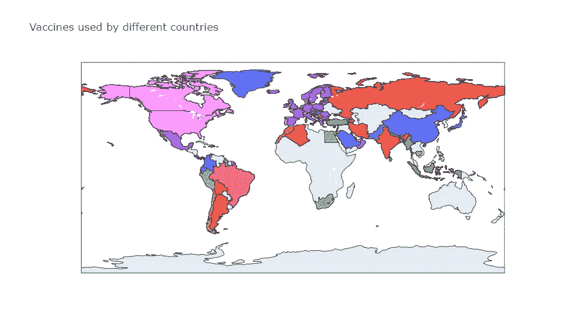

# 通过数据故事分析新冠肺炎疫苗接种进展

> 原文：<https://towardsdatascience.com/covid-19-vaccination-progress-analysis-around-the-world-736d7e57f198?source=collection_archive---------12----------------------->

## 全球不同国家新冠肺炎疫苗接种项目的详细数据分析和以结果为导向的故事讲述。

设计者: [Nevil Sutaria](https://www.canva.com/join/xjv-lvb-pgr)

在过去的一年里，新冠肺炎疫情是世界上最严重的健康灾难。预测新冠肺炎疫苗接种趋势已成为一个具有挑战性的问题。许多卫生专业人员、统计学家、研究人员和程序员一直在使用各种方法跟踪病毒在世界不同地区的传播。天才科学家开发的各种疫苗的增加激发了对正在进行的疫苗项目的更多了解的好奇心，以及从数据中找到有意义的见解的浓厚兴趣，驱使我致力于这一特殊的努力。

在查阅了多个网站后，我在 [Kaggle](https://www.kaggle.com/gpreda/covid-19-vaccination-progress) 上找到了合适的数据集。我特别使用了 [Jovian](https://jovian.ai/nevilsutaria-9/covid-19-vaccination-progress) 来完成这个项目，因为它易于使用和理解。此外，完整的代码可在 [GitHub](https://github.com/MrNevil/COVID-19-Vaccination-progress) 上获得。

该项目旨在通过使用从互联网收集的数据中发现的推论，传达对全球不同正在进行的疫苗接种计划的分析。探索性数据分析中使用的 python 库包括 *NumPy、Pandas、Matplotlib、Seaborn 和 Plotly* 。以下项目的目标包括:

1.  哪个国家首先开始为其公民接种疫苗？
2.  哪个国家拥有**最高的接种人群**？
3.  提供哪些**不同类别的疫苗**？
4.  各国使用哪种**疫苗？**

# 数据准备和清理

我们读取数据文件，并聚合几个字段的数据(国家、iso_code 和疫苗——特定国家使用的疫苗接种方案)。数据清理是成功的数据分析项目中最关键的一步。在大多数情况下，数据集只有很少的“NaN”(非数字)值、一些空行(值为 0)以及冗余列，可以使用和配置 drop function 并根据需要将 NaN 值更改为 0 或删除整行来删除这些值。

> “数据科学家花 60%的时间清理和组织数据。~根据[福布斯](https://www.forbes.com/sites/gilpress/2016/03/23/data-preparation-most-time-consuming-least-enjoyable-data-science-task-survey-says/?sh=6db33ca96f63)的一项调查

# 探索性数据分析和可视化

我们将初始化 Python 包，我们将使用这些包进行数据摄取和可视化。我们将通过设置字体大小、图形大小、面部颜色等来配置环境。此外，我们通常会使用 seaborn 进行可视化。

现在，我们可以通过处理目标来开始处理数据。

## **1。哪个国家的公民接种疫苗最快？**

为了绘图，我们需要一组以特定方式排列的数据值。可以通过使用 groupby()、max()、sort_values()等方法来实现。此外，我们将比较前 10 个国家的简洁可视化。排列好之后，我们可以使用 seaborn 内置函数绘制它们，如下所示。

从下面的图像中可以清楚地看到，以色列在人均剂量方面领先世界，每 100 个人就有超过 80 个剂量。

## **2。哪个国家接种疫苗的人数最多？**

让我们找出接种疫苗人数最多的国家。为了便于可视化，我们将考虑排名前 10 位的国家。在这里，我们使用 matplotlib 绘制了数据，并使用了总接种量系列。

从下面的图像中可以清楚地看到，美国大约有 6000 万人接种了疫苗。

## **3。提供哪些不同类别的疫苗？**

为了找到不同的类别并了解哪种疫苗被广泛使用，我将代码整理如下:

**辉瑞**在世界上最常用的新冠肺炎疫苗名单中名列榜首，其次是 **Mordema** 和**牛津-阿斯利康。**

## **4。不同国家使用的疫苗有哪些不同？**

在这个特定的目标中，我们将使用 Plotly 库来绘制一个二维世界地图。这里我们使用 iso_code 来获取特定地区/国家的位置。此外，hover_name 属性用于创建动态图表，以便当我们将鼠标悬停在某个特定国家时，它会显示疫苗的详细信息。

要看动态图，请点击[这里](https://www.kaggle.com/mrnevil/covid-19-vaccination-progress)。

# 推论和结论

从上面的分析和可视化，我们可以得出结论:

1.  *在* ***以色列，给病人接种疫苗的比率最高。***

猜想:是因为它的面积小(就面积和人口而言)，人口相对年轻，2020 年 12 月天气相对温暖，中央集权的国家政府制度，以及对大规模国家突发事件实施迅速反应的发达基础设施。

2.****美国接种疫苗的人数最多，约占其总人口的 6000 万*** *其次是* ***中国*** *和* ***英国*** *。**

*推测:由于这些都是发达国家，疫苗对公众来说更容易获得。*

***3。 *Moderna、辉瑞/BioNTech*** *是世界范围内最受欢迎的疫苗，因为它几乎没有副作用(迄今已知)。此外，印度使用* ***Covaxin，Covishield*** *为其公民接种疫苗。**

*4.*不同的国家使用不同的疫苗，即、* ***印度*** *— Covaxin、牛津/阿斯利康、* ***美国*** *— Moderna、辉瑞/BioNTech、**以色列* *— Moderna、辉瑞/BioNTech、* ***英国*** *—牛津/阿斯利康、辉瑞/**

*从推论和推测中，可以得出这样的结论:来自世界各地的人们都在自我教育，并愿意在政府的免费疫苗接种计划下接种疫苗。此外，这些疫苗已被证明对新冠肺炎有效(到目前为止)。如果接种疫苗的人数继续增长，那么所有国家都可以在今年年底前为其人民接种疫苗。*

# *参考资料和未来工作*

*我们可以通过比较接种疫苗前和接种疫苗后的死亡人数来扩展该数据集的用途，以检查每个国家每种疫苗的有效性。*

## ***资源:***

1.  *[数据集](https://www.kaggle.com/gpreda/covid-world-vaccination-progress)*
2.  *[数据分析课程](https://www.zerotopandas.com)*
3.  *[新冠肺炎疫苗接种](https://ourworldindata.org/covid-vaccinations)*
4.  *[日期时间库文档](https://docs.python.org/3/library/datetime.html)*
5.  *[Matplotlib 文档](https://matplotlib.org/3.1.1/contents.html)*
6.  *[辅导点](https://www.tutorialspoint.com/matplotlib/matplotlib_bar_plot.htm)*
7.  *[Seaborn 文档](https://seaborn.pydata.org/introduction.html)*
8.  *[熊猫文档](https://pandas.pydata.org/pandas-docs/stable/reference/api/pandas.DataFrame.items.html)*
9.  *[Plotly 文档](https://plotly.com/python/)*
10.  *[W3schools](https://www.w3schools.com/python/matplotlib_pie_charts.asp)*

**

*设计者: [Nevil Sutaria](https://www.canva.com/join/xjv-lvb-pgr)*