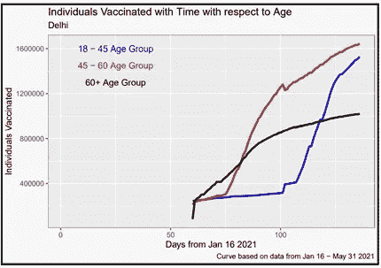
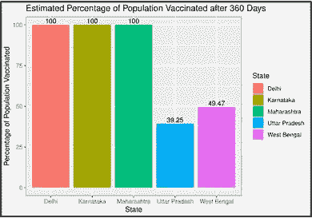

# 新冠肺炎疫苗接种:对印度有什么好处？

> 原文：<https://towardsdatascience.com/covid-19-vaccination-what-does-it-hold-for-india-992550aeb217?source=collection_archive---------27----------------------->

## 使用 R 可视化当前疫苗接种数据，并估计在印度 5 个邦接种疫苗所需的时间

丹尼尔·施鲁迪在 [Unsplash](https://unsplash.com?utm_source=medium&utm_medium=referral) 上拍摄的照片

# **简介**

新冠肺炎疫情已经影响到世界各国，印度对此并不陌生。从旅行禁令开始，到防护设备、病床、氧气瓶甚至医生的严重短缺，该国人民经历了许多苦难。然而，随着疫苗接种运动的开始，似乎有了一个更美好的未来。

我对疫苗接种运动的效果很好奇，所以我决定把这个问题分成几个小问题

1.  我们应该选择哪 5 个州来可视化疫苗接种曲线？
2.  疫苗的施用在性别、疫苗类型或年龄组方面有什么不同吗？
3.  给定上述信息，我们能否估计在某一特定州给所有人接种疫苗需要多少天？

为了探索这一点，我收集了印度 5 个邦的疫苗接种数据——德里、西孟加拉邦、马哈拉施特拉邦、卡纳塔克邦和北方邦，并使用 R 来可视化基于不同类别的数据。利用这些数据和每个州的人口普查数据，我试图准确地估计出该州所有人接种疫苗所需的时间。然而，值得注意的是，该模型完全基于疫苗接种数据。如果与每个州的感染和死亡率的额外数据相结合，它将更加敏感，从而产生更准确的估计。

通过这篇文章，我将分享我的思考过程、发现和分析。

# 第一部分:为什么选择这 5 个州？

我选择的五个邦是德里、西孟加拉邦、马哈拉施特拉邦、卡纳塔克邦和北方邦。选择它们最重要的原因是因为这五个州都是印度感染人数最多的前 10 个州(1)。此外，考虑到 UP 的人口是德里的 7.7 倍，我认为比较德里和北方邦之间的疫苗接种率会很有趣。

# **第二部分:使用 R 可视化疫苗接种数据**

下一步是可视化使用 R 收集的数据，并观察数据中的模式。除了绘制接种疫苗的总人数随时间变化的图表之外，我认为根据 3 个类别比较 5 个州会很有趣:性别、疫苗类型和年龄。让我们看看每个类别中的州是如何比较的。

***A .总体接种曲线——接种总人数与时间***

**5 个州中每个州的“随时间接种疫苗的总人数”图表**

在所有 5 种状态中，我们观察到一条 S 形曲线。这种模式是人口曲线的特征，因此毫不奇怪我们在疫苗接种曲线中也看到了这种模式。疫苗接种率起初滞后，但在大约第 50 天(或 2021 年 3 月 7 日)后呈指数增长。总的来说，很高兴看到五条疫苗接种曲线都呈指数增长！

***B .比较关于性别的曲线***

**5 个州中每一个州的“接种疫苗的个体与时间和性别的关系”图表**

现有数据只包括三种性别——男性、女性和变性人。虽然很高兴看到所有五个州的男性和女性的曲线都相似，但同样重要的是要注意到两性之间的差距随着时间的推移而增加。这种模式的唯一例外是卡纳塔克邦。除了是唯一一个女性疫苗接种曲线比男性更陡的州，它也是唯一一个两性之间的差距不会随着时间的推移而增加的州。

尽管跨性别个体已经被纳入数据集的一部分，但他们的疫苗接种曲线在所有五个州似乎都是接近零的直线。其原因可能是，与那些认为自己是男性和女性的人相比，认为自己是变性人的人数非常少。

***C .比较关于疫苗类型的曲线***

**5 个州中每一个州的“接种疫苗的个人与疫苗类型的时间关系”图表**

在印度，目前有三种疫苗获得批准——CoviShield/Astrazeneca-Oxford 疫苗、Covaxin 和 Sputnik V。

在所有五个状态中，我们看到 CoviShield 和 Covaxin 曲线之间的巨大差异。可能是人们在有意选择 CoviShield 而不是 Covaxin 或许 CoviShield 更容易获得，能够满足所有州的供应要求。

在所有五个状态中，我们观察到史泼尼克五号的曲线是一条接近零的直线。这表明接受 Sputnik V 疫苗的人数远远少于接受 Covaxin 或 CoviShield 疫苗的人数。这是意料之中的，因为 Sputnik V 最近刚刚获得印度政府的批准，并于 5 月 17 日至 23 日在市场上出售。因此，看到曲线还没有呈指数增长并不奇怪。

***D .比较关于年龄的曲线***

**五个州中每一个州的“接种疫苗的个体年龄分布图”**

CoWIN 疫苗接种门户网站将人群分为三个不同的年龄组——18-45 岁、45-60 岁和 60 岁以上。

一般来说，我们看到 45-60 岁和 60 岁以上的年龄组有相似的疫苗接种曲线。然而，德里的情况并非如此，因为 45-60 岁年龄组的疫苗接种曲线远比 60 岁以上年龄组的疫苗接种曲线陡峭。此外，我们还看到，在德里，60 岁以上年龄类别的曲线在第 80 天左右(或 2021 年 4 月 6 日)开始变平。这背后的原因尚不清楚。

在所有 5 个州，18-45 岁年龄组的疫苗接种曲线起初滞后，但在大约第 105 天(或 2021 年 5 月 1 日)后出现大规模指数增长。这是有意义的，因为 CoWIN 疫苗接种门户网站只允许 18 岁以上的个人在 2021 年 5 月 1 日之后注册接种疫苗。

# **第三部分:估算特定州所有人接种疫苗所需的天数**

现在，我已经将所有这些数据可视化并观察到某些趋势，一个想法浮现在脑海中——有没有一种方法可以预测为某个特定州的所有人接种疫苗需要多少天？

为了回答这个问题，我采用了一种简单的数学方法。使用 R，我开发了一个线性回归模型，并获得了五个州中每个州接种疫苗的总人数随时间变化的趋势线。然后，利用这个等式和印度的人口普查数据(3，4)，我通过逆向工作计算了该邦所有人接种疫苗所需的预计天数。下表总结了我的发现。

**总结调查结果的表格**

**注:**上述卡纳塔克邦人口的最后一次记录是在 2020 年，即 2021 年的数字尚未更新。对于所有其他国家，人口是基于目前的数字。

上面的数字挺有意思的。我的观察总结如下:

*   德里的人口是所有邦中最少的，我们预计为所有人接种疫苗需要 345 天。
*   尽管卡纳塔克邦的人口是德里的 2.3 倍，但预计为所有公民接种疫苗需要 342 天(比德里少 3 天)。这表明卡纳塔克邦在疫苗接种方面做得很好。
*   马哈拉施特拉邦的人口是德里的 4.2 倍，卡纳塔克邦的 1.8 倍，但它预计只有 355 天的时间为所有人接种疫苗。这仅仅比德里的预测天数多 10 天，考虑到它的人口，这是值得称赞的。
*   最后，我们有西孟加拉邦和北方邦。西孟加拉邦的人口是德里的 3.3 倍，而北方邦的人口是德里的 7.7 倍。尽管存在如此巨大的差异，西孟加拉邦所有人接种疫苗的预计天数为 549 天(仅为德里预计时间的 1.6 倍)，澳大利亚首都地区为 585 天(仅为德里预计时间的 1.7 倍)。这是非常值得称赞的，表明考虑到他们庞大的人口，西孟加拉邦和北方邦的疫苗接种工作是有效的。

总之，30、180 和 360 天后接种疫苗的人口的估计百分比显示在下面的柱状图中。

**柱状图显示了分别在 30、180 和 360 天后各州接种疫苗人口的估计百分比**

假设目前的疫苗接种率——预计德里、马哈拉施特拉邦和卡纳塔克邦将在未来 1 年多内为所有人接种疫苗，而北方邦和西孟加拉邦也需要一段时间才能做到。

# ***最终想法***

拥有 13.9 亿人口的印度是世界上疫苗接种规模最大的国家之一。专家表示，70-85%的人口需要接种疫苗以获得群体免疫，这意味着至少有 9.73 亿人(5)。虽然该分析仅考虑了有限时间内的 5 种状态和数据，但一旦有更多数据可用，观察疫苗接种曲线如何变化将是有趣的。

该模型考虑了纯粹从疫苗接种活动中获得的数据。如果结合更多关于每个州的感染率和死亡率的信息，将有助于我们将疫苗接种活动与感染率联系起来。这将是政府和卫生官员手中的一个非常重要的政策工具，以帮助印度实现无 COVID。

# **参考和链接:**

1.  [https://www . business insider . in/India/news/新冠肺炎-印度各州案例/slidelist/81984395.cms](https://www.businessinsider.in/india/news/covid-19-cases-in-india-state-wise/slidelist/81984395.cms)
2.  [https://www . livemint . com/news/India/Sputnik-v-vaccine-has-reach-the-India-to-be-available-by-next-week-gov-official-11620904330559 . html](https://www.livemint.com/news/india/sputnik-v-vaccine-has-reached-india-to-be-available-in-market-by-next-week-govt-official-11620904330559.html)
3.  [https://www . India online pages . com/population/state-wise-population-of-India . html](https://www.indiaonlinepages.com/population/state-wise-population-of-india.html)
4.  [https://www.macrotrends.net/cities/21228/delhi/population](https://www.macrotrends.net/cities/21228/delhi/population)
5.  [https://health . Cleveland clinic . org/在疫情战争结束之前，有多少人需要接种疫苗/](https://health.clevelandclinic.org/how-much-of-the-population-will-need-to-be-vaccinated-until-the-pandemic-is-over/)
6.  [http://www . sth da . com/English/wiki/be-awesome-in-gg plot 2-a-practical-guide-to-be-high-effective-r-software-and-data-visualization](http://www.sthda.com/english/wiki/be-awesome-in-ggplot2-a-practical-guide-to-be-highly-effective-r-software-and-data-visualization)

**从 Kaggle 链接到数据集:**

[https://www.kaggle.com/sudalairajkumar/covid19-in-india?select = covid _ vaccine _ state wise . CSV](https://www.kaggle.com/sudalairajkumar/covid19-in-india?select=covid_vaccine_statewise.csv)

**链接到 GitHub 上的代码:**

[https://github.com/dikshasen24/COVID-19-Vaccination-Article](https://github.com/dikshasen24/COVID-19-Vaccination-Article)