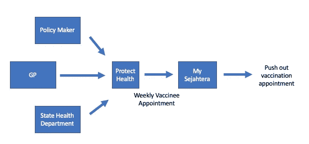
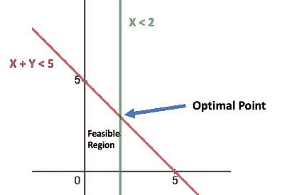

# 基于线性规划的新冠肺炎疫苗预约分配

> 原文：<https://towardsdatascience.com/covid-19-vaccine-appointment-allocation-using-linear-programming-a5e20119090?source=collection_archive---------33----------------------->

## 分享我在马来西亚国家新冠肺炎免疫计划(PICK)中的数据科学经验


照片由 [Pexels](https://www.pexels.com/photo/covid-19-vaccine-5863391/?utm_content=attributionCopyText&utm_medium=referral&utm_source=pexels) 的 Nataliya Vaitkevich 拍摄

**国家新冠肺炎免疫接种计划**，通常被称为 **PICK** ，是马来西亚政府目前正在实施的一项全国疫苗接种运动，旨在通过成功实现居住在马来西亚的公民和非公民的群体免疫，遏制新冠肺炎病毒的传播，并在马来西亚结束新冠肺炎疫情。[【1】](https://en.wikipedia.org/wiki/COVID-19_vaccination_in_Malaysia#cite_note-1)

作为马来西亚卫生部动员计划的一部分，我被分配到[protect Health Corporation Sdn Bhd](https://protecthealth.com.my/bm)(*protect Health*)协助过去 3 个月的 PICK 计划。ProtectHealth 是一个由卫生部指定的法人实体，旨在将私人医生转变为新冠肺炎疫苗接种计划中的疫苗接种员。

在 ProtectHealth 下，我加入了处理私人全科医生(GP)和私人医院的团队。我们的任务是促进他们与州卫生部和我的 Sejahtera 团队之间的疫苗接种计划。在本文中，我将以全科医生为例，因为仅私人全科医生就贡献了总疫苗接种量的 [5%](https://www.thestar.com.my/news/nation/2021/08/22/gps-involvement-in-vaccination-exercise-is-based-on-current-needs-says-citf) 。

每周，我们将与相关方沟通，根据 GP 预先商定的剂量模型分配*疫苗预约*。

> 疫苗接种者预约分配是指在未来某个日期给予 GP 的新**doe one**预约的数量，对于 GP，我们的目标是每周一次。MySejahtera 团队将根据分配情况推送已注册的受种者。

例如，GP A 同意每周 300 剂的模型(第一剂和第二剂)，我们将需要用下周的新号码填充空白的第一剂疫苗接种槽。请参考下图以获得更好的说明:



过程的图解。作者图片

# **产生疫苗预约的困难。**

当你只需要为一个全科医生或一个小区域分配预约时，这听起来很容易，但当你处理全国所有的全科医生时，事情就会变得混乱，每周大约有**1000-2000 人**，**，而时间是你唯一没有的东西。**

我们面临的情况如下:

*   推出辉瑞疫苗，该疫苗需要将特定州或地区的受种者四舍五入到最接近的 6 位。
*   由于各种原因，如 EMCO 或物流问题，在某个地区突然停止提供疫苗注射
*   新给药方案的分配
*   GPs 的各种运行时间/天数
*   以及更多需要临时决定的情况😢。


问题的说明——每周要安排多少次约会(第一剂)。作者图片

这些情况的后果，我们决定**我们需要一个健壮的系统，能够:**

*   一键重新生成疫苗接种预约，即快速
*   能够为州和地区添加新的排除或包含规则
*   能够添加新的剂量方案
*   根据现有的第二次剂量预约优化我们的分配，以优化全科医生的能力
*   能够四舍五入到最接近的六位，以防止疫苗接种者的浪费
*   不要过量给全科医生增加负担

# **线性规划来拯救**

线性规划或 LP，一种数学建模技术，其中线性函数在受到各种约束时被最大化或最小化。[【2】](https://www.britannica.com/science/linear-programming-mathematics)

在下面的例子中，我们有一个变量 X 和 Y，其中 X + Y 必须小于 5，只有 X 必须小于或等于 2。X 和 Y 可以是什么？线性规划将从可行域中找出最大(最优)点(2，3)。



最佳点的简单说明，作者提供的图像

**在接种者预约分配中应用 LP:**

使用上述概念，我们将总剂量方案的约束公式化为:

```
**Mon + Tue + Wed + Thurs + Fri + Sat + Sun < Total Dose**
```

如果我们想在一周的某一天停止，我们可以根据状态动态添加规则:

```
If state == "Johor", then let Fri == 0
```

如果我们想把总剂量减少到 6

```
If drug == "Pfizer" then round_down(Daily dose of M/Tu/W/Th/F/Sa/Su)
```

LP 模型为我们的疫苗预约生成提供了灵活性，因为我们能够使用该模型根据多个州和机构的请求添加多个条件。我们使用的 python 包是 PuLP，更多关于 PuLP 的信息，可以访问[这里](https://github.com/coin-or/pulp)。

## 应用 LP 的结果:

在我们的分配模型中应用 LP 之后，我们可以在每周不到 5 分钟的时间内重新生成我们的每周约会。任何特别的变化都可以立即在我们的主数据库中进行。这些变化将反映在重新生成的每周约会中，因为我们已经自动化了整个数据 ETL(提取、转换、加载)过程。

然而，值得一提的是， **LP 并没有解决我们所有的问题**，我们仍然需要手动添加一些特殊情况或非常非常特别的情况，但它解决了我们在生成每周疫苗预约分配中几乎 95%的问题。

# 最终想法:

将书中的内容应用到现实生活中的问题需要你调整参数并有一点点创造力，但是通过对基本概念的深刻理解，你可以将理论应用到实践中。有些人可能会说 LP 可能不是问题的最佳解决方案，但它确实解决了我们在疫情期间的痛苦。

最后，在我看来，LP 是数据科学从业者必须学习的重要技术，尤其是当您需要优化生产力和避免设施浪费时。

如果你对 LP 感兴趣，可以看下面另一篇文章:

[](https://medium.datadriveninvestor.com/an-introduction-to-modern-portfolio-theory-mpt-in-portfolio-optimization-d19cd8b16b34) [## 投资组合优化中的现代投资组合理论(MPT)导论

### 在每一个股票投资决策中，作为一个理性的投资者，关注的总是股票的回报

medium.datadriveninvestor.com](https://medium.datadriveninvestor.com/an-introduction-to-modern-portfolio-theory-mpt-in-portfolio-optimization-d19cd8b16b34) 

如果你想成为中等会员，可以考虑通过这个[链接](https://manfyegoh.medium.com/membership)支持我

# 致谢:

感谢博士的团队成员。和你们一起工作是我的荣幸。感谢你们在整个疫苗接种项目中几乎每天都在工作。

在我的硕士学习期间，我选修了一门叫做商业智能和决策分析的课程，老师是[的黄·李沛博士](https://scholar.google.com.my/citations?user=SpTykxIAAAAJ&hl=en)。我很感激他耐心地教我这个技巧。这是一种奇妙的技术！