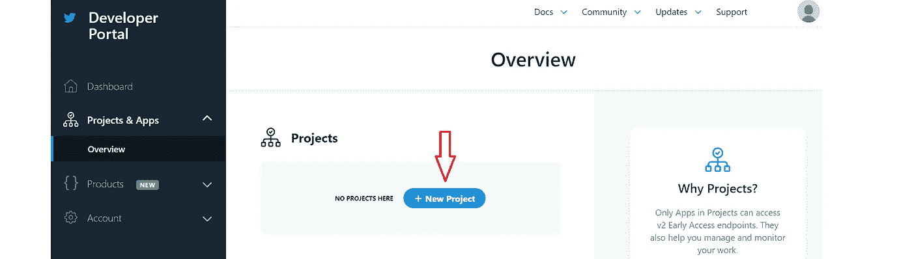
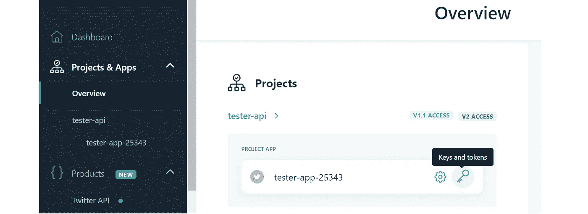
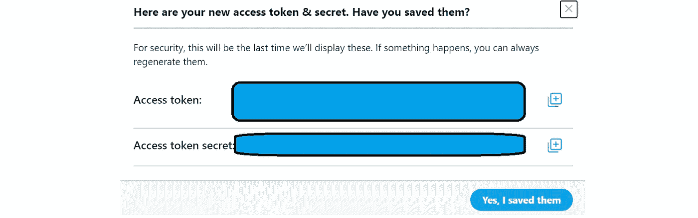
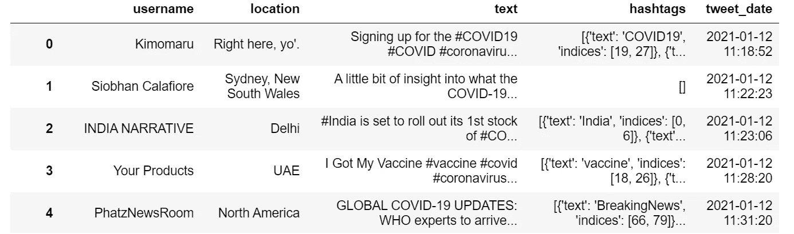
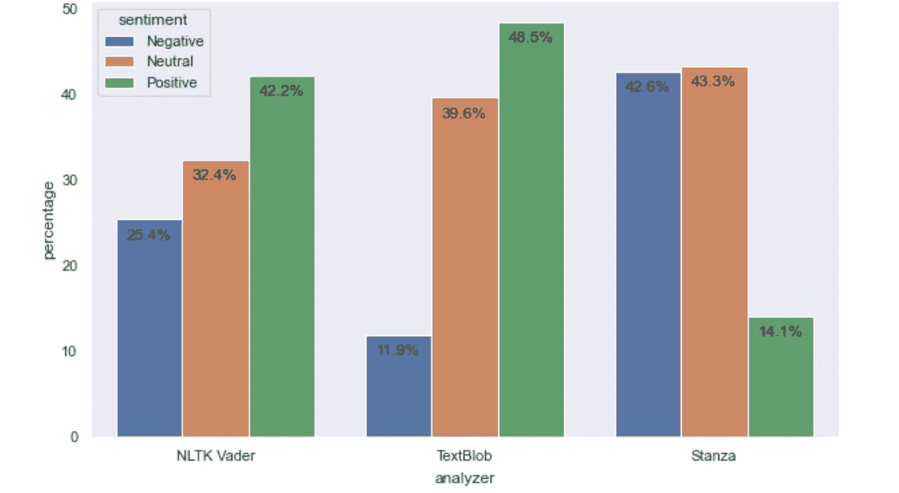
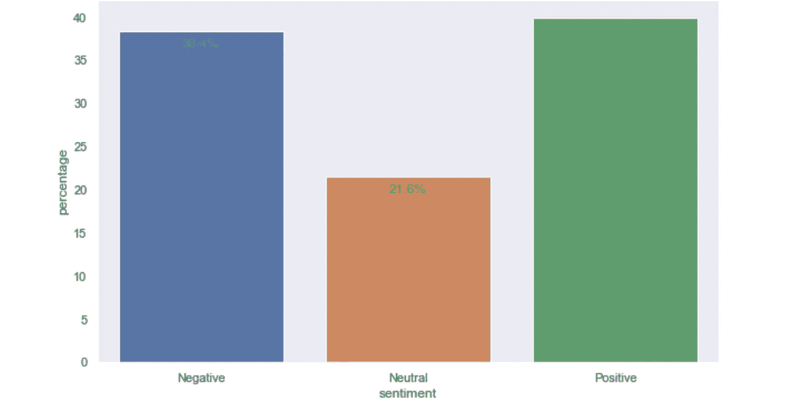

# 新冠肺炎疫苗——公众情绪如何？

> 原文：<https://towardsdatascience.com/covid-19-vaccine-whats-the-public-sentiment-7149c9b42b99?source=collection_archive---------36----------------------->

## 使用 NLP (Stanza、NLTK Vader 和 TextBlob)对新冠肺炎疫苗推文进行逐步情感分析

[疾控中心](https://unsplash.com/@cdc?utm_source=medium&utm_medium=referral)在 [Unsplash](https://unsplash.com?utm_source=medium&utm_medium=referral) 拍摄的照片

新冠肺炎疫情自称是最严重的全球威胁之一，并且仍然是一个持续的威胁。同样，我们正处于人类历史上最大的疫苗接种运动中。据[彭博](https://www.bloomberg.com/graphics/covid-vaccine-tracker-global-distribution/)报道，到目前为止(截至 2020 年 1 月 26 日)，已经在 56 个国家注射了令人震惊的 6810 万剂疫苗。

虽然疫苗为抗击新冠肺炎带来了新的希望，但它也引发了激进的反疫苗运动。因此，用最近推特数据上的[情绪分析](https://en.wikipedia.org/wiki/Sentiment_analysis)(Python 语言)来衡量公众对新冠肺炎疫苗的看法将会很有趣。

# 泰勒:博士

*   TextBlob 和 NLTK Vader 有相似的情绪比例趋势(*正面* **>** *中性* **>** *负面*)，而 Stanza 的情绪趋势与此相反(*负面* **>** *中性* **>** *正面*)
*   从集合方法的结果来看，**总体情绪是****混合，只是**稍微偏向**正面，**基于**正面** ( **40.0%** )和**负面** ( **38.4%** )情绪的比例****
*   **链接到 [GitHub repo](https://github.com/kennethleungty/COVID19-Vaccine-Sentiment-Analysis)**

# **内容**

> **[*1。Twitter API*](#a9a4)[*2 的设置。提取并预处理推文*](#a6b4)[*3 .感情分析用 NLTK 维德*](#2e72)[*4。用 text blob*](#29b2)[*5 进行情感分析。感情分析同节*](#4524)[*6。感悟来自感悟*](#e815)[*7。用集成方法合成情感*](#af17)**

# **1.Twitter API 的设置**

**要使用 Twitter API，我们首先需要一个 Twitter 开发人员帐户:**

*   ****步骤 1** :前往 [Twitter 开发者应用页面](https://developer.twitter.com/en/apply/user)创建一个开发者账户**
*   ****第二步**:申请被批准后(这可能需要一天时间，但我的申请马上就被批准了)，前往[开发者仪表板](https://developer.twitter.com/en/portal/dashboard)。点击侧边栏上的'*项目&应用* ' > ' *概述*，进入**概述**部分。点击“**新建项目**按钮创建一个新项目。**

****

**作者推特截图**

*   **第三步:返回**概述**并点击钥匙图标以访问新创建项目的**钥匙和令牌**。**

****

**作者推特截图**

*   **第四步:生成(或重新生成)这 4 个代码:(1) **API Key、**
    (2) **API Secret、** (3) **访问令牌、** (4) **访问令牌 Secret** 。记住保存这 4 个代码，因为我们以后会用到它们。**

****

**点击“生成”或“重新生成”时弹出显示访问代码的窗口**

# **2.提取和预处理推文**

## **Twitter API 认证**

**我们将使用[**tweepy**](https://www.tweepy.org/)**包来访问 Twitter API。您可以使用以下命令安装该软件包:`pip install tweepy`****

****使用之前保存的访问凭证(4 个代码)，我们可以设置 Twitter API 认证。****

## ****推文提取****

****以下是 tweet 提取代码的主要考虑事项:****

*   ****每 15 分钟有 900 个 API 调用的速率限制，所以我们需要在代码中加入一个`time.sleep(15 * 60)`步骤****
*   ****我提取了最近 7 天的每一天，因为 Twitter API 只允许提取 7 天前的推文****
*   ****为了获得与新冠肺炎疫苗相关的推文，使用的搜索词是**‘covid 19 covid 疫苗’******
*   ****排除被转发或非英语的推文****

****对于这个项目，检索了以下属性:*用户名、位置、推文文本、标签和推文日期*。使用我编写的提取代码，我能够在不到 2 小时的时间内提取大约 13，000 条推文。****

********

****摘录的推文示例****

## ******文本预处理******

****正如你所料，推文文本会变得非常混乱。幸运的是，我们可以使用[**tweet-preprocessor**](https://pypi.org/project/tweet-preprocessor/)**包来高效地执行预处理。可以安装`pip install tweet-preprocessor`******

******默认情况下， *tweet-preprocessor* 会删除 URL、标签、表情符号、保留字(如 RT)和提及等项目。如果你想定制推文的预处理方式，请查看他们的[文档](https://pypi.org/project/tweet-preprocessor/)。我使用了默认设置，代码如下所示:******

******其他预处理步骤包括:******

*   ******从原始 ***标签*** 栏的字典中提取单个标签******
*   ****只保留带有包含字符串' *vacc* '的文本或标签的推文****
*   ****删除带有重复 tweet 文本的行****

****我们的 Twitter 数据集现在已经准备好进行情感分析，我们将使用 3 个独立的包来进行分析。我们开始吧！****

********

****让我们看看我们能从新冠肺炎疫苗相关的推特数据中得到什么启示|图片由 [Joshua Hoehne](https://unsplash.com/@mrthetrain?utm_source=medium&utm_medium=referral) 在 [Unsplash](https://unsplash.com?utm_source=medium&utm_medium=referral) 上发布****

# ****3.用 NLTK Vader 进行情感分析****

## ****介绍****

****自然学习工具包( [**NLTK**](https://www.nltk.org/) )是一个 Python 包，提供了支持自然语言处理(NLP)的程序，并附带了预先训练好的模型。****

****特别是，我们将使用价感知词典和情感推理机([**【VADER】**](https://www.codeproject.com/Articles/5269445/Using-Pre-trained-VADER-Models-for-NLTK-Sentiment))模型，这是一个词典和基于规则的情感分析工具，旨在对社交媒体文本进行情感分析。它使用一个带有简单启发的[单词包方法](https://machinelearningmastery.com/gentle-introduction-bag-words-model/)(例如，在出现某些单词如“very”时增加情感强度)。****

## ****设置和分析****

****使用`pip install nltk`安装 NLTK 后，我们可以使用 Vader 模型运行情感分析:****

****Vader 返回[复合分数](https://predictivehacks.com/how-to-run-sentiment-analysis-in-python-using-vader/)，这是给定文本的单一一维情感测量。得分范围从-1(最负面)到+1(最正面)，中性情绪得分在 **-** 0.05 到 0.05 之间任意设定。****

# ****4.使用 TextBlob 进行情感分析****

## ****介绍****

****[TextBlob](https://textblob.readthedocs.io/en/dev/) 是一个流行的 Python 库，用于处理文本数据和执行一系列 NLP 任务，包括情感分析。与 NLTK Vader 类似，TextBlob 情感分类器是基于单词包方法的。事实上，TextBlob 是建立在 NLTK 和[模式](https://github.com/clips/pattern)库之上的。****

## ****设置和分析****

****这是安装 TextBlob 的命令:`pip install textblob`，下面是运行 TextBlob 情感分析的方法:****

****TextBlob 情感分析器返回两个分数，即[极性和主观性](https://textblob.readthedocs.io/en/dev/quickstart.html)。我们看极性得分，就像维达一样，是一个在-1 和 1 范围内的浮点数，其中-1 表示最负，+1 表示最正。同样，对于维达，中性情绪被任意定义为介于 **-** 0.05 和 0.05 之间的分数。****

# ****5.用 Stanza 进行情感分析****

## ****介绍****

****[Stanza](https://stanfordnlp.github.io/stanza/index.html) 是 [Stanford NLP 组](https://nlp.stanford.edu/)的官方 Python NLP 库，取代了基于 Java 的 [CoreNLP](https://stanfordnlp.github.io/CoreNLP/) 。这些模块建立在 PyTorch 的基础上，其预建的[情绪分析器](https://stanfordnlp.github.io/stanza/sentiment.html)基于 CNN 分类器，该分类器在数据集上进行训练，包括[斯坦福情绪树树](https://medium.com/r?url=https%3A%2F%2Fgithub.com%2Fstanfordnlp%2Fsentiment-treebank)和[航空公司推特情绪](https://www.kaggle.com/crowdflower/twitter-airline-sentiment/data)。****

## ****设置和分析****

****使用命令`pip install stanza`安装节库。然后，我们下载 Stanza 的英语包，并运行情感分析:****

****Stanza 返回一个从 0 到 2 的情感分数，映射: **0:** 阴性， **1:** 中性， **2:** 阳性。由于每条推文可能包含许多句子，我们对每条推文的句子取平均分。****

# ****6.来自情感分析的见解****

****在使用三种不同的分析器生成情感之后，是时候使用`seaborn`库来可视化和解释结果了。****

********

****NLTK Vader 和 TextBlob 的情绪比例相对相似，正面情绪最高，负面情绪最低。 **TextBlob** 是迄今为止最积极的**，对积极情绪的回复为 **48.5%** 。另一方面，第**节**产生的情绪是最负面的，负面情绪的比例最高( **42.6%** )。******

****总体而言，TextBlob 和 NLTK Vader 情感评分比 Stanza 的**高** ( **即更积极**)。这一发现证实了另一项[分析](http://monkeythinkmonkeycode.com/nlp-in-python-a-quick-library-comparison-for-sentiment-analysis/)对 TextBlob 和 Stanza 情感分析的比较。****

****虽然 TextBlob 是最受欢迎的 Twitter 数据情感分析器，但 Stanza 当然值得探索，因为它部分是在 Twitter 数据集上训练的。这里的结果是一个很好的例子，说明了**在不同数据集和方法上训练的不同分析器如何导致不同的结果**。****

****在手动查看了 **100 条**推文的样本后，我发现最具代表性的观点位于 TextBlob(有点过于积极)和 Stanza(有点过于消极)之间。让我们试着得到介于两者之间的情感结果。****

# ****7.用集成方法合成情感****

****我运用了一些创造性的方法，从三个情感分数的平均值中创建了一个综合分数。所有 3 个分数都已经在[-1，1]的范围内，并且在计算平均值时给予相同的权重。****

****与前面的步骤一样，分数 **≥** 0.05 被定义为*正*，分数 **≤-** 0.05 被定义为*负*，两者之间的任何值被设置为*中性*。通过综合评分和分类系统，我们得到了以下结果:****

********

******积极**情绪( **40.0%** )的比例**略大于**消极**情绪( **38.4%** )的比例**，但这两个比例被认为**相似**。这表明，在分析点上，对新冠肺炎疫苗的总体情绪往往是混合的，只是稍微倾向于正面的情绪。****

# **结论**

**在这篇文章中，我写了通过 Twitter API 提取与新冠肺炎疫苗相关的推文，并实现了 3 个不同的情感分析器(NLTK Vader、TextBlob、Stanza)来评估这些推文。**

**展望未来，仍有很大的探索空间。**

*   **基于推文日期的观点趋势**
*   **评估不同地区(如国家)的观点**
*   **为中性情绪尝试不同的分数阈值**
*   **评估 TextBlob 返回的主观性组件**

**期待您加入我的数据科学学习之旅！请随时关注此[媒体页面](https://kennethleungty.medium.com/)以了解更多数据科学内容，或者在 [LinkedIn](https://www.linkedin.com/in/kennethleungty/) 上联系我。**