# CovidSimNet:介绍一种确定“相似”COVID 状态的方法

> 原文：<https://towardsdatascience.com/covidsimnet-introducing-a-method-to-determine-similar-covid-cities-6d6701aad03b?source=collection_archive---------37----------------------->

## 使用数据来确定 COVID 状态相似性矩阵，以估计政策对相似状态和“高风险”状态的影响

在分析和证明假设的过程中，数据一直扮演着不可或缺的角色。随着高度优化且易于使用的框架的出现，几乎每秒钟都在收集数据。世界上最有价值的资源不再是石油，而是数据([《经济学家》](https://www.economist.com/leaders/2017/05/06/the-worlds-most-valuable-resource-is-no-longer-oil-but-data))。据估计，到 2025 年，每天将产生约 463 艾字节(1 艾字节可存储 5 万年的 DVD 质量视频)的数据。

[约翰·斯诺](https://www.rcseng.ac.uk/library-and-publications/library/blog/mapping-disease-john-snow-and-cholera/)，英国医生，现代流行病学的创始人之一，在 19 世纪发现霍乱的源头是被污染的公共水泵。他通过在地图上绘制霍乱病例发现了这一点，并调查了大多数病例都是靠近水泵的人。


照片由[米卡·鲍梅斯特](https://unsplash.com/@mbaumi?utm_source=medium&utm_medium=referral)在 [Unsplash](https://unsplash.com?utm_source=medium&utm_medium=referral) 上拍摄

# 介绍

在本文的中，我们提出了一种看似合理的方法，通过创建一个逐状态相似性矩阵，该方法可用于识别相似的 COVID-hit 状态。该矩阵可进一步用于同时估计许多州的政策效果，也可用于确定高风险州。

# 数据

我们将使用美国每个州的 COVID 数据，包括每个州的确诊病例、死亡人数和人口。我们从约翰霍普金斯大学 **系统科学与工程中心(CSSE)的 [**新冠肺炎数据仓库中检索数据集。**](https://github.com/CSSEGISandData/COVID-19)**

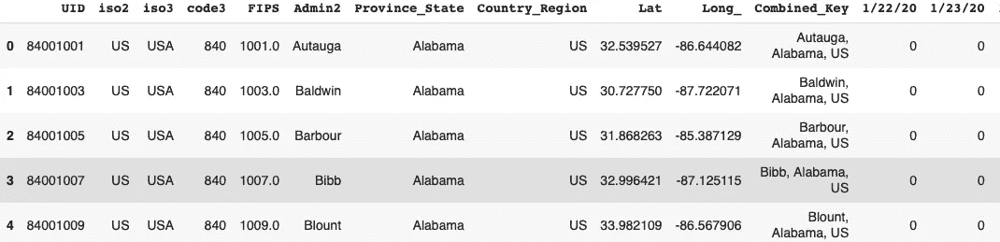

对于每个州和日期，我们都有确诊病例(死亡病例也是如此)(图片由作者提供)

为了从这些熊猫数据框架中提取相关信息，我们首先汇总每个日期的确认数量和死亡数量，然后将其与每个州的人口数合并。在执行所有预处理和聚合后，我们检索最终的数据帧。

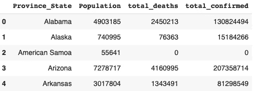

我们最终的数据框架(图片由作者提供)

N 现在，我们通过在 0 和 1 之间缩放值来导出给定列的标准化数量。我们使用下面的公式和附带的代码来计算所需的值

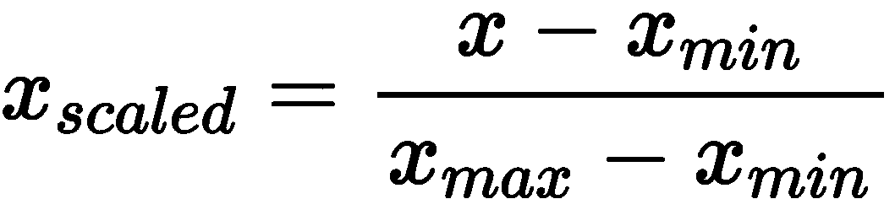

作者图片

```
final[‘death_normalized’] = (final[‘total_deaths’] — final[‘total_deaths’].min()) / (final[‘total_deaths’].max() — final[‘total_deaths’].min())final[‘confirmed_normalized’] = (final[‘total_confirmed’] — final[‘total_confirmed’].min()) / (final[‘total_confirmed’].max() — final[‘total_confirmed’].min())final[‘population_normalized’] = (final[‘Population’] — final[‘Population’].min()) / (final[‘Population’].max() — final[‘Population’].min())
```

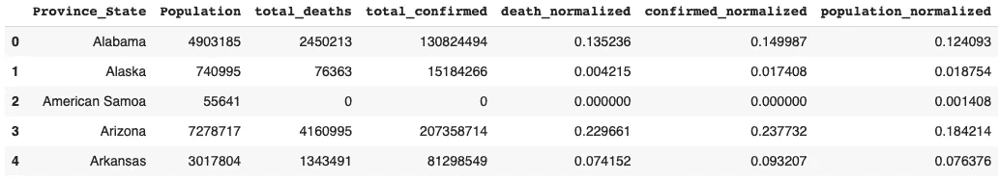

标准化的数据框架(图片由作者提供)

> **注**:为了使用死亡项和确认项，我们将两个量相加，从而得到一个对两列的信息进行量化的项。这是一个主观决定，可以根据目标的设定来决定。

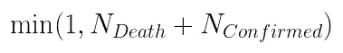

我们进一步得到 1 和总数之间的最小值，将最大值限制为 1(图片由作者提供)

```
def get_min(row): return min(1, row['total'])
```

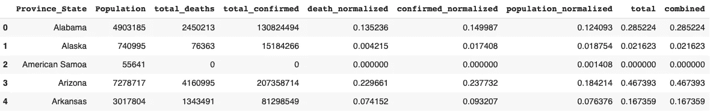

计算数据框架(图片由作者提供)

# 度量标准的制定

我们将该指标定义为 1 和每个总体的标准化列之和之间的最小值。对于每个州，我们将标准化列的相加除以总体。对于一个州来说，“风险因素”表示该州的“风险”有多大。我们使用下面的代码和公式来计算指标。

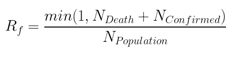

风险系数公式(图片由作者提供)

```
final[‘risk_factor’]=final[‘combined’]/final[‘population_normalized]
final = final.replace(np.inf, 0)
final[‘risk_factor_softmax’] = softmax(final[‘risk_factor’])
```

> **注意**:这是一个主观指标，可以根据目标进行调整。替代方法包括获得总人口或使用最大人口。

## Softmax 简介

在计算“风险系数”时，我们可以看到这些值不是在 0 或 1 之间。我们希望这是概率，这样我们可以为每个状态建立一个表示相似性的共现矩阵。

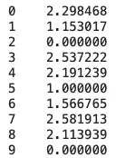

风险因子值不在 0 和 1 之间(图片由作者提供)

[soft max 函数](https://en.wikipedia.org/wiki/Softmax_function)将给定向量归一化为概率分布，使得每个分量在 0 和 1 之间，并且这些分量相加为 1，因此它们可以被解释为概率，较大的输入分量对应于较大的概率。

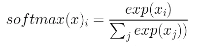

Softmax 函数(图片由作者提供)

N 为了将我们的值转换为概率并最终创建状态的共生矩阵，我们将 softmax 应用于向量。

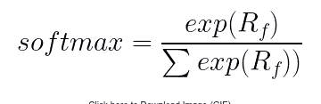

已应用 Softmax(图片由作者提供)

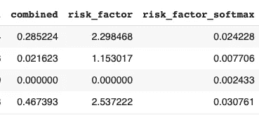

最终数据帧(图片由作者提供)

# 定义“高风险区域”

高风险区域被定义为超过容许系数的状态。如果一个状态等于或大于“耐受因子”，我们将该状态归类为“高风险区域”。对于我们当前的任务，我们将“容差系数”设置为 **0.02，但这个值可以变化。**

> 注意:容差是基于值的，可能会因不同的数据而变化(例如，如果我们分析的是印度的 COVID 数据，而不是美国的数据)。

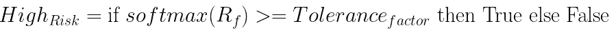

确定高风险区域的详细算法表达式(图片由作者提供)

```
tolerance_factor = 0.02def is_risk_area(row): if row['risk_factor_softmax'] >= tolerance_factor: return True else: return Falsefinal['is_risk'] = final.apply(is_risk_area, axis=1)
```

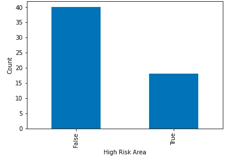

代表“高风险”区域计数的图(图片由作者提供)

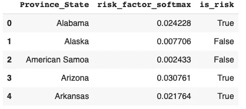

由转换后的列组成的数据帧(图片由作者提供)

# 构建共现矩阵，也称为相似矩阵

为了计算两个状态在“风险因子”方面有多相似，我们定义了一个术语，称为“差异因子”。差异因子表示被认为相似的状态所需的最小差异。对于我们当前的任务，差异因子被设置为 0.01。

> 注意:差异系数是基于值的，可能会因不同的数据而变化(例如，如果我们分析的是印度的 COVID 数据，而不是美国的数据)。定义的指标是主观的，可以根据不同的偏好进行调整。

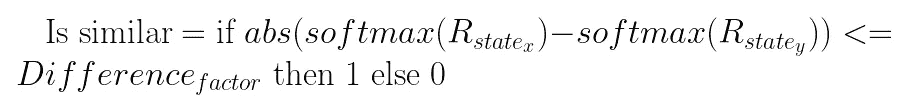

确定相似性的详细算法表达式(图片由作者提供)

> **提示**:为了提取一个更彻底的相似性分数，我们可以返回概率的补数，这样我们就有介于 0 和 1 之间的值来表示两个状态之间的强度。我们也可以包括其他因素。

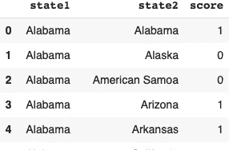

计算数据框架(图片由作者提供)

## 推导共生矩阵

为了从上述数据帧中导出共生矩阵，我们使用 scipy.sparse 模块创建了一个 coo_matrix。这个函数将创建一个维数(状态数，状态数)的矩阵，在我们的例子中就是(58，58)。对于每一个州，我们都有对应于另一个州的分数。

```
from scipy import sparse
user_items = sparse.coo_matrix((cmat.score.astype(float),(cmat.state1.astype('category').cat.codes,
cmat.state2.astype('category').cat.codes)))
```

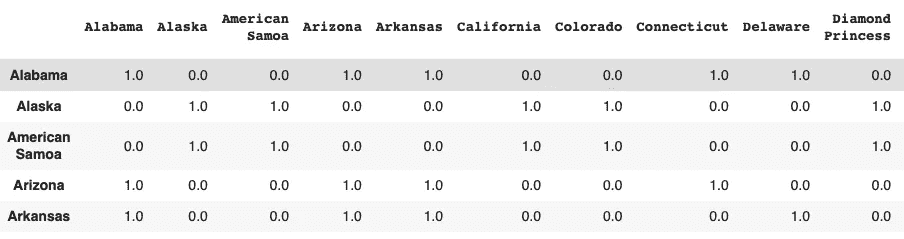

最终数据帧的样本(图片由作者提供)

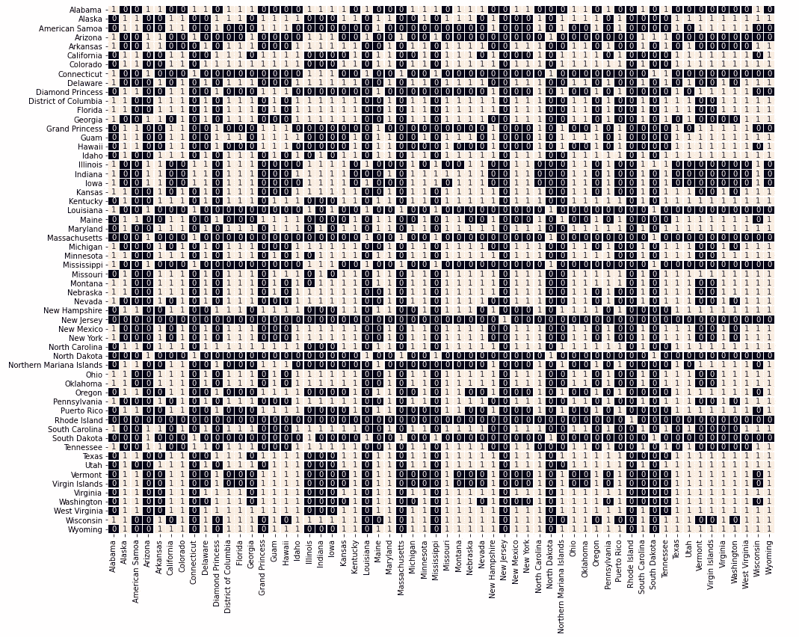

根据确诊人数和死亡人数显示每个州与另一个州相似程度的热图(图片由作者提供)

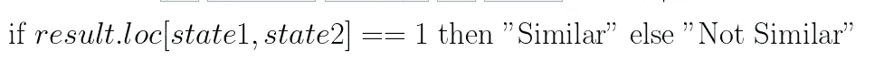

我们如何判断两个状态是否相似的例子(图片由作者提供)

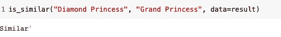

两个相似状态的演示输出(基于风险因素)(图片由作者提供)

# 结论和进一步的应用

我们展示了一种合理的方法来确定“高风险”州，并建立一个类似州的地图。定义的指标是主观的，可以根据客观情况进行调整。该方法的应用是无限的，因为它可以应用于:

*   ***估计政策对各州的影响。(例如，确定周末关闭餐馆对一个州的影响，并使用同现相似性矩阵近似计算对另一个州的影响)***
*   ***检测高风险州或城市***

*还有很多……*