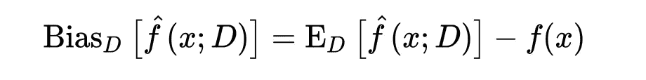
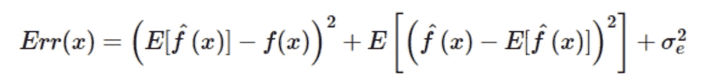
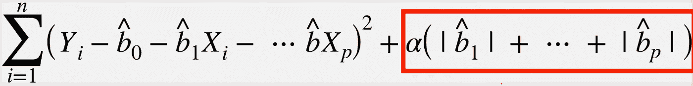
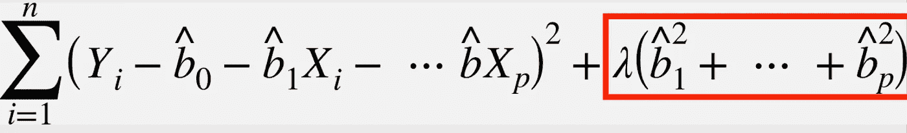
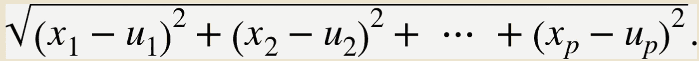

# 破解数据科学访谈:基本的机器学习概念

> 原文：<https://towardsdatascience.com/crack-data-science-interviews-essential-machine-learning-concepts-afd6a0a6d1aa?source=collection_archive---------21----------------------->

## 破解数据科学面试

## 赢在 2021 年:数据科学家/工程师的必读之作，第 1 部分

美国宇航局在 [Unsplash](https://unsplash.com/s/photos/data-science?utm_source=unsplash&utm_medium=referral&utm_content=creditCopyText) 拍摄的照片

# 介绍

数据科学面试涵盖了广泛的主题:测试候选人总体统计流畅性的统计部分，关于候选人各种 ML 算法和权衡的机器学习部分，以及锻炼我们现场编码技能的编程部分。

更不用说每个面试官最喜欢的“向我介绍你的解决方案”和几十次后续互动了。更重要的是，在 DS 社区中有一个新发现的趋势，即转向像数据结构和算法这样的计算机科学基础(查看[的精彩文章](/the-ultimate-guide-to-acing-coding-interviews-for-data-scientists-d45c99d6bddc) [Emma Ding](https://medium.com/u/1b25d5393c4f?source=post_page-----afd6a0a6d1aa--------------------------------) @Airbnb)。

综合来看，它们似乎太令人生畏而难以处理。

如果我们把大块分成小块，每一块都变得更“可咀嚼”和易于管理。

就像算法“各个击破”

一语双关！

这是关于基本概念的两篇文章的第一章。在第一章中，我将重点放在机器学习部分，并解释 DS 面试中的这些常见问题。在第二章中，我转换话题，详细阐述统计方面的内容。这是:

 [## 破解数据科学访谈:基本统计概念

### 赢在 2021 年:数据科学家/工程师的必读之作，第 2 部分

towardsdatascience.com](/crack-data-science-interviews-essential-statistics-concepts-d4491d85219e) 

# 概念 1:偏差和方差

> **1.1 什么是偏见？**

偏差是对估计值与其真实值之间的差异的估计。用简单的语言来说，它衡量我们的模型与实际数据点有多“接近”。

其数学公式表示如下:

[维基百科](https://en.wikipedia.org/wiki/Bias%E2%80%93variance_tradeoff)

偏差与特征选择和模型复杂性直接相关，过于简化的模型往往具有较高的偏差。

> **1.2 什么是方差？**

方差是指由于模型过于复杂和训练数据的选取而导致的建模误差。它衡量的是模型对噪声的拟合程度，而不是数据中的模式。使用不同训练集训练的模型具有不同的方差。与数据的选择直接相关。具有高方差的模型在训练数据中表现良好，但在新数据集中表现不佳。

其数学形式表示如下:

[维基百科](https://en.wikipedia.org/wiki/Bias%E2%80%93variance_tradeoff)

总的来说，灵活的(复杂的)模型倾向于具有低偏差但高方差，aka。过度适应训练集中的噪声，并且刚性(简单)模型具有高偏差但低方差，aka。欠拟合真实数据模式。

顺便提一下，任何机器学习算法都有三种误差来源:偏差、方差和不可约误差，如下所示。

**总误差=偏倚+方差+不可约误差**

照片由[奥斯丁·迪斯特尔](https://unsplash.com/@austindistel?utm_source=unsplash&utm_medium=referral&utm_content=creditCopyText)在 [Unsplash](https://unsplash.com/s/photos/interview?utm_source=unsplash&utm_medium=referral&utm_content=creditCopyText) 上拍摄

# 概念 2: L1 和 L2 正规化

> **2.1。什么是正规化？**

正则化是一种回归形式，它通过将系数估计值约束或缩小到零来产生简约的模型。它通过向成本函数添加惩罚来实现这个目标。在机器学习算法中，如果我们包括太多可能的特征，我们会使模型过度适应训练数据中的噪声。过度拟合会降低未来数据(测试集)的模型精度。正规化解决了这个问题。

> **2.2 什么是拉索回归(L1 正则化)？L1 是如何导致稀疏的？**

**什么**

LASSO 回归(L1 正则化)包括一个超参数α乘以系数绝对值之和，作为其成本函数中的惩罚项，如下所示(用红色标记):

截图 1:来自数据科学家实用统计

一方面，如果我们不应用任何惩罚(设置α =0)，上述公式变成常规的 OLS 回归，这可能会过度拟合。

另一方面，如果我们应用一个非常大的惩罚(或者，一个大的α值)，模型可能会欠拟合，因为我们错误地惩罚了所有的系数(包括最重要的系数)。

**如何**

L1 被称为稀疏正则化。如果我们运行梯度下降来计算权重，L1 正则化迫使任何权重更接近于 0，而不管其大小。在每次迭代中，L1 从权重中减去一个小值，一些系数最终收敛到 0。因此，L1 通过将不太重要的特征的系数缩小到 0 来导致模型稀疏。

(关于 L1 如何导致稀疏的原因，特别归功于[索纳·耶尔德勒姆](https://medium.com/u/2cf6b549448?source=post_page-----afd6a0a6d1aa--------------------------------)的[邮报](/l1-and-l2-regularization-explained-874c3b03f668)。

> **2.3。什么是山脊(L2)？L2 是如何工作的？**

岭回归采用系数乘以λ的“平方值”作为罚项，如下所示。

截图 2:来自数据科学家实用统计

如果 lambda λ为 0，则公式变为常规 OLS 回归。成本函数的惩罚项(用红色标出)增加了模型的偏差，并使对训练数据的拟合更差。

为了简单起见，L2 被称为正则化。随着速率趋向于 0，L2 正则化速度减慢，而不是收缩到 0。在每次迭代中，L2 移除一小部分权重，因此永远不会收敛到 0。

> **2.4。L1 和 L2 的异同**

**相似之处**

这两种方法都用于避免过度拟合。L1 正则化处理特征的数量，L2 正则化处理特征的权重。

**差异**

L1 正则化最小化残差平方的和(回归部分:屏幕截图 1 的左边部分)和超参数乘以斜率的绝对值。

L2 正则化最小化残差平方和(回归部分:屏幕截图 2 的左边部分)和λ乘以斜率平方(在红框中标出)。

L1 更稳健，有多种解决方案，而 L2 不那么稳健，只有一种解决方案。

> **2.5。如何选择 L1 和 L2？**

套索回归(L1)可以处理变量选择和参数收缩。**因此，当很少有变量具有相当大的实质性影响时，我们更喜欢套索回归。**

岭回归(L2)很好地处理了参数收缩，但保留了模型中的所有系数。**当存在许多具有小/中等实质性影响的变量时，这是优选的(**[**【ISLR】**](https://www.amazon.com/Introduction-Statistical-Learning-Applications-Statistics/dp/1461471370/ref=sr_1_1?dchild=1&keywords=An+Introduction+to+Statistical+Learning%3A+With+Applications+in+R&qid=1610145477&sr=8-1)**)作者:Hastie & Tibshirani，2013)。**

此外，当存在共线要素时，L2 是首选。一个简单的例子是女性和怀孕。由于这两个特征共线，系数方差往往很大，这进一步损害了估计的稳定性(Terence Parr 教授的[帖子](https://explained.ai/regularization/L1vsL2.html))。

[Adomas Aleno](https://unsplash.com/@aleno?utm_source=unsplash&utm_medium=referral&utm_content=creditCopyText) 在 [Unsplash](https://unsplash.com/s/photos/business?utm_source=unsplash&utm_medium=referral&utm_content=creditCopyText) 上拍摄的照片

# 概念 3:机器学习算法和距离度量

> **3.1 什么是欧氏距离？你为什么选择它去 KNN？**

定义:为了让 KNN 工作，我们需要根据一些度量来确定两个记录之间的相似性。欧几里德距离是距离度量之一。为了计算欧几里得距离，我们取两个向量之差的平方根，如下所示:

截图 3:来自数据科学家实用统计

我们选择欧氏距离有两个原因。

1.  欧几里德距离在计算上是高效的。KNN 涉及 K*n 两两比较(K:特征的数量；n:行数)。对于大型数据集，计算量可能相当大。
2.  输入变量在类型和规模上是相似的(例如，宽度、高度)。换句话说，我们假设一个向量中一个单位的增加(减少)与另一个向量中一个单位的增加(减少)相同。**(这个超级重要。我被一个 FAANG 问过这个问题)。**

> **3.2 维度的诅咒**

维数灾难是指当输入变量/特征过多时，很难找到最优解。

每个特征提供了一个维度来聚类数据点，并且当有太多维度(例如，特征、输入变量)时，使得每个观察彼此等距变得困难。

> **3.3 决策树和随机森林有哪些权衡？**

决策树是一种基于树的模型，它根据不同的特征做出预测决策。它易于应用，快速，可解释，但往往适得其反。

随机森林是一种集成学习算法，它通过自举样本在每个节点组合多个决策树。RF 有一个集体决策过程，并采用每个 DT 做出的所有预测的大多数类别。

因此，RF 具有更高的精度。但是相对于 DT 来说计算量很大，我们也不知道它是如何工作的(像黑盒一样)。

> **3.4 什么是决策树的基尼杂质？**

基尼系数是衡量每一部分数据的同质性或杂质的一种方法。测量杂质以分割每个分区中的数据，并最终计算加权平均值:选择导致最低加权平均值的分区。

> **3.5 I 型和 II 型误差、阿尔法和贝塔水平**

第一类错误是指当零假设(H0)为真时，我们错误地拒绝了它。这是一个假阳性。例如，电子邮件过滤算法错误地声称一封电子邮件是垃圾邮件，但实际上它不是。我们使用α水平来表示当 H0 为真时错误拒绝它的概率，也就是 I 型错误。

第二类错误是指当替代假设(Ha)正确时，我们未能拒绝零假设的情况。这是一个假阴性。例如，电子邮件过滤算法无法检测垃圾邮件。我们使用β水平来表示类型 II 错误，即当它为真时拒绝 Ha。

# 外卖食品

有人要求我解释一些概念，但我无法对所有的概念给出满意的答案。像任何其他数据科学实践者一样，我过于关注 ML 算法的应用/生产方面，而忘记了最基本的概念，这对于面试来说并不理想。

唯一的出路就是分解算法，理解每一块是如何工作的，就像为什么选择欧几里德距离而不是其他度量一样。

*Medium 最近进化出了自己的* [*作家伙伴计划*](https://blog.medium.com/evolving-the-partner-program-2613708f9f3c) *，支持像我这样的普通作家。如果你还不是订户，通过下面的链接注册，我会收到一部分会员费。*

 [## 阅读叶雷华博士研究员(以及其他成千上万的媒体作家)的每一个故事

### 作为一个媒体会员，你的会员费的一部分会给你阅读的作家，你可以完全接触到每一个故事…

leihua-ye.medium.com](https://leihua-ye.medium.com/membership) 

# 我的数据科学面试顺序:

 [## 2021 年数据科学家面临的 4 个棘手的 SQL 问题

### 可能会让你犯错的简单查询

towardsdatascience.com](/4-tricky-sql-questions-for-data-scientists-in-2021-88ff6e456c77)  [## Python 中的 Bootstrap 和统计推断

### 数据科学面试中常见的引导问题

towardsdatascience.com](/bootstrap-and-statistical-inference-in-python-a06d098a8bfd)  [## Python 中的 4 种统计模拟，第 2 部分

### 任何数据科学面试最重要的部分！

towardsdatascience.com](/statistical-simulation-in-python-part-2-91f71f474f77) 

# 喜欢读这本书吗？

> 请在 [LinkedIn](https://www.linkedin.com/in/leihuaye/) 和 [Youtube](https://www.youtube.com/channel/UCBBu2nqs6iZPyNSgMjXUGPg) 上找到我。
> 
> 还有，看看我其他关于人工智能和机器学习的帖子。