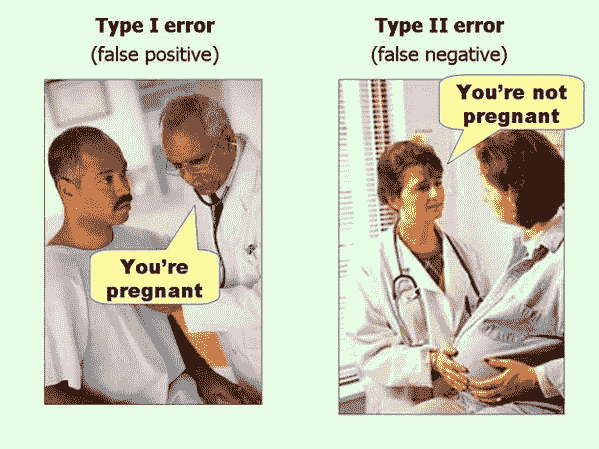

# 破解数据科学访谈:基本统计概念

> 原文：<https://towardsdatascience.com/crack-data-science-interviews-essential-statistics-concepts-d4491d85219e?source=collection_archive---------9----------------------->

## 破解数据科学面试

## 赢在 2021 年:数据科学家/工程师的必读之作，第 2 部分

照片由 [Adomas Aleno](https://unsplash.com/@aleno?utm_source=unsplash&utm_medium=referral&utm_content=creditCopyText) 在 [Unsplash](https://unsplash.com/s/photos/business?utm_source=unsplash&utm_medium=referral&utm_content=creditCopyText) 上拍摄

# 介绍

数据科学面试涵盖广泛的主题，面试官经常要求我们解释最基本的概念。它更可能会问这样的问题，比如你为什么选择 L1 而不是 L2，而不是从头开始建立一个机器学习算法。

我的数据科学专业网络反复告诉我，他们不期望求职者知道每一种算法。相反，他们期望对基本面有很高的熟悉度。完全说得通。在打下坚实的基础后，你可以很快学会一种新的算法。

统计学和机器学习是密不可分的双胞胎，在这两个领域中有许多概念可以互换使用。在另一章中，我阐述了机器学习中最基本的概念。如果你还没有机会，这里是:

</crack-data-science-interviews-essential-machine-learning-concepts-afd6a0a6d1aa>  

在今天的帖子中，让我们转向统计学，解决数据科学访谈中最常见的 10 个概念。

# 概念 1:缺失数据

关于缺失数据的面试问题看起来很容易，但很有挑战性。你必须根据数据类型和上下文来定制你的答案。我们中的许多人，包括我在内，未能认识到缺失数据的本质，并相应地调整他们的回应。

我对这个话题做了深入的研究，想出了应对策略。

> **面试问题**:缺失数据有多少种？每种类型的解决方案如何？

总的来说，有三种类型的缺失数据，我们应该针对每种情况分别处理。

**第一种:完全随机缺失(MCAR)。**

*   缺失数据和其他变量之间没有关系。换句话说，一些数据丢失是没有原因的。它的发生完全是由于随机性。
*   **解决方案**:我们可以删除缺失值，只关注完整的观察值。然而，MCAR 假设在现实生活中很少是正确的，删除缺失值可能会给参数估计带来偏差。

**类型 2:随机缺失(MAR)**

*   缺失值不是随机的。它取决于其他变量，但不取决于丢失的数据本身。听起来很困惑？别担心，我需要一段时间来理解要点。
*   这里有一个有用的例子。有两个变量:学生的 GPA 和学生的专业(STEM 和非 STEM)。STEM 学生的绩点有缺失，但非 STEM 学生没有。这里，缺失值(GPA)与另一个变量(major)有关，但与自身无关。
*   MAR 是唯一的，不同于第三种类型的缺失值(稍后讨论)。
*   **解决方案**:由于其他变量会导致缺失值，我们可以使用高级插补方法(如 KNN、线性回归、平均值、众数、中位数)来插补缺失值。然而，代价是我们可以减少数据差异。

**第三类:非随机缺失(MNAR)**

*   由于变量本身的原因，数据丢失。
*   上例中有两个变量:学生的 GPA 和专业(STEM 和非 STEM)。在这个时间里，绩点高的同学不存在价值观缺失，绩点低的其他同学存在价值观缺失，无论专业如何。
*   变量本身不可观察的特性导致了值的丢失！换句话说，有有效输入和没有有效输入的人是根本不同的。
*   **解** : MNAR 引入了一个非常微妙的情况。简单的插补不起作用，因为其他变量不会导致缺失值。完全删除会导致模型偏差。我们应该分析数据丢失的原因，并尽可能收集更多的数据。

缺失数据是一个宽泛的问题，答案可能很长，也可能因上下文而异。请解释丢失的数据有不同的类型，并且您希望在提出解决方案之前了解更多有关业务问题的信息，并从那里着手。

## 参考

<https://www.displayr.com/different-types-of-missing-data/>  <https://github.com/zhiqiangzhongddu/Data-Science-Interview-Questions-and-Answers-General->  

# 概念 2:装袋和增压

## 制袋材料

> **面试问题**:什么是**装袋**？它是如何工作的？赞成？缺点？

Bagging， *Bootstrap Aggregating* ，是一种**集成学习算法**，通过替换随机生成新的训练数据，适合多个模型。由于 bootstrap 过程，每个模型都是相互独立的。

对于回归问题，bagging 采用所有模型的平均值。对于分类问题，它采用模型的大多数类。

**优点**

*   Bagging 结合了几个弱学习器，提高了模型性能。
*   它减少了方差并避免了过度拟合。
*   装袋可以并行进行。

**缺点**

*   Bagging 将高偏差引入到具有高偏差的数据集的聚合中。
*   它是不可解释的，并且计算量很大。

## 助推

> **面试问题**:什么是**助推**？它是如何工作的？赞成？缺点？

Boosting 是一种**集成学习算法**，它使用原始数据的子集来生成弱模型。然后，boosting 将它们依次组合成一个更强的模型**。为了创建子集数据，boosting 会评估以前模型的性能，并为以前模型中的错误分类事例增加更多权重。**

## **赞成的意见**

*   **当数据有偏差时，提升效果很好。**
*   **它照顾到了以前模型的重量。**

## **骗局**

*   **如果数据具有很高的方差，它的性能会很差。**
*   **计算开销很大。**

## **参考**

**</20-machine-learning-related-questions-to-prepare-for-interviews-93bcba72f911>  <https://en.wikipedia.org/wiki/Bootstrap_aggregating>  <https://stats.stackexchange.com/questions/18891/bagging-boosting-and-stacking-in-machine-learning>    

# 概念三:什么是 Bootstrap？

Bootstrap 是一种从原始数据集中重复抽取随机样本的重采样方法。Bootstrap 允许我们甚至用一个样本来对总体参数进行统计推断。在机器学习中，bootstrap 广泛用于集成学习算法，如随机森林。

## **参考**

</a-practical-guide-to-bootstrap-with-r-examples-bd975ec6dcea>  </bootstrap-and-statistical-inference-in-python-a06d098a8bfd>  </statistical-simulation-in-python-part-2-91f71f474f77>  

# **概念 4:多重共线性**

> **面试问题**:什么是多重共线性？怎么检测出来的？解决方案？

当回归模型中的独立变量相互关联时，就会发生多重共线性。它会产生有偏见的估计。

检测多重共线性有两种方法。首先，我们可以画一个相关矩阵，检查两个或两个以上的变量是否高度相关。

第二，我们可以使用方差膨胀因子。VIF 测量回归模型中多重共线性的数量。数学上是模型总方差和只包含单个自变量的方差之比。高 VIF 表示高度共线性。

## **解决方案**

1.  丢弃相关变量，保留最重要的变量。
2.  转换数据以避免变量相关性。
3.  利用主成分分析进行降维。

**参考**

<https://www.investopedia.com/terms/v/variance-inflation-factor.asp>  </multi-collinearity-in-regression-fe7a2c1467ea>  

# 概念 5:维度的诅咒

每个变量都为聚类数据提供了一个维度。太多的变量提供了太多的维度，使得数据稀疏地分布在这些维度上。稀疏分布使数据点距离相等，并使依赖于距离度量的机器学习算法无效，例如，[欧几里德距离](/crack-data-science-interviews-essential-machine-learning-concepts-afd6a0a6d1aa?source=post_stats_page-------------------------------------) ( [统计学习介绍](https://www.amazon.com/Introduction-Statistical-Learning-Applications-Statistics/dp/1461471370))。

例如，K 最近邻算法采用欧几里德距离作为度量，并且在高维空间中表现不佳，因为它不能找到局部邻居。

## 参考

<https://www.amazon.com/Introduction-Statistical-Learning-Applications-Statistics/dp/1461471370>  </the-curse-of-dimensionality-50dc6e49aa1e>  

# **概念 6:第一类和第二类错误**

第一类错误，也称为假阳性，是当零假设(H0)为真时拒绝它。简单地说，第一类错误是指声称某事已经发生，但实际上它并没有发生。

第二类错误，又称假阴性，是指当替代假设(Ha)为真时，拒绝零假设的失败。简而言之，第二类错误是指声称什么都没发生，但实际上却是这样。

以下示例最能说明这两种类型的错误:

[*效果大小常见问题*](http://effectsizefaq.com/2010/05/31/i-always-get-confused-about-type-i-and-ii-errors-can-you-show-me-something-to-help-me-remember-the-difference/) *作者保罗·埃利斯*

毫无疑问，这是我见过的最生动的例子。

# 概念 7:统计能力

它是当替代假设为真时，检验拒绝零假设的概率。用通俗的语言来说，如果真实的效果存在，我们就不会错过一个效果。

(*统计功效是实验研究的一个关键概念，我将结合统计模拟和统计功效再写一篇帖子。敬请期待！*)

# **概念 8:辛普森悖论**

它描述了存在于子组中的一种趋势，当这些组聚集在一起时，这种趋势消失或逆转。辛普森悖论可能错误地导致统计推断中误导性的因果主张。

它是由混杂变量引起的，我们必须在分析中包括缺失的变量。

## 参考

</22-statistics-questions-to-prepare-for-data-science-interviews-d5651a8b3c56>  <https://medium.com/the-innovation/the-so-called-simpsons-paradox-6d0efdca6fdc>  <https://en.wikipedia.org/wiki/Simpson%27s_paradox>  

# **概念 9:大数定律**

在概率论中，LLN 描述了大量重复试验 ***的结果随着试验次数的增加而接近*** 的真实期望值。

在英语中，这意味着我们将获得总体参数的真实值(例如，平均值、标准差等)。)经过大量的试验。

一个简单的例子。如果你掷一枚公平硬币 10，000 次，你得到的正面总数大约是 5，000 次，或者大约 50%的概率。然而，如果你只抛 6 次硬币，出现的正面总数可能是 6 或 0，而不是 50-50。

# **概念 10:中心极限理论**

即使总体分布不是正态分布，重复样本的形状也接近正态分布。中心极限理论在统计学和机器学习中有着广泛的应用，特别是在假设检验和统计推断中。

# 外卖食品

*   技术面试要求彻底理解最基本的概念。我们可以把最复杂的问题分解成这些基本组成部分。
*   在 FAANG 的一次面试中，我被要求从一个样本中构建一个置信区间。读完这篇文章后，你会知道你可以引导样本来创建额外的数据，并使用中心极限理论来进行假设检验。
*   在另一次旅游采访中，有人问我如何处理缺失数据的解决方案。读完这篇文章后，你会知道你应该要求澄清，并决定丢失数据的性质。

*Medium 最近进化出了它的* [*作家伙伴计划*](https://blog.medium.com/evolving-the-partner-program-2613708f9f3c) *，支持像我这样的普通作家。如果你还不是订户，通过下面的链接注册，我会收到一部分会员费。*

<https://leihua-ye.medium.com/membership>  

# 我的数据科学面试顺序:

</online-controlled-experiment-8-common-pitfalls-and-solutions-ea4488e5a82e>  </essential-sql-skills-for-data-scientists-in-2021-8eb14a38b97f>  </5-python-coding-questions-asked-at-faang-59e6cf5ba2a0>  

# 喜欢读这本书吗？

> 请在 [LinkedIn](https://www.linkedin.com/in/leihuaye/) 和 [Youtube](https://www.youtube.com/channel/UCBBu2nqs6iZPyNSgMjXUGPg) 上找到我。
> 
> 还有，看看我其他关于人工智能和机器学习的帖子。**