# 破解数据科学家的商业案例访谈—第 2 部分

> 原文：<https://towardsdatascience.com/cracking-business-case-interviews-for-data-scientists-part-2-c96d9b9a4292?source=collection_archive---------11----------------------->

图片由[黄敏哈](https://minha-hwang.medium.com)

如果您错过了上一篇文章，下面显示了本系列第 1 部分的链接。

[破解数据科学家的商业案例访谈——第一部分](https://medium.com/towards-data-science/cracking-business-case-interviews-for-data-scientists-step-1-define-a-problem-6a63f86b9a38)

欢迎回到“数据科学家的商业案例访谈”的“第二部分”在这篇文章中，我将讨论解决问题方法的 7 个步骤的其余部分。本文将涵盖:

(1) **第四步:制定问题分析和工作计划**——使用问题分析工作表和工作计划来“计划”行动

(2) **第五步:进行分析**——简单案例的样本分析(一个玩具的例子)

(3) **第六步:综合发现**——构建故事情节金字塔(“分组”结构与“论证”结构)

(4) **第 7 步:制定建议** —将故事金字塔转化为大纲和最终演示文稿

(5) **总结:关键要点**

# 步骤 4:制定问题分析和工作计划

一旦我们对要分析的问题进行了优先排序，我们需要(1)设计详细的分析,( 2)进行适当的工作规划。解决问题方法的 7 个步骤中的第 4 步有助于计划行动。图 28 显示了问题分析和工作计划如何帮助准备行动。

图 28:黄敏哈[拍摄的图像](https://minha-hwang.medium.com)

图 29 显示了“工具#4A”:问题分析工作表。“这有助于我们思考您需要通过什么样的分析和活动来证明或否定在步骤 2 和 3 中生成并排列优先级的假设。此外，我们应该写下潜在的数据来源或数据提供者，以明确我们期望从哪里获得相关数据或信息。请注意，相关数据或信息可以是定量的(如 CRM 数据库中的交易数据表)，也可以是定性的(如消费者焦点小组访谈、业务利益相关者访谈)。这个阶段的“分析和活动”的描述不必太详细。最好简短扼要。

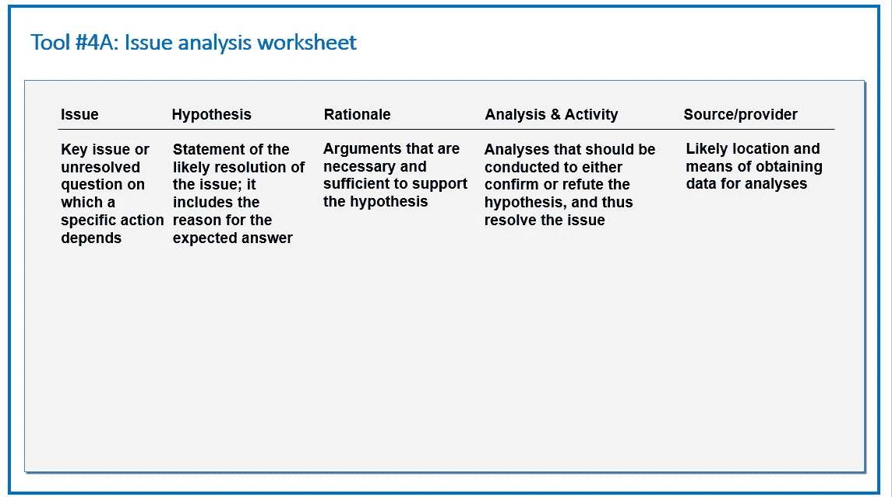

图 29:黄敏哈[拍摄的图像](https://minha-hwang.medium.com)

图 30 显示了“工具#4B:工作计划工作表”这有助于我们指定最终产品(即关键交付成果)并为每个关键任务分配责任和期限。请注意，工作计划工作表(以及问题分析工作表)对于数据科学经理非常有用，可以确保最终交付成果的总和有助于团队找到他们想要找到的答案。此外，让负责任的所有者和截止日期在团队成员中明确期望。重要的是与团队成员共同开发这一工具，以建立和达成共识。最后，我要推荐 2 个实用的小技巧:(1)请避免共同承担责任。将一项关键任务分配给两个以上的人，不清楚谁对结果负责。如果您必须将一项关键分析或任务分配给两个以上的人，您仍然可以明确领导和支持角色。(2)对于时间线，请确保您已经包括了一些缓冲区。将会出现意外事件和数据问题，这可能会延迟整体时间表(例如，数据质量问题、基础设施问题、招聘问题、关键利益相关方的可用性等)。)在初始工作计划中包含缓冲区有助于您减少意外问题造成的潜在延迟。

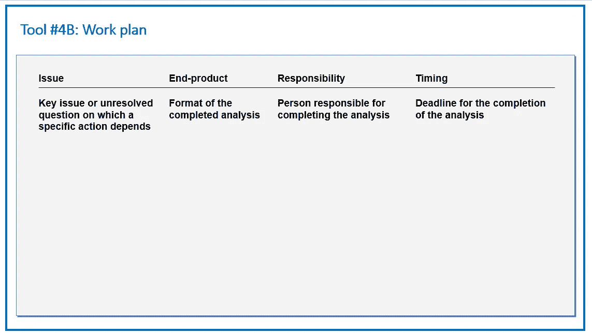

图 30:黄敏哈拍摄的图像

图 31-图 33 显示了一个简单的“问题分析工作表”的例子以约翰章鱼为例。请注意，这一步有助于我们定义单独的工作流，并确定相关的数据和信息提供者。

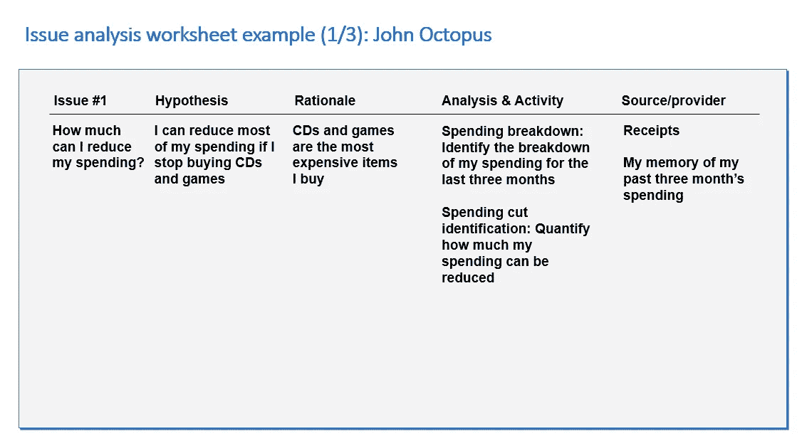

图 31:由[黄敏哈](https://minha-hwang.medium.com)拍摄的图像

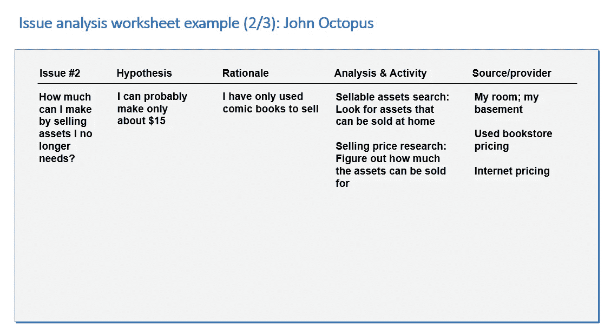

图 32:由[黄敏哈](https://minha-hwang.medium.com)拍摄的图像

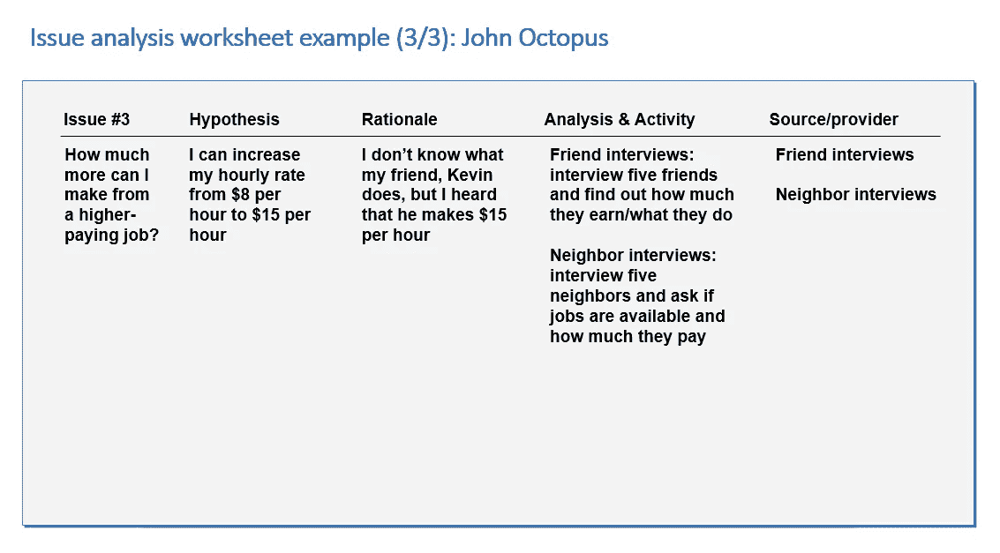

图 33:黄敏哈拍摄的图像

# 步骤 5:进行分析

在步骤 4 中定义了关键的分析和活动之后，您终于可以进行实际的分析了。这是一部分，可能会因项目和问题而有很大不同。我将通过一个简单的案例来展示这个阶段是如何随着时间的推移而发展的。对于大多数商业问题，从基线(没有采取任何行动的状态)和目标开始是有帮助的。如果您同意度量这两种状态的标准，那就更好了。如果没有，您可能需要额外的工作来清楚地定义要使用的度量标准，并与相关的利益相关者建立共识。对于约翰章鱼的例子，我们可以从当前状态的评估开始。“瀑布图”非常有用，可以直观地显示基线和目标，以及要缩小的差距。图 34 显示了 John Octopus 示例的基线、差距和目标。为了购买一台售价 900 美元的 MacBook Pro 电脑，John Octopus 需要弥补 240 美元的缺口。

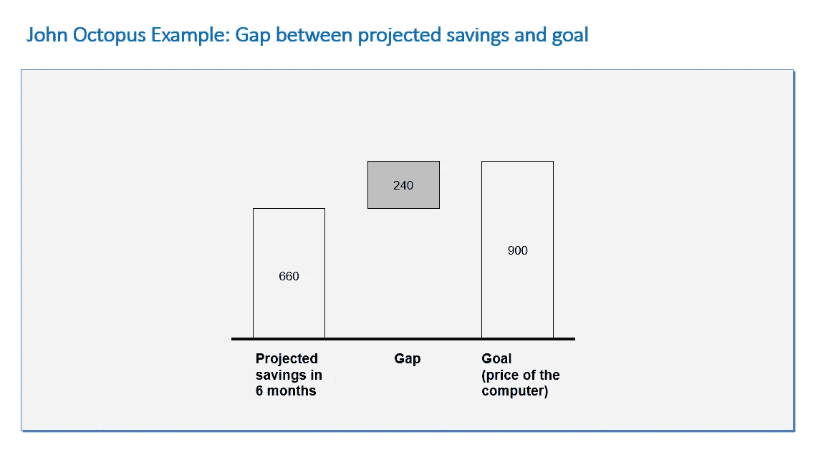

图 34:黄敏哈拍摄的图像

对减少开支的影响的第一次分析如图 35 所示。收集多个时间段的数据通常很重要，因为数据中可能存在季节性或趋势性。图 35 中的月支出数据表确实显示了支出随时间的波动。与单个月的估计相比，使用 3 个月的平均值(32 美元)将是对平均月支出更可靠的估计。图 36 中每月平均花费的细目证明了最初的假设是错误的。咖啡和漫画书是最大的两项支出，而不是视频游戏和 CD。让我强调一下，最初的假设不一定是正确的。这个阶段的数据和分析将证明或否定一个假设，这是一个有助于集中分析的工具。

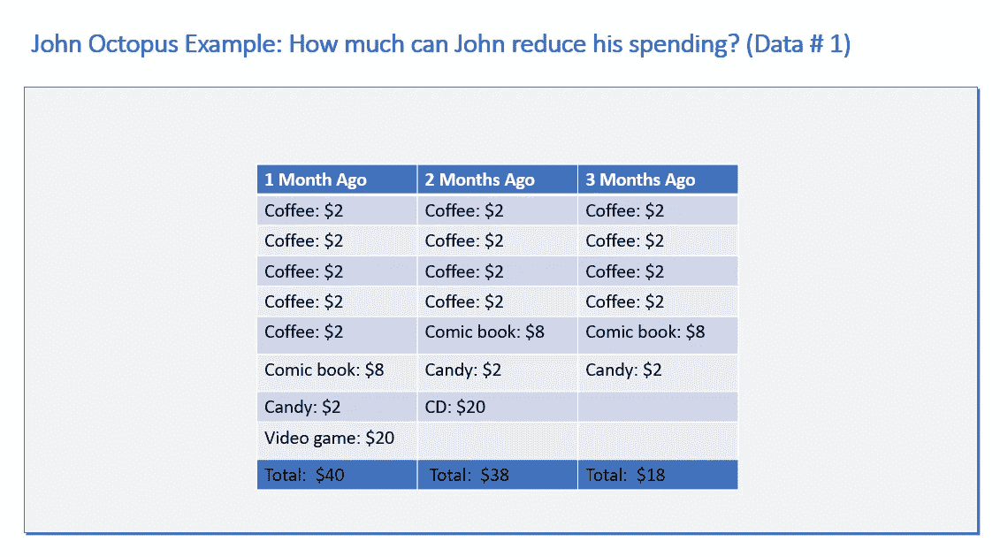

图 35:由[黄敏哈](https://minha-hwang.medium.com)拍摄的图像

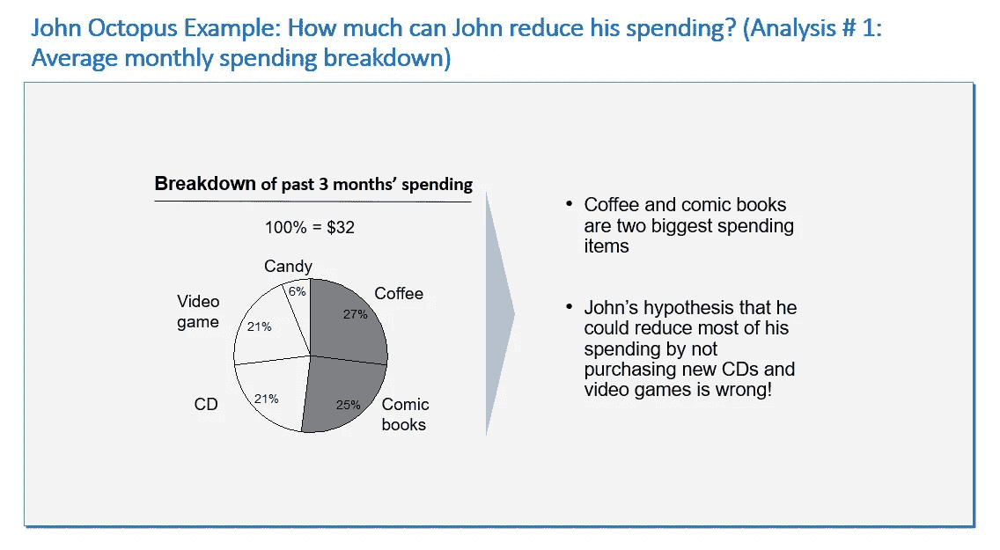

图 36:由[黄敏哈](https://minha-hwang.medium.com)拍摄的图像

找出哪些项目是支出最高的项目是一回事，但你还需要考虑减少支出的可行性。图 37 显示了定性开支削减可行性评估的示例。举个例子，章鱼哥约翰决定不削减咖啡开支，因为早上没有咖啡他无法正常工作。根据图 36 中项目的平均月支出(即对减少支出的影响)以及图 37 中削减支出的可行性(按高/中/低评估)，我们可以在图 38 中创建一个“优先化”矩阵。这表明，电子游戏和光盘是约翰没有太多困难就能减少开支的物品。我们可以反映这一分析的结果，并评估我们缩小了多少差距。图 39 显示，在视频游戏和光盘上的支出削减可以在未来 6 个月贡献 80 美元，这将差距缩小到 160 美元。

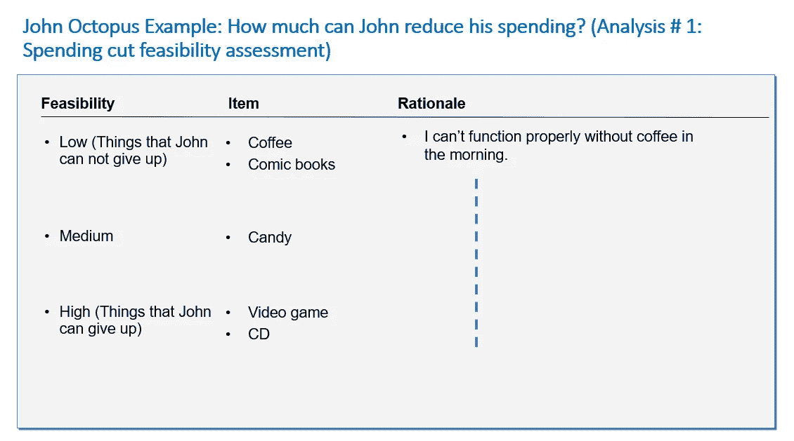

图 37:黄敏哈拍摄的图像

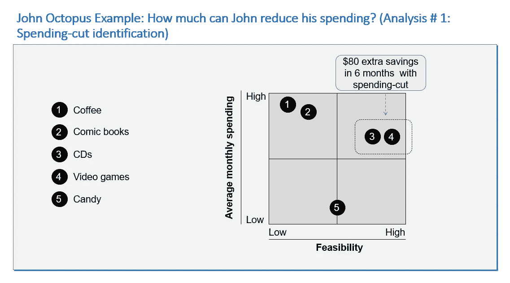

图 38:由[黄敏哈](https://minha-hwang.medium.com)拍摄的图像

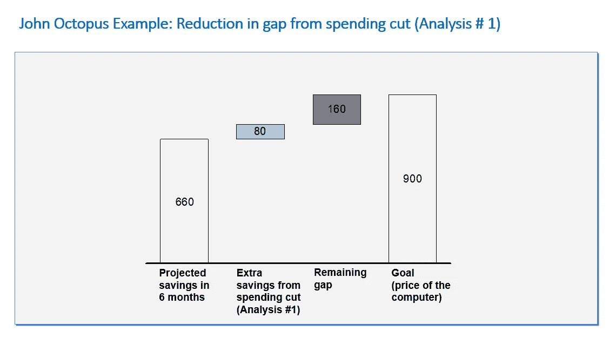

图 39:由[黄敏哈](https://minha-hwang.medium.com)拍摄的图像

作为第二项分析，约翰·章鱼评估了他可以通过出售不必要的资产(如二手漫画书)赚多少钱。图 40 总结了这一分析的结果，通过出售不必要的资产，确定了 50 美元的额外节约。图 41 回顾了增加额外节省后与目标的差距。由于增加了 50 美元，剩余的差额现在减少到 110 美元。请注意，量化每次分析的影响并将其与目标进行比较有助于您判断何时可以停止。如果整体影响大到足以实现你的目标，你可以早点停止，而不是做所有的活动或分析。

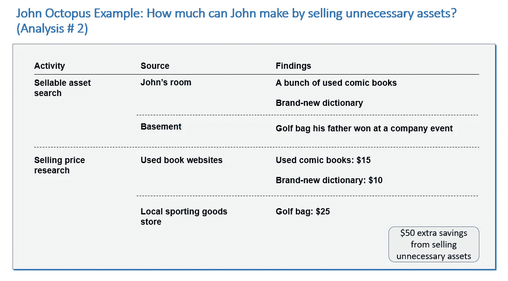

图 40:黄敏哈拍摄的图像

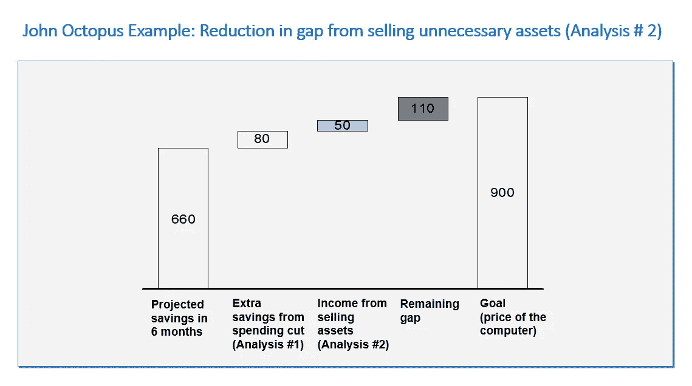

图 41:由[黄敏哈](https://minha-hwang.medium.com)拍摄的图像

图 42 和图 43 总结了分析# 3——朋友和邻居访谈的结果:约翰调换工作能增加多少收入。在仔细研究了他的发现后，约翰意识到他每小时只能挣 6-8 美元。图 44 总结了他的发现。通过换工作来增加他收入的假设似乎行不通。我们被困在这里了吗？我们如何缩小剩下的差距？

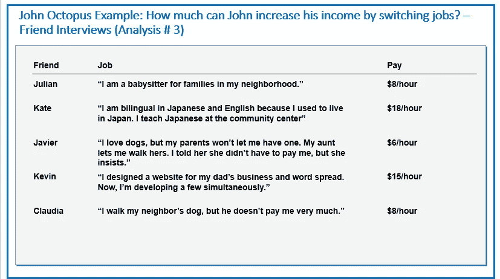

图 42:由[黄敏哈](https://minha-hwang.medium.com)拍摄的图像

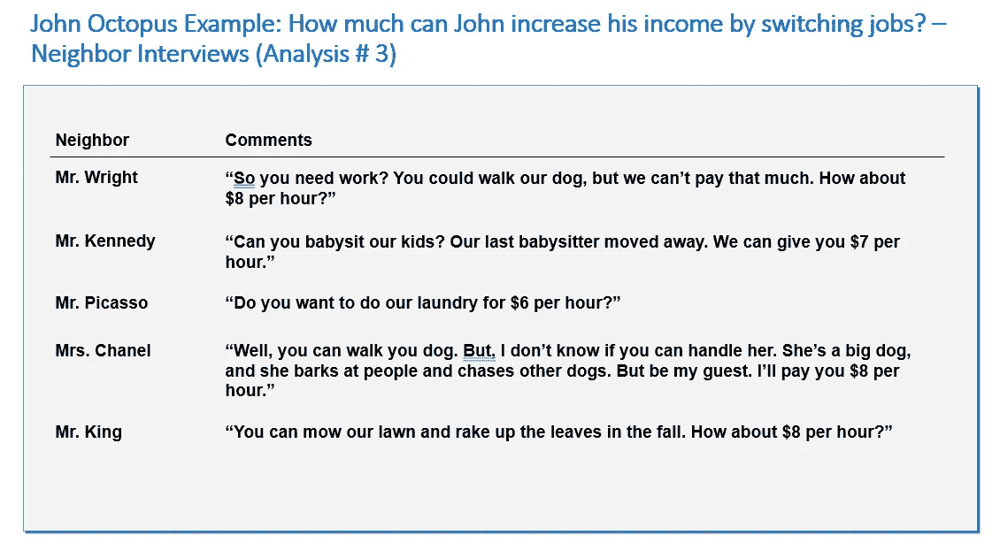

图 43:由[黄敏哈](https://minha-hwang.medium.com)拍摄的图像

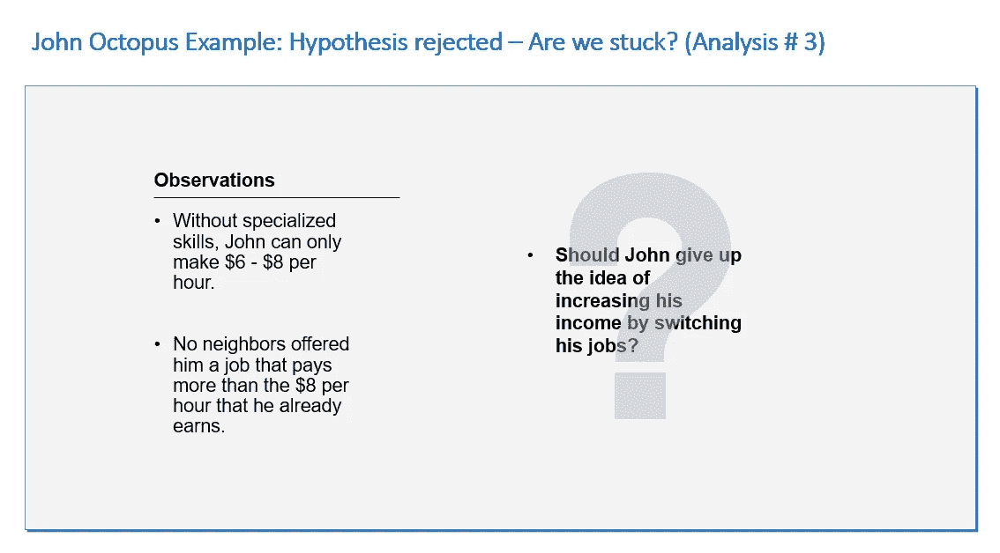

图 44:由[黄敏哈](https://minha-hwang.medium.com)拍摄的图像

这是多重迭代开始发生的地方。有时候，最初的假设可能不足以实现你的目标。我们需要考虑其他可能的想法。通常，到目前为止进行的数据和分析为新想法提供了基础。图 45 显示了该过程的输出示例。章鱼哥约翰意识到他可以同时遛多只狗。这可以让他的月收入增加 32 美元，而不需要投入更多的时间。在反映了他月收入的增加后，图 46 显示他现在可以买一台 982 美元的电脑，这超过了他 900 美元的目标。一个问题就解决了！

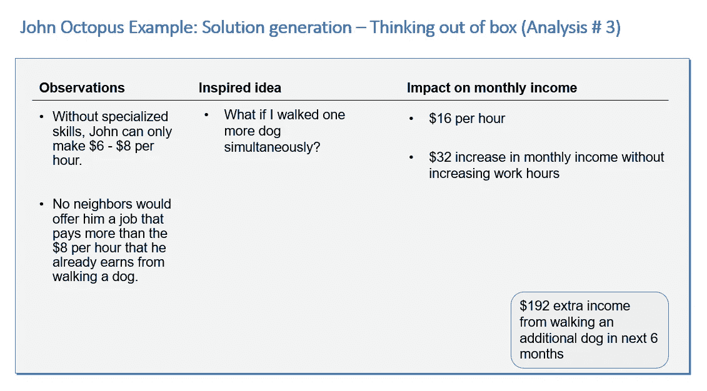

图 45:由[黄敏哈](https://minha-hwang.medium.com)拍摄的图像

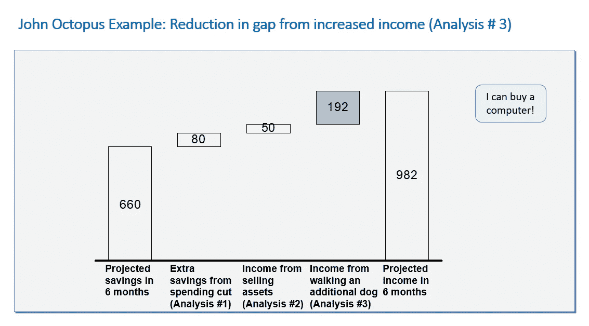

图 46:黄敏哈[拍摄的图像](https://minha-hwang.medium.com)

图 47 总结了一些在“进行分析”步骤中有用的技巧让我再次强调多次迭代的重要性。与其试图以缓慢的速度达到完美，不如快速高效地多次迭代。快速失败是非常受鼓励的，你总是可以迭代多次来改进。

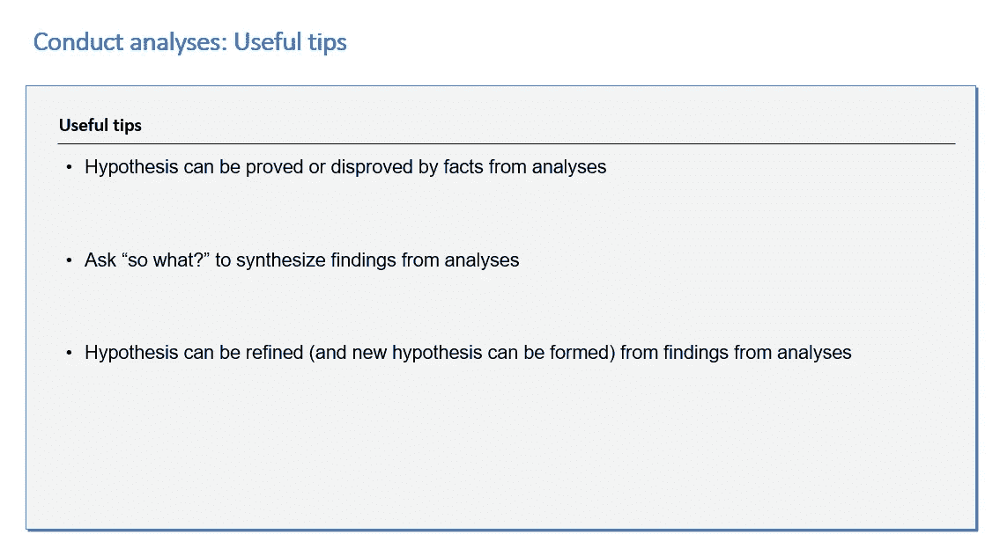

图 47:黄敏哈[拍摄的图像](https://minha-hwang.medium.com)

# 第六步:综合调查结果

一旦你完成了第 5 步的分析，第 6 步就是交流的重要开始:“综合发现”。请注意，合成不同于总结。图 48 对比了基于相同基本事实的综合与汇总的不同之处。合成倾向于更关注“那又怎样？”

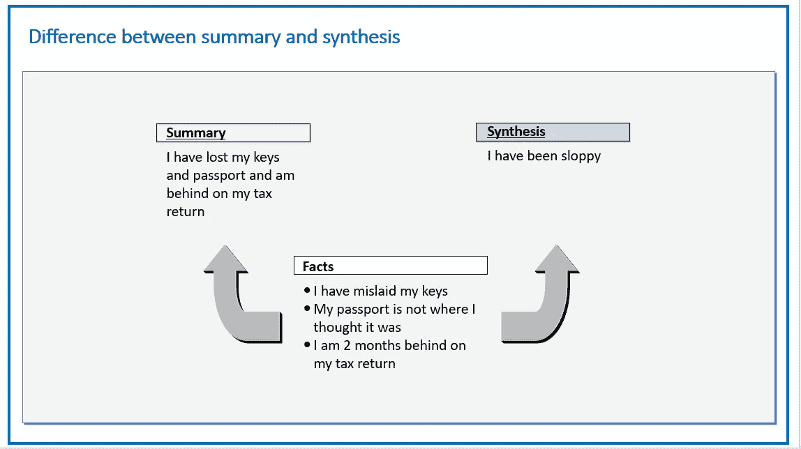

图 48:黄敏哈[拍摄的图像](https://minha-hwang.medium.com)

金字塔原理([芭芭拉·明托](http://barbaraminto.com/))有助于综合潜在的事实。图 49 显示了合成过程与交流的不同之处。合成通常是自下而上的。从潜在的事实、数据和分析出发，分组有助于找到一种模式或相似性。通过问“那又怎样”，你最终可以将这些综合成统治思想。相比之下，沟通通常是以自上而下的方式进行的。

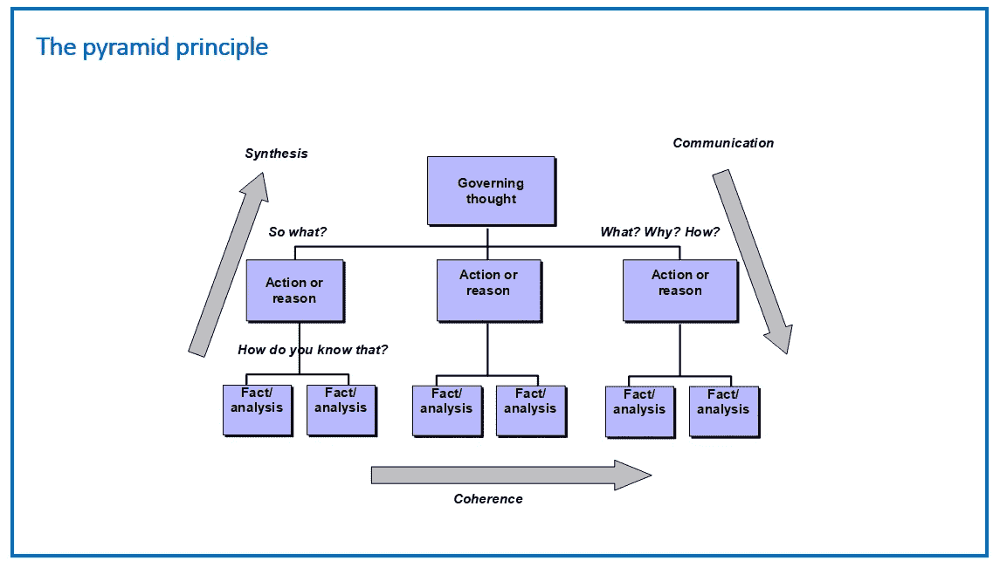

图 49:由[黄敏哈](https://minha-hwang.medium.com)拍摄的图像

图 50 介绍了“工具#5:故事情节金字塔”你可以有一个“分组”结构，其中一个主导思想由独立但连贯的想法支持。另一个替代方案是“论证”结构，在这种结构中，主导思想由一系列想法支持。图 51 和图 52 提供了这两种逻辑结构的更多细节和优缺点。

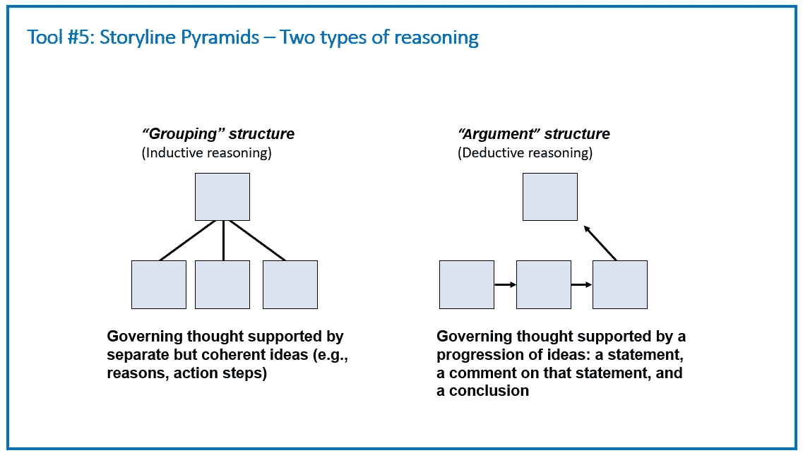

图 50:由[黄敏哈](https://minha-hwang.medium.com)拍摄的图像

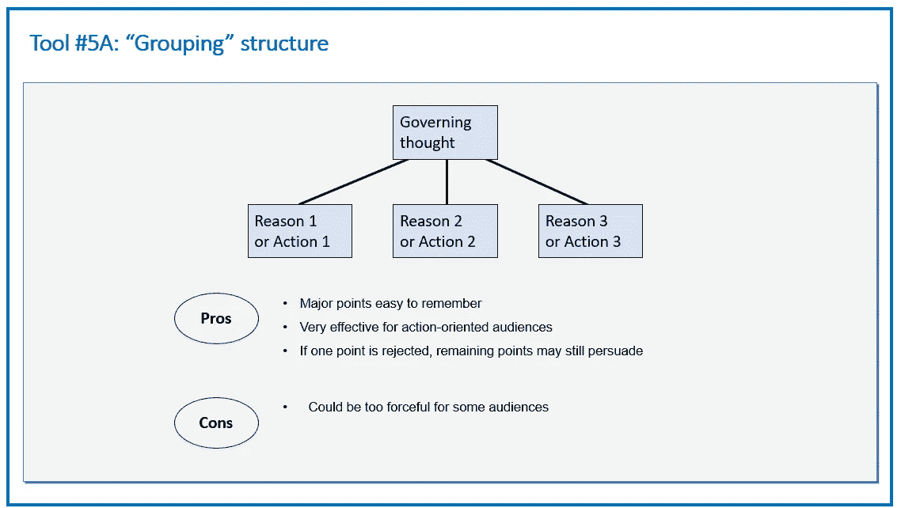

图 51:黄敏哈拍摄的图像

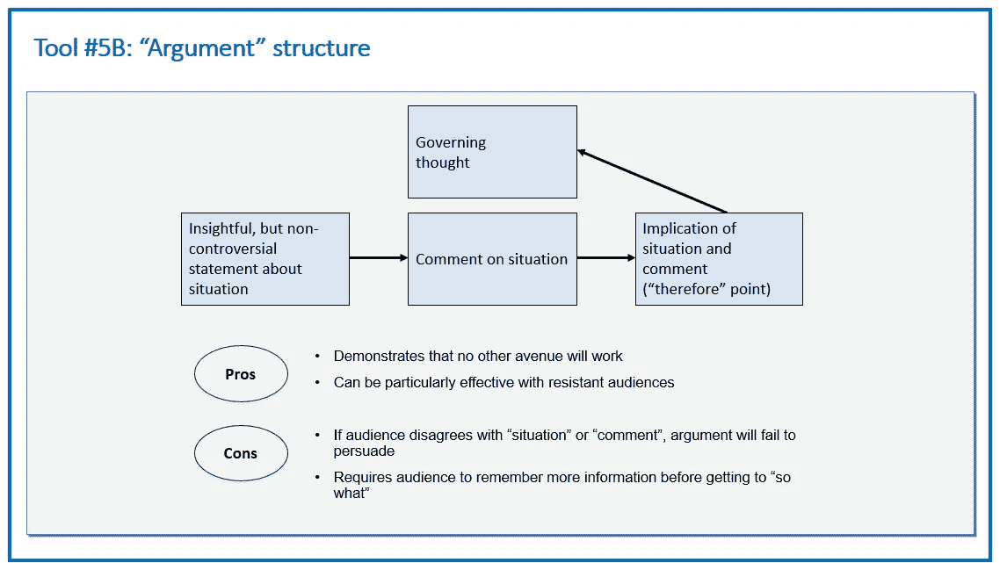

图 52:由[黄敏哈](https://minha-hwang.medium.com)拍摄的图像

为了使这些更具体，图 53 和图 54 提供了一个“分组”结构的例子。“分组”结构对注重行动的观众来说很有效。另一个主要好处是，如果一个点被拒绝，其余的点仍然有效。然而，对于某些观众来说，这可能被认为是太强有力了。

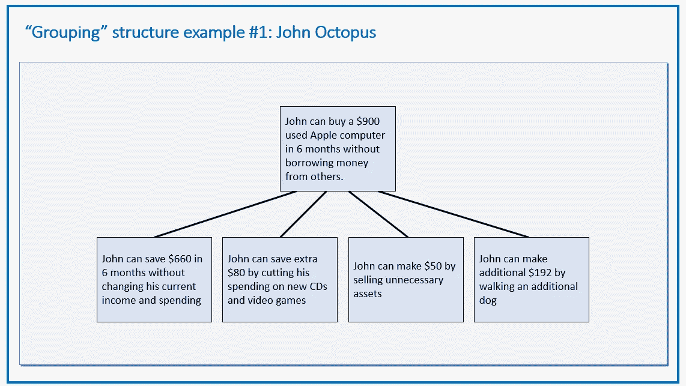

图 53:由[黄敏哈](https://minha-hwang.medium.com)拍摄的图像

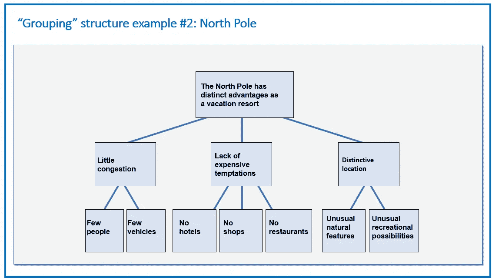

图 54:黄敏哈[拍摄的图像](https://minha-hwang.medium.com)

图 55 提供了一个“参数”结构的例子。这对抗拒的观众可能是有效的。但是，如果听众不同意这种情况或评论，论点可能无法说服。

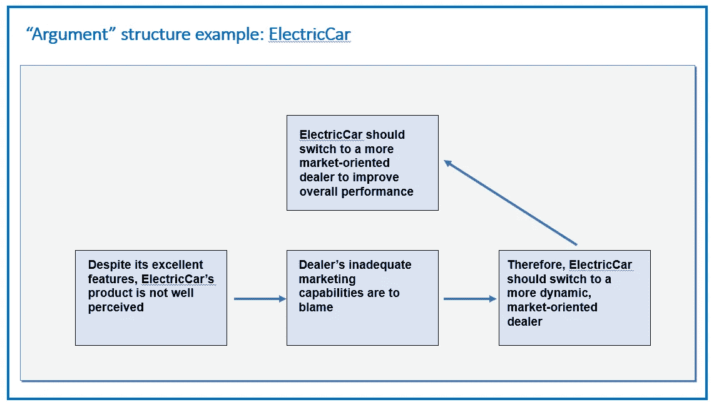

图 55:黄敏哈[拍摄的图像](https://minha-hwang.medium.com)

图 56 提供了一些有用的综合技巧。组织和结构是建立一个坚实的故事情节的关键。保持信息的重点是值得的。即使你的分析中有有趣的事实，如果这些事实与关键问题无关，也应该避免离题。

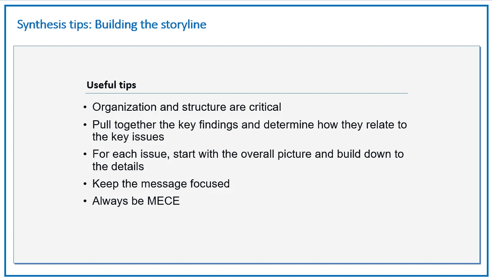

图 56:黄敏哈[拍摄的图像](https://minha-hwang.medium.com)

# 步骤 7:提出建议

一旦你在第 6 步制定了一个“故事情节”，7 步解决问题方法的最后一步就是“制定建议”我来强调一下这个阶段最后沟通的重要性。有时，由于缺乏令人信服的沟通，非常畅销的分析和令人信服的数据无法产生业务影响。在某些情况下，有效的沟通者甚至可以用不那么令人信服的数据和分析成功地说服听众。图 57 显示了你在步骤 6 中开发的故事情节金字塔如何转化为最终报告或演示的大纲。

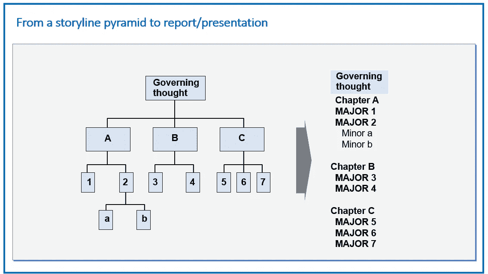

图 57:黄敏哈拍摄的图像

讲述故事的一种流行方式是 SCR:情境、复杂、解决。这种方法非常有效，尤其是在观众比较抗拒的情况下。此外，东方文化的观众往往喜欢这种讲故事的方式(即建立)。相比之下，西方文化的观众通常更喜欢“自上而下”的讲故事方式。更多高层领导受众倾向于“自上而下”的讲故事方式。然而，这些在很大程度上取决于具体的受众和情况。图 58(6 号工具)显示了 SCR 的细节。

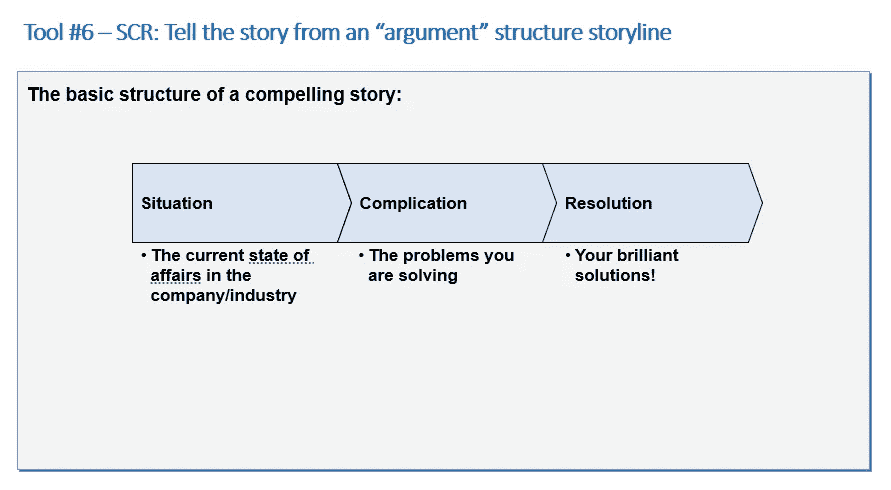

图 58:由[黄敏哈](https://minha-hwang.medium.com)拍摄的图像

图 59 提供了一家资产管理公司基于情景、复杂性和解决方案讲述故事的示例。对情境和复杂性的认同对于受众接受决议中的建议至关重要。

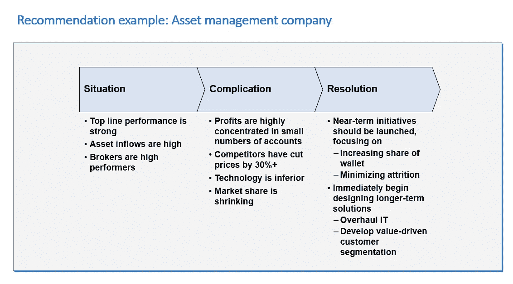

图 59:由[黄敏哈](https://minha-hwang.medium.com)拍摄的图像

# 总结:关键要点

我介绍了一个 7 步解决问题的方法，它可以用于业务问题和数据科学问题(尤其是决策科学问题或更面向应用的数据科学问题。)希望您发现这种结构化的问题解决方法有助于(1)为数据科学家的业务案例面试做准备，以及(2)作为数据科学家处理日常活动和任务。在图 60 中，总结了 7 步解决问题方法中每一步的要点。

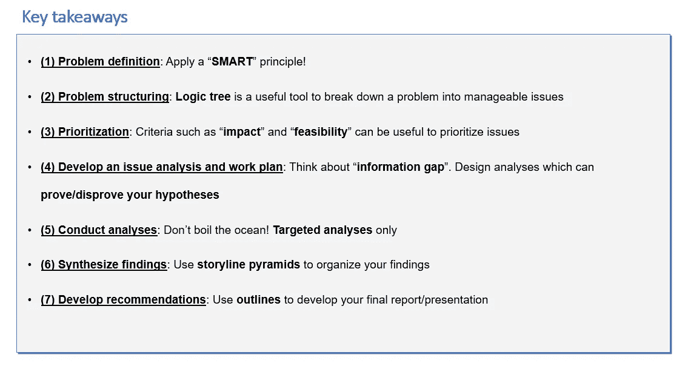

图 60:黄敏哈拍摄的图像

*本文中的约翰·章鱼例子改编自渡边谦的《解决问题 101:给聪明人的一本简单的书》。

**免责声明**:我并不代表麦肯锡建议的解决问题的方法，这里有所描述。我只是分享我的观点。

# 参考

1.  金字塔原理:写作和思考中的逻辑，ISBN-13:978–0273710516，芭芭拉·明托
2.  解决问题 101:一本给聪明人的简单的书，**ISBN-13:**978–1591842422，渡边谦

*原载于 2021 年 12 月 11 日*[*【http://bigdataco.blogspot.com】*](http://bigdataco.blogspot.com/2021/09/cracking-business-case-interviews-for.html)*。*