# 破解数据科学家的商业案例访谈:第 1 部分

> 原文：<https://towardsdatascience.com/cracking-business-case-interviews-for-data-scientists-step-1-define-a-problem-6a63f86b9a38?source=collection_archive---------18----------------------->

## 问题定义、结构化和优先级排序

**图片由**[黄敏镐 ](http://medium.com/@minha.hwang)

商业案例研究面试问题往往是面试过程中最难的部分，尤其是对于没有工作经验的早期数据科学家。即使在得到一份工作后，从其他团队和利益相关者那里获得一种结构化的方式来制定和解决业务问题也是有益的。

基于我作为前麦肯锡顾问和数据科学家超过 10 年的学习，我分享一个“解决问题的 7 个步骤”的方法。这种结构化的业务案例/问题解决流程以及相关的框架和模板将帮助您更轻松地处理和解决新的业务问题。

在本文中，我将讨论:

(1) **问题解决**方法的 **7 步概述**

(2) **第一步:定义一个问题**——如何通过解决一个恰当的问题来避免第三类错误

(3) **第二步:构建问题**——如何将问题分解成可管理的子问题

(4) **第三步:确定问题的优先级—** 如何确定要解决的子问题的优先级

下面显示了其余步骤的“第 2 部分”的链接。

[破解数据科学家的商业案例访谈—第二部分| Minha Hwang |迈向数据科学](/cracking-business-case-interviews-for-data-scientists-part-2-c96d9b9a4292)

# **概述“解决问题的 7 个步骤”方法**

解决业务问题本身就是一项艰巨的任务。然而，应用结构化的问题解决方法对于数据科学家来说非常有帮助，可以使这变得更加愉快。这个在大学或者研究生院还没有教好。像麦肯锡这样的顶级管理咨询公司已经开发了这种方法，这也是他们成功的秘诀之一。本着分享的精神，我将在这一系列的两篇文章中详细描述这种方法。本文将有助于(1)数据科学家准备业务案例面试，(2)数据科学家及其业务合作伙伴解决业务问题并产生业务影响，(MBAs 准备管理咨询公司的业务案例研究面试，以及(4)博士生和研究人员采用假设驱动的方法并提高研究效率。解决业务问题的 7 个关键步骤如下:

(1)定义一个问题

(2)构造一个问题

(3)优先处理问题

(4)制定问题分析和工作计划

(5)进行分析

(6)综合研究结果

(7)提出建议

这不是一个线性过程。因此，你需要重复几次来得到一个更好的解决方案，直到你确信进一步迭代的好处是有限的。定期修改和重新评估是非常重要的。这些步骤听起来非常直观和简单。在这一点上，你可能想知道这是否有帮助。魔鬼在细节中。现在，让我深入研究每一个步骤，展示它是如何工作的。我在图 1 中总结了“解决问题的 7 个步骤”。

**图 1:图片由** [**黄敏哈**](http://medium.com/@minha.hwang) 拍摄

# **第一步:定义问题**

解决业务案例的最重要的步骤是“问题定义”，这一点经常被忽视如果机器学习工程师解决了错误的问题，那么用复杂的自然语言处理模型完美解决问题还有什么意义？信不信由你，这种“第三类错误”(解决一个错误的问题)在实践中经常发生。如果有一个合适的问题定义阶段，这是完全可以避免的。

在描述这个阶段的关键要素之前，我想指出一个可以解决的“定义明确的问题”与我们通常所说的“问题”有很大的不同在日常互动中，我们通常所说的“问题”是指认识到“有些事情不对劲”发生的事情和应该发生的事情(即目标)之间存在差距。)或者已经发生的和可能发生的有差距(即机会。承认“问题”是困难的，而且会产生焦虑。它往往非常“笼统”，可以只是“陈述事实”。这仅仅是对形势的认识，需要采取行动。

可以解决的“明确定义的问题”具有以下特性:

*   一个发人深省的**问题，而不是一个事实**
*   **具体**，不笼统
*   **可测量**
*   **行动导向**
*   **相关**(针对关键问题)
*   **有时间限制的**

此外，它是

*   有争议的(非事实陈述或无争议的主张)
*   关注**决策者需要什么**才能前进

定义明确的问题的这些性质通常可以用一个“聪明”原则来概括。这个原理如图 2 所示。

**图 2:图片由** [**黄敏哈**](http://medium.com/@minha.hwang) 拍摄

为了使“明确定义的问题”更具体，让我用一个简单的玩具例子来对比“明确定义的问题”和我们通常所说的“问题”。下面总结了这个玩具例子的背景:约翰章鱼。

*   事情经过:约翰上周六和朋友去看了《Ready Player One》(虚拟现实上的电脑生成动画电影(即 CGI)，他很喜欢。
*   目标:约翰看完电影后印象深刻。因此，他想成为好莱坞 CGI 电影导演。
*   需要采取行动的情况(典型意义上的问题):
*   约翰对如何制作电脑动画电影毫无头绪。
*   *他甚至没有电脑。*
*   *首先，他需要弄清楚如何买一台电脑，以便开始工作。*

我们有足够的信息来正确定义这个问题吗？不，还没有！我已经在图 3 中总结了我们目前所拥有的信息。

**图 3:图片由** [**黄敏哈**](http://medium.com/@minha.hwang) 拍摄

让我介绍第一个问题定义工具，来阐明我们需要哪些额外的信息来“正确地定义”问题。**“问题定义工作表”**是一份很好的清单，可以确保我们拥有正确定义问题所需的所有信息。关键要素是:

**(1)问题定义**:请强迫自己把这个当成一个“问题”。

**(2)背景**:了解问题的历史和组织背景很重要。

**(3)关键利益相关者**:谁是关键决策者？谁会受到这个决定的影响？

**(4)成功的标准**:没有这个，你怎么知道自己是否成功解决了业务问题？请确保在解决问题之前正确定义“成功指标”。你解决不了问题，这是无法衡量的。

**(5)约束**:把甚至不应该考虑的写下来也是有帮助的。

**(6)解决方案空间的范围**:通常，对于问题的地理或业务线焦点有明确的要求。检查时间要求也很好(即 4 周、3 个月、1 年后的答案？).有时候，80/20 方向性的答案是渴望的。其他时候需要非常精准的回答(网站流量增加 1%或者网站流量增加 1.1%)。明确所需的准确性有助于正确衡量提议的方法或解决方案是否合适。

为了便于将来使用，第一个工具“问题定义工作表”如图 4 所示。

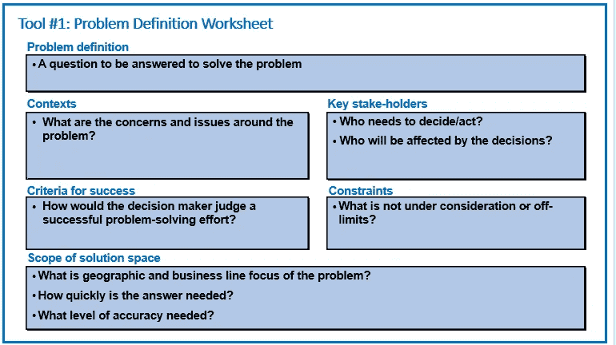

**图 4:图片由** [**黄敏哈**](http://medium.com/@minha.hwang) 拍摄

现在，让我们为 John Octopus 玩具示例收集更多信息。这些是:

*   时机:John 希望在暑假期间从 8 月份开始获得一些设计实践，而暑假只有 6 个月的时间。
*   计算机的类型和价格范围:
*   *约翰发现 MacBook Pro 很适合 CGI 使用。*
*   *二手 MacBook Pro 售价约 900 美元*
*   其他上下文:
*   *约翰不想借或租电脑。*
*   约翰有 140 美元的存款。他的父母每月给他 100 美元的零花钱，他每周帮邻居遛狗一次，每小时挣 15 美元，相当于每月 60 美元。
*   约翰平均每月花费 80 美元。
*   如果约翰想在 10 个月内拥有一台电脑，他可以通过存钱来买。

有了额外的必需信息，我们可以正确地定义 John Octopus 的问题，如图 5 所示。

**图 5:图片由** [**黄敏哈**](http://medium.com/@minha.hwang) 拍摄

看到问题定义的坏例子通常是有帮助的。图 6 显示了同一个 John Octopus 例子中有缺陷的问题定义的三个例子。

**图 6 图像由** [**黄敏哈**](http://medium.com/@minha.hwang) 组成

作为最后一个练习，我们可以再考虑一个例子，这个例子不太基于个人经验，但更多地来自商业案例。

图 7 显示了洋葱银行有缺陷的问题定义的更多例子。

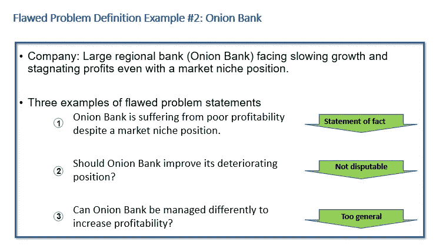

**图 7:图片由** [**黄敏哈**](http://medium.com/@minha.hwang) 拍摄

相比之下，图 8 显示了洋葱银行的一个明确定义的问题的例子。

**图 8:图片由** [**黄敏哈**](http://medium.com/@minha.hwang) 拍摄

希望本文能帮助您理解定义良好的业务问题的关键要素。一个好的问题定义是 60%以上的解决问题的努力。请确保您在数据科学家访谈或作为数据科学家的日常任务中正确定义了问题。

# 第二步:构建问题

一旦你恰当地定义了一个问题，下一步就是“构建一个问题”通常，已定义的问题太大，即使在问题定义之后也无法有效解决。将一个问题分解成子问题(即问题)的更小和可管理的组成部分非常有助于使问题解决可行和有效。这允许将工作划分并分配给不同的团队成员，并进行适当的责任分配。此外，这一步是确定问题优先级的后续步骤的基础，在这一步中，将根据解决问题的重点来确定优先级。“**逻辑树**”(2 号工具)在问题结构化的过程中非常有用。图 9 介绍了一个逻辑树。

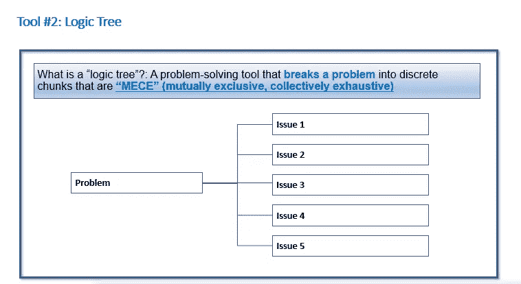

**图 9:图片由** [**黄敏哈**](http://medium.com/@minha.hwang) 拍摄

一个“**逻辑树**”(2 号工具)帮助我们确保待维护问题的完整性。通过检查离散的组块(即子问题)是互斥的，并且是集体穷举的(即“MECE”)，我们可以确保解决问题的部分最终将真正解决问题。由于这些部分没有重叠，我们可以避免重复工作。事实上，没有差距(集体详尽)确保我们没有遗漏任何重要的东西。这也有助于作为一个通信设备。在团队中创建逻辑树有助于建立共识，这也可以在团队之外以结构化的方式共享。最后，这有助于集中使用框架和理论。验证提出的框架和理论通常会揭示逻辑上的差距或尚未考虑的方面。

有两种不同类型的逻辑树。在解决问题的初始阶段，一个"**问题树** " ( **什么/如何树**)更有助于思考整个解决方案空间。一旦你对问题有了足够的了解(例如，经过几次反复的探索性分析、最初的二手数据研究，或者访谈和会议)，一个“**假设驱动树**”(**为什么树**)就变得更加相关了。该树更适合基于假设集中解决问题的努力，并作为确定优先级的基础。数据科学领导者成功的秘诀是尽早建立良好的假设并正确安排工作的优先级。图 10 总结了两种类型的逻辑树。

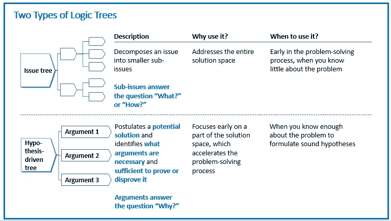

**图 10:图片由** [**黄敏哈**](http://medium.com/@minha.hwang) 拍摄

为了使“逻辑树”的使用更加具体，让我们通过使用 John Octopus 的一个简单案例来开始一个练习。图 11 是一个样例“问题树”,您可以创建它来为 John Octopus 解决问题。请注意，我们正在询问“如何”开发该树的问题。图 11 显示了最高的两个级别。由于我们的目标是在 6 个月内拿出 900 美元购买一台二手 MacBook Pro 电脑，我们可以开始将问题分为增加收入和减少储蓄。为了开发下面的分支，我们必须考虑一下约翰·章鱼哥是如何获得收入的，他的大部分钱都花在了哪里。

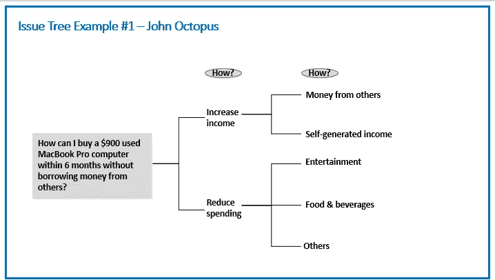

**图 11:图片由** [**黄敏哈**](http://medium.com/@minha.hwang) 拍摄

一旦我们开发了顶层，我们就可以进一步开发上层和下层分支的问题树。如果你想练习，我会建议你不要看下面的解决方案。在实践之后，你可能会意识到开发一个“MECE”树需要大量的思考，即使是像这样一个简单的问题。图 12 和图 13 分别显示了上分支和下分支的潜在问题树。

**图 12:图像由** [**黄敏哈**](http://medium.com/@minha.hwang) 拍摄

**图 13:图片由** [**黄敏哈**](http://medium.com/@minha.hwang) 拍摄

什么会被认为是不好的“问题树”？看到不好的例子有助于理解好的解决方案需要什么。图 14 显示了 John Octopus 问题的有缺陷的问题树示例。你可以看到，通过混合不同的水平，这是不一致的——增加收入与许多支出类别细分处于同一水平。此外，这不是“MECE”，因为咖啡和糖果等重要的消费类别没有显示出来。

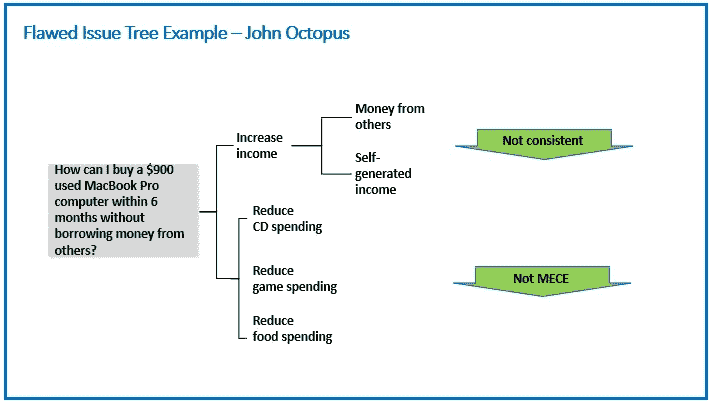

**图 14:图片由** [**黄敏哈**](http://medium.com/@minha.hwang) 拍摄

到目前为止，我们已经看到了 John Octopus 问题的“**问题树**”(如何/什么树)的例子。如果您创建一个“**假设驱动树**”(为什么树)，它与您创建的问题树有什么不同？图 15 显示了 John Octopus 问题的“假设驱动树”示例。请注意，这可以通过问一系列“为什么”的问题来展开。

**图 15:图像由** [**黄敏哈**](http://medium.com/@minha.hwang) 拍摄

现在，让我们通过使用一个更加面向业务的示例来做另一个创建“问题树”的练习。假设你被可口可乐公司聘为管理顾问，该公司试图解决全球盈利能力下降的问题。有许多方法可以开发“问题树”。这些将帮助你考虑给定问题的不同维度和方面。图 16、图 17 和图 18 显示了针对给定问题开发问题树的三种不同方式:利润驱动、地理位置和业务线。

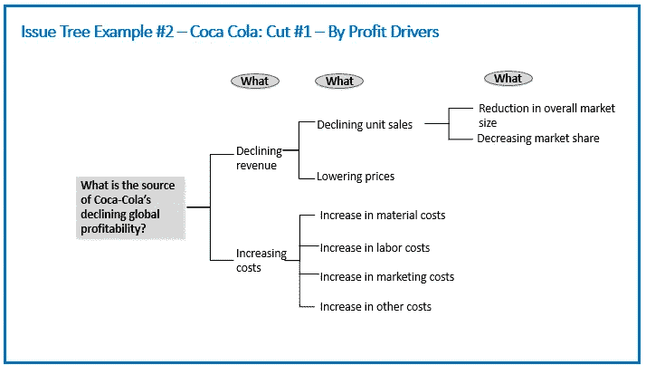

**图 16:图片由** [**黄敏哈**](http://medium.com/@minha.hwang) 拍摄

**图 17:图片由** [**黄敏哈**](http://medium.com/@minha.hwang) 拍摄

**图 18:图像由** [**黄敏哈**](http://medium.com/@minha.hwang)

最后再考虑一个例子，是 A/B 测试的数据科学问题。我们试图解决的问题是“如何提高 A/B 测试的灵敏度。”对于许多大型科技/互联网公司来说，这是一个重要的问题，这些公司使用基于 A/B 测试的数据驱动决策来做出产品功能发布决策。通过提高指标敏感度，公司可以用更少的数据进行精确的推断(即，更短的实验持续时间或更小的实验样本量)。)典型的 A/B 检验依赖于一个独立的 2 样本 t 检验作为检验统计量。对 A/B 测试中驱动测试统计量的因素有一个直观的理解，将有助于您开发一个问题树，并集思广益以提高度量敏感度。提醒一下，A/B 测试的测试统计如下所示。从更直观的角度来看这个公式，你可以意识到 3 件事很重要:效果大小(即你的治疗组和对照组之间的均值差异)、方差(即噪音水平)和样本大小。请注意，我在顶部简化了一个更通用的公式，假设治疗组和对照组之间的方差相同(即混合方差)，治疗组和对照组之间的样本量相同，以方便直观。

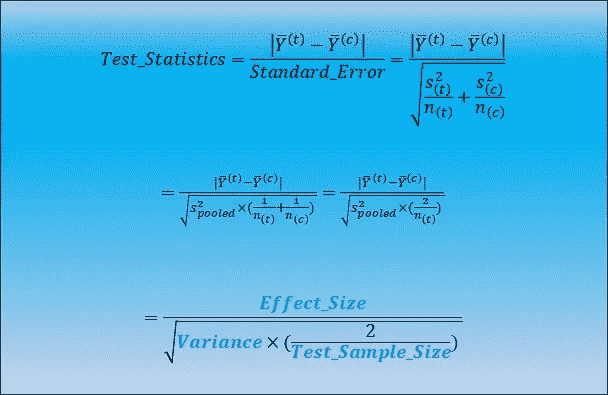

**图 20:图片由** [**黄敏哈**](http://medium.com/@minha.hwang) 拍摄

图 20 显示了增加 A/B 测试灵敏度问题的潜在“问题树”。

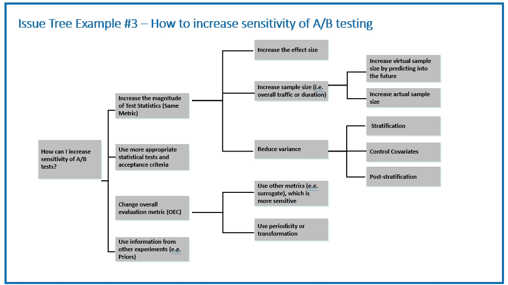

**图 20:图片由** [**黄敏哈**](http://medium.com/@minha.hwang) 拍摄

希望你已经对如何应用逻辑树将问题分解成更易管理的块(即子问题)有了很好的理解。总之，好的逻辑树是(1)一致的，(2)相关的，(3)“MECE”。图 21 在一张图中更清楚地说明了这一点。

**图 21:图片由** [**黄敏哈**](http://medium.com/@minha.hwang) 拍摄

最后，我将通过提供一些关于“如何制作逻辑树”的提示来结束这一部分图 22 显示了技巧，以及基本原理(即为什么)。

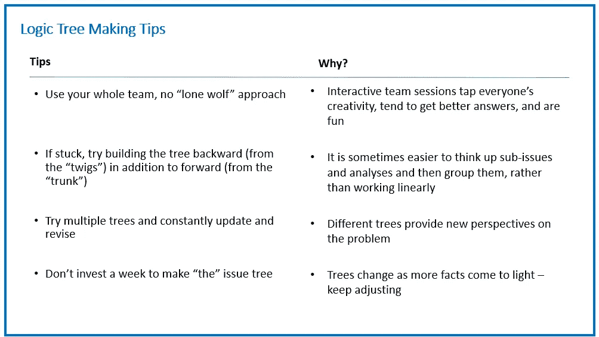

**图 22:图片由** [**黄敏哈**](http://medium.com/@minha.hwang) 拍摄

# 第三步:区分子问题的优先级

一旦你把一个问题分解成子问题，下一步就是“优先化”。这实质上是砍掉问题树或假设驱动树的分支，把注意力集中在最重要的事情上。图 23 以图形的形式展示了这个过程。

**图 23:图像由** [**黄敏哈**](http://medium.com/@minha.hwang)

我们可以使用哪些潜在的标准来确定优先级？潜在(业务)影响、技术或执行可行性、风险通常是有用的标准。个人或公司的价值观也可以作为指导。在实践方面，参考高层管理议程以确保您的项目将从领导和高层管理获得所需的支持是一个不错的主意。检查 okr 在这方面会有帮助。图 24 总结了您可以考虑的潜在标准。

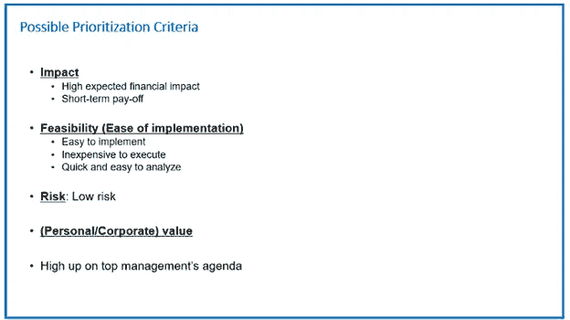

**图 24:图片由** [**黄敏哈**](http://medium.com/@minha.hwang) 拍摄

图 25 显示了“工具#3”，它对于解决问题的优先化步骤非常有用。优先级矩阵(2 x 2 矩阵)，其中一个轴是潜在影响，另一个轴是可行性，是一个有用的可视化工具，可以对要关注的子问题进行优先级排序。在图 25 中，我使用了 John Octopus 问题来使它更加具体。

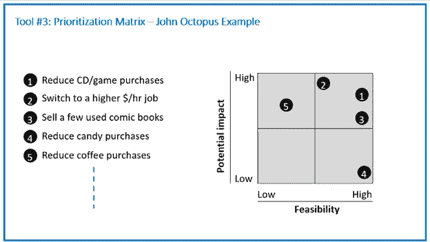

**图 25:图片由** [**黄敏哈**](http://medium.com/@minha.hwang) 拍摄

为了更熟悉解决问题的第三步:优先化，让我们再次使用约翰章鱼问题。在图 26 中，我展示了问题树的上层分支，以及如何应用优先级。类似地，在图 27 中，问题树的较低分支显示了类似的优先级排序练习。

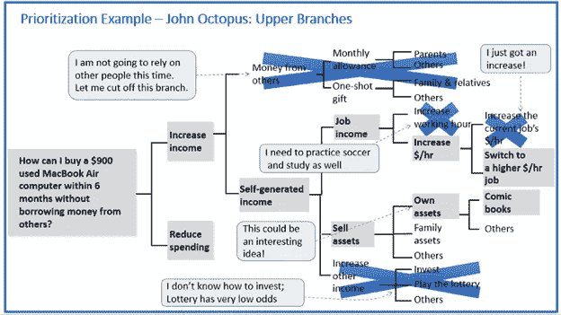

**图 26:图片由** [**黄敏哈**](http://medium.com/@minha.hwang) 拍摄

**图 27:图片由** [**黄敏哈**](http://medium.com/@minha.hwang) 拍摄

到目前为止，结构化问题解决方法的前 3 个步骤:(1)定义问题，(2)构建问题，以及(3)区分问题的优先次序，都是通过例子来介绍的，使它们更加具体。

在后续文章(第 2 部分)中，我将详细描述解决问题过程的其余部分。下面显示了下一篇文章的链接。

[数据科学家的商业案例访谈-第二部分](/cracking-business-case-interviews-for-data-scientists-part-2-c96d9b9a4292)

*本文中的 John Octopus 例子改编自[《解决 101 个问题:聪明人的一本简单书》](https://www.amazon.com/Problem-Solving-101-Simple-People/dp/1591842425/ref=sr_1_1?crid=20NZRXNVUMS66&dchild=1&keywords=problem+solving+101+by+ken+watanabe&qid=1630943858&sprefix=problem+solving+101%2Caps%2C389&sr=8-1)渡边谦的书。我会推荐那本书，尤其是给学生看的。

**免责声明**:我并不代表麦肯锡建议的解决问题的方法，这里有所描述。我只是分享我的观点。

*原载于 2021 年 9 月 6 日 http://bigdataco.blogspot.com***。**