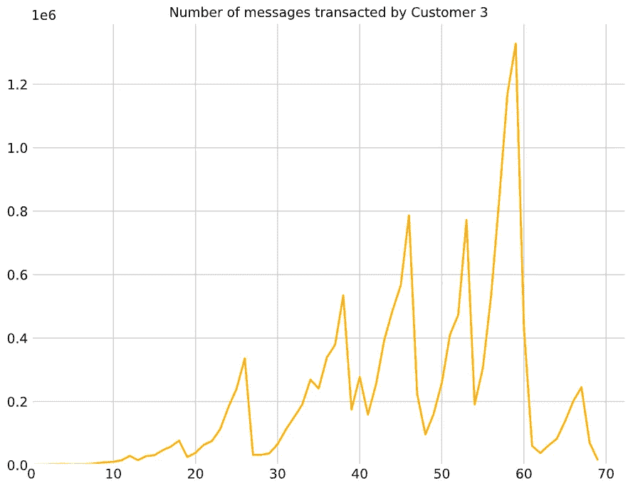
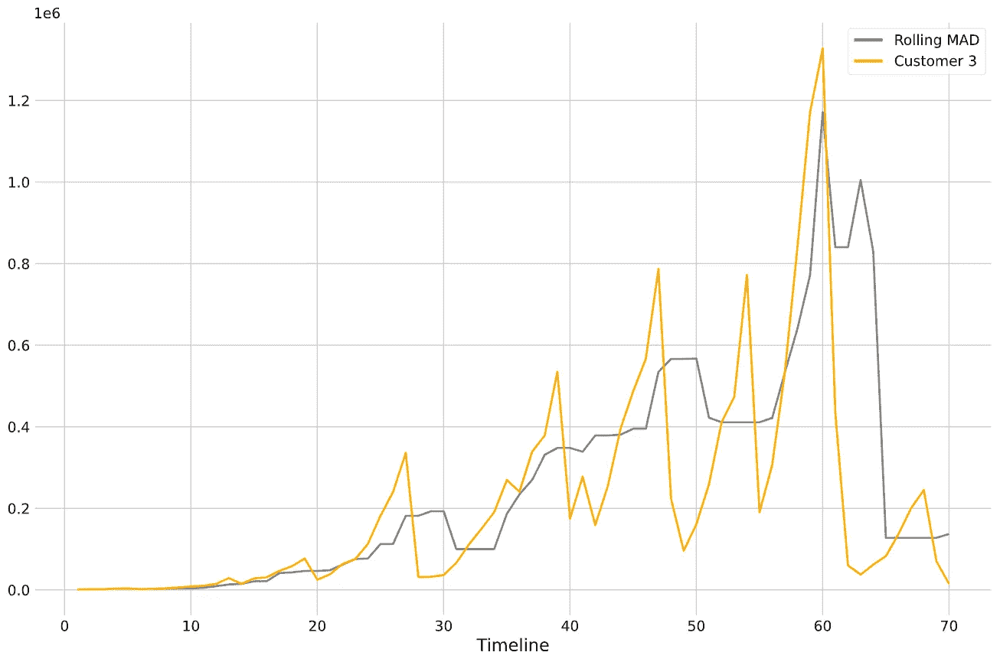
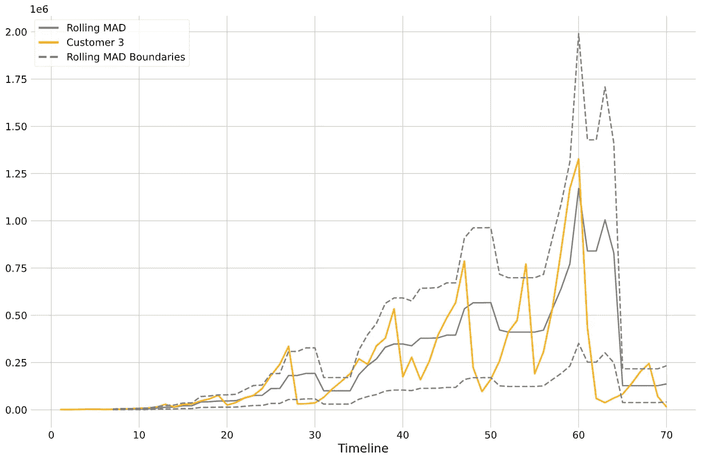
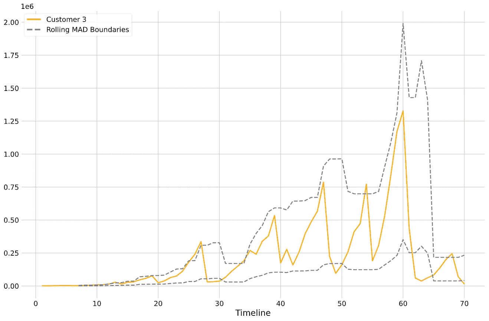
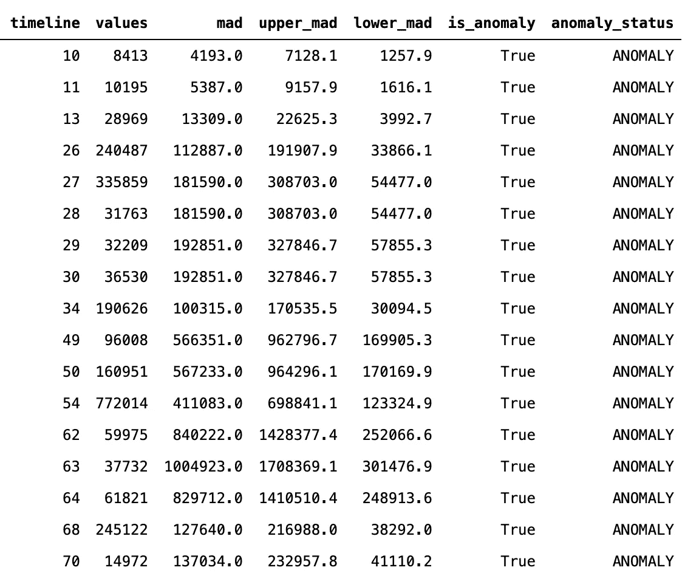

# 疯狂简单的异常检测帮助客户取得成功

> 原文：<https://towardsdatascience.com/crazy-simple-anomaly-detection-for-customer-success-458e94d4d516?source=collection_archive---------25----------------------->

## 如何检测使用情况的变化，及时做出反应并让您的客户满意

异常检测这个话题很吸引人。有大量的方法可以使用，从简单的统计到更复杂的无监督学习方法。此外，异常检测的影响是巨大的。当事情没有按计划进行时，检测的能力是一个奇妙的工具，并且具有拯救生命的潜力(例如在预防性维护中)。

在本文中，我们将探索一种极其简单的异常检测方法。有时候最简单的解决方案可能会产生最大的影响。在这种情况下，我们将使用[中位数绝对偏差或 MAD](https://en.wikipedia.org/wiki/Median_absolute_deviation) 来检测企业交易的 WhatsApp 消息数量中可能的异常值。

# 介绍

在客户成功领域，特别是在 SaaS B2B 公司，衡量我们客户的产品使用是至关重要的。本质上，SaaS 企业希望了解他们的客户如何使用他们的产品，以及他们使用了多少。背后的原因是，如果客户不使用你的产品，很可能他们遇到了某种麻烦。这可能是因为他们不知道如何使用它，他们没有从中获得价值，或者他们遇到了某种产品缺陷。在任何情况下，使用率下降都会导致客户流失。除其他事项外，客户成功团队的角色是识别可能发生这种情况的案例，并帮助这些客户最终引领他们走向成功。

除了使用 MBR 或 QBRs(月度或季度业务回顾)进行定期检查之外，客户成功团队还可以通过了解客户何时较少使用他们的产品来采取积极的态度。这是一个实现异常检测的完美例子。这个想法是检测每个客户的使用数据中的异常，并让客户成功团队联系那些放弃使用的客户。

# 数据

要使用的数据类型因业务而异。如果你是 Shopify 这样的电子商务平台，你可能会对跟踪销售感兴趣，如果你是 MailChimp 这样的电子邮件营销平台，你会对发送的电子邮件感兴趣。当我在 [Sirena](https://www.sirena.app/) 工作时，我会使用 WhatsApp messages 的使用数据，Sirena 是一款让企业通过 WhatsApp 与客户沟通的应用。在本文中，我将使用从一个非常简单的模拟中随机生成的 WhatsApp 消息数据。这个数据集在我的 Github 中公开:[fake data/whatsapp messages](https://github.com/juangesino/FakeData/tree/master/WhatsAppMessages)

该数据集包含 4 个不同客户在 10 周内处理的邮件数量。为了简单起见，我们将只关注一个客户；顾客 3。

# 异常检测

## **疯了**

中位数绝对偏差(MAD)是一个非常简单的样本变异度量。从这个意义上来说，它非常类似于衡量统计离差的标准偏差。MAD 被定义为每个观测值和中值之间的残差绝对值的中值:

然而，与标准偏差相比，MAD 的一个很大的优点是其对异常值的稳健性或不敏感性。平均值和标准偏差都受到异常值的严重影响，因此对异常检测极为不利。在他们的论文中，Leys 等人(2013)表明，许多研究人员仍然使用标准差来表示离差，并建议转向 MAD。在这篇文章中，我将向您展示如何在 Python 中使用它来检测异常或离群值。

## **实施**

我们将从单个客户开始，在本例中为客户 3:

您可能会惊讶于它的实现是如此简单。事实上，计算 MAD 基本上只是 python 的一行代码:

这一行所做的是定义一个(lambda)函数，该函数接受一个 [numpy](https://numpy.org/) 数组(x ),并计算每个 x 与 x 的中值之差的元素绝对值的中值，这正是 MAD 的定义。简单。

在计算 MAD 时，我们面临的唯一(非常微小的)复杂情况是，我们实际上想要计算滚动 MAD。但是使用 numpy 也很简单:

如你所见，首先我们计算滚动中值，然后我们加上滚动平均值。我们可以绘制出它与数据的关系，从而了解我们正在做的事情:

我们可以看到 MAD 是高度滞后的，这没关系。请记住，我们不是要一个非常复杂的异常检测器或预测模型。我们只需要了解对我们的客户来说什么是“正常的”使用变化。

很好，现在我们有了 MAD，我们需要定义标准来理解一个观察是否是一个实际的异常。为此，我们将添加一个阈值，并为我们的滚动 MAD 创建上限和下限:

太好了！现在，我们可以将这些边界添加到图表中，看看我们在处理什么:

看起来不错！现在我们有了 MAD 和一个边界，它可以帮助我们确定一个观察是否是异常。这意味着，对于每个时间点，如果观测值高于滚动 MAD 的上限或低于下限，我们就说这是一个异常。

在这种特定情况下，50%的阈值似乎有点太紧了。我们可以尝试改变这种情况，直到我们对假阳性的数量感到满意为止。我们可以用 70%试试。

使用这些数据，我们可以很容易地获得 MAD 实现检测到的所有异常的列表:

结果向我们显示了每天的使用情况(值)、我们期望看到的情况(MAD)和时间间隔(MAD 上限和下限)。

# 结论

在这篇文章中，我们探索了一种非常简单的方法，使用中值绝对偏差或 MAD 来实现使用数据的异常检测。当然，您可以做很多修改来适应您的特定用例，比如滚动窗口、阈值或者决定何时通知您的团队。我敢肯定，您可以想象当客户的一个帐户停止使用时，一个松散的集成会通知客户成功管理人员。但是，如果您的产品使用有相关的季节性，请考虑调整通知服务。例如，在我们的例子中，如果使用率下降发生在周末(使用率预计会在周末下降)，通知 CSE 没有太大意义。另一种选择是有两个 MAD 界限，一个是周末的更宽松的界限，另一个是工作日的更严格的界限。可能性是无限的。

**参考文献**

莱斯大学、莱伊大学、克莱恩大学、伯纳德大学和利卡塔大学(2013 年)。检测异常值:不要使用平均值周围的标准偏差，使用中位数周围的绝对偏差。*《实验社会心理学杂志》，49 期* (4)，764–766 页。