# 使用 Wtfutil 在您的终端中创建一个漂亮的仪表板

> 原文：<https://towardsdatascience.com/create-a-beautiful-dashboard-in-your-terminal-with-wtfutil-573424fe3684?source=collection_archive---------12----------------------->

## 现在你可以在你的终端上查看你的日程表，待办事项，系统信息，Docker，Git 等等。

# 动机

作为一名数据科学家或程序员，终端可能是您大部分工作的随身工具。如果你能像下面这样查看你的日程表、待办事项、系统信息、docker、git 和你最喜欢的博客的更新，那不是很好吗？

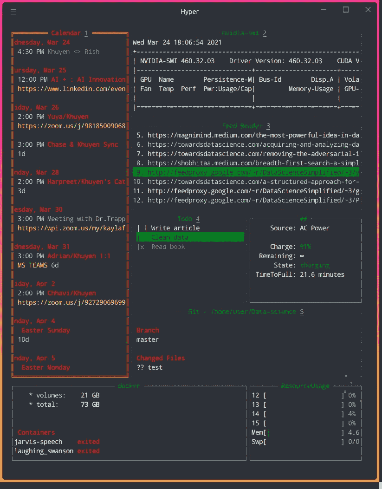

作者图片

这就是 WTF 派上用场的时候。

# WTF 是什么？

WTF 允许您监控系统、服务和重要信息。以下是您可以使用 WTF 查看的一些内容:

*   谷歌日历
*   码头工人
*   饭桶
*   资源使用
*   系统
*   您最喜爱的网站的更新

还有更多！在本文中，我将向您展示如何使用 WTF 将这些信息添加到终端仪表板中。

# 装置

## 公司自产自用

您可以使用 Hombrew 安装 WTF

```
brew install wtfutil

wtfutil
```

## 二进制的

如果这个方法对你不起作用，从 GitHub 下载[最新的二进制](https://github.com/wtfutil/wtf/releases)。如果您使用的是 Linux，您可以通过键入以下命令来检查您使用的是哪个 ARM 版本

```
dpkg --print-architecture
```

由于我的 ARM 版本是 amd64，所以在`Downloads`下载了[wtf _ 0 . 36 . 0 _ Linux _ amd64 . tar . gz](https://github.com/wtfutil/wtf/releases/download/v0.36.0/wtf_0.36.0_linux_amd64.tar.gz)，解压文件，然后将文件`wtfutil`移动到 `/usr/local/bin`:

```
mv ~/Downloads/wtf_0.36.0_darwin_amd64/wtfutil /usr/local/bin
```

然后设置执行文件的权限

```
chmod a+x /usr/local/bin/wtfutil
```

现在它应该工作了！

```
wtfutil
```

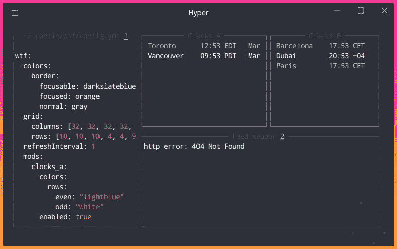

作者图片

如果这两种方法都不适合你，在这里查看其他方法[。](https://github.com/wtfutil/wtf#installation)

# 自定义仪表板

现在我们的仪表板看起来有点无聊。让我们向仪表板添加一些有用的模块。要在终端中编辑配置文件，请键入

```
nano ~/.config/wtf/config.yml
```

或类型

```
gedit ~/.config/wtf/config.yml
```

使用代码编辑器编辑文件。

## 谷歌日历

如果你像我一样，使用谷歌日历来提醒自己即将到来的事件或约会，如果你不用打开谷歌日历就可以在终端上浏览一周，那不是很好吗？幸运的是，WTF 允许你这样做。

要将 Google Calendar 添加到您的仪表板，首先通过在[步骤 1](https://developers.google.com/calendar/quickstart/go#step_1_turn_on_the) 中点击“启用 Google Calendar API”来启用 Google Calendar API。

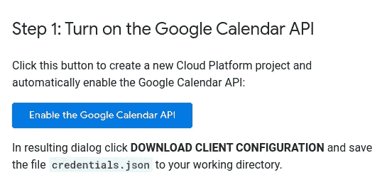

作者图片

下载完`credials.json`后，将其移动到本地机器的一个保存位置。例如，您可以将您的`credentials.json`文件移动到`~/.config/wtf/`:

```
sudo mv ~/Downloads/credentials.json  ~/.config/wtf
```

然后将 Google 日历的凭证文件路径添加到`~/.config/wtf/config.yml`

删除或禁用`~/.config/wtf/config.yml`中的`textfile`部分，因为其位置与`gcal`重叠

保存文件，然后键入`wtfutil`，您应该会看到一个提示“转到您的浏览器中的以下链接，然后键入授权码”。单击链接并将代码复制到终端。

现在，您应该可以在终端上看到 Google 日历的事件和约会，如下所示！

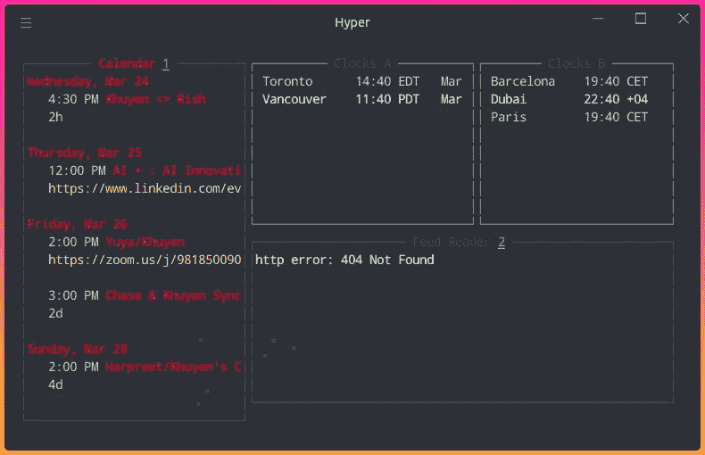

作者图片

## 提要阅读器

如果你想获得你喜欢的网站如 Medium 的每日更新，只需将`feedreader`添加到`~/.config/wtf/config.yml`，然后在`feedreader`下添加他们的 RSS 源。

您可以按照本说明[或本说明](https://help.medium.com/hc/en-us/articles/214874118-Using-RSS-feeds-of-profiles-publications-and-topics)在媒体上查找个人资料、出版物和主题的 RSS 源，或使用本说明[查找任何其他网站的 RSS 源。](https://zapier.com/blog/how-to-find-rss-feed-url/)

保存上面的配置后，您的仪表板应该如下所示:

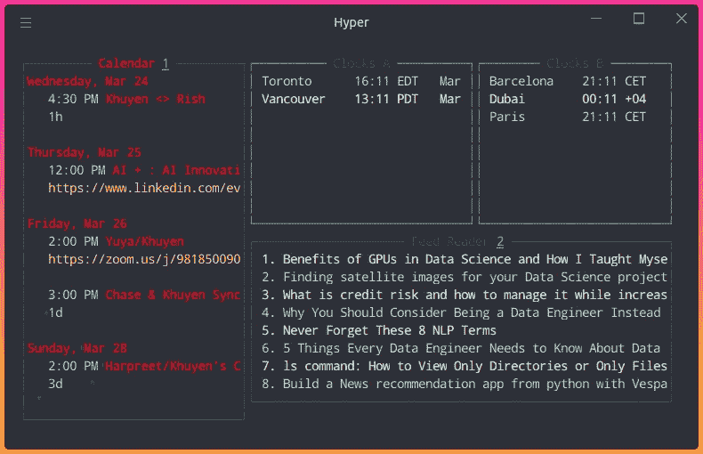

作者图片

如果您想要选择特定的部分，请在该部分的顶部键入数字。由于数字 2 紧挨着提要阅读器标题，我们将键入`2`来访问提要阅读器部分。

然后使用向上或向下箭头在不同的文章之间移动。键入`o`在浏览器上打开文章。现在你可以在你的终端中获得你喜欢的网站的每日更新！

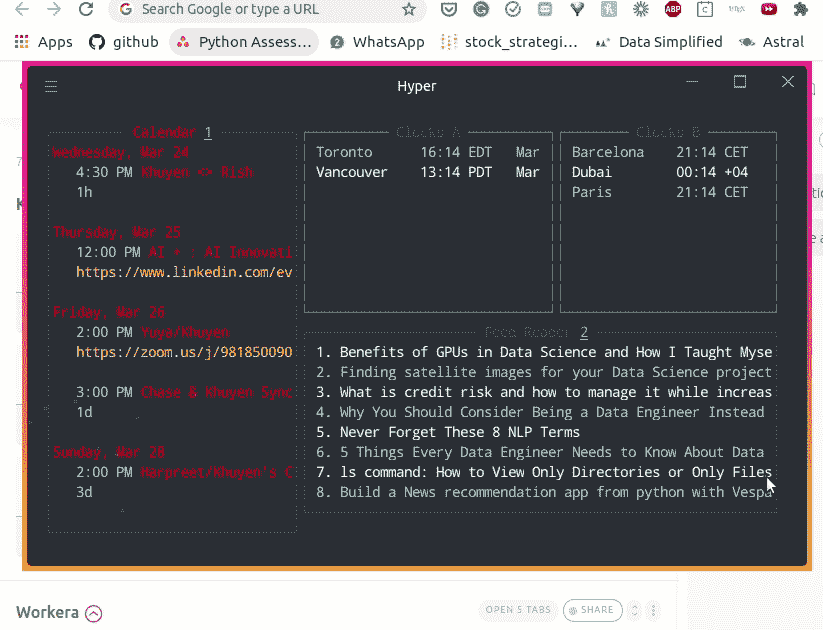

作者 GIF

## CmdRunner

如果您想在仪表板上显示终端命令的输出，如`nvidia-smi`，将`cmdrunner`添加到您的`~/.config/wtf/config.yml`:

*   `cmd`:要运行的终端命令。在这种情况下，它是`nvidia-smi`
*   `args`:添加命令的参数。由于`nvidia-smi`没有任何参数，数组为空。

我禁用了`clocks_a`和`clocks_b`部分，为我的新部分留出了空间。如果您希望保留`clocks_a`和`clocks_b`部分，可以通过编辑`position`中的参数随意改变`nvidia-mi`的位置。

保存配置文件后，您的仪表板应该类似于下图。

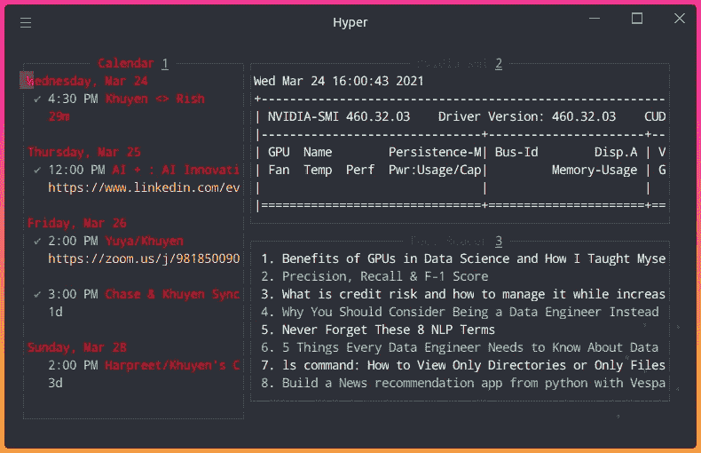

作者图片

## 饭桶

了解您最近使用 git 更改或提交了哪些文件也很有用。要显示关于本地 git 存储库的信息，请将下面的代码添加到您的`~/.config/wtf/config.yml`中:

您应该会看到如下所示的内容:

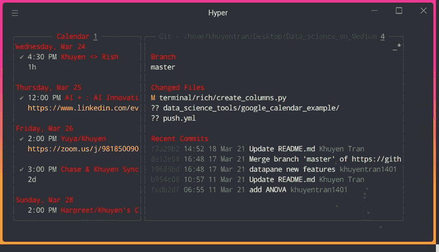

作者图片

## 码头工人

如果您正在使用 docker，了解 Docker 容器和映像的信息可能会很有用，比如卷、内存限制、磁盘使用等。

要将 Docker 的信息添加到您的终端仪表板，请将以下代码添加到您的`~/.config/wtf/config.yml`:

保存配置文件后，您的仪表板应该如下所示:

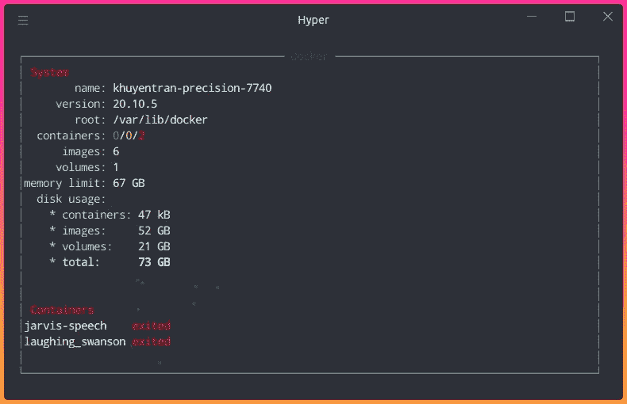

作者图片

## 资源使用

要在仪表盘上显示关于 CPU 和内存使用情况的信息，请将`resourceusage`添加到您的`~/.config/wtf/config.yml`:

您应该能够在仪表板中看到您的 CPU 和内存使用情况！

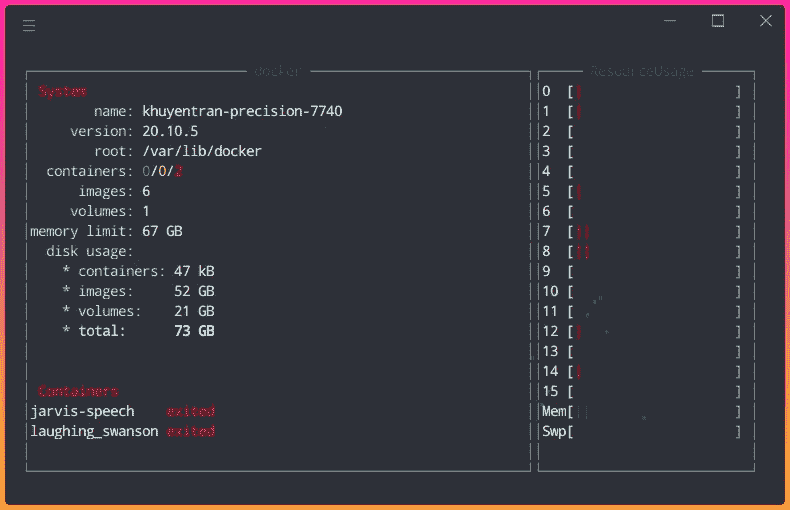

作者图片

## 待办事项列表

您也可以通过将`todo`添加到您的`~/.config/wtf/config.yml`来将待办事项列表添加到您的终端:

您应该会看到如下所示的内容:

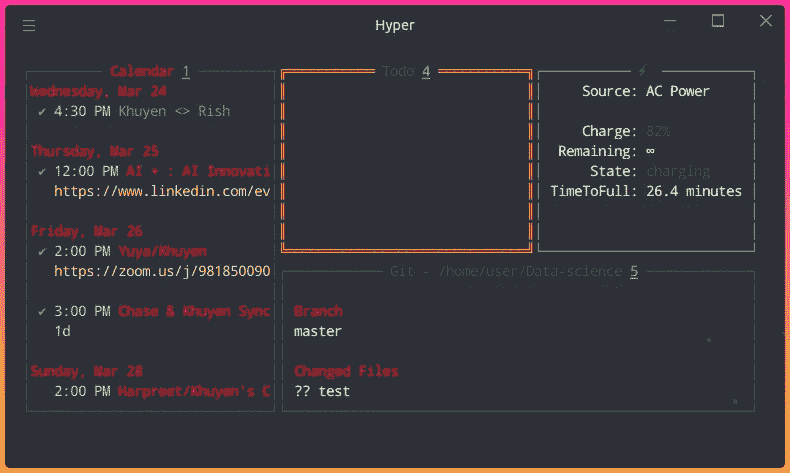

作者图片

您的待办事项列表中还没有任务。让我们通过键入`4`来添加一个任务，然后键入`n`来添加一个新任务。添加任务后，点击“保存”将任务添加到列表中。

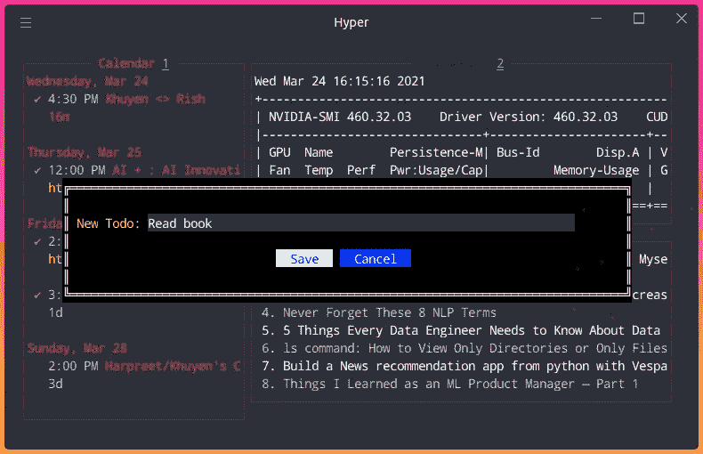

作者图片

一个新项目被添加到您的列表中！

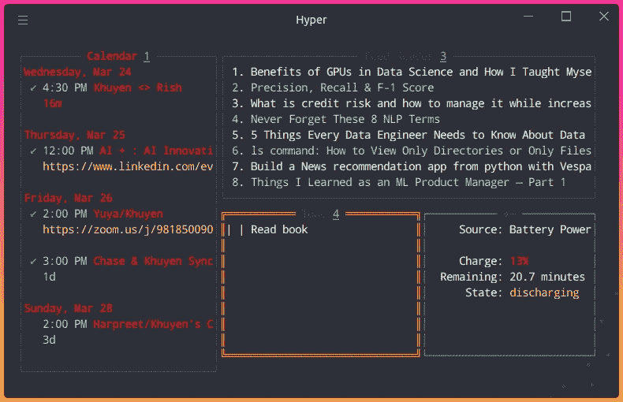

作者图片

要检查任务，请使用向上或向下键选择任务，然后键入 Space。若要取消选中该任务，请再次键入 Space。

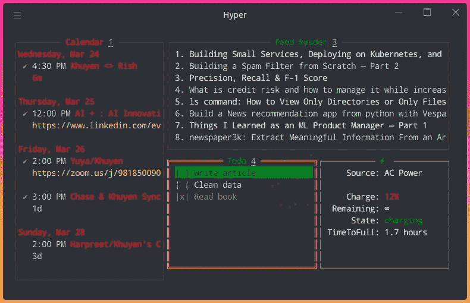

作者图片

就是这样！现在，您有了一个有用且漂亮的仪表板，可以在您的终端中查看。您的仪表板现在应该如下所示:


作者图片

点击查看添加到终端[的其他选项。](https://wtfutil.com/modules/)

# 结论

恭喜你！您刚刚学习了如何使用 WTF 创建一个漂亮的终端仪表板！能够使用一个命令查看所有重要信息可以每周节省时间。希望这篇文章能给你建立自己的终端仪表盘的动力。

本文中显示的完整的`~/.config/wtf/config.yml`文件可以在这里找到。

<https://github.com/khuyentran1401/Data-science/blob/master/terminal/wtf/config.yml>  

我喜欢写一些基本的数据科学概念，并尝试不同的算法和数据科学工具。你可以在 [LinkedIn](https://www.linkedin.com/in/khuyen-tran-1ab926151/) 和 [Twitter](https://twitter.com/KhuyenTran16) 上联系我。

如果你想查看我写的所有文章的代码，请点击这里。在 Medium 上关注我，了解我的最新数据科学文章，例如:

</understand-your-csv-files-from-your-terminal-with-xsv-65255ae67293>  </how-to-create-and-view-interactive-cheatsheets-on-the-command-line-6578641039ff>  </stop-using-print-to-debug-in-python-use-icecream-instead-79e17b963fcc>  </rich-generate-rich-and-beautiful-text-in-the-terminal-with-python-541f39abf32e> 